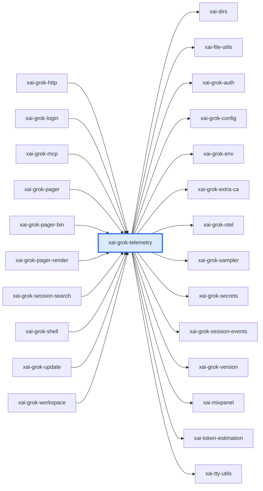

# xai-grok-telemetry：模块详解

[返回十模块索引](README.md) · [返回全仓总览](../grok-build%20%E6%A8%A1%E5%9D%97%E6%80%BB%E8%A7%88%EF%BC%88%E8%87%AA%E5%8A%A8%E7%94%9F%E6%88%90%EF%BC%89.md)

> 自动统计 + 源码阅读说明。修改 scripts/grok-module-notes-*.json 中的解读，运行 `pnpm run arch:grok:details` 更新。

Grok Build 的遥测引擎：产品事件、Mixpanel 发射、Sentry 错误上报、OpenTelemetry tracing、结构化 unified log、启动信息和进程指标都由它提供。

## 源码版本与统计口径

- grok-build SOURCE_REV：`c4ea71cfdbcdb21e32e41bc25a0043d7d4836714`；解读审阅基于 `c4ea71cfdbcdb21e32e41bc25a0043d7d4836714`。
- Rust 源码及 Cargo.toml 指纹：`672a0a59f9191e670f8db5eec6f0d4005fb51a0af05627ed61519cb66b681385`。
- raw LOC 是物理行；source LOC 是去注释后的非空行，保留字符串内容。扫描全部 crate 下 .rs，排除 target/ 和 fuzz/，不展开 feature、宏或 include。
- 下表分类按路径互斥分桶；实现路径可能含 #[cfg(test)] 内嵌测试，不能把这一列当成纯生产代码。场景 YAML、提示词 Markdown、快照等非 Rust 资产另见下文。
- 依赖方向 A → B 表示 A 的 Cargo 清单依赖 B，含 build/target/optional 的静态并集，不含 dev-dependencies；不是运行时调用图。
- 调用链文字是源码阅读结果，引用检查只验证文件/符号存在。本次没有执行 grok 二进制、Rust 测试或浏览器业务验收。

| 类别 | .rs 文件 | source LOC | raw LOC |
|---|---|---|---|
| 实现路径（可含内嵌测试） | 40 | 15,684 | 18,723 |
| 独立测试路径 | 19 | 4,797 | 5,336 |
| 基准路径 | 0 | 0 | 0 |
| 示例路径 | 0 | 0 | 0 |
| 总计 | 59 | 20,481 | 24,059 |

## 职责边界

**本模块负责**

- 负责采集、格式化和投递可观测性数据；不决定产品业务状态、不控制 agent、不替代审计证据存储。

## 入口与导出

| 类型 | 名称 | 真实入口 |
|---|---|---|
| library | `xai_grok_telemetry` | [src/lib.rs](../../../grok-build/crates/codegen/xai-grok-telemetry/src/lib.rs) |

库入口的词法 `mod` 声明（可能受 cfg 控制）：`activity`、`appender`、`client`、`config`、`context`、`debug_log`、`enums`、`events`、`external`、`hooks_log`、`http`、`id`、`instrumentation`、`memory_log`、`memory_telemetry`、`otel_layer`、`process_info`、`process_metrics`、`prompt_timing`、`region`、`sampling_log`、`sentry`、`session_ctx`、`session_end`、`session_metrics`、`span_profile`、`startup`、`subagent_spawn`、`turn_phases`、`unified_log`。

## 内部怎么拆：职责与源码

| 子系统 | 做什么 | 阅读入口 | 入口覆盖 .rs | source LOC | raw LOC |
|---|---|---|---|---|---|
| 事件模型 | events 定义产品事件及其字段和发送语义。 | [src/events/mod.rs](../../../grok-build/crates/codegen/xai-grok-telemetry/src/events/mod.rs) | 1 | 3,345 | 4,068 |
| 外部投递配置 | external/config、schema、providers 组织外部遥测 provider 的配置与事件 schema。 | [src/external/mod.rs](../../../grok-build/crates/codegen/xai-grok-telemetry/src/external/mod.rs)；[src/external/config.rs](../../../grok-build/crates/codegen/xai-grok-telemetry/src/external/config.rs)；[src/external/schema.rs](../../../grok-build/crates/codegen/xai-grok-telemetry/src/external/schema.rs)；[src/external/providers.rs](../../../grok-build/crates/codegen/xai-grok-telemetry/src/external/providers.rs) | 1 | 486 | 620 |
| 遥测客户端 | client 提供调用方发送事件的入口。 | [src/client.rs](../../../grok-build/crates/codegen/xai-grok-telemetry/src/client.rs)；[src/config.rs](../../../grok-build/crates/codegen/xai-grok-telemetry/src/config.rs) | 1 | 606 | 651 |
| 统一日志 | unified_log 和 debug_log 记录结构化/调试日志。 | [src/unified_log.rs](../../../grok-build/crates/codegen/xai-grok-telemetry/src/unified_log.rs)；[src/debug_log.rs](../../../grok-build/crates/codegen/xai-grok-telemetry/src/debug_log.rs) | 1 | 685 | 895 |
| OpenTelemetry 与 instrumentation | otel_layer、instrumentation、hooks_log 将调用过程纳入 tracing。 | [src/otel_layer.rs](../../../grok-build/crates/codegen/xai-grok-telemetry/src/otel_layer.rs)；[src/instrumentation.rs](../../../grok-build/crates/codegen/xai-grok-telemetry/src/instrumentation.rs)；[src/hooks_log.rs](../../../grok-build/crates/codegen/xai-grok-telemetry/src/hooks_log.rs) | 1 | 37 | 44 |
| 启动与进程信息 | startup、process_info、process_metrics 描述进程启动和运行指标。 | [src/startup.rs](../../../grok-build/crates/codegen/xai-grok-telemetry/src/startup.rs)；[src/process_info.rs](../../../grok-build/crates/codegen/xai-grok-telemetry/src/process_info.rs)；[src/process_metrics.rs](../../../grok-build/crates/codegen/xai-grok-telemetry/src/process_metrics.rs) | 1 | 817 | 861 |
| 上下文、身份和枚举 | context、id、enums 组织事件公共上下文与标识。 | [src/context.rs](../../../grok-build/crates/codegen/xai-grok-telemetry/src/context.rs)；[src/id.rs](../../../grok-build/crates/codegen/xai-grok-telemetry/src/id.rs)；[src/enums.rs](../../../grok-build/crates/codegen/xai-grok-telemetry/src/enums.rs) | 1 | 10 | 12 |
| 内存与提示词计时 | memory_log、memory_telemetry、prompt_timing 记录内存和 prompt 相关可观测性。 | [src/memory_log.rs](../../../grok-build/crates/codegen/xai-grok-telemetry/src/memory_log.rs)；[src/memory_telemetry.rs](../../../grok-build/crates/codegen/xai-grok-telemetry/src/memory_telemetry.rs)；[src/prompt_timing.rs](../../../grok-build/crates/codegen/xai-grok-telemetry/src/prompt_timing.rs) | 1 | 87 | 122 |

上表行数仅覆盖该行首个阅读入口的文件/目录，入口可能重叠；下表按 src 一级目录及 tests/benches 等桶互斥统计，可以相加。

## 目录体积

| 目录桶 | .rs | source LOC | raw LOC | 其中独立测试 source LOC |
|---|---|---|---|---|
| src/（根文件） | 32 | 7,804 | 9,332 | 683 |
| src/external | 8 | 6,357 | 7,314 | 1,828 |
| src/events | 5 | 4,164 | 4,967 | 130 |
| tests | 14 | 2,156 | 2,446 | 2,156 |

## 关键链路与源码阅读路径

### 阅读顺序：产品事件到外部 provider

1. 先读 events/mod.rs，确认业务事件结构。
2. 读 client.rs，确认调用方的发送入口。
3. 读 external/config.rs 与 external/providers.rs，确认投递配置和 provider 选择。
4. 读 external/schema.rs，确认外发数据的 schema。

源码依据：[src/events/mod.rs](../../../grok-build/crates/codegen/xai-grok-telemetry/src/events/mod.rs)；[src/client.rs](../../../grok-build/crates/codegen/xai-grok-telemetry/src/client.rs)；[src/external/config.rs](../../../grok-build/crates/codegen/xai-grok-telemetry/src/external/config.rs)；[src/external/providers.rs](../../../grok-build/crates/codegen/xai-grok-telemetry/src/external/providers.rs)；[src/external/schema.rs](../../../grok-build/crates/codegen/xai-grok-telemetry/src/external/schema.rs)。

### 阅读顺序：日志和 tracing

1. 从 unified_log.rs 和 debug_log.rs 区分结构化日志与调试日志。
2. 阅读 instrumentation.rs 和 otel_layer.rs，了解 tracing 接入。
3. 再读 startup.rs、process_info.rs、process_metrics.rs，了解运行环境字段。
4. 最后读 prompt_timing.rs，定位模型调用延迟指标。

源码依据：[src/unified_log.rs](../../../grok-build/crates/codegen/xai-grok-telemetry/src/unified_log.rs)；[src/debug_log.rs](../../../grok-build/crates/codegen/xai-grok-telemetry/src/debug_log.rs)；[src/instrumentation.rs](../../../grok-build/crates/codegen/xai-grok-telemetry/src/instrumentation.rs)；[src/otel_layer.rs](../../../grok-build/crates/codegen/xai-grok-telemetry/src/otel_layer.rs)；[src/startup.rs](../../../grok-build/crates/codegen/xai-grok-telemetry/src/startup.rs)；[src/process_info.rs](../../../grok-build/crates/codegen/xai-grok-telemetry/src/process_info.rs)；[src/process_metrics.rs](../../../grok-build/crates/codegen/xai-grok-telemetry/src/process_metrics.rs)；[src/prompt_timing.rs](../../../grok-build/crates/codegen/xai-grok-telemetry/src/prompt_timing.rs)。

## 直接依赖与被依赖

图中的每条边都来自 Cargo 扫描；边界内的可选依赖可能仅在特定构建配置启用。

**本模块依赖（14）**

| crate | Cargo 用途/模块说明 |
|---|---|
| `xai-dirs` | Home-directory resolution generally: USERPROFILE-first home_dir, plus grok-home ($GROK_HOME or <home>/.grok) |
| `xai-file-utils` | Local data collection: upload queueing and blob storage |
| `xai-grok-auth` | Auth dependency-inversion seam: HttpAuth + AuthCredentialProvider traits |
| `xai-grok-config` | Shared config loading for Grok — grok_home, effective config (requirements > user > managed), TOML merge |
| `xai-grok-env` | Backend environment for the Grok CLI crate family: endpoint URL presets, shared GROK_*/XAI_* readers, the credentials-path resolver, and the first-party credential list. |
| `xai-grok-extra-ca` | TLS policy for the grok CLI: rustls backend pin, process crypto provider, shared root store, and opt-in GROK_EXTRA_CA_BUNDLE roots |
| `xai-grok-otel` | OpenTelemetry foundation for Grok Build: W3C trace-context propagation, the OTLP HTTP client, and the tracing->OTLP span layer/provider |
| `xai-grok-sampler` | Actor-based sampling/inference layer for xAI grok (HTTP streaming + retry, no shell coupling) |
| `xai-grok-secrets` | Regex sanitizer for Grok Build outbound data (Sentry / Mixpanel / product-event scrubbing) |
| `xai-grok-session-events` | Typed per-session event log written as JSON lines |
| `xai-grok-version` | Lockstepped grok CLI version. |
| `xai-mixpanel` | Lightweight Mixpanel HTTP tracking client (replaces mixpanel-rs to avoid pulling reqwest 0.11) |
| `xai-token-estimation` | Pure shared token-estimation primitives. |
| `xai-tty-utils` | Lightweight process-spawning utilities for TTY safety — detach from controlling terminal, suppress interactive pagers, process-group lifecycle |

**使用本模块（10）**

| crate | Cargo 用途/模块说明 |
|---|---|
| `xai-grok-http` | Shared reqwest HTTP clients and User-Agent construction for the grok CLI. |
| `xai-grok-login` | Authentication subsystem for the grok shell crate family: login flows, token refresh, credential providers, and auth storage. |
| `xai-grok-mcp` | MCP integration crate. Quarantines rmcp + reqwest 0.13 (rmcp 3.x requires reqwest >= 0.13.2 while the rest of the workspace uses reqwest 0.12) and owns the MCP credential store and OAuth flow orchestrator. |
| `xai-grok-pager` | xai-grok-pager |
| `xai-grok-pager-bin` | 根据 crate 名称和目录推断 |
| `xai-grok-pager-render` | 根据 crate 名称和目录推断 |
| `xai-grok-session-search` | SQLite FTS5 index over local grok sessions: lease-guarded bootstrap, debounced incremental upserts, and BM25 ranked query |
| `xai-grok-shell` | Grok |
| `xai-grok-update` | 根据 crate 名称和目录推断 |
| `xai-grok-workspace` | Core host-local workspace library (FS, VCS, execution, discovery) for xai-grok-shell and remote sampler |

## 测试依据与非 Rust 资产

| 已有测试阅读入口 | 代码中覆盖的行为（本次未运行） |
|---|---|
| [src/external/tests.rs](../../../grok-build/crates/codegen/xai-grok-telemetry/src/external/tests.rs) | 源内回归样例覆盖外部遥测配置/投递路径。 |
| [src/startup_tests.rs](../../../grok-build/crates/codegen/xai-grok-telemetry/src/startup_tests.rs) | 源内回归样例覆盖启动遥测。 |
| [src/events/mod.rs](../../../grok-build/crates/codegen/xai-grok-telemetry/src/events/mod.rs) | 文件内测试和事件定义是阅读事件语义的入口。 |

| 独立测试文件 Top 8 | source LOC | raw LOC |
|---|---|---|
| [src/external/tests.rs](../../../grok-build/crates/codegen/xai-grok-telemetry/src/external/tests.rs) | 1,828 | 1,975 |
| [src/startup_tests.rs](../../../grok-build/crates/codegen/xai-grok-telemetry/src/startup_tests.rs) | 604 | 694 |
| [tests/otlp_collector/mod.rs](../../../grok-build/crates/codegen/xai-grok-telemetry/tests/otlp_collector/mod.rs) | 519 | 591 |
| [tests/external_otlp_gates_on.rs](../../../grok-build/crates/codegen/xai-grok-telemetry/tests/external_otlp_gates_on.rs) | 409 | 457 |
| [tests/external_otlp.rs](../../../grok-build/crates/codegen/xai-grok-telemetry/tests/external_otlp.rs) | 298 | 331 |
| [tests/manual_auth_emit.rs](../../../grok-build/crates/codegen/xai-grok-telemetry/tests/manual_auth_emit.rs) | 197 | 212 |
| [src/events/active_agent_message_tests.rs](../../../grok-build/crates/codegen/xai-grok-telemetry/src/events/active_agent_message_tests.rs) | 130 | 134 |
| [tests/external_otlp_grpc.rs](../../../grok-build/crates/codegen/xai-grok-telemetry/tests/external_otlp_grpc.rs) | 115 | 129 |

| 类型 | 文件数 | 示例（不计 Rust LOC） |
|---|---|---|
| .toml | 1 | [Cargo.toml](../../../grok-build/crates/codegen/xai-grok-telemetry/Cargo.toml) |

## 对 WhyBuddy 可以怎么用

**事件 schema 与 provider 分离**：业务事件不与 Mixpanel/Sentry 等单一厂商 API 绑死。 WhyBuddy 的 run、工具、浏览器验证、用户批准事件应先有本地 schema，再可选投递外部平台。

依据：[src/events/mod.rs](../../../grok-build/crates/codegen/xai-grok-telemetry/src/events/mod.rs)；[src/external/schema.rs](../../../grok-build/crates/codegen/xai-grok-telemetry/src/external/schema.rs)；[src/external/providers.rs](../../../grok-build/crates/codegen/xai-grok-telemetry/src/external/providers.rs)。

**统一日志和 tracing**：结构化日志与 span/trace 结合，方便按一个 run 查完整链路。 WhyBuddy 应让 control session ID、sandbox ID、browser tab ID 贯穿日志和 SSE 事件。

依据：[src/unified_log.rs](../../../grok-build/crates/codegen/xai-grok-telemetry/src/unified_log.rs)；[src/instrumentation.rs](../../../grok-build/crates/codegen/xai-grok-telemetry/src/instrumentation.rs)；[src/otel_layer.rs](../../../grok-build/crates/codegen/xai-grok-telemetry/src/otel_layer.rs)。

**启动与进程维度**：遥测记录启动配置和进程资源，不只记录产品按钮点击。 WhyBuddy 的 sandbox/browser 路线应记录启动失败、端口、退出码和资源回收，作为运行证据的一部分。

依据：[src/startup.rs](../../../grok-build/crates/codegen/xai-grok-telemetry/src/startup.rs)；[src/process_info.rs](../../../grok-build/crates/codegen/xai-grok-telemetry/src/process_info.rs)；[src/process_metrics.rs](../../../grok-build/crates/codegen/xai-grok-telemetry/src/process_metrics.rs)。

## 建议阅读顺序

1. [src/lib.rs](../../../grok-build/crates/codegen/xai-grok-telemetry/src/lib.rs)：确认遥测 crate 的公开范围。
2. [src/events/mod.rs](../../../grok-build/crates/codegen/xai-grok-telemetry/src/events/mod.rs)：先读产品事件模型。
3. [src/client.rs](../../../grok-build/crates/codegen/xai-grok-telemetry/src/client.rs)：读发送入口。
4. [src/external/providers.rs](../../../grok-build/crates/codegen/xai-grok-telemetry/src/external/providers.rs)：读外部投递选择。
5. [src/unified_log.rs](../../../grok-build/crates/codegen/xai-grok-telemetry/src/unified_log.rs)：读结构化日志。
6. [src/instrumentation.rs](../../../grok-build/crates/codegen/xai-grok-telemetry/src/instrumentation.rs)：读 tracing 接入。

## 大文件与完整 Rust 清单

先看实现路径的 Top 15；它们仍可能带内嵌测试。下面的完整清单包含所有统计文件，方便继续拆到单个组件。

| 实现路径 Top 15 | source LOC | raw LOC |
|---|---|---|
| [src/events/mod.rs](../../../grok-build/crates/codegen/xai-grok-telemetry/src/events/mod.rs) | 3,345 | 4,068 |
| [src/external/config.rs](../../../grok-build/crates/codegen/xai-grok-telemetry/src/external/config.rs) | 1,343 | 1,519 |
| [src/external/schema.rs](../../../grok-build/crates/codegen/xai-grok-telemetry/src/external/schema.rs) | 1,095 | 1,324 |
| [src/external/providers.rs](../../../grok-build/crates/codegen/xai-grok-telemetry/src/external/providers.rs) | 903 | 1,039 |
| [src/startup.rs](../../../grok-build/crates/codegen/xai-grok-telemetry/src/startup.rs) | 817 | 861 |
| [src/debug_log.rs](../../../grok-build/crates/codegen/xai-grok-telemetry/src/debug_log.rs) | 687 | 912 |
| [src/unified_log.rs](../../../grok-build/crates/codegen/xai-grok-telemetry/src/unified_log.rs) | 685 | 895 |
| [src/instrumentation.rs](../../../grok-build/crates/codegen/xai-grok-telemetry/src/instrumentation.rs) | 648 | 769 |
| [src/client.rs](../../../grok-build/crates/codegen/xai-grok-telemetry/src/client.rs) | 606 | 651 |
| [src/events/permission_analytics.rs](../../../grok-build/crates/codegen/xai-grok-telemetry/src/events/permission_analytics.rs) | 548 | 586 |
| [src/external/mod.rs](../../../grok-build/crates/codegen/xai-grok-telemetry/src/external/mod.rs) | 486 | 620 |
| [src/session_ctx.rs](../../../grok-build/crates/codegen/xai-grok-telemetry/src/session_ctx.rs) | 465 | 604 |
| [src/sentry.rs](../../../grok-build/crates/codegen/xai-grok-telemetry/src/sentry.rs) | 362 | 435 |
| [src/external/emit.rs](../../../grok-build/crates/codegen/xai-grok-telemetry/src/external/emit.rs) | 347 | 387 |
| [src/config.rs](../../../grok-build/crates/codegen/xai-grok-telemetry/src/config.rs) | 336 | 366 |

展开全部 59 个 Rust 文件

| 文件 | 类别 | source LOC | raw LOC |
|---|---|---|---|
| [src/activity.rs](../../../grok-build/crates/codegen/xai-grok-telemetry/src/activity.rs) | 实现路径（可含内嵌测试） | 100 | 129 |
| [src/appender.rs](../../../grok-build/crates/codegen/xai-grok-telemetry/src/appender.rs) | 实现路径（可含内嵌测试） | 26 | 41 |
| [src/client.rs](../../../grok-build/crates/codegen/xai-grok-telemetry/src/client.rs) | 实现路径（可含内嵌测试） | 606 | 651 |
| [src/config.rs](../../../grok-build/crates/codegen/xai-grok-telemetry/src/config.rs) | 实现路径（可含内嵌测试） | 336 | 366 |
| [src/context.rs](../../../grok-build/crates/codegen/xai-grok-telemetry/src/context.rs) | 实现路径（可含内嵌测试） | 10 | 12 |
| [src/debug_log.rs](../../../grok-build/crates/codegen/xai-grok-telemetry/src/debug_log.rs) | 实现路径（可含内嵌测试） | 687 | 912 |
| [src/enums.rs](../../../grok-build/crates/codegen/xai-grok-telemetry/src/enums.rs) | 实现路径（可含内嵌测试） | 40 | 57 |
| [src/events/active_agent_message.rs](../../../grok-build/crates/codegen/xai-grok-telemetry/src/events/active_agent_message.rs) | 实现路径（可含内嵌测试） | 71 | 85 |
| [src/events/active_agent_message_tests.rs](../../../grok-build/crates/codegen/xai-grok-telemetry/src/events/active_agent_message_tests.rs) | 独立测试路径 | 130 | 134 |
| [src/events/feedback.rs](../../../grok-build/crates/codegen/xai-grok-telemetry/src/events/feedback.rs) | 实现路径（可含内嵌测试） | 70 | 94 |
| [src/events/mod.rs](../../../grok-build/crates/codegen/xai-grok-telemetry/src/events/mod.rs) | 实现路径（可含内嵌测试） | 3,345 | 4,068 |
| [src/events/permission_analytics.rs](../../../grok-build/crates/codegen/xai-grok-telemetry/src/events/permission_analytics.rs) | 实现路径（可含内嵌测试） | 548 | 586 |
| [src/external/config.rs](../../../grok-build/crates/codegen/xai-grok-telemetry/src/external/config.rs) | 实现路径（可含内嵌测试） | 1,343 | 1,519 |
| [src/external/emit.rs](../../../grok-build/crates/codegen/xai-grok-telemetry/src/external/emit.rs) | 实现路径（可含内嵌测试） | 347 | 387 |
| [src/external/mod.rs](../../../grok-build/crates/codegen/xai-grok-telemetry/src/external/mod.rs) | 实现路径（可含内嵌测试） | 486 | 620 |
| [src/external/providers.rs](../../../grok-build/crates/codegen/xai-grok-telemetry/src/external/providers.rs) | 实现路径（可含内嵌测试） | 903 | 1,039 |
| [src/external/redact.rs](../../../grok-build/crates/codegen/xai-grok-telemetry/src/external/redact.rs) | 实现路径（可含内嵌测试） | 209 | 256 |
| [src/external/schema.rs](../../../grok-build/crates/codegen/xai-grok-telemetry/src/external/schema.rs) | 实现路径（可含内嵌测试） | 1,095 | 1,324 |
| [src/external/tests.rs](../../../grok-build/crates/codegen/xai-grok-telemetry/src/external/tests.rs) | 独立测试路径 | 1,828 | 1,975 |
| [src/external/truncate.rs](../../../grok-build/crates/codegen/xai-grok-telemetry/src/external/truncate.rs) | 实现路径（可含内嵌测试） | 146 | 194 |
| [src/hooks_log.rs](../../../grok-build/crates/codegen/xai-grok-telemetry/src/hooks_log.rs) | 实现路径（可含内嵌测试） | 84 | 118 |
| [src/http.rs](../../../grok-build/crates/codegen/xai-grok-telemetry/src/http.rs) | 实现路径（可含内嵌测试） | 9 | 18 |
| [src/id.rs](../../../grok-build/crates/codegen/xai-grok-telemetry/src/id.rs) | 实现路径（可含内嵌测试） | 133 | 166 |
| [src/instrumentation.rs](../../../grok-build/crates/codegen/xai-grok-telemetry/src/instrumentation.rs) | 实现路径（可含内嵌测试） | 648 | 769 |
| [src/lib.rs](../../../grok-build/crates/codegen/xai-grok-telemetry/src/lib.rs) | 实现路径（可含内嵌测试） | 42 | 51 |
| [src/memory_log.rs](../../../grok-build/crates/codegen/xai-grok-telemetry/src/memory_log.rs) | 实现路径（可含内嵌测试） | 87 | 122 |
| [src/memory_telemetry.rs](../../../grok-build/crates/codegen/xai-grok-telemetry/src/memory_telemetry.rs) | 实现路径（可含内嵌测试） | 209 | 228 |
| [src/otel_layer.rs](../../../grok-build/crates/codegen/xai-grok-telemetry/src/otel_layer.rs) | 实现路径（可含内嵌测试） | 37 | 44 |
| [src/process_info.rs](../../../grok-build/crates/codegen/xai-grok-telemetry/src/process_info.rs) | 实现路径（可含内嵌测试） | 96 | 123 |
| [src/process_info_tests.rs](../../../grok-build/crates/codegen/xai-grok-telemetry/src/process_info_tests.rs) | 独立测试路径 | 70 | 76 |
| [src/process_metrics.rs](../../../grok-build/crates/codegen/xai-grok-telemetry/src/process_metrics.rs) | 实现路径（可含内嵌测试） | 133 | 157 |
| [src/process_metrics_tests.rs](../../../grok-build/crates/codegen/xai-grok-telemetry/src/process_metrics_tests.rs) | 独立测试路径 | 9 | 11 |
| [src/prompt_timing.rs](../../../grok-build/crates/codegen/xai-grok-telemetry/src/prompt_timing.rs) | 实现路径（可含内嵌测试） | 160 | 179 |
| [src/region.rs](../../../grok-build/crates/codegen/xai-grok-telemetry/src/region.rs) | 实现路径（可含内嵌测试） | 96 | 126 |
| [src/sampling_log.rs](../../../grok-build/crates/codegen/xai-grok-telemetry/src/sampling_log.rs) | 实现路径（可含内嵌测试） | 54 | 70 |
| [src/sentry.rs](../../../grok-build/crates/codegen/xai-grok-telemetry/src/sentry.rs) | 实现路径（可含内嵌测试） | 362 | 435 |
| [src/session_ctx.rs](../../../grok-build/crates/codegen/xai-grok-telemetry/src/session_ctx.rs) | 实现路径（可含内嵌测试） | 465 | 604 |
| [src/session_end.rs](../../../grok-build/crates/codegen/xai-grok-telemetry/src/session_end.rs) | 实现路径（可含内嵌测试） | 187 | 224 |
| [src/session_metrics.rs](../../../grok-build/crates/codegen/xai-grok-telemetry/src/session_metrics.rs) | 实现路径（可含内嵌测试） | 309 | 362 |
| [src/span_profile.rs](../../../grok-build/crates/codegen/xai-grok-telemetry/src/span_profile.rs) | 实现路径（可含内嵌测试） | 269 | 316 |
| [src/startup.rs](../../../grok-build/crates/codegen/xai-grok-telemetry/src/startup.rs) | 实现路径（可含内嵌测试） | 817 | 861 |
| [src/startup_tests.rs](../../../grok-build/crates/codegen/xai-grok-telemetry/src/startup_tests.rs) | 独立测试路径 | 604 | 694 |
| [src/subagent_spawn.rs](../../../grok-build/crates/codegen/xai-grok-telemetry/src/subagent_spawn.rs) | 实现路径（可含内嵌测试） | 101 | 138 |
| [src/turn_phases.rs](../../../grok-build/crates/codegen/xai-grok-telemetry/src/turn_phases.rs) | 实现路径（可含内嵌测试） | 333 | 377 |
| [src/unified_log.rs](../../../grok-build/crates/codegen/xai-grok-telemetry/src/unified_log.rs) | 实现路径（可含内嵌测试） | 685 | 895 |
| [tests/agent_id_prewarm.rs](../../../grok-build/crates/codegen/xai-grok-telemetry/tests/agent_id_prewarm.rs) | 独立测试路径 | 16 | 19 |
| [tests/external_otlp.rs](../../../grok-build/crates/codegen/xai-grok-telemetry/tests/external_otlp.rs) | 独立测试路径 | 298 | 331 |
| [tests/external_otlp_gates_on.rs](../../../grok-build/crates/codegen/xai-grok-telemetry/tests/external_otlp_gates_on.rs) | 独立测试路径 | 409 | 457 |
| [tests/external_otlp_grpc.rs](../../../grok-build/crates/codegen/xai-grok-telemetry/tests/external_otlp_grpc.rs) | 独立测试路径 | 115 | 129 |
| [tests/external_otlp_grpc_tls.rs](../../../grok-build/crates/codegen/xai-grok-telemetry/tests/external_otlp_grpc_tls.rs) | 独立测试路径 | 84 | 103 |
| [tests/external_otlp_guard.rs](../../../grok-build/crates/codegen/xai-grok-telemetry/tests/external_otlp_guard.rs) | 独立测试路径 | 51 | 68 |
| [tests/external_otlp_mtls_grpc.rs](../../../grok-build/crates/codegen/xai-grok-telemetry/tests/external_otlp_mtls_grpc.rs) | 独立测试路径 | 98 | 109 |
| [tests/external_otlp_mtls_grpc_reject.rs](../../../grok-build/crates/codegen/xai-grok-telemetry/tests/external_otlp_mtls_grpc_reject.rs) | 独立测试路径 | 74 | 83 |
| [tests/external_otlp_mtls_http.rs](../../../grok-build/crates/codegen/xai-grok-telemetry/tests/external_otlp_mtls_http.rs) | 独立测试路径 | 105 | 119 |
| [tests/external_otlp_session_ctx.rs](../../../grok-build/crates/codegen/xai-grok-telemetry/tests/external_otlp_session_ctx.rs) | 独立测试路径 | 103 | 122 |
| [tests/machine_id_off_boot_path.rs](../../../grok-build/crates/codegen/xai-grok-telemetry/tests/machine_id_off_boot_path.rs) | 独立测试路径 | 10 | 13 |
| [tests/manual_auth_emit.rs](../../../grok-build/crates/codegen/xai-grok-telemetry/tests/manual_auth_emit.rs) | 独立测试路径 | 197 | 212 |
| [tests/otlp_collector/mod.rs](../../../grok-build/crates/codegen/xai-grok-telemetry/tests/otlp_collector/mod.rs) | 独立测试路径 | 519 | 591 |
| [tests/process_snapshot.rs](../../../grok-build/crates/codegen/xai-grok-telemetry/tests/process_snapshot.rs) | 独立测试路径 | 77 | 90 |

解读维护源：[grok-module-notes-core.json](../../scripts/grok-module-notes-core.json)。
