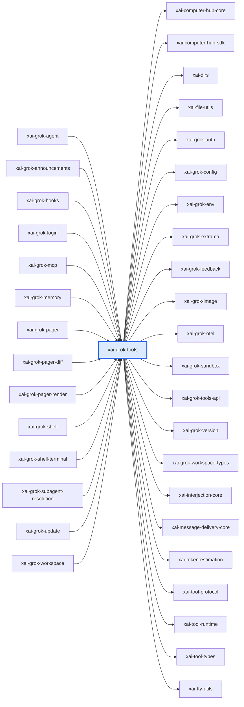

# xai-grok-tools：模块详解

[返回十模块索引](README.md) · [返回全仓总览](../grok-build%20%E6%A8%A1%E5%9D%97%E6%80%BB%E8%A7%88%EF%BC%88%E8%87%AA%E5%8A%A8%E7%94%9F%E6%88%90%EF%BC%89.md)

> 自动统计 + 源码阅读说明。修改 scripts/grok-module-notes-*.json 中的解读，运行 `pnpm run arch:grok:details` 更新。

模型工具层：定义工具的输入输出、注册和实现。内置实现覆盖命令、读文件、搜索替换、任务、人工问答和本机 computer 终端；它把模型意图变为受类型约束的工具请求。

## 源码版本与统计口径

- grok-build SOURCE_REV：`c4ea71cfdbcdb21e32e41bc25a0043d7d4836714`；解读审阅基于 `c4ea71cfdbcdb21e32e41bc25a0043d7d4836714`。
- Rust 源码及 Cargo.toml 指纹：`7640bfaf784b4ec061cae750fe2d0cfda425c902af20d7958416ff877e3bcacb`。
- raw LOC 是物理行；source LOC 是去注释后的非空行，保留字符串内容。扫描全部 crate 下 .rs，排除 target/ 和 fuzz/，不展开 feature、宏或 include。
- 下表分类按路径互斥分桶；实现路径可能含 #[cfg(test)] 内嵌测试，不能把这一列当成纯生产代码。场景 YAML、提示词 Markdown、快照等非 Rust 资产另见下文。
- 依赖方向 A → B 表示 A 的 Cargo 清单依赖 B，含 build/target/optional 的静态并集，不含 dev-dependencies；不是运行时调用图。
- 调用链文字是源码阅读结果，引用检查只验证文件/符号存在。本次没有执行 grok 二进制、Rust 测试或浏览器业务验收。

| 类别 | .rs 文件 | source LOC | raw LOC |
|---|---|---|---|
| 实现路径（可含内嵌测试） | 245 | 111,554 | 134,269 |
| 独立测试路径 | 25 | 13,405 | 15,404 |
| 基准路径 | 0 | 0 | 0 |
| 示例路径 | 0 | 0 | 0 |
| 总计 | 270 | 124,959 | 149,673 |

## 职责边界

**本模块负责**

- 拥有工具协议和工具实现，不拥有会话轮次、TUI 卡片或工作区权限最终策略。会话宿主负责调度，workspace 负责本机资源与权限。

## 入口与导出

| 类型 | 名称 | 真实入口 |
|---|---|---|
| library | `xai_grok_tools` | [src/lib.rs](../../../grok-build/crates/codegen/xai-grok-tools/src/lib.rs) |

库入口的词法 `mod` 声明（可能受 cfg 控制）：`attribution`、`bridge`、`computer`、`gitignore`、`implementations`、`mcp_elicitation`、`media_gen_limits`、`normalization`、`notification`、`persistence`、`registry`、`reminders`、`retry`、`tool_taxonomy`、`types`、`util`、`versions`。

## 内部怎么拆：职责与源码

| 子系统 | 做什么 | 阅读入口 | 入口覆盖 .rs | source LOC | raw LOC |
|---|---|---|---|---|---|
| 工具注册和元数据 | 工具名、描述、参数和注册解析的核心类型。 | [src/registry/mod.rs](../../../grok-build/crates/codegen/xai-grok-tools/src/registry/mod.rs)；[src/registry/types.rs](../../../grok-build/crates/codegen/xai-grok-tools/src/registry/types.rs)；[src/types/tool_io.rs](../../../grok-build/crates/codegen/xai-grok-tools/src/types/tool_io.rs) | 1 | 2 | 4 |
| 输出和截断 | 定义工具结果，并限制发给模型或 MCP 的输出量。 | [src/types/output.rs](../../../grok-build/crates/codegen/xai-grok-tools/src/types/output.rs)；[src/util/mcp_truncate.rs](../../../grok-build/crates/codegen/xai-grok-tools/src/util/mcp_truncate.rs) | 1 | 2,622 | 2,887 |
| 命令执行工具 | 实现 Grok Build bash 工具，并通过环境策略构造执行环境。 | [src/implementations/grok_build/bash/mod.rs](../../../grok-build/crates/codegen/xai-grok-tools/src/implementations/grok_build/bash/mod.rs)；[src/util/shell_env_policy.rs](../../../grok-build/crates/codegen/xai-grok-tools/src/util/shell_env_policy.rs) | 1 | 3,877 | 4,908 |
| 代码读取和编辑 | read_file、grep、search_replace 是模型理解和修改代码的基本工具。 | [src/implementations/grok_build/read_file/mod.rs](../../../grok-build/crates/codegen/xai-grok-tools/src/implementations/grok_build/read_file/mod.rs)；[src/implementations/grok_build/grep/mod.rs](../../../grok-build/crates/codegen/xai-grok-tools/src/implementations/grok_build/grep/mod.rs)；[src/implementations/grok_build/search_replace/mod.rs](../../../grok-build/crates/codegen/xai-grok-tools/src/implementations/grok_build/search_replace/mod.rs) | 1 | 2,587 | 2,704 |
| 任务和调度 | task 表达子任务，scheduler actor 推进调度，task_output 处理任务输出。 | [src/implementations/grok_build/task/mod.rs](../../../grok-build/crates/codegen/xai-grok-tools/src/implementations/grok_build/task/mod.rs)；[src/implementations/grok_build/scheduler/actor.rs](../../../grok-build/crates/codegen/xai-grok-tools/src/implementations/grok_build/scheduler/actor.rs)；[src/implementations/grok_build/task_output/mod.rs](../../../grok-build/crates/codegen/xai-grok-tools/src/implementations/grok_build/task_output/mod.rs) | 1 | 2,856 | 3,224 |
| 人工决策工具协议 | ask_user_question 和 exit_plan_mode 定义模型暂停并请求用户选择/批准时的结构化 request/response。 | [src/implementations/grok_build/ask_user_question/mod.rs](../../../grok-build/crates/codegen/xai-grok-tools/src/implementations/grok_build/ask_user_question/mod.rs)；[src/implementations/grok_build/exit_plan_mode/mod.rs](../../../grok-build/crates/codegen/xai-grok-tools/src/implementations/grok_build/exit_plan_mode/mod.rs) | 1 | 915 | 1,179 |
| Computer 本机终端 | computer/local/terminal 提供本机终端控制实现，是 computer 工具族的执行端之一。 | [src/computer/mod.rs](../../../grok-build/crates/codegen/xai-grok-tools/src/computer/mod.rs)；[src/computer/local/terminal.rs](../../../grok-build/crates/codegen/xai-grok-tools/src/computer/local/terminal.rs) | 1 | 3 | 4 |
| MCP、通知和提醒 | MCP elicitation 表达外部工具要求用户补充的信息；notification 和 reminders 表达外部通知及任务完成提醒。 | [src/mcp_elicitation/mod.rs](../../../grok-build/crates/codegen/xai-grok-tools/src/mcp_elicitation/mod.rs)；[src/notification/mod.rs](../../../grok-build/crates/codegen/xai-grok-tools/src/notification/mod.rs)；[src/reminders/task_completion.rs](../../../grok-build/crates/codegen/xai-grok-tools/src/reminders/task_completion.rs) | 1 | 14 | 15 |

上表行数仅覆盖该行首个阅读入口的文件/目录，入口可能重叠；下表按 src 一级目录及 tests/benches 等桶互斥统计，可以相加。

## 目录体积

| 目录桶 | .rs | source LOC | raw LOC | 其中独立测试 source LOC |
|---|---|---|---|---|
| src/implementations | 172 | 85,619 | 102,285 | 10,702 |
| src/types | 29 | 11,236 | 13,648 | 206 |
| src/computer | 14 | 8,203 | 10,184 | 171 |
| src/util | 22 | 4,795 | 6,150 | 188 |
| src/registry | 3 | 4,775 | 5,148 | 0 |
| src/（根文件） | 10 | 3,265 | 3,978 | 0 |
| src/reminders | 4 | 2,989 | 3,252 | 0 |
| src/mcp_elicitation | 6 | 1,437 | 1,614 | 595 |
| tests | 5 | 1,431 | 1,823 | 1,431 |
| src/notification | 4 | 916 | 1,230 | 112 |
| build.rs | 1 | 293 | 361 | 0 |

## 关键链路与源码阅读路径

### 阅读顺序：模型工具调用从合同到结果

1. 先读 registry/types.rs，确认工具如何按名称和元数据注册。
2. 再读 types/tool_io.rs 与 types/output.rs，确认调用目标和结果的结构。
3. 选读 implementations/grok_build/bash/mod.rs、read_file/mod.rs 或 grep/mod.rs，核对具体执行器。
4. 最后读 util/mcp_truncate.rs，确认结果进入模型前的输出边界。

源码依据：[src/registry/types.rs](../../../grok-build/crates/codegen/xai-grok-tools/src/registry/types.rs)；[src/types/tool_io.rs](../../../grok-build/crates/codegen/xai-grok-tools/src/types/tool_io.rs)；[src/types/output.rs](../../../grok-build/crates/codegen/xai-grok-tools/src/types/output.rs)；[src/implementations/grok_build/bash/mod.rs](../../../grok-build/crates/codegen/xai-grok-tools/src/implementations/grok_build/bash/mod.rs)；[src/util/mcp_truncate.rs](../../../grok-build/crates/codegen/xai-grok-tools/src/util/mcp_truncate.rs)。

### 阅读顺序：人工问答和计划批准为何不是普通 UI

1. 先读 ask_user_question/mod.rs 中的 Question、QuestionOption 和响应类型。
2. 再读 exit_plan_mode/mod.rs 中计划退出的扩展响应。
3. 随后交叉阅读 pager 的 ACP interaction handler，确认这些结构化请求如何变成前台交互。
4. 最后回到 tools 合同，区分协议拥有者与 UI 渲染者。

源码依据：[src/implementations/grok_build/ask_user_question/mod.rs](../../../grok-build/crates/codegen/xai-grok-tools/src/implementations/grok_build/ask_user_question/mod.rs)；[src/implementations/grok_build/exit_plan_mode/mod.rs](../../../grok-build/crates/codegen/xai-grok-tools/src/implementations/grok_build/exit_plan_mode/mod.rs)；[../xai-grok-pager/src/app/acp_handler/interactions.rs](../../../grok-build/crates/codegen/xai-grok-pager/src/app/acp_handler/interactions.rs)。

### 阅读顺序：子任务能力

1. 从 task/mod.rs 查看任务工具入口与状态模型。
2. 读取 scheduler/actor.rs 了解调度 actor 的职责。
3. 读取 task_output/mod.rs 确认结果如何整理为工具输出。
4. 查看 coordinator_tests.rs 的源内回归样例，了解协调边界。

源码依据：[src/implementations/grok_build/task/mod.rs](../../../grok-build/crates/codegen/xai-grok-tools/src/implementations/grok_build/task/mod.rs)；[src/implementations/grok_build/scheduler/actor.rs](../../../grok-build/crates/codegen/xai-grok-tools/src/implementations/grok_build/scheduler/actor.rs)；[src/implementations/grok_build/task_output/mod.rs](../../../grok-build/crates/codegen/xai-grok-tools/src/implementations/grok_build/task_output/mod.rs)；[src/implementations/grok_build/task/coordinator_tests.rs](../../../grok-build/crates/codegen/xai-grok-tools/src/implementations/grok_build/task/coordinator_tests.rs)。

## 直接依赖与被依赖

图中的每条边都来自 Cargo 扫描；边界内的可选依赖可能仅在特定构建配置启用。

**本模块依赖（22）**

| crate | Cargo 用途/模块说明 |
|---|---|
| `xai-computer-hub-core` | Transport, ToolRegistry, and resolver abstractions for the xAI Computer Hub |
| `xai-computer-hub-sdk` | SDK for the xAI Computer Hub: connection pool, transparent reconnect, tool harness, and tool-server runtime. |
| `xai-dirs` | Home-directory resolution generally: USERPROFILE-first home_dir, plus grok-home ($GROK_HOME or <home>/.grok) |
| `xai-file-utils` | Local data collection: upload queueing and blob storage |
| `xai-grok-auth` | Auth dependency-inversion seam: HttpAuth + AuthCredentialProvider traits |
| `xai-grok-config` | Shared config loading for Grok — grok_home, effective config (requirements > user > managed), TOML merge |
| `xai-grok-env` | Backend environment for the Grok CLI crate family: endpoint URL presets, shared GROK_*/XAI_* readers, the credentials-path resolver, and the first-party credential list. |
| `xai-grok-extra-ca` | TLS policy for the grok CLI: rustls backend pin, process crypto provider, shared root store, and opt-in GROK_EXTRA_CA_BUNDLE roots |
| `xai-grok-feedback` | Shared feedback taxonomy, durable local draft storage, and the session trace archive builder for Grok Build |
| `xai-grok-image` | Image validation and transcoding shared by Grok tools and clients |
| `xai-grok-otel` | OpenTelemetry foundation for Grok Build: W3C trace-context propagation, the OTLP HTTP client, and the tracing->OTLP span layer/provider |
| `xai-grok-sandbox` | OS-level sandboxing for Grok Build using kernel primitives (Landlock/Seatbelt) via nono |
| `xai-grok-tools-api` | Protobuf API definitions for Grok tools |
| `xai-grok-version` | Lockstepped grok CLI version. |
| `xai-grok-workspace-types` | Wire types for the xAI workspace API (request/chunk/event enums shared by client and server) |
| `xai-interjection-core` | Shared mid-turn interjection buffer and formatting for the client and server agent loops |
| `xai-message-delivery-core` | Source-typed message delivery values and operation authorization. |
| `xai-token-estimation` | Pure shared token-estimation primitives. |
| `xai-tool-protocol` | Wire-protocol types for the xAI Computer Hub |
| `xai-tool-runtime` | Unified Tool trait, dispatch trait, error taxonomy, notifications, and search index for the xAI Computer Hub |
| `xai-tool-types` | Canonical tool-description types for the xAI platform |
| `xai-tty-utils` | Lightweight process-spawning utilities for TTY safety — detach from controlling terminal, suppress interactive pagers, process-group lifecycle |

**使用本模块（14）**

| crate | Cargo 用途/模块说明 |
|---|---|
| `xai-grok-agent` | Agent builder, definition parsing, and system prompt assembly |
| `xai-grok-announcements` | Shared announcement types, persistence, and formatting for Grok CLI apps |
| `xai-grok-hooks` | Runtime hook system for Grok — file-based discovery, command execution, and policy enforcement |
| `xai-grok-login` | Authentication subsystem for the grok shell crate family: login flows, token refresh, credential providers, and auth storage. |
| `xai-grok-mcp` | MCP integration crate. Quarantines rmcp + reqwest 0.13 (rmcp 3.x requires reqwest >= 0.13.2 while the rest of the workspace uses reqwest 0.12) and owns the MCP credential store and OAuth flow orchestrator. |
| `xai-grok-memory` | Cross-session memory for Grok. |
| `xai-grok-pager` | xai-grok-pager |
| `xai-grok-pager-diff` | Diff hunk construction for the Grok Build TUI |
| `xai-grok-pager-render` | 根据 crate 名称和目录推断 |
| `xai-grok-shell` | Grok |
| `xai-grok-shell-terminal` | Local, ACP, and PTY terminal runners extracted from xai-grok-shell so they compile in parallel. |
| `xai-grok-subagent-resolution` | Shared subagent definition, runtime, prompt, and resume resolution |
| `xai-grok-update` | 根据 crate 名称和目录推断 |
| `xai-grok-workspace` | Core host-local workspace library (FS, VCS, execution, discovery) for xai-grok-shell and remote sampler |

## 测试依据与非 Rust 资产

| 已有测试阅读入口 | 代码中覆盖的行为（本次未运行） |
|---|---|
| [src/implementations/grok_build/task/coordinator_tests.rs](../../../grok-build/crates/codegen/xai-grok-tools/src/implementations/grok_build/task/coordinator_tests.rs) | 源内回归样例覆盖任务协调的状态推进和输出行为。 |
| [src/types/tool_io.rs](../../../grok-build/crates/codegen/xai-grok-tools/src/types/tool_io.rs) | 源内测试覆盖 dispatch target 名称解析。 |
| [src/util/mcp_truncate.rs](../../../grok-build/crates/codegen/xai-grok-tools/src/util/mcp_truncate.rs) | 源内测试覆盖 MCP 输出裁剪边界。 |

| 独立测试文件 Top 8 | source LOC | raw LOC |
|---|---|---|
| [src/implementations/grok_build/task/coordinator_tests.rs](../../../grok-build/crates/codegen/xai-grok-tools/src/implementations/grok_build/task/coordinator_tests.rs) | 3,739 | 4,102 |
| [src/implementations/lsp/tests.rs](../../../grok-build/crates/codegen/xai-grok-tools/src/implementations/lsp/tests.rs) | 1,782 | 2,258 |
| [src/implementations/grok_build/task/coordinator/active_message_tests.rs](../../../grok-build/crates/codegen/xai-grok-tools/src/implementations/grok_build/task/coordinator/active_message_tests.rs) | 1,388 | 1,503 |
| [src/implementations/lsp/tests/mock_servers.rs](../../../grok-build/crates/codegen/xai-grok-tools/src/implementations/lsp/tests/mock_servers.rs) | 854 | 1,015 |
| [tests/test_subagent_soak.rs](../../../grok-build/crates/codegen/xai-grok-tools/tests/test_subagent_soak.rs) | 851 | 983 |
| [src/implementations/grok_build/task/backend_tests.rs](../../../grok-build/crates/codegen/xai-grok-tools/src/implementations/grok_build/task/backend_tests.rs) | 818 | 947 |
| [src/implementations/grok_build/task/coordinator/wake_tests.rs](../../../grok-build/crates/codegen/xai-grok-tools/src/implementations/grok_build/task/coordinator/wake_tests.rs) | 708 | 754 |
| [src/implementations/grok_build/send_subagent_message_tests.rs](../../../grok-build/crates/codegen/xai-grok-tools/src/implementations/grok_build/send_subagent_message_tests.rs) | 396 | 437 |

| 类型 | 文件数 | 示例（不计 Rust LOC） |
|---|---|---|
| .json | 1 | [schema/tool_meta.schema.json](../../../grok-build/crates/codegen/xai-grok-tools/schema/tool_meta.schema.json) |
| .md | 1 | [THIRD_PARTY_NOTICES.md](../../../grok-build/crates/codegen/xai-grok-tools/THIRD_PARTY_NOTICES.md) |
| .toml | 1 | [Cargo.toml](../../../grok-build/crates/codegen/xai-grok-tools/Cargo.toml) |

## 对 WhyBuddy 可以怎么用

**注册表加类型化 IO**：工具声明、输入、输出和执行实现可分开演进。 WhyBuddy 可把生成、页面绑定、sandbox、浏览器验证统一挂入服务端 tool registry，前端只消费事件。

依据：[src/registry/types.rs](../../../grok-build/crates/codegen/xai-grok-tools/src/registry/types.rs)；[src/types/tool_io.rs](../../../grok-build/crates/codegen/xai-grok-tools/src/types/tool_io.rs)；[src/types/output.rs](../../../grok-build/crates/codegen/xai-grok-tools/src/types/output.rs)。

**人工决策协议**：问卷和计划批准由工具协议表达，UI 不能自行定义控制含义。 WhyBuddy 应继续让 Python 控制面拥有 ask_user_question/exit_plan_mode 的响应文本与状态，React 只负责输入。

依据：[src/implementations/grok_build/ask_user_question/mod.rs](../../../grok-build/crates/codegen/xai-grok-tools/src/implementations/grok_build/ask_user_question/mod.rs)；[src/implementations/grok_build/exit_plan_mode/mod.rs](../../../grok-build/crates/codegen/xai-grok-tools/src/implementations/grok_build/exit_plan_mode/mod.rs)。

**任务协调三层**：任务入口、调度器、输出整理分离，主 agent 不必直接管理每个子任务。 WhyBuddy 可将生成、启动、浏览器验证拆成有父子关系的 server task。

依据：[src/implementations/grok_build/task/mod.rs](../../../grok-build/crates/codegen/xai-grok-tools/src/implementations/grok_build/task/mod.rs)；[src/implementations/grok_build/scheduler/actor.rs](../../../grok-build/crates/codegen/xai-grok-tools/src/implementations/grok_build/scheduler/actor.rs)；[src/implementations/grok_build/task_output/mod.rs](../../../grok-build/crates/codegen/xai-grok-tools/src/implementations/grok_build/task_output/mod.rs)。

**证据预算**：工具输出先受大小约束再进入模型上下文。 WhyBuddy 的 DOM、console、网络和截图说明也应有预算、摘要和原始证据引用。

依据：[src/types/output.rs](../../../grok-build/crates/codegen/xai-grok-tools/src/types/output.rs)；[src/util/mcp_truncate.rs](../../../grok-build/crates/codegen/xai-grok-tools/src/util/mcp_truncate.rs)。

## 建议阅读顺序

1. [src/lib.rs](../../../grok-build/crates/codegen/xai-grok-tools/src/lib.rs)：确认工具库公开边界。
2. [src/registry/types.rs](../../../grok-build/crates/codegen/xai-grok-tools/src/registry/types.rs)：先读工具注册合同。
3. [src/types/output.rs](../../../grok-build/crates/codegen/xai-grok-tools/src/types/output.rs)：确认工具结果模型。
4. [src/implementations/grok_build/ask_user_question/mod.rs](../../../grok-build/crates/codegen/xai-grok-tools/src/implementations/grok_build/ask_user_question/mod.rs)：阅读已对齐的人类决策协议。
5. [src/implementations/grok_build/task/mod.rs](../../../grok-build/crates/codegen/xai-grok-tools/src/implementations/grok_build/task/mod.rs)：阅读子任务工具入口。
6. [src/computer/local/terminal.rs](../../../grok-build/crates/codegen/xai-grok-tools/src/computer/local/terminal.rs)：阅读本机 computer 执行端。

## 大文件与完整 Rust 清单

先看实现路径的 Top 15；它们仍可能带内嵌测试。下面的完整清单包含所有统计文件，方便继续拆到单个组件。

| 实现路径 Top 15 | source LOC | raw LOC |
|---|---|---|
| [src/computer/local/terminal.rs](../../../grok-build/crates/codegen/xai-grok-tools/src/computer/local/terminal.rs) | 4,836 | 5,725 |
| [src/registry/types.rs](../../../grok-build/crates/codegen/xai-grok-tools/src/registry/types.rs) | 4,579 | 4,920 |
| [src/implementations/grok_build/bash/mod.rs](../../../grok-build/crates/codegen/xai-grok-tools/src/implementations/grok_build/bash/mod.rs) | 3,877 | 4,908 |
| [src/implementations/grok_build/task/mod.rs](../../../grok-build/crates/codegen/xai-grok-tools/src/implementations/grok_build/task/mod.rs) | 2,856 | 3,224 |
| [src/implementations/grok_build/scheduler/actor.rs](../../../grok-build/crates/codegen/xai-grok-tools/src/implementations/grok_build/scheduler/actor.rs) | 2,812 | 3,152 |
| [src/types/output.rs](../../../grok-build/crates/codegen/xai-grok-tools/src/types/output.rs) | 2,622 | 2,887 |
| [src/implementations/grok_build/read_file/mod.rs](../../../grok-build/crates/codegen/xai-grok-tools/src/implementations/grok_build/read_file/mod.rs) | 2,587 | 2,704 |
| [src/implementations/grok_build/search_replace/mod.rs](../../../grok-build/crates/codegen/xai-grok-tools/src/implementations/grok_build/search_replace/mod.rs) | 2,543 | 2,643 |
| [src/reminders/task_completion.rs](../../../grok-build/crates/codegen/xai-grok-tools/src/reminders/task_completion.rs) | 2,487 | 2,619 |
| [src/implementations/grok_build/task_output/mod.rs](../../../grok-build/crates/codegen/xai-grok-tools/src/implementations/grok_build/task_output/mod.rs) | 2,474 | 2,789 |
| [src/implementations/grok_build/grep/mod.rs](../../../grok-build/crates/codegen/xai-grok-tools/src/implementations/grok_build/grep/mod.rs) | 2,030 | 2,576 |
| [src/implementations/grok_build_hashline/edit/apply.rs](../../../grok-build/crates/codegen/xai-grok-tools/src/implementations/grok_build_hashline/edit/apply.rs) | 1,865 | 2,225 |
| [src/implementations/grok_build/video_gen/mod.rs](../../../grok-build/crates/codegen/xai-grok-tools/src/implementations/grok_build/video_gen/mod.rs) | 1,583 | 1,853 |
| [src/implementations/grok_build/list_dir/mod.rs](../../../grok-build/crates/codegen/xai-grok-tools/src/implementations/grok_build/list_dir/mod.rs) | 1,579 | 1,638 |
| [src/types/skill_discovery_tracker/mod.rs](../../../grok-build/crates/codegen/xai-grok-tools/src/types/skill_discovery_tracker/mod.rs) | 1,573 | 1,979 |

展开全部 270 个 Rust 文件

| 文件 | 类别 | source LOC | raw LOC |
|---|---|---|---|
| [build.rs](../../../grok-build/crates/codegen/xai-grok-tools/build.rs) | 实现路径（可含内嵌测试） | 293 | 361 |
| [src/attribution.rs](../../../grok-build/crates/codegen/xai-grok-tools/src/attribution.rs) | 实现路径（可含内嵌测试） | 39 | 55 |
| [src/bridge.rs](../../../grok-build/crates/codegen/xai-grok-tools/src/bridge.rs) | 实现路径（可含内嵌测试） | 797 | 993 |
| [src/computer/local/cgroup.rs](../../../grok-build/crates/codegen/xai-grok-tools/src/computer/local/cgroup.rs) | 实现路径（可含内嵌测试） | 368 | 531 |
| [src/computer/local/embedded_search_tools.rs](../../../grok-build/crates/codegen/xai-grok-tools/src/computer/local/embedded_search_tools.rs) | 实现路径（可含内嵌测试） | 605 | 745 |
| [src/computer/local/file_system.rs](../../../grok-build/crates/codegen/xai-grok-tools/src/computer/local/file_system.rs) | 实现路径（可含内嵌测试） | 318 | 353 |
| [src/computer/local/lifecycle.rs](../../../grok-build/crates/codegen/xai-grok-tools/src/computer/local/lifecycle.rs) | 实现路径（可含内嵌测试） | 142 | 193 |
| [src/computer/local/mock_fs.rs](../../../grok-build/crates/codegen/xai-grok-tools/src/computer/local/mock_fs.rs) | 实现路径（可含内嵌测试） | 93 | 128 |
| [src/computer/local/mod.rs](../../../grok-build/crates/codegen/xai-grok-tools/src/computer/local/mod.rs) | 实现路径（可含内嵌测试） | 29 | 37 |
| [src/computer/local/shell_state.rs](../../../grok-build/crates/codegen/xai-grok-tools/src/computer/local/shell_state.rs) | 实现路径（可含内嵌测试） | 911 | 1,243 |
| [src/computer/local/static_shell.rs](../../../grok-build/crates/codegen/xai-grok-tools/src/computer/local/static_shell.rs) | 实现路径（可含内嵌测试） | 286 | 344 |
| [src/computer/local/terminal.rs](../../../grok-build/crates/codegen/xai-grok-tools/src/computer/local/terminal.rs) | 实现路径（可含内嵌测试） | 4,836 | 5,725 |
| [src/computer/local/terminal_snapshot_tests.rs](../../../grok-build/crates/codegen/xai-grok-tools/src/computer/local/terminal_snapshot_tests.rs) | 独立测试路径 | 114 | 135 |
| [src/computer/mod.rs](../../../grok-build/crates/codegen/xai-grok-tools/src/computer/mod.rs) | 实现路径（可含内嵌测试） | 3 | 4 |
| [src/computer/task_log.rs](../../../grok-build/crates/codegen/xai-grok-tools/src/computer/task_log.rs) | 实现路径（可含内嵌测试） | 39 | 54 |
| [src/computer/task_log_tests.rs](../../../grok-build/crates/codegen/xai-grok-tools/src/computer/task_log_tests.rs) | 独立测试路径 | 57 | 73 |
| [src/computer/types.rs](../../../grok-build/crates/codegen/xai-grok-tools/src/computer/types.rs) | 实现路径（可含内嵌测试） | 402 | 619 |
| [src/gitignore.rs](../../../grok-build/crates/codegen/xai-grok-tools/src/gitignore.rs) | 实现路径（可含内嵌测试） | 83 | 117 |
| [src/implementations/codex/apply_patch/apply.rs](../../../grok-build/crates/codegen/xai-grok-tools/src/implementations/codex/apply_patch/apply.rs) | 实现路径（可含内嵌测试） | 253 | 315 |
| [src/implementations/codex/apply_patch/errors.rs](../../../grok-build/crates/codegen/xai-grok-tools/src/implementations/codex/apply_patch/errors.rs) | 实现路径（可含内嵌测试） | 43 | 58 |
| [src/implementations/codex/apply_patch/mod.rs](../../../grok-build/crates/codegen/xai-grok-tools/src/implementations/codex/apply_patch/mod.rs) | 实现路径（可含内嵌测试） | 9 | 25 |
| [src/implementations/codex/apply_patch/parser.rs](../../../grok-build/crates/codegen/xai-grok-tools/src/implementations/codex/apply_patch/parser.rs) | 实现路径（可含内嵌测试） | 655 | 779 |
| [src/implementations/codex/apply_patch/seek_sequence.rs](../../../grok-build/crates/codegen/xai-grok-tools/src/implementations/codex/apply_patch/seek_sequence.rs) | 实现路径（可含内嵌测试） | 125 | 185 |
| [src/implementations/codex/apply_patch/tool.rs](../../../grok-build/crates/codegen/xai-grok-tools/src/implementations/codex/apply_patch/tool.rs) | 实现路径（可含内嵌测试） | 856 | 1,024 |
| [src/implementations/codex/grep_files/mod.rs](../../../grok-build/crates/codegen/xai-grok-tools/src/implementations/codex/grep_files/mod.rs) | 实现路径（可含内嵌测试） | 2 | 7 |
| [src/implementations/codex/grep_files/tool.rs](../../../grok-build/crates/codegen/xai-grok-tools/src/implementations/codex/grep_files/tool.rs) | 实现路径（可含内嵌测试） | 431 | 546 |
| [src/implementations/codex/list_dir/mod.rs](../../../grok-build/crates/codegen/xai-grok-tools/src/implementations/codex/list_dir/mod.rs) | 实现路径（可含内嵌测试） | 2 | 7 |
| [src/implementations/codex/list_dir/tool.rs](../../../grok-build/crates/codegen/xai-grok-tools/src/implementations/codex/list_dir/tool.rs) | 实现路径（可含内嵌测试） | 541 | 711 |
| [src/implementations/codex/mod.rs](../../../grok-build/crates/codegen/xai-grok-tools/src/implementations/codex/mod.rs) | 实现路径（可含内嵌测试） | 8 | 22 |
| [src/implementations/codex/read_file/indentation.rs](../../../grok-build/crates/codegen/xai-grok-tools/src/implementations/codex/read_file/indentation.rs) | 实现路径（可含内嵌测试） | 460 | 636 |
| [src/implementations/codex/read_file/mod.rs](../../../grok-build/crates/codegen/xai-grok-tools/src/implementations/codex/read_file/mod.rs) | 实现路径（可含内嵌测试） | 5 | 22 |
| [src/implementations/codex/read_file/slice.rs](../../../grok-build/crates/codegen/xai-grok-tools/src/implementations/codex/read_file/slice.rs) | 实现路径（可含内嵌测试） | 133 | 183 |
| [src/implementations/codex/read_file/text_utils.rs](../../../grok-build/crates/codegen/xai-grok-tools/src/implementations/codex/read_file/text_utils.rs) | 实现路径（可含内嵌测试） | 23 | 30 |
| [src/implementations/codex/read_file/tool.rs](../../../grok-build/crates/codegen/xai-grok-tools/src/implementations/codex/read_file/tool.rs) | 实现路径（可含内嵌测试） | 502 | 641 |
| [src/implementations/cursor_rules_on_read.rs](../../../grok-build/crates/codegen/xai-grok-tools/src/implementations/cursor_rules_on_read.rs) | 实现路径（可含内嵌测试） | 688 | 767 |
| [src/implementations/editor_infra/file_operation_lock.rs](../../../grok-build/crates/codegen/xai-grok-tools/src/implementations/editor_infra/file_operation_lock.rs) | 实现路径（可含内嵌测试） | 204 | 262 |
| [src/implementations/editor_infra/mod.rs](../../../grok-build/crates/codegen/xai-grok-tools/src/implementations/editor_infra/mod.rs) | 实现路径（可含内嵌测试） | 3 | 6 |
| [src/implementations/grok_build/app_builder_stub.rs](../../../grok-build/crates/codegen/xai-grok-tools/src/implementations/grok_build/app_builder_stub.rs) | 实现路径（可含内嵌测试） | 10 | 14 |
| [src/implementations/grok_build/ask_user_question/format.rs](../../../grok-build/crates/codegen/xai-grok-tools/src/implementations/grok_build/ask_user_question/format.rs) | 实现路径（可含内嵌测试） | 495 | 628 |
| [src/implementations/grok_build/ask_user_question/mod.rs](../../../grok-build/crates/codegen/xai-grok-tools/src/implementations/grok_build/ask_user_question/mod.rs) | 实现路径（可含内嵌测试） | 915 | 1,179 |
| [src/implementations/grok_build/ask_user_question/types.rs](../../../grok-build/crates/codegen/xai-grok-tools/src/implementations/grok_build/ask_user_question/types.rs) | 实现路径（可含内嵌测试） | 511 | 666 |
| [src/implementations/grok_build/bash/mod.rs](../../../grok-build/crates/codegen/xai-grok-tools/src/implementations/grok_build/bash/mod.rs) | 实现路径（可含内嵌测试） | 3,877 | 4,908 |
| [src/implementations/grok_build/deploy_app_stub.rs](../../../grok-build/crates/codegen/xai-grok-tools/src/implementations/grok_build/deploy_app_stub.rs) | 实现路径（可含内嵌测试） | 1 | 3 |
| [src/implementations/grok_build/enter_plan_mode/mod.rs](../../../grok-build/crates/codegen/xai-grok-tools/src/implementations/grok_build/enter_plan_mode/mod.rs) | 实现路径（可含内嵌测试） | 583 | 711 |
| [src/implementations/grok_build/exit_plan_mode/mod.rs](../../../grok-build/crates/codegen/xai-grok-tools/src/implementations/grok_build/exit_plan_mode/mod.rs) | 实现路径（可含内嵌测试） | 317 | 409 |
| [src/implementations/grok_build/exit_plan_mode/types.rs](../../../grok-build/crates/codegen/xai-grok-tools/src/implementations/grok_build/exit_plan_mode/types.rs) | 实现路径（可含内嵌测试） | 101 | 122 |
| [src/implementations/grok_build/grep/mod.rs](../../../grok-build/crates/codegen/xai-grok-tools/src/implementations/grok_build/grep/mod.rs) | 实现路径（可含内嵌测试） | 2,030 | 2,576 |
| [src/implementations/grok_build/grep/ripgrep.rs](../../../grok-build/crates/codegen/xai-grok-tools/src/implementations/grok_build/grep/ripgrep.rs) | 实现路径（可含内嵌测试） | 68 | 72 |
| [src/implementations/grok_build/image_edit/mod.rs](../../../grok-build/crates/codegen/xai-grok-tools/src/implementations/grok_build/image_edit/mod.rs) | 实现路径（可含内嵌测试） | 531 | 689 |
| [src/implementations/grok_build/image_gen/mod.rs](../../../grok-build/crates/codegen/xai-grok-tools/src/implementations/grok_build/image_gen/mod.rs) | 实现路径（可含内嵌测试） | 585 | 736 |
| [src/implementations/grok_build/init_or_update_app_stub.rs](../../../grok-build/crates/codegen/xai-grok-tools/src/implementations/grok_build/init_or_update_app_stub.rs) | 实现路径（可含内嵌测试） | 1 | 3 |
| [src/implementations/grok_build/kill_task/mod.rs](../../../grok-build/crates/codegen/xai-grok-tools/src/implementations/grok_build/kill_task/mod.rs) | 实现路径（可含内嵌测试） | 702 | 824 |
| [src/implementations/grok_build/kill_task/terminal_command.rs](../../../grok-build/crates/codegen/xai-grok-tools/src/implementations/grok_build/kill_task/terminal_command.rs) | 实现路径（可含内嵌测试） | 221 | 248 |
| [src/implementations/grok_build/list_dir/mod.rs](../../../grok-build/crates/codegen/xai-grok-tools/src/implementations/grok_build/list_dir/mod.rs) | 实现路径（可含内嵌测试） | 1,579 | 1,638 |
| [src/implementations/grok_build/list_dir/versions/legacy_0_4_10.rs](../../../grok-build/crates/codegen/xai-grok-tools/src/implementations/grok_build/list_dir/versions/legacy_0_4_10.rs) | 实现路径（可含内嵌测试） | 353 | 439 |
| [src/implementations/grok_build/list_dir/versions/mod.rs](../../../grok-build/crates/codegen/xai-grok-tools/src/implementations/grok_build/list_dir/versions/mod.rs) | 实现路径（可含内嵌测试） | 1 | 7 |
| [src/implementations/grok_build/lsp/mod.rs](../../../grok-build/crates/codegen/xai-grok-tools/src/implementations/grok_build/lsp/mod.rs) | 实现路径（可含内嵌测试） | 94 | 115 |
| [src/implementations/grok_build/mod.rs](../../../grok-build/crates/codegen/xai-grok-tools/src/implementations/grok_build/mod.rs) | 实现路径（可含内嵌测试） | 74 | 84 |
| [src/implementations/grok_build/monitor/event.rs](../../../grok-build/crates/codegen/xai-grok-tools/src/implementations/grok_build/monitor/event.rs) | 实现路径（可含内嵌测试） | 178 | 222 |
| [src/implementations/grok_build/monitor/mod.rs](../../../grok-build/crates/codegen/xai-grok-tools/src/implementations/grok_build/monitor/mod.rs) | 实现路径（可含内嵌测试） | 4 | 4 |
| [src/implementations/grok_build/monitor/rate_limiter.rs](../../../grok-build/crates/codegen/xai-grok-tools/src/implementations/grok_build/monitor/rate_limiter.rs) | 实现路径（可含内嵌测试） | 221 | 271 |
| [src/implementations/grok_build/monitor/tool.rs](../../../grok-build/crates/codegen/xai-grok-tools/src/implementations/grok_build/monitor/tool.rs) | 实现路径（可含内嵌测试） | 506 | 624 |
| [src/implementations/grok_build/monitor/types.rs](../../../grok-build/crates/codegen/xai-grok-tools/src/implementations/grok_build/monitor/types.rs) | 实现路径（可含内嵌测试） | 150 | 216 |
| [src/implementations/grok_build/read_file/mod.rs](../../../grok-build/crates/codegen/xai-grok-tools/src/implementations/grok_build/read_file/mod.rs) | 实现路径（可含内嵌测试） | 2,587 | 2,704 |
| [src/implementations/grok_build/read_file/versions/legacy_0_4_10.rs](../../../grok-build/crates/codegen/xai-grok-tools/src/implementations/grok_build/read_file/versions/legacy_0_4_10.rs) | 实现路径（可含内嵌测试） | 7 | 22 |
| [src/implementations/grok_build/read_file/versions/mod.rs](../../../grok-build/crates/codegen/xai-grok-tools/src/implementations/grok_build/read_file/versions/mod.rs) | 实现路径（可含内嵌测试） | 1 | 8 |
| [src/implementations/grok_build/scheduler/actor.rs](../../../grok-build/crates/codegen/xai-grok-tools/src/implementations/grok_build/scheduler/actor.rs) | 实现路径（可含内嵌测试） | 2,812 | 3,152 |
| [src/implementations/grok_build/scheduler/create.rs](../../../grok-build/crates/codegen/xai-grok-tools/src/implementations/grok_build/scheduler/create.rs) | 实现路径（可含内嵌测试） | 415 | 488 |
| [src/implementations/grok_build/scheduler/delete.rs](../../../grok-build/crates/codegen/xai-grok-tools/src/implementations/grok_build/scheduler/delete.rs) | 实现路径（可含内嵌测试） | 112 | 137 |
| [src/implementations/grok_build/scheduler/interval.rs](../../../grok-build/crates/codegen/xai-grok-tools/src/implementations/grok_build/scheduler/interval.rs) | 实现路径（可含内嵌测试） | 137 | 165 |
| [src/implementations/grok_build/scheduler/list.rs](../../../grok-build/crates/codegen/xai-grok-tools/src/implementations/grok_build/scheduler/list.rs) | 实现路径（可含内嵌测试） | 119 | 140 |
| [src/implementations/grok_build/scheduler/mod.rs](../../../grok-build/crates/codegen/xai-grok-tools/src/implementations/grok_build/scheduler/mod.rs) | 实现路径（可含内嵌测试） | 17 | 19 |
| [src/implementations/grok_build/scheduler/occurrence_journal.rs](../../../grok-build/crates/codegen/xai-grok-tools/src/implementations/grok_build/scheduler/occurrence_journal.rs) | 实现路径（可含内嵌测试） | 507 | 566 |
| [src/implementations/grok_build/scheduler/occurrence_journal_tests.rs](../../../grok-build/crates/codegen/xai-grok-tools/src/implementations/grok_build/scheduler/occurrence_journal_tests.rs) | 独立测试路径 | 361 | 390 |
| [src/implementations/grok_build/scheduler/types.rs](../../../grok-build/crates/codegen/xai-grok-tools/src/implementations/grok_build/scheduler/types.rs) | 实现路径（可含内嵌测试） | 405 | 486 |
| [src/implementations/grok_build/search_replace/helpers.rs](../../../grok-build/crates/codegen/xai-grok-tools/src/implementations/grok_build/search_replace/helpers.rs) | 实现路径（可含内嵌测试） | 392 | 516 |
| [src/implementations/grok_build/search_replace/mod.rs](../../../grok-build/crates/codegen/xai-grok-tools/src/implementations/grok_build/search_replace/mod.rs) | 实现路径（可含内嵌测试） | 2,543 | 2,643 |
| [src/implementations/grok_build/search_replace/versions/legacy_0_4_10.rs](../../../grok-build/crates/codegen/xai-grok-tools/src/implementations/grok_build/search_replace/versions/legacy_0_4_10.rs) | 实现路径（可含内嵌测试） | 79 | 92 |
| [src/implementations/grok_build/search_replace/versions/mod.rs](../../../grok-build/crates/codegen/xai-grok-tools/src/implementations/grok_build/search_replace/versions/mod.rs) | 实现路径（可含内嵌测试） | 1 | 8 |
| [src/implementations/grok_build/send_feedback.rs](../../../grok-build/crates/codegen/xai-grok-tools/src/implementations/grok_build/send_feedback.rs) | 实现路径（可含内嵌测试） | 278 | 325 |
| [src/implementations/grok_build/send_feedback_tests.rs](../../../grok-build/crates/codegen/xai-grok-tools/src/implementations/grok_build/send_feedback_tests.rs) | 独立测试路径 | 294 | 326 |
| [src/implementations/grok_build/send_subagent_message.rs](../../../grok-build/crates/codegen/xai-grok-tools/src/implementations/grok_build/send_subagent_message.rs) | 实现路径（可含内嵌测试） | 194 | 224 |
| [src/implementations/grok_build/send_subagent_message_tests.rs](../../../grok-build/crates/codegen/xai-grok-tools/src/implementations/grok_build/send_subagent_message_tests.rs) | 独立测试路径 | 396 | 437 |
| [src/implementations/grok_build/storage.rs](../../../grok-build/crates/codegen/xai-grok-tools/src/implementations/grok_build/storage.rs) | 实现路径（可含内嵌测试） | 195 | 248 |
| [src/implementations/grok_build/task/active_message.rs](../../../grok-build/crates/codegen/xai-grok-tools/src/implementations/grok_build/task/active_message.rs) | 实现路径（可含内嵌测试） | 310 | 371 |
| [src/implementations/grok_build/task/active_message_tests.rs](../../../grok-build/crates/codegen/xai-grok-tools/src/implementations/grok_build/task/active_message_tests.rs) | 独立测试路径 | 75 | 81 |
| [src/implementations/grok_build/task/admission.rs](../../../grok-build/crates/codegen/xai-grok-tools/src/implementations/grok_build/task/admission.rs) | 实现路径（可含内嵌测试） | 107 | 138 |
| [src/implementations/grok_build/task/admission_tests.rs](../../../grok-build/crates/codegen/xai-grok-tools/src/implementations/grok_build/task/admission_tests.rs) | 独立测试路径 | 108 | 120 |
| [src/implementations/grok_build/task/backend.rs](../../../grok-build/crates/codegen/xai-grok-tools/src/implementations/grok_build/task/backend.rs) | 实现路径（可含内嵌测试） | 594 | 718 |
| [src/implementations/grok_build/task/backend_tests.rs](../../../grok-build/crates/codegen/xai-grok-tools/src/implementations/grok_build/task/backend_tests.rs) | 独立测试路径 | 818 | 947 |
| [src/implementations/grok_build/task/coordinator.rs](../../../grok-build/crates/codegen/xai-grok-tools/src/implementations/grok_build/task/coordinator.rs) | 实现路径（可含内嵌测试） | 1,476 | 1,636 |
| [src/implementations/grok_build/task/coordinator/active_message.rs](../../../grok-build/crates/codegen/xai-grok-tools/src/implementations/grok_build/task/coordinator/active_message.rs) | 实现路径（可含内嵌测试） | 780 | 859 |
| [src/implementations/grok_build/task/coordinator/active_message_lineage_tests.rs](../../../grok-build/crates/codegen/xai-grok-tools/src/implementations/grok_build/task/coordinator/active_message_lineage_tests.rs) | 独立测试路径 | 78 | 86 |
| [src/implementations/grok_build/task/coordinator/active_message_tests.rs](../../../grok-build/crates/codegen/xai-grok-tools/src/implementations/grok_build/task/coordinator/active_message_tests.rs) | 独立测试路径 | 1,388 | 1,503 |
| [src/implementations/grok_build/task/coordinator/completion.rs](../../../grok-build/crates/codegen/xai-grok-tools/src/implementations/grok_build/task/coordinator/completion.rs) | 实现路径（可含内嵌测试） | 51 | 62 |
| [src/implementations/grok_build/task/coordinator/graph.rs](../../../grok-build/crates/codegen/xai-grok-tools/src/implementations/grok_build/task/coordinator/graph.rs) | 实现路径（可含内嵌测试） | 99 | 123 |
| [src/implementations/grok_build/task/coordinator/graph_tests.rs](../../../grok-build/crates/codegen/xai-grok-tools/src/implementations/grok_build/task/coordinator/graph_tests.rs) | 独立测试路径 | 101 | 112 |
| [src/implementations/grok_build/task/coordinator/query.rs](../../../grok-build/crates/codegen/xai-grok-tools/src/implementations/grok_build/task/coordinator/query.rs) | 实现路径（可含内嵌测试） | 253 | 272 |
| [src/implementations/grok_build/task/coordinator/queue.rs](../../../grok-build/crates/codegen/xai-grok-tools/src/implementations/grok_build/task/coordinator/queue.rs) | 实现路径（可含内嵌测试） | 190 | 231 |
| [src/implementations/grok_build/task/coordinator/spawn.rs](../../../grok-build/crates/codegen/xai-grok-tools/src/implementations/grok_build/task/coordinator/spawn.rs) | 实现路径（可含内嵌测试） | 247 | 284 |
| [src/implementations/grok_build/task/coordinator/wake.rs](../../../grok-build/crates/codegen/xai-grok-tools/src/implementations/grok_build/task/coordinator/wake.rs) | 实现路径（可含内嵌测试） | 200 | 206 |
| [src/implementations/grok_build/task/coordinator/wake_tests.rs](../../../grok-build/crates/codegen/xai-grok-tools/src/implementations/grok_build/task/coordinator/wake_tests.rs) | 独立测试路径 | 708 | 754 |
| [src/implementations/grok_build/task/coordinator_state.rs](../../../grok-build/crates/codegen/xai-grok-tools/src/implementations/grok_build/task/coordinator_state.rs) | 实现路径（可含内嵌测试） | 823 | 1,018 |
| [src/implementations/grok_build/task/coordinator_tests.rs](../../../grok-build/crates/codegen/xai-grok-tools/src/implementations/grok_build/task/coordinator_tests.rs) | 独立测试路径 | 3,739 | 4,102 |
| [src/implementations/grok_build/task/mod.rs](../../../grok-build/crates/codegen/xai-grok-tools/src/implementations/grok_build/task/mod.rs) | 实现路径（可含内嵌测试） | 2,856 | 3,224 |
| [src/implementations/grok_build/task/types.rs](../../../grok-build/crates/codegen/xai-grok-tools/src/implementations/grok_build/task/types.rs) | 实现路径（可含内嵌测试） | 1,225 | 1,621 |
| [src/implementations/grok_build/task_output/mod.rs](../../../grok-build/crates/codegen/xai-grok-tools/src/implementations/grok_build/task_output/mod.rs) | 实现路径（可含内嵌测试） | 2,474 | 2,789 |
| [src/implementations/grok_build/task_output/terminal_command.rs](../../../grok-build/crates/codegen/xai-grok-tools/src/implementations/grok_build/task_output/terminal_command.rs) | 实现路径（可含内嵌测试） | 137 | 162 |
| [src/implementations/grok_build/task_output/wait_tasks.rs](../../../grok-build/crates/codegen/xai-grok-tools/src/implementations/grok_build/task_output/wait_tasks.rs) | 实现路径（可含内嵌测试） | 269 | 315 |
| [src/implementations/grok_build/todo/mod.rs](../../../grok-build/crates/codegen/xai-grok-tools/src/implementations/grok_build/todo/mod.rs) | 实现路径（可含内嵌测试） | 802 | 998 |
| [src/implementations/grok_build/update_goal/mod.rs](../../../grok-build/crates/codegen/xai-grok-tools/src/implementations/grok_build/update_goal/mod.rs) | 实现路径（可含内嵌测试） | 374 | 503 |
| [src/implementations/grok_build/video_gen/mod.rs](../../../grok-build/crates/codegen/xai-grok-tools/src/implementations/grok_build/video_gen/mod.rs) | 实现路径（可含内嵌测试） | 1,583 | 1,853 |
| [src/implementations/grok_build/web_fetch/artifact.rs](../../../grok-build/crates/codegen/xai-grok-tools/src/implementations/grok_build/web_fetch/artifact.rs) | 实现路径（可含内嵌测试） | 169 | 187 |
| [src/implementations/grok_build/web_fetch/cache.rs](../../../grok-build/crates/codegen/xai-grok-tools/src/implementations/grok_build/web_fetch/cache.rs) | 实现路径（可含内嵌测试） | 79 | 94 |
| [src/implementations/grok_build/web_fetch/client.rs](../../../grok-build/crates/codegen/xai-grok-tools/src/implementations/grok_build/web_fetch/client.rs) | 实现路径（可含内嵌测试） | 1,247 | 1,529 |
| [src/implementations/grok_build/web_fetch/config.rs](../../../grok-build/crates/codegen/xai-grok-tools/src/implementations/grok_build/web_fetch/config.rs) | 实现路径（可含内嵌测试） | 144 | 194 |
| [src/implementations/grok_build/web_fetch/domain.rs](../../../grok-build/crates/codegen/xai-grok-tools/src/implementations/grok_build/web_fetch/domain.rs) | 实现路径（可含内嵌测试） | 273 | 376 |
| [src/implementations/grok_build/web_fetch/error.rs](../../../grok-build/crates/codegen/xai-grok-tools/src/implementations/grok_build/web_fetch/error.rs) | 实现路径（可含内嵌测试） | 112 | 151 |
| [src/implementations/grok_build/web_fetch/http.rs](../../../grok-build/crates/codegen/xai-grok-tools/src/implementations/grok_build/web_fetch/http.rs) | 实现路径（可含内嵌测试） | 107 | 146 |
| [src/implementations/grok_build/web_fetch/mod.rs](../../../grok-build/crates/codegen/xai-grok-tools/src/implementations/grok_build/web_fetch/mod.rs) | 实现路径（可含内嵌测试） | 180 | 229 |
| [src/implementations/grok_build/web_fetch/overflow.rs](../../../grok-build/crates/codegen/xai-grok-tools/src/implementations/grok_build/web_fetch/overflow.rs) | 实现路径（可含内嵌测试） | 781 | 845 |
| [src/implementations/grok_build/web_fetch/ssrf.rs](../../../grok-build/crates/codegen/xai-grok-tools/src/implementations/grok_build/web_fetch/ssrf.rs) | 实现路径（可含内嵌测试） | 323 | 411 |
| [src/implementations/grok_build/web_search/mod.rs](../../../grok-build/crates/codegen/xai-grok-tools/src/implementations/grok_build/web_search/mod.rs) | 实现路径（可含内嵌测试） | 113 | 145 |
| [src/implementations/grok_build/workflow/mod.rs](../../../grok-build/crates/codegen/xai-grok-tools/src/implementations/grok_build/workflow/mod.rs) | 实现路径（可含内嵌测试） | 664 | 730 |
| [src/implementations/grok_build_concise/bash.rs](../../../grok-build/crates/codegen/xai-grok-tools/src/implementations/grok_build_concise/bash.rs) | 实现路径（可含内嵌测试） | 237 | 283 |
| [src/implementations/grok_build_concise/mod.rs](../../../grok-build/crates/codegen/xai-grok-tools/src/implementations/grok_build_concise/mod.rs) | 实现路径（可含内嵌测试） | 6 | 13 |
| [src/implementations/grok_build_concise/read_file.rs](../../../grok-build/crates/codegen/xai-grok-tools/src/implementations/grok_build_concise/read_file.rs) | 实现路径（可含内嵌测试） | 149 | 180 |
| [src/implementations/grok_build_concise/search_replace.rs](../../../grok-build/crates/codegen/xai-grok-tools/src/implementations/grok_build_concise/search_replace.rs) | 实现路径（可含内嵌测试） | 164 | 199 |
| [src/implementations/grok_build_hashline/anchor.rs](../../../grok-build/crates/codegen/xai-grok-tools/src/implementations/grok_build_hashline/anchor.rs) | 实现路径（可含内嵌测试） | 111 | 149 |
| [src/implementations/grok_build_hashline/benchmark.rs](../../../grok-build/crates/codegen/xai-grok-tools/src/implementations/grok_build_hashline/benchmark.rs) | 实现路径（可含内嵌测试） | 658 | 879 |
| [src/implementations/grok_build_hashline/config.rs](../../../grok-build/crates/codegen/xai-grok-tools/src/implementations/grok_build_hashline/config.rs) | 实现路径（可含内嵌测试） | 341 | 389 |
| [src/implementations/grok_build_hashline/edit/apply.rs](../../../grok-build/crates/codegen/xai-grok-tools/src/implementations/grok_build_hashline/edit/apply.rs) | 实现路径（可含内嵌测试） | 1,865 | 2,225 |
| [src/implementations/grok_build_hashline/edit/mod.rs](../../../grok-build/crates/codegen/xai-grok-tools/src/implementations/grok_build_hashline/edit/mod.rs) | 实现路径（可含内嵌测试） | 1,199 | 1,392 |
| [src/implementations/grok_build_hashline/edit/range_policy.rs](../../../grok-build/crates/codegen/xai-grok-tools/src/implementations/grok_build_hashline/edit/range_policy.rs) | 实现路径（可含内嵌测试） | 69 | 88 |
| [src/implementations/grok_build_hashline/edit/types.rs](../../../grok-build/crates/codegen/xai-grok-tools/src/implementations/grok_build_hashline/edit/types.rs) | 实现路径（可含内嵌测试） | 141 | 224 |
| [src/implementations/grok_build_hashline/grep.rs](../../../grok-build/crates/codegen/xai-grok-tools/src/implementations/grok_build_hashline/grep.rs) | 实现路径（可含内嵌测试） | 607 | 752 |
| [src/implementations/grok_build_hashline/mod.rs](../../../grok-build/crates/codegen/xai-grok-tools/src/implementations/grok_build_hashline/mod.rs) | 实现路径（可含内嵌测试） | 126 | 159 |
| [src/implementations/grok_build_hashline/mutate.rs](../../../grok-build/crates/codegen/xai-grok-tools/src/implementations/grok_build_hashline/mutate.rs) | 实现路径（可含内嵌测试） | 304 | 388 |
| [src/implementations/grok_build_hashline/read_file.rs](../../../grok-build/crates/codegen/xai-grok-tools/src/implementations/grok_build_hashline/read_file.rs) | 实现路径（可含内嵌测试） | 707 | 889 |
| [src/implementations/grok_build_hashline/scheme.rs](../../../grok-build/crates/codegen/xai-grok-tools/src/implementations/grok_build_hashline/scheme.rs) | 实现路径（可含内嵌测试） | 859 | 1,186 |
| [src/implementations/lsp/capabilities.rs](../../../grok-build/crates/codegen/xai-grok-tools/src/implementations/lsp/capabilities.rs) | 实现路径（可含内嵌测试） | 177 | 231 |
| [src/implementations/lsp/client.rs](../../../grok-build/crates/codegen/xai-grok-tools/src/implementations/lsp/client.rs) | 实现路径（可含内嵌测试） | 800 | 962 |
| [src/implementations/lsp/config.rs](../../../grok-build/crates/codegen/xai-grok-tools/src/implementations/lsp/config.rs) | 实现路径（可含内嵌测试） | 301 | 359 |
| [src/implementations/lsp/diagnostics.rs](../../../grok-build/crates/codegen/xai-grok-tools/src/implementations/lsp/diagnostics.rs) | 实现路径（可含内嵌测试） | 266 | 383 |
| [src/implementations/lsp/dispatch.rs](../../../grok-build/crates/codegen/xai-grok-tools/src/implementations/lsp/dispatch.rs) | 实现路径（可含内嵌测试） | 498 | 574 |
| [src/implementations/lsp/documents.rs](../../../grok-build/crates/codegen/xai-grok-tools/src/implementations/lsp/documents.rs) | 实现路径（可含内嵌测试） | 173 | 245 |
| [src/implementations/lsp/format.rs](../../../grok-build/crates/codegen/xai-grok-tools/src/implementations/lsp/format.rs) | 实现路径（可含内嵌测试） | 66 | 72 |
| [src/implementations/lsp/manager.rs](../../../grok-build/crates/codegen/xai-grok-tools/src/implementations/lsp/manager.rs) | 实现路径（可含内嵌测试） | 612 | 760 |
| [src/implementations/lsp/mod.rs](../../../grok-build/crates/codegen/xai-grok-tools/src/implementations/lsp/mod.rs) | 实现路径（可含内嵌测试） | 61 | 75 |
| [src/implementations/lsp/pending.rs](../../../grok-build/crates/codegen/xai-grok-tools/src/implementations/lsp/pending.rs) | 实现路径（可含内嵌测试） | 324 | 443 |
| [src/implementations/lsp/pull.rs](../../../grok-build/crates/codegen/xai-grok-tools/src/implementations/lsp/pull.rs) | 实现路径（可含内嵌测试） | 368 | 530 |
| [src/implementations/lsp/refresh.rs](../../../grok-build/crates/codegen/xai-grok-tools/src/implementations/lsp/refresh.rs) | 实现路径（可含内嵌测试） | 58 | 102 |
| [src/implementations/lsp/restart.rs](../../../grok-build/crates/codegen/xai-grok-tools/src/implementations/lsp/restart.rs) | 实现路径（可含内嵌测试） | 359 | 410 |
| [src/implementations/lsp/tests.rs](../../../grok-build/crates/codegen/xai-grok-tools/src/implementations/lsp/tests.rs) | 独立测试路径 | 1,782 | 2,258 |
| [src/implementations/lsp/tests/mock_servers.rs](../../../grok-build/crates/codegen/xai-grok-tools/src/implementations/lsp/tests/mock_servers.rs) | 独立测试路径 | 854 | 1,015 |
| [src/implementations/lsp/types.rs](../../../grok-build/crates/codegen/xai-grok-tools/src/implementations/lsp/types.rs) | 实现路径（可含内嵌测试） | 112 | 146 |
| [src/implementations/lsp/watched_files.rs](../../../grok-build/crates/codegen/xai-grok-tools/src/implementations/lsp/watched_files.rs) | 实现路径（可含内嵌测试） | 498 | 582 |
| [src/implementations/lsp/workspace_open.rs](../../../grok-build/crates/codegen/xai-grok-tools/src/implementations/lsp/workspace_open.rs) | 实现路径（可含内嵌测试） | 103 | 135 |
| [src/implementations/memory/get_tool.rs](../../../grok-build/crates/codegen/xai-grok-tools/src/implementations/memory/get_tool.rs) | 实现路径（可含内嵌测试） | 148 | 188 |
| [src/implementations/memory/mod.rs](../../../grok-build/crates/codegen/xai-grok-tools/src/implementations/memory/mod.rs) | 实现路径（可含内嵌测试） | 24 | 40 |
| [src/implementations/memory/search_tool.rs](../../../grok-build/crates/codegen/xai-grok-tools/src/implementations/memory/search_tool.rs) | 实现路径（可含内嵌测试） | 99 | 111 |
| [src/implementations/memory/types.rs](../../../grok-build/crates/codegen/xai-grok-tools/src/implementations/memory/types.rs) | 实现路径（可含内嵌测试） | 26 | 50 |
| [src/implementations/mod.rs](../../../grok-build/crates/codegen/xai-grok-tools/src/implementations/mod.rs) | 实现路径（可含内嵌测试） | 30 | 30 |
| [src/implementations/opencode/bash/mod.rs](../../../grok-build/crates/codegen/xai-grok-tools/src/implementations/opencode/bash/mod.rs) | 实现路径（可含内嵌测试） | 961 | 1,182 |
| [src/implementations/opencode/edit/mod.rs](../../../grok-build/crates/codegen/xai-grok-tools/src/implementations/opencode/edit/mod.rs) | 实现路径（可含内嵌测试） | 911 | 1,170 |
| [src/implementations/opencode/glob/mod.rs](../../../grok-build/crates/codegen/xai-grok-tools/src/implementations/opencode/glob/mod.rs) | 实现路径（可含内嵌测试） | 651 | 827 |
| [src/implementations/opencode/grep/mod.rs](../../../grok-build/crates/codegen/xai-grok-tools/src/implementations/opencode/grep/mod.rs) | 实现路径（可含内嵌测试） | 796 | 1,029 |
| [src/implementations/opencode/mod.rs](../../../grok-build/crates/codegen/xai-grok-tools/src/implementations/opencode/mod.rs) | 实现路径（可含内嵌测试） | 16 | 31 |
| [src/implementations/opencode/read/mod.rs](../../../grok-build/crates/codegen/xai-grok-tools/src/implementations/opencode/read/mod.rs) | 实现路径（可含内嵌测试） | 1,111 | 1,362 |
| [src/implementations/opencode/skill/mod.rs](../../../grok-build/crates/codegen/xai-grok-tools/src/implementations/opencode/skill/mod.rs) | 实现路径（可含内嵌测试） | 770 | 930 |
| [src/implementations/opencode/todowrite/mod.rs](../../../grok-build/crates/codegen/xai-grok-tools/src/implementations/opencode/todowrite/mod.rs) | 实现路径（可含内嵌测试） | 644 | 812 |
| [src/implementations/opencode/write/mod.rs](../../../grok-build/crates/codegen/xai-grok-tools/src/implementations/opencode/write/mod.rs) | 实现路径（可含内嵌测试） | 378 | 488 |
| [src/implementations/read_file/image.rs](../../../grok-build/crates/codegen/xai-grok-tools/src/implementations/read_file/image.rs) | 实现路径（可含内嵌测试） | 408 | 510 |
| [src/implementations/read_file/metadata.rs](../../../grok-build/crates/codegen/xai-grok-tools/src/implementations/read_file/metadata.rs) | 实现路径（可含内嵌测试） | 253 | 305 |
| [src/implementations/read_file/mod.rs](../../../grok-build/crates/codegen/xai-grok-tools/src/implementations/read_file/mod.rs) | 实现路径（可含内嵌测试） | 14 | 20 |
| [src/implementations/read_file/pdf.rs](../../../grok-build/crates/codegen/xai-grok-tools/src/implementations/read_file/pdf.rs) | 实现路径（可含内嵌测试） | 473 | 538 |
| [src/implementations/read_file/pptx.rs](../../../grok-build/crates/codegen/xai-grok-tools/src/implementations/read_file/pptx.rs) | 实现路径（可含内嵌测试） | 212 | 275 |
| [src/implementations/search_tool/mod.rs](../../../grok-build/crates/codegen/xai-grok-tools/src/implementations/search_tool/mod.rs) | 实现路径（可含内嵌测试） | 636 | 757 |
| [src/implementations/search_tool/types.rs](../../../grok-build/crates/codegen/xai-grok-tools/src/implementations/search_tool/types.rs) | 实现路径（可含内嵌测试） | 11 | 20 |
| [src/implementations/skills/discovery.rs](../../../grok-build/crates/codegen/xai-grok-tools/src/implementations/skills/discovery.rs) | 实现路径（可含内嵌测试） | 1,287 | 1,563 |
| [src/implementations/skills/mod.rs](../../../grok-build/crates/codegen/xai-grok-tools/src/implementations/skills/mod.rs) | 实现路径（可含内嵌测试） | 3 | 3 |
| [src/implementations/skills/skill.rs](../../../grok-build/crates/codegen/xai-grok-tools/src/implementations/skills/skill.rs) | 实现路径（可含内嵌测试） | 1,055 | 1,293 |
| [src/implementations/skills/types.rs](../../../grok-build/crates/codegen/xai-grok-tools/src/implementations/skills/types.rs) | 实现路径（可含内嵌测试） | 169 | 231 |
| [src/implementations/task_output/mod.rs](../../../grok-build/crates/codegen/xai-grok-tools/src/implementations/task_output/mod.rs) | 实现路径（可含内嵌测试） | 1 | 3 |
| [src/implementations/task_output/tool.rs](../../../grok-build/crates/codegen/xai-grok-tools/src/implementations/task_output/tool.rs) | 实现路径（可含内嵌测试） | 259 | 337 |
| [src/implementations/use_tool/mod.rs](../../../grok-build/crates/codegen/xai-grok-tools/src/implementations/use_tool/mod.rs) | 实现路径（可含内嵌测试） | 1,411 | 1,629 |
| [src/implementations/web_search/client.rs](../../../grok-build/crates/codegen/xai-grok-tools/src/implementations/web_search/client.rs) | 实现路径（可含内嵌测试） | 826 | 873 |
| [src/implementations/web_search/mod.rs](../../../grok-build/crates/codegen/xai-grok-tools/src/implementations/web_search/mod.rs) | 实现路径（可含内嵌测试） | 4 | 5 |
| [src/implementations/web_search/tool.rs](../../../grok-build/crates/codegen/xai-grok-tools/src/implementations/web_search/tool.rs) | 实现路径（可含内嵌测试） | 0 | 3 |
| [src/implementations/web_search/types.rs](../../../grok-build/crates/codegen/xai-grok-tools/src/implementations/web_search/types.rs) | 实现路径（可含内嵌测试） | 117 | 138 |
| [src/lib.rs](../../../grok-build/crates/codegen/xai-grok-tools/src/lib.rs) | 实现路径（可含内嵌测试） | 29 | 42 |
| [src/mcp_elicitation/mod.rs](../../../grok-build/crates/codegen/xai-grok-tools/src/mcp_elicitation/mod.rs) | 实现路径（可含内嵌测试） | 14 | 15 |
| [src/mcp_elicitation/schema.rs](../../../grok-build/crates/codegen/xai-grok-tools/src/mcp_elicitation/schema.rs) | 实现路径（可含内嵌测试） | 357 | 417 |
| [src/mcp_elicitation/schema_tests.rs](../../../grok-build/crates/codegen/xai-grok-tools/src/mcp_elicitation/schema_tests.rs) | 独立测试路径 | 258 | 277 |
| [src/mcp_elicitation/types.rs](../../../grok-build/crates/codegen/xai-grok-tools/src/mcp_elicitation/types.rs) | 实现路径（可含内嵌测试） | 227 | 254 |
| [src/mcp_elicitation/validate.rs](../../../grok-build/crates/codegen/xai-grok-tools/src/mcp_elicitation/validate.rs) | 实现路径（可含内嵌测试） | 244 | 284 |
| [src/mcp_elicitation/validate_tests.rs](../../../grok-build/crates/codegen/xai-grok-tools/src/mcp_elicitation/validate_tests.rs) | 独立测试路径 | 337 | 367 |
| [src/media_gen_limits.rs](../../../grok-build/crates/codegen/xai-grok-tools/src/media_gen_limits.rs) | 实现路径（可含内嵌测试） | 438 | 487 |
| [src/normalization.rs](../../../grok-build/crates/codegen/xai-grok-tools/src/normalization.rs) | 实现路径（可含内嵌测试） | 125 | 143 |
| [src/notification/handle.rs](../../../grok-build/crates/codegen/xai-grok-tools/src/notification/handle.rs) | 实现路径（可含内嵌测试） | 340 | 383 |
| [src/notification/handle_tests.rs](../../../grok-build/crates/codegen/xai-grok-tools/src/notification/handle_tests.rs) | 独立测试路径 | 112 | 129 |
| [src/notification/mod.rs](../../../grok-build/crates/codegen/xai-grok-tools/src/notification/mod.rs) | 实现路径（可含内嵌测试） | 33 | 34 |
| [src/notification/types.rs](../../../grok-build/crates/codegen/xai-grok-tools/src/notification/types.rs) | 实现路径（可含内嵌测试） | 431 | 684 |
| [src/persistence.rs](../../../grok-build/crates/codegen/xai-grok-tools/src/persistence.rs) | 实现路径（可含内嵌测试） | 549 | 675 |
| [src/registry/mod.rs](../../../grok-build/crates/codegen/xai-grok-tools/src/registry/mod.rs) | 实现路径（可含内嵌测试） | 2 | 4 |
| [src/registry/proto_convert.rs](../../../grok-build/crates/codegen/xai-grok-tools/src/registry/proto_convert.rs) | 实现路径（可含内嵌测试） | 194 | 224 |
| [src/registry/types.rs](../../../grok-build/crates/codegen/xai-grok-tools/src/registry/types.rs) | 实现路径（可含内嵌测试） | 4,579 | 4,920 |
| [src/reminders/lsp_diagnostics.rs](../../../grok-build/crates/codegen/xai-grok-tools/src/reminders/lsp_diagnostics.rs) | 实现路径（可含内嵌测试） | 81 | 96 |
| [src/reminders/mod.rs](../../../grok-build/crates/codegen/xai-grok-tools/src/reminders/mod.rs) | 实现路径（可含内嵌测试） | 251 | 303 |
| [src/reminders/skill_discovery.rs](../../../grok-build/crates/codegen/xai-grok-tools/src/reminders/skill_discovery.rs) | 实现路径（可含内嵌测试） | 170 | 234 |
| [src/reminders/task_completion.rs](../../../grok-build/crates/codegen/xai-grok-tools/src/reminders/task_completion.rs) | 实现路径（可含内嵌测试） | 2,487 | 2,619 |
| [src/retry.rs](../../../grok-build/crates/codegen/xai-grok-tools/src/retry.rs) | 实现路径（可含内嵌测试） | 123 | 146 |
| [src/tool_taxonomy.rs](../../../grok-build/crates/codegen/xai-grok-tools/src/tool_taxonomy.rs) | 实现路径（可含内嵌测试） | 365 | 414 |
| [src/types/agents_md_tracker.rs](../../../grok-build/crates/codegen/xai-grok-tools/src/types/agents_md_tracker.rs) | 实现路径（可含内嵌测试） | 652 | 877 |
| [src/types/api_key_provider.rs](../../../grok-build/crates/codegen/xai-grok-tools/src/types/api_key_provider.rs) | 实现路径（可含内嵌测试） | 16 | 26 |
| [src/types/claude_alias.rs](../../../grok-build/crates/codegen/xai-grok-tools/src/types/claude_alias.rs) | 实现路径（可含内嵌测试） | 106 | 143 |
| [src/types/compat.rs](../../../grok-build/crates/codegen/xai-grok-tools/src/types/compat.rs) | 实现路径（可含内嵌测试） | 510 | 597 |
| [src/types/config_source.rs](../../../grok-build/crates/codegen/xai-grok-tools/src/types/config_source.rs) | 实现路径（可含内嵌测试） | 73 | 98 |
| [src/types/context.rs](../../../grok-build/crates/codegen/xai-grok-tools/src/types/context.rs) | 实现路径（可含内嵌测试） | 214 | 267 |
| [src/types/definition.rs](../../../grok-build/crates/codegen/xai-grok-tools/src/types/definition.rs) | 实现路径（可含内嵌测试） | 1 | 3 |
| [src/types/description.rs](../../../grok-build/crates/codegen/xai-grok-tools/src/types/description.rs) | 实现路径（可含内嵌测试） | 157 | 211 |
| [src/types/error.rs](../../../grok-build/crates/codegen/xai-grok-tools/src/types/error.rs) | 实现路径（可含内嵌测试） | 32 | 44 |
| [src/types/memory_backend.rs](../../../grok-build/crates/codegen/xai-grok-tools/src/types/memory_backend.rs) | 实现路径（可含内嵌测试） | 191 | 263 |
| [src/types/memory_v2.rs](../../../grok-build/crates/codegen/xai-grok-tools/src/types/memory_v2.rs) | 实现路径（可含内嵌测试） | 95 | 129 |
| [src/types/mod.rs](../../../grok-build/crates/codegen/xai-grok-tools/src/types/mod.rs) | 实现路径（可含内嵌测试） | 38 | 38 |
| [src/types/output.rs](../../../grok-build/crates/codegen/xai-grok-tools/src/types/output.rs) | 实现路径（可含内嵌测试） | 2,622 | 2,887 |
| [src/types/params_validation.rs](../../../grok-build/crates/codegen/xai-grok-tools/src/types/params_validation.rs) | 实现路径（可含内嵌测试） | 123 | 138 |
| [src/types/process_manager.rs](../../../grok-build/crates/codegen/xai-grok-tools/src/types/process_manager.rs) | 实现路径（可含内嵌测试） | 6 | 14 |
| [src/types/requirements.rs](../../../grok-build/crates/codegen/xai-grok-tools/src/types/requirements.rs) | 实现路径（可含内嵌测试） | 168 | 243 |
| [src/types/resources.rs](../../../grok-build/crates/codegen/xai-grok-tools/src/types/resources.rs) | 实现路径（可含内嵌测试） | 1,217 | 1,437 |
| [src/types/schema.rs](../../../grok-build/crates/codegen/xai-grok-tools/src/types/schema.rs) | 实现路径（可含内嵌测试） | 472 | 497 |
| [src/types/session_mode.rs](../../../grok-build/crates/codegen/xai-grok-tools/src/types/session_mode.rs) | 实现路径（可含内嵌测试） | 41 | 60 |
| [src/types/skill_discovery_tracker/conditional.rs](../../../grok-build/crates/codegen/xai-grok-tools/src/types/skill_discovery_tracker/conditional.rs) | 实现路径（可含内嵌测试） | 102 | 140 |
| [src/types/skill_discovery_tracker/listing.rs](../../../grok-build/crates/codegen/xai-grok-tools/src/types/skill_discovery_tracker/listing.rs) | 实现路径（可含内嵌测试） | 1,491 | 1,821 |
| [src/types/skill_discovery_tracker/mod.rs](../../../grok-build/crates/codegen/xai-grok-tools/src/types/skill_discovery_tracker/mod.rs) | 实现路径（可含内嵌测试） | 1,573 | 1,979 |
| [src/types/skill_discovery_tracker/skill_path_suggestion.rs](../../../grok-build/crates/codegen/xai-grok-tools/src/types/skill_discovery_tracker/skill_path_suggestion.rs) | 实现路径（可含内嵌测试） | 68 | 93 |
| [src/types/skill_discovery_tracker/skill_path_suggestion_tests.rs](../../../grok-build/crates/codegen/xai-grok-tools/src/types/skill_discovery_tracker/skill_path_suggestion_tests.rs) | 独立测试路径 | 206 | 254 |
| [src/types/template_renderer.rs](../../../grok-build/crates/codegen/xai-grok-tools/src/types/template_renderer.rs) | 实现路径（可含内嵌测试） | 619 | 783 |
| [src/types/tool.rs](../../../grok-build/crates/codegen/xai-grok-tools/src/types/tool.rs) | 实现路径（可含内嵌测试） | 105 | 129 |
| [src/types/tool_index.rs](../../../grok-build/crates/codegen/xai-grok-tools/src/types/tool_index.rs) | 实现路径（可含内嵌测试） | 34 | 76 |
| [src/types/tool_io.rs](../../../grok-build/crates/codegen/xai-grok-tools/src/types/tool_io.rs) | 实现路径（可含内嵌测试） | 197 | 217 |
| [src/types/tool_metadata.rs](../../../grok-build/crates/codegen/xai-grok-tools/src/types/tool_metadata.rs) | 实现路径（可含内嵌测试） | 107 | 184 |
| [src/util/base64_images.rs](../../../grok-build/crates/codegen/xai-grok-tools/src/util/base64_images.rs) | 实现路径（可含内嵌测试） | 700 | 834 |
| [src/util/binary.rs](../../../grok-build/crates/codegen/xai-grok-tools/src/util/binary.rs) | 实现路径（可含内嵌测试） | 129 | 162 |
| [src/util/command_display.rs](../../../grok-build/crates/codegen/xai-grok-tools/src/util/command_display.rs) | 实现路径（可含内嵌测试） | 308 | 367 |
| [src/util/env.rs](../../../grok-build/crates/codegen/xai-grok-tools/src/util/env.rs) | 实现路径（可含内嵌测试） | 67 | 99 |
| [src/util/fs.rs](../../../grok-build/crates/codegen/xai-grok-tools/src/util/fs.rs) | 实现路径（可含内嵌测试） | 200 | 267 |
| [src/util/git_detect.rs](../../../grok-build/crates/codegen/xai-grok-tools/src/util/git_detect.rs) | 实现路径（可含内嵌测试） | 198 | 242 |
| [src/util/grok_home.rs](../../../grok-build/crates/codegen/xai-grok-tools/src/util/grok_home.rs) | 实现路径（可含内嵌测试） | 4 | 4 |
| [src/util/hash.rs](../../../grok-build/crates/codegen/xai-grok-tools/src/util/hash.rs) | 实现路径（可含内嵌测试） | 137 | 191 |
| [src/util/image_compress.rs](../../../grok-build/crates/codegen/xai-grok-tools/src/util/image_compress.rs) | 实现路径（可含内嵌测试） | 198 | 276 |
| [src/util/mcp_truncate.rs](../../../grok-build/crates/codegen/xai-grok-tools/src/util/mcp_truncate.rs) | 实现路径（可含内嵌测试） | 551 | 678 |
| [src/util/mod.rs](../../../grok-build/crates/codegen/xai-grok-tools/src/util/mod.rs) | 实现路径（可含内嵌测试） | 46 | 47 |
| [src/util/path_suggestions.rs](../../../grok-build/crates/codegen/xai-grok-tools/src/util/path_suggestions.rs) | 实现路径（可含内嵌测试） | 283 | 381 |
| [src/util/query_tools.rs](../../../grok-build/crates/codegen/xai-grok-tools/src/util/query_tools.rs) | 实现路径（可含内嵌测试） | 95 | 137 |
| [src/util/remap.rs](../../../grok-build/crates/codegen/xai-grok-tools/src/util/remap.rs) | 实现路径（可含内嵌测试） | 142 | 173 |
| [src/util/serde_base64.rs](../../../grok-build/crates/codegen/xai-grok-tools/src/util/serde_base64.rs) | 实现路径（可含内嵌测试） | 134 | 173 |
| [src/util/shared_http.rs](../../../grok-build/crates/codegen/xai-grok-tools/src/util/shared_http.rs) | 实现路径（可含内嵌测试） | 151 | 183 |
| [src/util/shell_env_policy.rs](../../../grok-build/crates/codegen/xai-grok-tools/src/util/shell_env_policy.rs) | 实现路径（可含内嵌测试） | 175 | 233 |
| [src/util/shell_env_policy_tests.rs](../../../grok-build/crates/codegen/xai-grok-tools/src/util/shell_env_policy_tests.rs) | 独立测试路径 | 188 | 215 |
| [src/util/spawn.rs](../../../grok-build/crates/codegen/xai-grok-tools/src/util/spawn.rs) | 实现路径（可含内嵌测试） | 16 | 26 |
| [src/util/truncate.rs](../../../grok-build/crates/codegen/xai-grok-tools/src/util/truncate.rs) | 实现路径（可含内嵌测试） | 592 | 773 |
| [src/util/unicode_confusables.rs](../../../grok-build/crates/codegen/xai-grok-tools/src/util/unicode_confusables.rs) | 实现路径（可含内嵌测试） | 366 | 549 |
| [src/util/vendor.rs](../../../grok-build/crates/codegen/xai-grok-tools/src/util/vendor.rs) | 实现路径（可含内嵌测试） | 115 | 140 |
| [src/versions.rs](../../../grok-build/crates/codegen/xai-grok-tools/src/versions.rs) | 实现路径（可含内嵌测试） | 717 | 906 |
| [tests/browser_tab_chrome_e2e.rs](../../../grok-build/crates/codegen/xai-grok-tools/tests/browser_tab_chrome_e2e.rs) | 独立测试路径 | 0 | 13 |
| [tests/cgroup_memory_test.rs](../../../grok-build/crates/codegen/xai-grok-tools/tests/cgroup_memory_test.rs) | 独立测试路径 | 311 | 426 |
| [tests/path_suggestions_production.rs](../../../grok-build/crates/codegen/xai-grok-tools/tests/path_suggestions_production.rs) | 独立测试路径 | 269 | 395 |
| [tests/test_subagent_soak.rs](../../../grok-build/crates/codegen/xai-grok-tools/tests/test_subagent_soak.rs) | 独立测试路径 | 851 | 983 |
| [tests/web_citation_counter.rs](../../../grok-build/crates/codegen/xai-grok-tools/tests/web_citation_counter.rs) | 独立测试路径 | 0 | 6 |

解读维护源：[grok-module-notes-core.json](../../scripts/grok-module-notes-core.json)。
