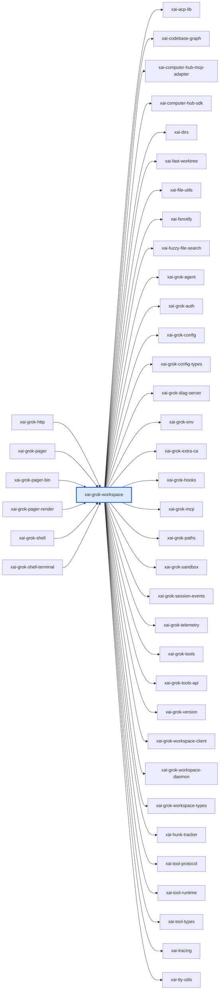

# xai-grok-workspace：模块详解

[返回十模块索引](README.md) · [返回全仓总览](../grok-build%20%E6%A8%A1%E5%9D%97%E6%80%BB%E8%A7%88%EF%BC%88%E8%87%AA%E5%8A%A8%E7%94%9F%E6%88%90%EF%BC%89.md)

> 自动统计 + 源码阅读说明。修改 scripts/grok-module-notes-*.json 中的解读，运行 `pnpm run arch:grok:details` 更新。

本机工作区宿主层：管理文件、VCS、worktree、项目配置、工具会话、权限、sandbox 元数据和可选 preview 服务。当前开源快照保留 BrowserService 相关注释与接口占位，但没有完整浏览器后端实现；不能据此声称浏览器闭环已经可用。

## 源码版本与统计口径

- grok-build SOURCE_REV：`c4ea71cfdbcdb21e32e41bc25a0043d7d4836714`；解读审阅基于 `c4ea71cfdbcdb21e32e41bc25a0043d7d4836714`。
- Rust 源码及 Cargo.toml 指纹：`148ba79207894b85a70e09fa4b91d0cd91f6537fe428139e95757d0e0da9c7ba`。
- raw LOC 是物理行；source LOC 是去注释后的非空行，保留字符串内容。扫描全部 crate 下 .rs，排除 target/ 和 fuzz/，不展开 feature、宏或 include。
- 下表分类按路径互斥分桶；实现路径可能含 #[cfg(test)] 内嵌测试，不能把这一列当成纯生产代码。场景 YAML、提示词 Markdown、快照等非 Rust 资产另见下文。
- 依赖方向 A → B 表示 A 的 Cargo 清单依赖 B，含 build/target/optional 的静态并集，不含 dev-dependencies；不是运行时调用图。
- 调用链文字是源码阅读结果，引用检查只验证文件/符号存在。本次没有执行 grok 二进制、Rust 测试或浏览器业务验收。

| 类别 | .rs 文件 | source LOC | raw LOC |
|---|---|---|---|
| 实现路径（可含内嵌测试） | 97 | 75,602 | 87,326 |
| 独立测试路径 | 16 | 22,374 | 23,810 |
| 基准路径 | 0 | 0 | 0 |
| 示例路径 | 0 | 0 | 0 |
| 总计 | 113 | 97,976 | 111,136 |

## 职责边界

**本模块负责**

- 拥有每个 workspace 的能力和资源生命周期；不绘制 pager UI，不执行模型轮次，也不定义内置工具请求格式。

## 入口与导出

| 类型 | 名称 | 真实入口 |
|---|---|---|
| library | `xai_grok_workspace` | [src/lib.rs](../../../grok-build/crates/codegen/xai-grok-workspace/src/lib.rs) |
| binary | `xai-workspace-server` | [src/bin/workspace_server.rs](../../../grok-build/crates/codegen/xai-grok-workspace/src/bin/workspace_server.rs) |
| binary | `workspace-server-probe` | [src/bin/workspace_server_probe.rs](../../../grok-build/crates/codegen/xai-grok-workspace/src/bin/workspace_server_probe.rs) |

库入口的词法 `mod` 声明（可能受 cfg 控制）：`activity`、`capability`、`channel`、`config`、`discovery`、`envrc`、`error`、`export_github`、`file_system`、`folder_trust`、`fs_notify`、`git_content_filters`、`git_odb`、`handle`、`hub`、`hub_auth`、`hub_channel`、`hub_ids`、`hub_server`、`image_capabilities`、`mcp`、`mcp_claim`、`path_virtualization`、`permission`、`project_config`、`publish`、`recovery`、`restore_fetch`、`scheduler_liveness`、`rpc_envelope`、`session`、`status_config`、`telemetry`、`trust`、`upload`、`util`、`workspace_ops`、`worktree`。

## 内部怎么拆：职责与源码

| 子系统 | 做什么 | 阅读入口 | 入口覆盖 .rs | source LOC | raw LOC |
|---|---|---|---|---|---|
| WorkspaceHandle | 集中管理 workspace 会话句柄、sandbox 元数据和生命周期。finalize_session_setup 的注释提到 BrowserService，但当前函数体仅发工具定义与环境事件；浏览器 shutdown 在 session/mod.rs 是空实现。 | [src/handle.rs](../../../grok-build/crates/codegen/xai-grok-workspace/src/handle.rs)；[src/session/mod.rs](../../../grok-build/crates/codegen/xai-grok-workspace/src/session/mod.rs)；[src/handle_tests.rs](../../../grok-build/crates/codegen/xai-grok-workspace/src/handle_tests.rs) | 1 | 4,573 | 4,866 |
| Workspace server | 已存在工作环境里的服务进程：应用 OS sandbox 策略，并在 preview_enabled 开启时启动 preview supervisor。它不是完整的云容器/虚拟机创建平台；sandbox.apply 失败或平台不支持时当前实现会告警并继续。 | [src/bin/workspace_server.rs](../../../grok-build/crates/codegen/xai-grok-workspace/src/bin/workspace_server.rs)；[src/bin/workspace_server_probe.rs](../../../grok-build/crates/codegen/xai-grok-workspace/src/bin/workspace_server_probe.rs) | 1 | 950 | 1,025 |
| 权限管理器 | 管理权限请求、已记忆决议、策略匹配和 resolution 生命周期。 | [src/permission/manager/mod.rs](../../../grok-build/crates/codegen/xai-grok-workspace/src/permission/manager/mod.rs)；[src/permission/policy.rs](../../../grok-build/crates/codegen/xai-grok-workspace/src/permission/policy.rs)；[src/permission/resolution_tests.rs](../../../grok-build/crates/codegen/xai-grok-workspace/src/permission/resolution_tests.rs) | 1 | 9,628 | 10,674 |
| 自动与受管权限策略 | auto_mode 和 managed_policy 表达不同来源的权限决策。 | [src/permission/auto_mode/mod.rs](../../../grok-build/crates/codegen/xai-grok-workspace/src/permission/auto_mode/mod.rs)；[src/permission/managed_policy/mod.rs](../../../grok-build/crates/codegen/xai-grok-workspace/src/permission/managed_policy/mod.rs)；[src/permission/managed_policy/tests.rs](../../../grok-build/crates/codegen/xai-grok-workspace/src/permission/managed_policy/tests.rs) | 1 | 2,836 | 3,354 |
| Shell 授权 | 把终端 command/scope 的授权判定放在 workspace 安全域。 | [src/permission/shell_access.rs](../../../grok-build/crates/codegen/xai-grok-workspace/src/permission/shell_access.rs)；[src/permission/policy.rs](../../../grok-build/crates/codegen/xai-grok-workspace/src/permission/policy.rs) | 1 | 2,886 | 3,246 |
| Session Git 和工具配置 | session/git 管理会话 VCS 操作，tool_config 为终端、web fetch 等工具构造 session context。 | [src/session/git.rs](../../../grok-build/crates/codegen/xai-grok-workspace/src/session/git.rs)；[src/session/tool_config.rs](../../../grok-build/crates/codegen/xai-grok-workspace/src/session/tool_config.rs)；[src/session/mod.rs](../../../grok-build/crates/codegen/xai-grok-workspace/src/session/mod.rs) | 1 | 3,435 | 3,639 |
| Worktree 生命周期 | 支持异步/流式创建、从 worktree 创建、候选目录选择和进度活动记录。 | [src/worktree/mod.rs](../../../grok-build/crates/codegen/xai-grok-workspace/src/worktree/mod.rs)；[src/activity.rs](../../../grok-build/crates/codegen/xai-grok-workspace/src/activity.rs) | 1 | 3,512 | 4,186 |
| Workspace RPC 操作 | 将搜索、hunk、worktree 等能力收敛为 WorkspaceOp 并统一 dispatch。 | [src/workspace_ops.rs](../../../grok-build/crates/codegen/xai-grok-workspace/src/workspace_ops.rs) | 1 | 2,428 | 2,508 |
| 发现、信任和项目配置 | 发现工作区、处理文件系统、目录信任、envrc、恢复和变更监听。 | [src/discovery.rs](../../../grok-build/crates/codegen/xai-grok-workspace/src/discovery.rs)；[src/file_system/mod.rs](../../../grok-build/crates/codegen/xai-grok-workspace/src/file_system/mod.rs)；[src/folder_trust.rs](../../../grok-build/crates/codegen/xai-grok-workspace/src/folder_trust.rs)；[src/trust.rs](../../../grok-build/crates/codegen/xai-grok-workspace/src/trust.rs)；[src/project_config.rs](../../../grok-build/crates/codegen/xai-grok-workspace/src/project_config.rs)；[src/recovery.rs](../../../grok-build/crates/codegen/xai-grok-workspace/src/recovery.rs)；[src/fs_notify.rs](../../../grok-build/crates/codegen/xai-grok-workspace/src/fs_notify.rs)；[src/envrc.rs](../../../grok-build/crates/codegen/xai-grok-workspace/src/envrc.rs) | 1 | 454 | 572 |

上表行数仅覆盖该行首个阅读入口的文件/目录，入口可能重叠；下表按 src 一级目录及 tests/benches 等桶互斥统计，可以相加。

## 目录体积

| 目录桶 | .rs | source LOC | raw LOC | 其中独立测试 source LOC |
|---|---|---|---|---|
| src/（根文件） | 37 | 36,123 | 39,954 | 11,806 |
| src/permission | 32 | 34,291 | 39,322 | 5,712 |
| src/session | 13 | 13,375 | 14,939 | 3,669 |
| src/file_system | 18 | 5,142 | 6,486 | 0 |
| src/worktree | 4 | 4,521 | 5,296 | 243 |
| src/hub_auth | 3 | 2,437 | 2,795 | 944 |
| src/bin | 2 | 1,108 | 1,230 | 0 |
| src/upload | 2 | 945 | 1,070 | 0 |
| src/util | 2 | 34 | 44 | 0 |

## 关键链路与源码阅读路径

### 阅读顺序：workspace 服务与当前浏览器缺口

1. 先读 workspace_server.rs：SandboxManager 应用 OS 限制，preview supervisor 只有显式开启后才启动。该进程运行于已有环境，不负责创建完整云沙盒。
2. 再读 handle.rs 的 finalize_session_setup：注释仍说注入 BrowserService，但当前函数体只发工具定义与环境事件。
3. 再读 session/mod.rs：shutdown_browser_service 是空函数，replace_carrying_browser_service 实际只校验终端后端并替换 toolset。
4. 最后读 browser_tab_chrome_e2e.rs：当前文件仅含测试说明注释；没有可运行测试体。因此不能把这份快照当成完整浏览器运行/验收闭环。

源码依据：[src/bin/workspace_server.rs](../../../grok-build/crates/codegen/xai-grok-workspace/src/bin/workspace_server.rs)；[src/handle.rs](../../../grok-build/crates/codegen/xai-grok-workspace/src/handle.rs)；[src/session/mod.rs](../../../grok-build/crates/codegen/xai-grok-workspace/src/session/mod.rs)；[../xai-grok-tools/tests/browser_tab_chrome_e2e.rs](../../../grok-build/crates/codegen/xai-grok-tools/tests/browser_tab_chrome_e2e.rs)。

### 阅读顺序：命令权限如何形成

1. 先读 session/tool_config.rs，确认工具如何取得 session workspace context。
2. 读取 permission/manager/mod.rs，查看权限请求和决议的中心状态。
3. 读取 policy.rs 与 shell_access.rs，确认规则和 command scope 的边界。
4. 再读 auto_mode 与 managed_policy，区分用户自动授权和部署侧策略。

源码依据：[src/session/tool_config.rs](../../../grok-build/crates/codegen/xai-grok-workspace/src/session/tool_config.rs)；[src/permission/manager/mod.rs](../../../grok-build/crates/codegen/xai-grok-workspace/src/permission/manager/mod.rs)；[src/permission/policy.rs](../../../grok-build/crates/codegen/xai-grok-workspace/src/permission/policy.rs)；[src/permission/shell_access.rs](../../../grok-build/crates/codegen/xai-grok-workspace/src/permission/shell_access.rs)；[src/permission/auto_mode/mod.rs](../../../grok-build/crates/codegen/xai-grok-workspace/src/permission/auto_mode/mod.rs)；[src/permission/managed_policy/mod.rs](../../../grok-build/crates/codegen/xai-grok-workspace/src/permission/managed_policy/mod.rs)。

### 阅读顺序：隔离 worktree

1. 从 worktree/mod.rs 的 create_worktree_async 和 create_worktree_streaming 开始。
2. 阅读 activity.rs，确认创建过程如何报告活动与结束状态。
3. 阅读 workspace_ops.rs，了解 worktree 操作怎样进入统一 RPC dispatch。
4. 结合源内 worktree 测试，检查失败清理和通知语义。

源码依据：[src/worktree/mod.rs](../../../grok-build/crates/codegen/xai-grok-workspace/src/worktree/mod.rs)；[src/activity.rs](../../../grok-build/crates/codegen/xai-grok-workspace/src/activity.rs)；[src/workspace_ops.rs](../../../grok-build/crates/codegen/xai-grok-workspace/src/workspace_ops.rs)。

## 直接依赖与被依赖

图中的每条边都来自 Cargo 扫描；边界内的可选依赖可能仅在特定构建配置启用。

**本模块依赖（34）**

| crate | Cargo 用途/模块说明 |
|---|---|
| `xai-acp-lib` | 根据 crate 名称和目录推断 |
| `xai-codebase-graph` | High-performance code graph generation using tree-sitter queries |
| `xai-computer-hub-mcp-adapter` | Bridge between MCP servers and the xAI Computer Hub, registering MCP-discovered tools as native hub tools. |
| `xai-computer-hub-sdk` | SDK for the xAI Computer Hub: connection pool, transparent reconnect, tool harness, and tool-server runtime. |
| `xai-dirs` | Home-directory resolution generally: USERPROFILE-first home_dir, plus grok-home ($GROK_HOME or <home>/.grok) |
| `xai-fast-worktree` | High-performance git worktree creation using CoW cloning |
| `xai-file-utils` | Local data collection: upload queueing and blob storage |
| `xai-fsnotify` | Local-filesystem event source: single causal stream of semantic FsEvents |
| `xai-fuzzy-file-search` | Fuzzy file search over a directory tree: an ignore-aware walker feeding a nucleo matcher, plus a background daemon |
| `xai-grok-agent` | Agent builder, definition parsing, and system prompt assembly |
| `xai-grok-auth` | Auth dependency-inversion seam: HttpAuth + AuthCredentialProvider traits |
| `xai-grok-config` | Shared config loading for Grok — grok_home, effective config (requirements > user > managed), TOML merge |
| `xai-grok-config-types` | Leaf configuration value types for the grok CLI, extracted from xai-grok-shell for dependency inversion. |
| `xai-grok-diag-server` | In-guest diagnostics HTTP server (/ready, /statusz, /logs) for the standalone workspace-server |
| `xai-grok-env` | Backend environment for the Grok CLI crate family: endpoint URL presets, shared GROK_*/XAI_* readers, the credentials-path resolver, and the first-party credential list. |
| `xai-grok-extra-ca` | TLS policy for the grok CLI: rustls backend pin, process crypto provider, shared root store, and opt-in GROK_EXTRA_CA_BUNDLE roots |
| `xai-grok-hooks` | Runtime hook system for Grok — file-based discovery, command execution, and policy enforcement |
| `xai-grok-mcp` | MCP integration crate. Quarantines rmcp + reqwest 0.13 (rmcp 3.x requires reqwest >= 0.13.2 while the rest of the workspace uses reqwest 0.12) and owns the MCP credential store and OAuth flow orchestrator. |
| `xai-grok-paths` | Type-safe path wrappers for absolute and relative UTF-8 paths |
| `xai-grok-sandbox` | OS-level sandboxing for Grok Build using kernel primitives (Landlock/Seatbelt) via nono |
| `xai-grok-session-events` | Typed per-session event log written as JSON lines |
| `xai-grok-telemetry` | Telemetry engine: product events + Mixpanel emission + Sentry error reporting for Grok Build sessions |
| `xai-grok-tools` | Grok tools library |
| `xai-grok-tools-api` | Protobuf API definitions for Grok tools |
| `xai-grok-version` | Lockstepped grok CLI version. |
| `xai-grok-workspace-client` | Lightweight typed client for hub-proxied workspace.* RPCs (shared by xai-grok-shell proxy mode and other consumers) |
| `xai-grok-workspace-daemon` | Process lifecycle for the workspace-server daemon: self-daemonization, single-instance pidfile locking, and preview-proxy child supervision |
| `xai-grok-workspace-types` | Wire types for the xAI workspace API (request/chunk/event enums shared by client and server) |
| `xai-hunk-tracker` | Track file hunks (diffs) with agent/external attribution |
| `xai-tool-protocol` | Wire-protocol types for the xAI Computer Hub |
| `xai-tool-runtime` | Unified Tool trait, dispatch trait, error taxonomy, notifications, and search index for the xAI Computer Hub |
| `xai-tool-types` | Canonical tool-description types for the xAI platform |
| `xai-tracing` | 根据 crate 名称和目录推断 |
| `xai-tty-utils` | Lightweight process-spawning utilities for TTY safety — detach from controlling terminal, suppress interactive pagers, process-group lifecycle |

**使用本模块（6）**

| crate | Cargo 用途/模块说明 |
|---|---|
| `xai-grok-http` | Shared reqwest HTTP clients and User-Agent construction for the grok CLI. |
| `xai-grok-pager` | xai-grok-pager |
| `xai-grok-pager-bin` | 根据 crate 名称和目录推断 |
| `xai-grok-pager-render` | 根据 crate 名称和目录推断 |
| `xai-grok-shell` | Grok |
| `xai-grok-shell-terminal` | Local, ACP, and PTY terminal runners extracted from xai-grok-shell so they compile in parallel. |

## 测试依据与非 Rust 资产

| 已有测试阅读入口 | 代码中覆盖的行为（本次未运行） |
|---|---|
| [src/handle_tests.rs](../../../grok-build/crates/codegen/xai-grok-workspace/src/handle_tests.rs) | 源内回归样例覆盖 WorkspaceHandle 的资源装配和关闭。 |
| [src/permission/resolution_tests.rs](../../../grok-build/crates/codegen/xai-grok-workspace/src/permission/resolution_tests.rs) | 源内回归样例覆盖权限决议状态和结果语义。 |
| [src/permission/managed_policy/tests.rs](../../../grok-build/crates/codegen/xai-grok-workspace/src/permission/managed_policy/tests.rs) | 源内回归样例覆盖受管策略解析与适用。 |
| [src/worktree/mod.rs](../../../grok-build/crates/codegen/xai-grok-workspace/src/worktree/mod.rs) | 文件内测试覆盖 worktree 创建、失败通知和清理标记等行为。 |

| 独立测试文件 Top 8 | source LOC | raw LOC |
|---|---|---|
| [src/handle_tests.rs](../../../grok-build/crates/codegen/xai-grok-workspace/src/handle_tests.rs) | 8,151 | 8,432 |
| [src/permission/managed_policy/tests.rs](../../../grok-build/crates/codegen/xai-grok-workspace/src/permission/managed_policy/tests.rs) | 3,133 | 3,267 |
| [src/hub_server_tests.rs](../../../grok-build/crates/codegen/xai-grok-workspace/src/hub_server_tests.rs) | 2,356 | 2,359 |
| [src/permission/resolution_tests.rs](../../../grok-build/crates/codegen/xai-grok-workspace/src/permission/resolution_tests.rs) | 2,171 | 2,622 |
| [src/session/git_restore_code_tests.rs](../../../grok-build/crates/codegen/xai-grok-workspace/src/session/git_restore_code_tests.rs) | 1,678 | 1,689 |
| [src/session/git_tests.rs](../../../grok-build/crates/codegen/xai-grok-workspace/src/session/git_tests.rs) | 1,340 | 1,577 |
| [src/hub_auth/proactive_tests.rs](../../../grok-build/crates/codegen/xai-grok-workspace/src/hub_auth/proactive_tests.rs) | 944 | 1,028 |
| [src/restore_fetch_tests.rs](../../../grok-build/crates/codegen/xai-grok-workspace/src/restore_fetch_tests.rs) | 686 | 753 |

| 类型 | 文件数 | 示例（不计 Rust LOC） |
|---|---|---|
| .json | 1 | [tests/fixtures/enterprise-managed-settings-ga.json](../../../grok-build/crates/codegen/xai-grok-workspace/tests/fixtures/enterprise-managed-settings-ga.json) |
| .md | 1 | [templates/auto_mode_classifier_system_prompt.md](../../../grok-build/crates/codegen/xai-grok-workspace/templates/auto_mode_classifier_system_prompt.md) |
| .toml | 1 | [Cargo.toml](../../../grok-build/crates/codegen/xai-grok-workspace/Cargo.toml) |

## 对 WhyBuddy 可以怎么用

**会话资源生命周期**：把文件、终端进程、工作区元数据和关闭逻辑统一管理；当前浏览器接口只是占位，需要补实现。 WhyBuddy 可借这个生命周期边界，再实现每个 run 的应用工作区、浏览器后端和真实操作验证。静态预览可作为已有能力继续提供。

依据：[src/handle.rs](../../../grok-build/crates/codegen/xai-grok-workspace/src/handle.rs)；[src/session/mod.rs](../../../grok-build/crates/codegen/xai-grok-workspace/src/session/mod.rs)；[src/bin/workspace_server.rs](../../../grok-build/crates/codegen/xai-grok-workspace/src/bin/workspace_server.rs)。

**能力级权限策略**：权限请求、规则、自动模式和受管策略独立，能留下审计边界。 WhyBuddy 可将命令、文件写入、浏览器导航、发布分为独立 capability。

依据：[src/permission/manager/mod.rs](../../../grok-build/crates/codegen/xai-grok-workspace/src/permission/manager/mod.rs)；[src/permission/policy.rs](../../../grok-build/crates/codegen/xai-grok-workspace/src/permission/policy.rs)；[src/permission/auto_mode/mod.rs](../../../grok-build/crates/codegen/xai-grok-workspace/src/permission/auto_mode/mod.rs)；[src/permission/managed_policy/mod.rs](../../../grok-build/crates/codegen/xai-grok-workspace/src/permission/managed_policy/mod.rs)。

**隔离 worktree**：生成任务在独立工作目录中进行，创建过程可流式回报。 WhyBuddy 可在 worktree/sandbox 中启动真实项目、由浏览器验证，再决定导出或合并。

依据：[src/worktree/mod.rs](../../../grok-build/crates/codegen/xai-grok-workspace/src/worktree/mod.rs)；[src/activity.rs](../../../grok-build/crates/codegen/xai-grok-workspace/src/activity.rs)。

**WorkspaceOp 边界**：本机能力通过明确操作协议分派，不散落到调用方。 WhyBuddy 可为 sandbox 和 browser 建立小而可审计的 RPC action 集。

依据：[src/workspace_ops.rs](../../../grok-build/crates/codegen/xai-grok-workspace/src/workspace_ops.rs)。

## 建议阅读顺序

1. [src/lib.rs](../../../grok-build/crates/codegen/xai-grok-workspace/src/lib.rs)：确认 workspace 公开能力。
2. [src/handle.rs](../../../grok-build/crates/codegen/xai-grok-workspace/src/handle.rs)：从真实运行时资源拥有者读起。
3. [src/bin/workspace_server.rs](../../../grok-build/crates/codegen/xai-grok-workspace/src/bin/workspace_server.rs)：确认 sandbox/preview 服务入口。
4. [src/permission/manager/mod.rs](../../../grok-build/crates/codegen/xai-grok-workspace/src/permission/manager/mod.rs)：理解权限中心状态。
5. [src/session/tool_config.rs](../../../grok-build/crates/codegen/xai-grok-workspace/src/session/tool_config.rs)：理解能力如何注入工具。
6. [src/worktree/mod.rs](../../../grok-build/crates/codegen/xai-grok-workspace/src/worktree/mod.rs)：理解隔离工作目录。

## 大文件与完整 Rust 清单

先看实现路径的 Top 15；它们仍可能带内嵌测试。下面的完整清单包含所有统计文件，方便继续拆到单个组件。

| 实现路径 Top 15 | source LOC | raw LOC |
|---|---|---|
| [src/permission/manager/mod.rs](../../../grok-build/crates/codegen/xai-grok-workspace/src/permission/manager/mod.rs) | 9,628 | 10,674 |
| [src/handle.rs](../../../grok-build/crates/codegen/xai-grok-workspace/src/handle.rs) | 4,573 | 4,866 |
| [src/worktree/mod.rs](../../../grok-build/crates/codegen/xai-grok-workspace/src/worktree/mod.rs) | 3,512 | 4,186 |
| [src/session/git.rs](../../../grok-build/crates/codegen/xai-grok-workspace/src/session/git.rs) | 3,435 | 3,639 |
| [src/permission/shell_access.rs](../../../grok-build/crates/codegen/xai-grok-workspace/src/permission/shell_access.rs) | 2,886 | 3,246 |
| [src/permission/auto_mode/mod.rs](../../../grok-build/crates/codegen/xai-grok-workspace/src/permission/auto_mode/mod.rs) | 2,836 | 3,354 |
| [src/workspace_ops.rs](../../../grok-build/crates/codegen/xai-grok-workspace/src/workspace_ops.rs) | 2,428 | 2,508 |
| [src/permission/policy.rs](../../../grok-build/crates/codegen/xai-grok-workspace/src/permission/policy.rs) | 2,333 | 2,713 |
| [src/activity.rs](../../../grok-build/crates/codegen/xai-grok-workspace/src/activity.rs) | 1,976 | 2,454 |
| [src/hub.rs](../../../grok-build/crates/codegen/xai-grok-workspace/src/hub.rs) | 1,868 | 1,944 |
| [src/permission/prompter.rs](../../../grok-build/crates/codegen/xai-grok-workspace/src/permission/prompter.rs) | 1,835 | 2,161 |
| [src/permission/bash_command_splitting.rs](../../../grok-build/crates/codegen/xai-grok-workspace/src/permission/bash_command_splitting.rs) | 1,550 | 1,851 |
| [src/trust.rs](../../../grok-build/crates/codegen/xai-grok-workspace/src/trust.rs) | 1,375 | 1,763 |
| [src/folder_trust.rs](../../../grok-build/crates/codegen/xai-grok-workspace/src/folder_trust.rs) | 1,304 | 1,635 |
| [src/session/file_state.rs](../../../grok-build/crates/codegen/xai-grok-workspace/src/session/file_state.rs) | 1,291 | 1,636 |

展开全部 113 个 Rust 文件

| 文件 | 类别 | source LOC | raw LOC |
|---|---|---|---|
| [src/activity.rs](../../../grok-build/crates/codegen/xai-grok-workspace/src/activity.rs) | 实现路径（可含内嵌测试） | 1,976 | 2,454 |
| [src/bin/workspace_server.rs](../../../grok-build/crates/codegen/xai-grok-workspace/src/bin/workspace_server.rs) | 实现路径（可含内嵌测试） | 950 | 1,025 |
| [src/bin/workspace_server_probe.rs](../../../grok-build/crates/codegen/xai-grok-workspace/src/bin/workspace_server_probe.rs) | 实现路径（可含内嵌测试） | 158 | 205 |
| [src/capability.rs](../../../grok-build/crates/codegen/xai-grok-workspace/src/capability.rs) | 实现路径（可含内嵌测试） | 273 | 344 |
| [src/channel.rs](../../../grok-build/crates/codegen/xai-grok-workspace/src/channel.rs) | 实现路径（可含内嵌测试） | 8 | 15 |
| [src/config.rs](../../../grok-build/crates/codegen/xai-grok-workspace/src/config.rs) | 实现路径（可含内嵌测试） | 1,107 | 1,239 |
| [src/discovery.rs](../../../grok-build/crates/codegen/xai-grok-workspace/src/discovery.rs) | 实现路径（可含内嵌测试） | 454 | 572 |
| [src/envrc.rs](../../../grok-build/crates/codegen/xai-grok-workspace/src/envrc.rs) | 实现路径（可含内嵌测试） | 611 | 718 |
| [src/error.rs](../../../grok-build/crates/codegen/xai-grok-workspace/src/error.rs) | 实现路径（可含内嵌测试） | 84 | 95 |
| [src/export_github.rs](../../../grok-build/crates/codegen/xai-grok-workspace/src/export_github.rs) | 实现路径（可含内嵌测试） | 676 | 753 |
| [src/file_system/acp_fs.rs](../../../grok-build/crates/codegen/xai-grok-workspace/src/file_system/acp_fs.rs) | 实现路径（可含内嵌测试） | 145 | 168 |
| [src/file_system/adapter.rs](../../../grok-build/crates/codegen/xai-grok-workspace/src/file_system/adapter.rs) | 实现路径（可含内嵌测试） | 59 | 83 |
| [src/file_system/attach_file.rs](../../../grok-build/crates/codegen/xai-grok-workspace/src/file_system/attach_file.rs) | 实现路径（可含内嵌测试） | 501 | 524 |
| [src/file_system/client_fs.rs](../../../grok-build/crates/codegen/xai-grok-workspace/src/file_system/client_fs.rs) | 实现路径（可含内嵌测试） | 721 | 876 |
| [src/file_system/codebase_index.rs](../../../grok-build/crates/codegen/xai-grok-workspace/src/file_system/codebase_index.rs) | 实现路径（可含内嵌测试） | 227 | 316 |
| [src/file_system/content.rs](../../../grok-build/crates/codegen/xai-grok-workspace/src/file_system/content.rs) | 实现路径（可含内嵌测试） | 253 | 299 |
| [src/file_system/ext_fs.rs](../../../grok-build/crates/codegen/xai-grok-workspace/src/file_system/ext_fs.rs) | 实现路径（可含内嵌测试） | 464 | 540 |
| [src/file_system/file_tree.rs](../../../grok-build/crates/codegen/xai-grok-workspace/src/file_system/file_tree.rs) | 实现路径（可含内嵌测试） | 474 | 546 |
| [src/file_system/fs.rs](../../../grok-build/crates/codegen/xai-grok-workspace/src/file_system/fs.rs) | 实现路径（可含内嵌测试） | 84 | 122 |
| [src/file_system/fsmonitor.rs](../../../grok-build/crates/codegen/xai-grok-workspace/src/file_system/fsmonitor.rs) | 实现路径（可含内嵌测试） | 222 | 264 |
| [src/file_system/git_status.rs](../../../grok-build/crates/codegen/xai-grok-workspace/src/file_system/git_status.rs) | 实现路径（可含内嵌测试） | 293 | 350 |
| [src/file_system/index.rs](../../../grok-build/crates/codegen/xai-grok-workspace/src/file_system/index.rs) | 实现路径（可含内嵌测试） | 973 | 1,459 |
| [src/file_system/jj_status.rs](../../../grok-build/crates/codegen/xai-grok-workspace/src/file_system/jj_status.rs) | 实现路径（可含内嵌测试） | 67 | 80 |
| [src/file_system/local_fs.rs](../../../grok-build/crates/codegen/xai-grok-workspace/src/file_system/local_fs.rs) | 实现路径（可含内嵌测试） | 49 | 59 |
| [src/file_system/mock_fs.rs](../../../grok-build/crates/codegen/xai-grok-workspace/src/file_system/mock_fs.rs) | 实现路径（可含内嵌测试） | 49 | 58 |
| [src/file_system/mod.rs](../../../grok-build/crates/codegen/xai-grok-workspace/src/file_system/mod.rs) | 实现路径（可含内嵌测试） | 256 | 330 |
| [src/file_system/process.rs](../../../grok-build/crates/codegen/xai-grok-workspace/src/file_system/process.rs) | 实现路径（可含内嵌测试） | 83 | 95 |
| [src/file_system/walk.rs](../../../grok-build/crates/codegen/xai-grok-workspace/src/file_system/walk.rs) | 实现路径（可含内嵌测试） | 222 | 317 |
| [src/folder_trust.rs](../../../grok-build/crates/codegen/xai-grok-workspace/src/folder_trust.rs) | 实现路径（可含内嵌测试） | 1,304 | 1,635 |
| [src/fs_notify.rs](../../../grok-build/crates/codegen/xai-grok-workspace/src/fs_notify.rs) | 实现路径（可含内嵌测试） | 337 | 398 |
| [src/git_content_filters.rs](../../../grok-build/crates/codegen/xai-grok-workspace/src/git_content_filters.rs) | 实现路径（可含内嵌测试） | 256 | 284 |
| [src/git_odb.rs](../../../grok-build/crates/codegen/xai-grok-workspace/src/git_odb.rs) | 实现路径（可含内嵌测试） | 77 | 96 |
| [src/handle.rs](../../../grok-build/crates/codegen/xai-grok-workspace/src/handle.rs) | 实现路径（可含内嵌测试） | 4,573 | 4,866 |
| [src/handle_tests.rs](../../../grok-build/crates/codegen/xai-grok-workspace/src/handle_tests.rs) | 独立测试路径 | 8,151 | 8,432 |
| [src/hub.rs](../../../grok-build/crates/codegen/xai-grok-workspace/src/hub.rs) | 实现路径（可含内嵌测试） | 1,868 | 1,944 |
| [src/hub_auth/mod.rs](../../../grok-build/crates/codegen/xai-grok-workspace/src/hub_auth/mod.rs) | 实现路径（可含内嵌测试） | 848 | 1,019 |
| [src/hub_auth/proactive.rs](../../../grok-build/crates/codegen/xai-grok-workspace/src/hub_auth/proactive.rs) | 实现路径（可含内嵌测试） | 645 | 748 |
| [src/hub_auth/proactive_tests.rs](../../../grok-build/crates/codegen/xai-grok-workspace/src/hub_auth/proactive_tests.rs) | 独立测试路径 | 944 | 1,028 |
| [src/hub_channel.rs](../../../grok-build/crates/codegen/xai-grok-workspace/src/hub_channel.rs) | 实现路径（可含内嵌测试） | 97 | 122 |
| [src/hub_ids.rs](../../../grok-build/crates/codegen/xai-grok-workspace/src/hub_ids.rs) | 实现路径（可含内嵌测试） | 4 | 8 |
| [src/hub_server.rs](../../../grok-build/crates/codegen/xai-grok-workspace/src/hub_server.rs) | 实现路径（可含内嵌测试） | 1,271 | 1,308 |
| [src/hub_server_tests.rs](../../../grok-build/crates/codegen/xai-grok-workspace/src/hub_server_tests.rs) | 独立测试路径 | 2,356 | 2,359 |
| [src/image_capabilities.rs](../../../grok-build/crates/codegen/xai-grok-workspace/src/image_capabilities.rs) | 实现路径（可含内嵌测试） | 311 | 393 |
| [src/lib.rs](../../../grok-build/crates/codegen/xai-grok-workspace/src/lib.rs) | 实现路径（可含内嵌测试） | 217 | 234 |
| [src/mcp.rs](../../../grok-build/crates/codegen/xai-grok-workspace/src/mcp.rs) | 实现路径（可含内嵌测试） | 1,098 | 1,311 |
| [src/mcp_claim.rs](../../../grok-build/crates/codegen/xai-grok-workspace/src/mcp_claim.rs) | 实现路径（可含内嵌测试） | 75 | 121 |
| [src/mcp_claim_tests.rs](../../../grok-build/crates/codegen/xai-grok-workspace/src/mcp_claim_tests.rs) | 独立测试路径 | 124 | 147 |
| [src/path_virtualization.rs](../../../grok-build/crates/codegen/xai-grok-workspace/src/path_virtualization.rs) | 实现路径（可含内嵌测试） | 468 | 559 |
| [src/path_virtualization_tests.rs](../../../grok-build/crates/codegen/xai-grok-workspace/src/path_virtualization_tests.rs) | 独立测试路径 | 489 | 515 |
| [src/permission/auto_mode/mod.rs](../../../grok-build/crates/codegen/xai-grok-workspace/src/permission/auto_mode/mod.rs) | 实现路径（可含内嵌测试） | 2,836 | 3,354 |
| [src/permission/auto_mode/routine_git.rs](../../../grok-build/crates/codegen/xai-grok-workspace/src/permission/auto_mode/routine_git.rs) | 实现路径（可含内嵌测试） | 111 | 127 |
| [src/permission/auto_mode/routine_git_tests.rs](../../../grok-build/crates/codegen/xai-grok-workspace/src/permission/auto_mode/routine_git_tests.rs) | 独立测试路径 | 90 | 94 |
| [src/permission/auto_mode/security_findings.rs](../../../grok-build/crates/codegen/xai-grok-workspace/src/permission/auto_mode/security_findings.rs) | 实现路径（可含内嵌测试） | 114 | 168 |
| [src/permission/auto_mode/security_findings_tests.rs](../../../grok-build/crates/codegen/xai-grok-workspace/src/permission/auto_mode/security_findings_tests.rs) | 独立测试路径 | 127 | 138 |
| [src/permission/bash_command_splitting.rs](../../../grok-build/crates/codegen/xai-grok-workspace/src/permission/bash_command_splitting.rs) | 实现路径（可含内嵌测试） | 1,550 | 1,851 |
| [src/permission/claude_settings.rs](../../../grok-build/crates/codegen/xai-grok-workspace/src/permission/claude_settings.rs) | 实现路径（可含内嵌测试） | 358 | 476 |
| [src/permission/exec_risk.rs](../../../grok-build/crates/codegen/xai-grok-workspace/src/permission/exec_risk.rs) | 实现路径（可含内嵌测试） | 844 | 950 |
| [src/permission/gate_preflight.rs](../../../grok-build/crates/codegen/xai-grok-workspace/src/permission/gate_preflight.rs) | 实现路径（可含内嵌测试） | 194 | 246 |
| [src/permission/hub_permission.rs](../../../grok-build/crates/codegen/xai-grok-workspace/src/permission/hub_permission.rs) | 实现路径（可含内嵌测试） | 612 | 612 |
| [src/permission/managed_policy/layer.rs](../../../grok-build/crates/codegen/xai-grok-workspace/src/permission/managed_policy/layer.rs) | 实现路径（可含内嵌测试） | 67 | 102 |
| [src/permission/managed_policy/marketplace.rs](../../../grok-build/crates/codegen/xai-grok-workspace/src/permission/managed_policy/marketplace.rs) | 实现路径（可含内嵌测试） | 128 | 179 |
| [src/permission/managed_policy/mcp.rs](../../../grok-build/crates/codegen/xai-grok-workspace/src/permission/managed_policy/mcp.rs) | 实现路径（可含内嵌测试） | 300 | 420 |
| [src/permission/managed_policy/mod.rs](../../../grok-build/crates/codegen/xai-grok-workspace/src/permission/managed_policy/mod.rs) | 实现路径（可含内嵌测试） | 293 | 358 |
| [src/permission/managed_policy/parse.rs](../../../grok-build/crates/codegen/xai-grok-workspace/src/permission/managed_policy/parse.rs) | 实现路径（可含内嵌测试） | 339 | 396 |
| [src/permission/managed_policy/tests.rs](../../../grok-build/crates/codegen/xai-grok-workspace/src/permission/managed_policy/tests.rs) | 独立测试路径 | 3,133 | 3,267 |
| [src/permission/managed_policy/url_match.rs](../../../grok-build/crates/codegen/xai-grok-workspace/src/permission/managed_policy/url_match.rs) | 实现路径（可含内嵌测试） | 639 | 808 |
| [src/permission/managed_policy/verdict.rs](../../../grok-build/crates/codegen/xai-grok-workspace/src/permission/managed_policy/verdict.rs) | 实现路径（可含内嵌测试） | 98 | 137 |
| [src/permission/manager/bash_grants.rs](../../../grok-build/crates/codegen/xai-grok-workspace/src/permission/manager/bash_grants.rs) | 实现路径（可含内嵌测试） | 299 | 384 |
| [src/permission/manager/mod.rs](../../../grok-build/crates/codegen/xai-grok-workspace/src/permission/manager/mod.rs) | 实现路径（可含内嵌测试） | 9,628 | 10,674 |
| [src/permission/manager/reasons.rs](../../../grok-build/crates/codegen/xai-grok-workspace/src/permission/manager/reasons.rs) | 实现路径（可含内嵌测试） | 52 | 53 |
| [src/permission/manager/request_classification.rs](../../../grok-build/crates/codegen/xai-grok-workspace/src/permission/manager/request_classification.rs) | 实现路径（可含内嵌测试） | 83 | 118 |
| [src/permission/manager/tests/stack_routing_tests.rs](../../../grok-build/crates/codegen/xai-grok-workspace/src/permission/manager/tests/stack_routing_tests.rs) | 独立测试路径 | 191 | 200 |
| [src/permission/mod.rs](../../../grok-build/crates/codegen/xai-grok-workspace/src/permission/mod.rs) | 实现路径（可含内嵌测试） | 81 | 86 |
| [src/permission/policy.rs](../../../grok-build/crates/codegen/xai-grok-workspace/src/permission/policy.rs) | 实现路径（可含内嵌测试） | 2,333 | 2,713 |
| [src/permission/prompter.rs](../../../grok-build/crates/codegen/xai-grok-workspace/src/permission/prompter.rs) | 实现路径（可含内嵌测试） | 1,835 | 2,161 |
| [src/permission/resolution.rs](../../../grok-build/crates/codegen/xai-grok-workspace/src/permission/resolution.rs) | 实现路径（可含内嵌测试） | 748 | 938 |
| [src/permission/resolution_tests.rs](../../../grok-build/crates/codegen/xai-grok-workspace/src/permission/resolution_tests.rs) | 独立测试路径 | 2,171 | 2,622 |
| [src/permission/rules.rs](../../../grok-build/crates/codegen/xai-grok-workspace/src/permission/rules.rs) | 实现路径（可含内嵌测试） | 273 | 337 |
| [src/permission/shell_access.rs](../../../grok-build/crates/codegen/xai-grok-workspace/src/permission/shell_access.rs) | 实现路径（可含内嵌测试） | 2,886 | 3,246 |
| [src/permission/state.rs](../../../grok-build/crates/codegen/xai-grok-workspace/src/permission/state.rs) | 实现路径（可含内嵌测试） | 1,018 | 1,247 |
| [src/permission/types.rs](../../../grok-build/crates/codegen/xai-grok-workspace/src/permission/types.rs) | 实现路径（可含内嵌测试） | 860 | 860 |
| [src/project_config.rs](../../../grok-build/crates/codegen/xai-grok-workspace/src/project_config.rs) | 实现路径（可含内嵌测试） | 74 | 103 |
| [src/publish.rs](../../../grok-build/crates/codegen/xai-grok-workspace/src/publish.rs) | 实现路径（可含内嵌测试） | 375 | 444 |
| [src/recovery.rs](../../../grok-build/crates/codegen/xai-grok-workspace/src/recovery.rs) | 实现路径（可含内嵌测试） | 695 | 847 |
| [src/restore_fetch.rs](../../../grok-build/crates/codegen/xai-grok-workspace/src/restore_fetch.rs) | 实现路径（可含内嵌测试） | 524 | 615 |
| [src/restore_fetch_tests.rs](../../../grok-build/crates/codegen/xai-grok-workspace/src/restore_fetch_tests.rs) | 独立测试路径 | 686 | 753 |
| [src/rpc_envelope.rs](../../../grok-build/crates/codegen/xai-grok-workspace/src/rpc_envelope.rs) | 实现路径（可含内嵌测试） | 193 | 199 |
| [src/scheduler_liveness.rs](../../../grok-build/crates/codegen/xai-grok-workspace/src/scheduler_liveness.rs) | 实现路径（可含内嵌测试） | 230 | 283 |
| [src/session/checkpoint.rs](../../../grok-build/crates/codegen/xai-grok-workspace/src/session/checkpoint.rs) | 实现路径（可含内嵌测试） | 947 | 1,009 |
| [src/session/checkpoint_store.rs](../../../grok-build/crates/codegen/xai-grok-workspace/src/session/checkpoint_store.rs) | 实现路径（可含内嵌测试） | 574 | 764 |
| [src/session/file_state.rs](../../../grok-build/crates/codegen/xai-grok-workspace/src/session/file_state.rs) | 实现路径（可含内嵌测试） | 1,291 | 1,636 |
| [src/session/git.rs](../../../grok-build/crates/codegen/xai-grok-workspace/src/session/git.rs) | 实现路径（可含内嵌测试） | 3,435 | 3,639 |
| [src/session/git_gate.rs](../../../grok-build/crates/codegen/xai-grok-workspace/src/session/git_gate.rs) | 实现路径（可含内嵌测试） | 585 | 655 |
| [src/session/git_gate_tests.rs](../../../grok-build/crates/codegen/xai-grok-workspace/src/session/git_gate_tests.rs) | 独立测试路径 | 604 | 667 |
| [src/session/git_head_divergence_tests.rs](../../../grok-build/crates/codegen/xai-grok-workspace/src/session/git_head_divergence_tests.rs) | 独立测试路径 | 47 | 55 |
| [src/session/git_restore_code_tests.rs](../../../grok-build/crates/codegen/xai-grok-workspace/src/session/git_restore_code_tests.rs) | 独立测试路径 | 1,678 | 1,689 |
| [src/session/git_tests.rs](../../../grok-build/crates/codegen/xai-grok-workspace/src/session/git_tests.rs) | 独立测试路径 | 1,340 | 1,577 |
| [src/session/jj.rs](../../../grok-build/crates/codegen/xai-grok-workspace/src/session/jj.rs) | 实现路径（可含内嵌测试） | 189 | 224 |
| [src/session/mod.rs](../../../grok-build/crates/codegen/xai-grok-workspace/src/session/mod.rs) | 实现路径（可含内嵌测试） | 917 | 1,086 |
| [src/session/swap_policy.rs](../../../grok-build/crates/codegen/xai-grok-workspace/src/session/swap_policy.rs) | 实现路径（可含内嵌测试） | 640 | 756 |
| [src/session/tool_config.rs](../../../grok-build/crates/codegen/xai-grok-workspace/src/session/tool_config.rs) | 实现路径（可含内嵌测试） | 1,128 | 1,182 |
| [src/status_config.rs](../../../grok-build/crates/codegen/xai-grok-workspace/src/status_config.rs) | 实现路径（可含内嵌测试） | 1,271 | 1,494 |
| [src/telemetry.rs](../../../grok-build/crates/codegen/xai-grok-workspace/src/telemetry.rs) | 实现路径（可含内嵌测试） | 7 | 23 |
| [src/trust.rs](../../../grok-build/crates/codegen/xai-grok-workspace/src/trust.rs) | 实现路径（可含内嵌测试） | 1,375 | 1,763 |
| [src/upload/environment.rs](../../../grok-build/crates/codegen/xai-grok-workspace/src/upload/environment.rs) | 实现路径（可含内嵌测试） | 331 | 422 |
| [src/upload/mod.rs](../../../grok-build/crates/codegen/xai-grok-workspace/src/upload/mod.rs) | 实现路径（可含内嵌测试） | 614 | 648 |
| [src/util/mod.rs](../../../grok-build/crates/codegen/xai-grok-workspace/src/util/mod.rs) | 实现路径（可含内嵌测试） | 33 | 41 |
| [src/util/ripgrep.rs](../../../grok-build/crates/codegen/xai-grok-workspace/src/util/ripgrep.rs) | 实现路径（可含内嵌测试） | 1 | 3 |
| [src/workspace_ops.rs](../../../grok-build/crates/codegen/xai-grok-workspace/src/workspace_ops.rs) | 实现路径（可含内嵌测试） | 2,428 | 2,508 |
| [src/worktree/identity.rs](../../../grok-build/crates/codegen/xai-grok-workspace/src/worktree/identity.rs) | 实现路径（可含内嵌测试） | 51 | 81 |
| [src/worktree/identity_tests.rs](../../../grok-build/crates/codegen/xai-grok-workspace/src/worktree/identity_tests.rs) | 独立测试路径 | 243 | 267 |
| [src/worktree/mod.rs](../../../grok-build/crates/codegen/xai-grok-workspace/src/worktree/mod.rs) | 实现路径（可含内嵌测试） | 3,512 | 4,186 |
| [src/worktree/strategy.rs](../../../grok-build/crates/codegen/xai-grok-workspace/src/worktree/strategy.rs) | 实现路径（可含内嵌测试） | 715 | 762 |

解读维护源：[grok-module-notes-core.json](../../scripts/grok-module-notes-core.json)。
