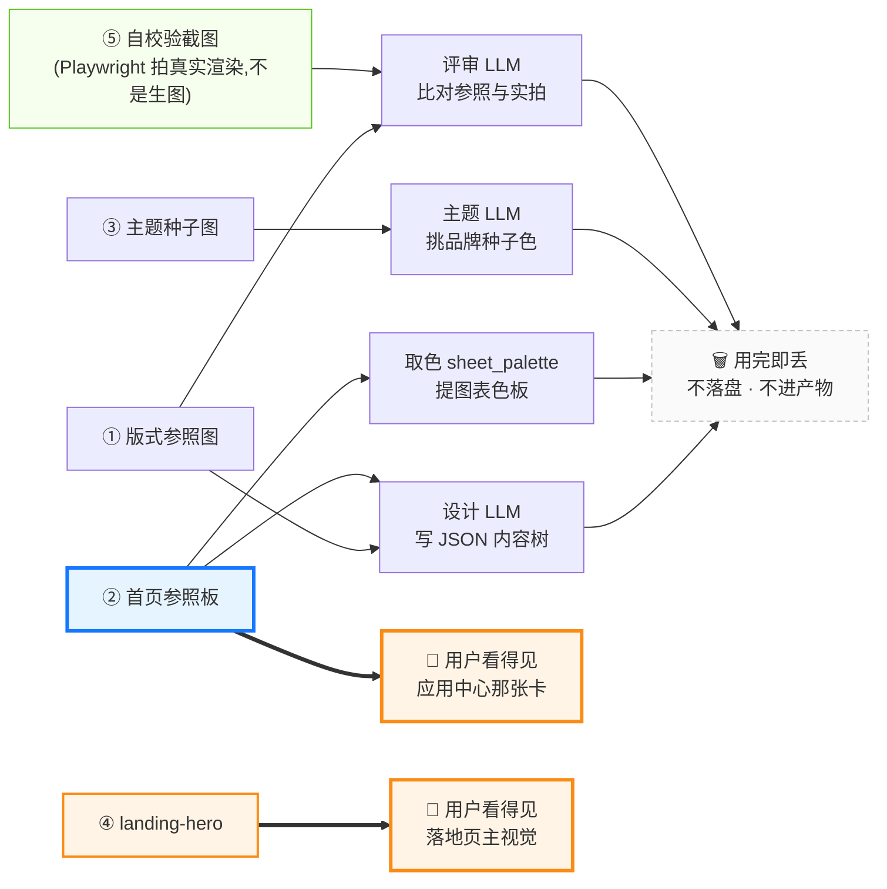

# 生图链路：四张图分别干什么（2026-08-07）

只读代码整理，未改动任何代码。写这份是因为**同一个混淆踩了三次**：

1. 2026-08-06 把 `.env` 里生图三行注掉之后，「首页 UI 显示有问题」——以为少的是
   一张图片，实际少的是**设计模型的版式参照**。
2. 讨论「用公开图库搜图替代生图」时，默认了"图 = 用户看到的图"，而耗时大头
   其实是用户看不到的那几张。
3. 我自己在同一场讨论里断言过「①②③ 用户永远看不到」——**② 是错的**，
   参照板同时就是应用中心那张卡的画面。

所以把四条链路画一次，钉住"谁生成、谁看、看完丢不丢"。

## 一句话

> 这个系统里的图**大部分不是给人看的，是给模型看的**。
> 四条链路里只有两条最终进入用户视野（②的缩略图、④的落地页主视觉），
> 而耗时最大的一条（②，实测单张 60~85s）主要身份是「给设计 LLM 看的草图」。

## 链路图



## 四条链路逐条

| | 生成函数 | 谁看 | 用户看得到吗 | 笼子 |
|---|---|---|---|---|
| ① 版式参照图 | `freeform_block._generate_reference_image_b64`（:1687，调用 :2342） | 设计 LLM | ❌ | `SLIDERULE_ENRICH_MAX_REF_IMAGES`，默认 **4** |
| ② 首页参照板 | `freeform_block._generate_overview_sheet_b64`（:1787，调用 :3164） | 设计 LLM + 取色 | ✅ **应用中心缩略图** | 每轮 **1 张**（`sheet_used == 0`）+ 预算闸 |
| ③ 主题种子图 | `identity_theme_gen._generate_reference_image_b64`（:186，调用 :246） | 主题 LLM | ❌ | 每轮 1 张，埋点 `theme.refimage` |
| ④ landing-hero | `_generate_overview_sheet_b64(marketing_hero=True)`（:3159） | **用户** | ✅ 落地页主视觉 | 仅 `presentation == "marketing-landing"` 的页 |
| ⑤ 自校验截图 | `app_screenshot.capture_freeform_preview_screenshot`（**不是生图**） | 评审 LLM | ❌ | `SLIDERULE_ENRICH_MAX_SCREENSHOT_VERIFY`，默认 **2** |

### ① 版式参照图 —— 画给设计模型看的草图

docstring 写得很直白（`freeform_block.py:1697`）：

> 图片只在本次调用内临时使用（喂给下面的视觉 LLM 看一眼），**不落盘、不进产物、
> 不展示给终端用户**——它上面的"数字"都是占位假象，不能当真实数据源。

道理是：与其用文字跟设计模型描述"我要现代仪表盘那种感觉"，不如先真画一张给它看。
模型看图比读字准。所以先生一张**长得像这一页**的假图（数字全是编的），再连同
真实字段一起喂给设计模型，让它照着那个气质排真数据。

**关键：它是版式草图，不是行业照片。**

### ② 首页参照板 —— 一图两用，也是唯一一张"既给模型看又给人看"的

主身份还是给设计模型看的参照，但生完之后顺手交给应用中心当缩略图
（`freeform_block.py:3177`）：

> 这张图排完版式就该丢了——但它同时也正是应用中心那张卡该显示的画面。

为什么要顺手用它，`app_preview.py` 的开头记了原因：应用中心此前靠**活渲染**，
实测「生产构建下同屏 14 张卡，最长单任务 4106ms，主线程连续堵四秒」。

它还有第三个消费者：`sheet_palette.extract_chart_palette` 从这张图里提图表色板。

⚠️ 这就是我之前断言错的地方。**"参照图用户看不到"这句话对 ①③ 成立，对 ② 不成立。**

### ③ 主题种子图 —— 只为了让 LLM 挑一个颜色

`identity_theme_gen.py:254` 那句提示词说得最清楚：

> 下面这张图是一张配色参考图，从它的主色调里提炼出上面要求的种子色
> （不需要版式跟这张图一模一样，只需要抓住它的主色调）。

拿到种子色之后，剩下 10 个主题字段全部由前端的 HCT 派生算法算
（`client/src/lib/identity-palette.ts`），LLM 不参与配色。图用完即丢。

### ④ landing-hero —— 唯一一张"生来就是给用户看"的

链路是全程受控的，模型碰不到 URL：

```
_generate_overview_sheet_b64(marketing_hero=True)
  → landing_media_b64
  → 预览负载 _landingHeroB64
  → GET /api/sliderule/freeform-preview/{pid}/media/landing-hero   （sliderule_full.py:1689）
  →                                                   （block-registry.tsx:960-962）
```

模型那一侧只能写一个字面量：

```python
imageRef: Optional[Literal["landing-hero"]] = None   # freeform_block.py:842
```

**这是刻意的零信任姿态**——模型能写 URL，就等于开了往用户页面塞任意外链的口子
（追踪像素、SSRF）。

### ⑤ 自校验截图 —— 唯一一张不是"生"出来的

这张是 Playwright 拍的**真实渲染结果**（走隔离预览页 `/sliderule/freeform-preview/:pid`），
拍完跟 ① 并排喂给评审 LLM（`freeform_block.py:2022-2023`）：一张是"我本来想要的样子"，
一张是"我实际做出来的样子"，让它挑差异。生成→截图→自己看→改的闭环。

## 闸：什么情况下一张都不生

三个环境变量任意缺一项，整条生图链路关闭（`.env:68-79`）：

```
IMAGE_API_URL / IMAGE_MODEL / IMAGE_API_KEY
```

三个调用点各自 fail-open 降级，都已实测：

| 调用点 | 降级表现 |
|---|---|
| `identity_theme_gen._generate_reference_image_b64` | → `None`，主题回落预设色板 |
| `freeform_block._image_generation_configured()` | → `False`，参照板整条不触发（连请求都不发） |
| `freeform_block._generate_reference_image_b64` | → `ImageGenError` → 跳过 |

另外两道独立的闸：

- `LLM_SUPPORTS_IMAGE_CONTENT_PARTS` —— 网关声明不支持图片入参时，生了也没人看，
  所以 `sheet_enabled` 直接为假（:2993）。
- **运行预算** —— `remaining_run_budget_seconds() >= 150 + 130 * design_total`
  才做视觉增强（`enrich_timing.py`）。重话题模型生成本身就吃掉 533s 的那种情况，
  这一段整段跳过，`skippedReason=deadline`。

**2026-08-06 起 `.env` 三行全部注掉，所以现在线上①②③④一张都没有。**
「关掉图片之后首页显示有问题」就是这个——少的不是图片，是①②那两张给设计模型
看的草图，设计只能纯靠文字生成。

## 常见误解对照

| 以为 | 实际 |
|---|---|
| 生图是为了让页面上有图 | 四条里三条是给模型看的；页面上真有图的只有 ④，且只在营销落地页 |
| 关掉生图 = 页面少张图 | 关掉 = 设计模型失去版式参照，**整页版式质量下降** |
| 参照图用户看不到 | ①③ 看不到，**② 就是应用中心那张卡** |
| 参照图可以换成图库照片 | ①②③ 要的是**版式草图**，图库给的是**行业照片**，两码事 |
| 生图慢是因为图大 | ② 单张实测 60~85s，是 ENRICH 段最贵的一步（见并行化审查文档「八、7」） |

## 对「用公开图库搜图替代生图」的判断

按上面的分工，这个建议**只落在 ④**，而 ④ 是四条里适用面最窄的一条
（仅 `marketing-landing` 页），耗时大头 ①② 完全用不上。

若要做，形态应当是**只换生产者、不动契约**：

```
服务端搜图 → 下载 → 落成受控媒体 → 模型拿到的仍然只有 landing-hero
```

`Literal["landing-hero"]` 一个字都不用改，零信任姿态不退。

2026-08-07 实测三条已知风险（用 Openverse 免 key 接口验的）：

1. **语义歧义**。直接搜 `greenhouse`，前三条全是**温室气体排放柱状图**
   （`Variwide chart of greenhouse gas emissions per capita`）。挂到大棚系统的
   落地页上不是"图丑一点"，是给用户一张误导性图表。中文业务名 → 英文查询这一步
   本身就是能出大错的语义环节。
2. **corpus 厚度**。`drugstore interior shelves` → 0 命中；
   `tomato greenhouse interior` → 2 命中。薄了就退化成"要么没有，要么错得离谱"。
3. **授权**。Openverse 命中以维基的 **CC BY-SA**（传染性 share-alike）为主，
   商业产品里不合适；唯一可用的一张是 rawpixel 的 CC0。真做要选 Unsplash / Pexels
   这类授权干净、corpus 大的源。

### 网络可达性：已在生产服务器上实测，不是阻塞项

我原本预判「生产服务器在国内（`docker-compose.prod.yml` 自己写着「国内服务器拉
ghcr 慢/超时」），维基的 upload.wikimedia.org 基本不可用，Openverse 这条路大概率
判死」。**这个预判被实测推翻了**，留在这里当记录：别拿"服务器在国内"这个标签去
推断具体域名的可达性，各家的边缘节点分布差别很大。

2026-08-07 在生产服务器跑 `scripts/stock-probe.sh` 的实测：

| | HTTP | 首字节 |
|---|---|---|
| api.unsplash.com | 301 | 0.28s |
| api.pexels.com | 302 | 0.16s |
| pixabay.com/api | 400 | 0.17s |
| api.openverse.org | **200** | 0.10s |
| images.unsplash.com | **200** | 0.18s |
| images.pexels.com | 404 | 0.20s |
| cdn.pixabay.com | 403 | 0.09s |
| images.rawpixel.com | 403 | 0.09s |
| upload.wikimedia.org | 301 | **0.10s** |

真下一张 525KB 大图：**HTTP 200，1.61s，334 KB/s**。

三点读法：

1. **全部可达，而且快。** 首字节 0.09~0.28s，比开发容器（走代理，0.19~0.27s）
   还略好。下载 1.61s 相对于 ② 生一张图的 60~85s 是零头。
2. **403 / 404 不是不可达**，是 CDN 拒绝对裸根路径的请求。真正有意义的是最后那次
   带完整路径的下载：rawpixel CDN 根路径 403，但真图 200。
3. **API 端点没带 key 验过**。301/302 只证明 DNS + TLS + HTTP 通，不证明 API 本身
   可用。接入前仍需拿真 key 打一次。

顺带一个推论（未验证）：wikimedia 0.10s 这个数不像从中国大陆出去的（跨太平洋
仅 RTT 就 150ms+，TLS 还要 2~3 个来回）。那台机器多半在香港/新加坡一带，或者
配了代理。这跟 compose 注释里「国内服务器拉 ghcr 慢」的假设不一致，**其它依赖
"服务器在国内"的判断也该重新核一遍**。

### 所以真正的阻塞项只剩两个

网络划掉之后，剩下的是上面 1、3 两条——**语义歧义**和**授权**。两条都跟选哪家
图库无关，得在方案层面解决，不是换个源就能绕过去的。

## 相关文件

- `slide-rule-python/services/freeform_block.py` —— ①②④⑤ 全在这里
- `slide-rule-python/services/identity_theme_gen.py` —— ③
- `slide-rule-python/services/app_preview.py` —— ② 通向应用中心的那条槽
- `slide-rule-python/services/app_screenshot.py` —— ⑤
- `slide-rule-python/services/enrich_timing.py` —— 预算闸与埋点
- `client/src/pages/sliderule/live-runtime/block-registry.tsx` —— ④ 的渲染端
- `docs/enrich-pipeline-parallelization-audit-2026-07-31.md` —— 这一段的耗时基线
