# WhyBuddy 欠缺模块清单：对照 Claude Code / Grok-build

> 性质：架构对照 + 落地设计。不是路线图散文。
> 北极星：`docs/NORTH_STAR.md`——**一句话意图 → 可预览、可导出、带证据链的应用方案**。
> 活路径（今天）：`ComposerDock` / `runTurn` → `POST /api/sliderule/drive-full-stream`（**路由信封** `sliderule_full.py:1243-1334`：persist-as-authority、skills/connectors/device/design-system、E25 `run_registry`、E26 自动补救、`save_session`）→ 生成器 `drive_full_v5_session_stream` → spec-first 七步 → `v5_model_gate` → `evaluate_coverage_gate`（驱动器内，不是 `/coverage`）→ publish closure 6/6。刷新续播是 `GET /runs/{id}/stream`，不是新点火。
> 目标点火插座（V6.1）：**新烧**走 `POST /api/sliderule/control-turn-stream`（`forcedTool` 或 LLM 选工具）→ `rehearse`/`refine`/`repair` 调**同一信封 helper**（从今天的路由抽出，不是裸调生成器）。产品客户端剥注释后不得 POST `/drive-full-stream` 也不得 POST `/drive-full`。续播仍 `GET /runs/{id}/stream`。
> 纪律：改之前先确认哪条链在跑（`Claude.md` 第一条）。本文件每个「加入」都写接在哪条 live path 上。

---

## 1. 结论先行

WhyBuddy / 面团 AI **不是**通用 AI 平台，也 **不该** 变成 Claude Code 或 Grok-build 的皮肤。它是一台**产品推演编译器**：封闭词表调度 → 闸门过的五系统应用。

今天不好用，**不是因为缺一套编码 Agent**。缺的是一层薄的、推演母语的**控制面**：

```
用户消息 / 重新推演 / 补齐缺口 / 质疑 / 斜杠
  → POST /control-turn-stream（登录闸；**新烧**的唯一点火 HTTP）
       便宜轮：LLM 选工具（ask_user / search / inspect / scope_card）
       贵按钮：`forcedTool` 跳过 LLM（rehearse/refine/repair 才 handoff；challenge 只失效）
  → rehearse / refine / repair → **工厂信封** start_drive_full_factory_run
       （persist 权威、skills/connectors、E25 run_registry、E26、save_session）
       信封内部才调生成器 drive_full_v5_session_stream(..., profile=)
  → 活预览 + 证据 HUD
  刷新续播：GET /runs/{id}/stream（不是 control-turn-stream，不增加生成器调用次数）
```

Claude / Grok 的形状是：**开放词表工具 + git 工作区**。
WhyBuddy 的目标形状是：**封闭词表工具 + 五系统会话**。

工厂不许被替换。控制面必须包住**信封**（不是裸生成器），并且是信封的**唯一产品客户端**。脚本路由 `/drive-full-stream` 可调同一 helper，不是第二方言。聊天不再等于点火工厂。「开始推演」是 `forcedTool: "rehearse"` 且 POST 必须带齐 skills/connectors/device/designSystem（不是 `{forcedTool, goal}`）。`/推演` 无范围卡只出卡。产品 UI 上不展示未标定的「8–9 分钟」数字（见 M2 / KD4）。

**一句话裁决**：偷 Claude/Grok 的「先谈再烧、中途可改、记忆可选、进度诚实」；不偷 Bash/Edit、MCP 应用商店、yolo 发布、通用子代理改模型。

---

## 2. 三个产品分别是什么

| | Claude Code | Grok-build | WhyBuddy / 面团 AI（现状） |
|---|---|---|---|
| **一句话** | 在仓库里写代码的 agent | 在仓库里写代码 + 调度子代理的 agent | 把一句话编成可预览、带证据的应用方案 |
| **工作对象** | git 工作区、文件、终端 | git 工作区、文件、终端、图像/视频 | 五系统会话（entities / rbac / workflow / pages / aigc / appbundle） |
| **循环** | LLM ↔ 开放 `tool_calls` | LLM ↔ 开放 `tool_calls` | 规则/`v5_agentic_pick` 从**封闭词表**抽能力；每轮是**孤立 chat completion**，`sliderule_llm/client.py:_chat_payload` **没有** `tools` 字段 |
| **贵的那一步** | 长会话里连续改文件 | 长会话里连续改文件 + 子代理 | `drive-full-stream` 一场推演（墙钟因路径而异，见 §4.1 观测备注），spec-first 七步 + 闸 |
| **信任** | 权限模式（ask / accept-edits / bypass） | 权限 + always-approve | 证据/闭环 **fail-closed**；增强类 **fail-open**（`Claude.md` §7） |
| **发布** | git commit / PR | git commit / PR | publish closure 6/6；缺证据就是 blocked，不许绿灯 |
| **北极星** | 把任务做完 | 把任务做完 | `docs/NORTH_STAR.md`：意图 → 应用方案，全程可见、每步有证据 |
| **不承诺** | 秒回（但短轮便宜） | 秒回 | 秒回。承诺的是推演可见、门真实执行 |

附属件（松耦合，不占主线，`NORTH_STAR.md` 第 26–28 行）：`agent-loop/` CLI/VS Code 队列跑手、`ue5/`、Autopilot `/autopilot`（legacy v4）。

活 UI：`/` 与 `/sliderule` 都重定向到 `/agent-loop/sliderule`（`client/src/App.tsx:85-87, 160-170`）。

---

## 3. 总架构对照图

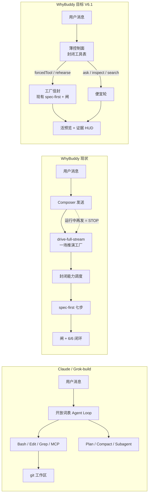
```mermaid
flowchart LR
  subgraph CLAUDE["Claude / Grok-build"]
    C1[用户消息] --> C2[开放词表 Agent Loop]
    C2 --> C3[Bash / Edit / Grep / MCP]
    C3 --> C4[git 工作区]
    C2 --> C5[Plan / Compact / Subagent]
  end

  subgraph NOW["WhyBuddy 现状"]
    N1[用户消息] --> N2[Composer 发送]
    N2 --> N3["drive-full-stream<br/>一场推演工厂"]
    N3 --> N4[封闭能力调度]
    N4 --> N5[spec-first 七步]
    N5 --> N6[闸 + 6/6 闭环]
    N2 -.->|运行中再发 = STOP| N3
  end

  subgraph NEXT["WhyBuddy 目标 V6.1"]
    T1[用户消息] --> T2[薄控制面<br/>封闭工具表]
    T2 -->|ask / inspect / search| T3[便宜轮]
    T2 -->|forcedTool / rehearse| T4[工厂信封<br/>现有 spec-first + 闸]
    T4 --> T5[活预览 + 证据 HUD]
    T3 --> T5
  end
```

三列读法：左边是大哥的 DNA（开放工具 + 仓库）。中间是今天——**聊天即工厂点火**。右边是要做的：控制面把工厂收成工具，工厂本身不换。

---

## 4. 现状活路径 vs 图上的假路径

`docs/SlideRule V6.0 架构图.md` 是一份约 2400 行的实验室笔记；配套 PNG 不可读。图自己前后打架，升版时只改了一处。本仓最贵的病在图上复发：同一个事实写两次，必然漂移。

### 4.1 活路径（通电的插座）

```
ComposerDock.doSend / sendMessage / repairGaps / challengeTurn
  → useSlideRuleSession.runTurn
  → POST /api/sliderule/drive-full-stream          routes/sliderule_full.py:1227
       信封（不是裸生成器）:1243-1334
         persist-as-authority load_session         :1248-1254
         skills/connectors/device/design-system    :1272-1294（finally 清空）
         E25 run_registry.start_run + SSE          :1328-1334
         E26 transient_blocked 自动补救一次        :1299-1312
         save_session on_complete                  :1320-1326
  → drive_full_v5_session_stream                   v5_full_driver.py:1779
     （生成器；refine 活路径 wants_refine/:469-508，
      不在执行器直调）
  → orchestrate_plan + pick_next_capabilities      v5_full_driver.py:2019-2023
    + 可选 v5_agentic_pick                         活调用点 v5_full_driver.py:2028-2030
                                                   （定义 v5_agentic_pick.py:452；
                                                    词表封闭；规则版为空则 LLM 无权续命）
  → 每能力一轮孤立 chat completion                 sliderule_llm/client.py:283
                                                   payload 只有 model/messages/temperature/max_tokens/stream
  → appbundle.runtimeclosure 触发 spec-first 七步  spec_first_pipeline.py:1-13
       spec_tree → spec_page_html → page_shell
       → html_structure → spec_semantics
       → model_assembly → html_bindings
  → v5_model_gate + v5_model_repair                v5_capability_executor.py:498, 532
  → evaluate_coverage_gate                         流式驱动器内：
                                                   v5_full_driver.py:1992 / :2333 / :2363
                                                   （POST /coverage 是算一遍不落库的调试口，
                                                    routes/sliderule_full.py:1216，不是产品插座）
  → publish closure 6/6                            v5_publish_closure_response.py
  → 前端 live-runtime HTML（DOMPurify + Shadow DOM）
```

**不是新点火的两条旁路（PR-4 必须点名留下 / 删掉）**：

- **续播**：`runTurn(..., { runId })` → `resumeDriveFullStream` → `GET /api/sliderule/runs/{id}/stream`（`useSlideRuleSession.ts:1614-1616`，`sliderule-marathon-driver.ts:332-344`）。不得改成 POST `control-turn-stream`。
- **Hang/null 第三工厂**：Python stream 返回 null 时 `useSlideRuleSession.ts:1178-1188` 调 `SlideRuleRuntime.driveReasoningSession`。PR-4 后产品 `runTurn` 必须删这条。同步 twin `POST /drive-full`（`sliderule-marathon-driver.ts:172`）产品面同样剥掉。

默认生成路径 **spec-first**，2026-08-14 起默认开（`spec_first_pipeline.py:39`）。GEN5（`v5_llm_generate.generate_five_system_model`）是回落；`SLIDERULE_SPEC_FIRST_NO_GEN5_ON_TRANSPORT` 默认 `1`（`v5_capability_executor.py:447-455`），传输/结构失败不许打回老链路交一份没页的 6/6。

**墙钟观测（不是标定集，禁止写进产品 UI）**：架构图记过二手车 1→6 ≈ 8–9 min、连锁宠物医院 1→4 = 381s（`docs/SlideRule V6.0 架构图.md:199`）；`v5_full_driver.py:1831-1835` 说第一页 HTML 约第 2 分钟；`intake_judge.py:3` 仍写「一轮约 20 分钟 + 最多 9 张生图」（那是 enrich 开着的口径）。三条可以同时「真」，因为路径不同。M18 切短清单后还会再变。Scope card / 推演钟 v1 只说「大约数分钟，第一页会先出现」，数字要等标定笔记（run id、spec-first on/off、enrich on/off、median + p90）才许上屏（KD4）。

**质疑的活路径（不要抄错文件）**：`challengeTurn` → `runTurn(..., intent: "challenge")` → TS `intakeMessage` → `invalidateForIntervention`（`client/src/lib/sliderule-runtime.ts:3215`，定义 `:2982`）→ `persistSession(preparedState)`（`useSlideRuleSession.ts:862-871`，失败时**今天仍继续驱动**——目标改为 fail-closed）→ Python `drive_full_stream` 以已持久化会话为权威起点（`sliderule_full.py:1248-1254`）。`v5_full_driver.py` **零** `challenge` / `intervention` 引用。Python 的 `invalidate_for_intervention` 在 `slide_rule_interactive_gates.py:399`，由 `drive_reasoning_turn`（`slide_rule_session.py:277`）调用，即 `/drive-turn`，产品流不走。OSS 表里那格是 stale-cascade（`OSS_GAP_ANALYSIS.md:44-46`），**不是** `persistence.py:399-576`（那是读会话解析）。

### 4.2 图码不符清单（事故记录）

| 图上口径 | 代码真相 | 文件 |
|---|---|---|
| ⚑⚑A「新链路接主轴尚未做」 | 已接。`_try_llm_generate_evidence` 先 `run_spec_first`。同一份文件 ⚑⚑E 写「✔ 已接」——**节点与正文当场打架** | `docs/SlideRule V6.0 架构图.md:200-206` vs `:273`；`v5_capability_executor.py:539-569` |
| GEN5 画成脊柱/红旗 | 默认路径绕过它。⛔1/⛔3 描述的是**老链路回落**，不是主轴 | `spec_first_pipeline.py:11-13`；架构图 `:109-113` |
| ENRICH 画在主轴 | spec-first 跳过 enrich（`from_spec_first` 标志，正反判据都有） | `tests/test_enrich_skipped_on_spec_first.py`；架构图 `:208-216` 曾写「不跑」但当时代码没开关——已修，图仍把 enrich 画得像主轴 |
| OWNERSHIP「前端没有可见性切换」 | **过期**。`AppsWorkbench.tsx` 有 `app-visibility-*` 开关 | 架构图 `:1834`；`AppsWorkbench.tsx:2136` |
| 成本「全是假的」`len//4` | **半真**：`cost_ledger.py` 挂 `call_llm` 成功出口记真实 usage；能力执行器估 token 仍 `len(content)//4` | `cost_ledger.py:1-9`；`slide_rule_executor.py:167`；架构图 `:2351-2353` |
| `app_template.py` 画成供给侧 | 文件在、种子在、49 条用例在；**生成链路零读取**。`match_app_template` 只出现在测试 | `app_template.py:240`；`tests/test_app_template.py`；架构图 `:1241, :2333` |
| `drive_v5_full_path` | import 了，**从未调用**（定义点一处，调用点零） | `v5_session_driver.py:12`；`routes/sliderule_full.py:37` |
| G_READY / G_CONFIRM 停泊 | 活在 `/drive-turn`（`drive_reasoning_turn`），**不在**产品流 `drive-full-stream` | `slide_rule_interactive_gates.py`；`routes/sliderule_full.py:1041` vs `:1227` |
| MCP 画得像协议 | 内部 2 条目注册表：`web.search`、`code.run`。`code.run` 从未被 driver 调用。`web.search` 在 `retrieve_evidence` 里无条件打，不是模型选的 | `mcp_tools.py:431-446`；`rag_service.py:32-36` |
| `mcp_runtime` / `skill_runtime` | 两个独立可注入适配器；**流式 driver 都不调**。不要把任一接成控制面 | `services/mcp_runtime.py:1-6`；`services/skill_runtime.py:1-6`；`v5_full_driver.py` 零引用 |
| 能力池 ~20 个 RAG 作文能力 | 仍被调度。用户等的是 `model.generate` / `appbundle.runtimeclosure`，前面烧的是 `risk.analyze` 散文 | `v5_agentic_pick.py:34-72`；`capability_maps.py` 大量 `retrieve_evidence` |
| 每步 checkpoint / 能力级 pendingWrites | **仍未做**。`persistence.py` 只有最新快照 | `docs/OSS_GAP_ANALYSIS.md:47-57`；`persistence.py` 无 checkpoint 目录 |

双后端仍在：Node `server/` 薄代理 + Python `:9700`。三套 UI 仍可达：`/agent-loop/sliderule`（主）、`/agent-loop/workbench`、`/autopilot` + `/projects` + `/tasks` + `workbench/legacy`（`App.tsx:90-172`）。

---

## 5. 为什么「不好用」——不是缺编码 Agent，是缺控制面

前端审计落到用户看见的东西上（`Claude.md` 第五条），不是落到源码行数上。

| 摩擦 | 活代码 | 用户感受 |
|---|---|---|
| 空态长得像聊天；发送 = 点火一场工厂，没有计划、没有 ETA、没有批准 | `client/src/pages/sliderule/ComposerDock.tsx:356-358` 注释：「深思一轮就是唯一产品路径」；`doSend` 不是唯一点火口——`sendMessage` / `repairGaps` / `challengeTurn` / `answerClarifications` 都进 `runTurn` | 「我只是打了个招呼」也会烧一轮 |
| `intake_judge` 已经分类（real / iteration / vague / off_topic / meta / out_of_scope），**默认不阻断** | `intake_judge.py:41-48, 78-81`：`SLIDERULE_INTAKE_JUDGE_BLOCKING` 默认关；前端 `use-intake-judge.ts:4-6`「只提示不阻断」 | 分类器在跑，点火照旧 |
| 运行中再发送 = **停止**，不是新指令 | `ComposerDock.tsx:1022-1033`：`isRunning ? stop : doSend`，title「停止」 | 想改方向只能先杀再重来 |
| 闭环后动词打架 | `SlideRule.tsx`：重新推演 / 编辑重跑 / 质疑 / 补齐缺口 / 重置；`looksLikeNewAppIntent` 自动新话题；`AppsWorkbench` Fork 应用 | 同一意图六种说法 |
| 质疑走 `window.prompt` | `useSlideRuleSession.ts:1882-1895` | 浏览器原生弹窗，不是作曲家 |
| 「推演」不是侧栏项 | `client/src/pages/agent-loop/dashboard/DashboardApp.tsx:1193`：「推演不再单列菜单项：点品牌 logo / 点会话 / 新建会话都通向推演视图」。`AgentLoopPage.test.tsx:186-197` 只断言 `href="/agent-loop/sliderule"` 和字「推演」，今天靠品牌 logo 的 `title="回到推演"` 就能绿 | 新用户找不到产品本身 |
| `/autopilot` `/projects` `/tasks` workbench/legacy 仍直达 | `App.tsx:90-172` | 三套产品抢注意力 |
| 没有便宜问答 vs 昂贵推演的分流 | 产品面恒 `driveMode=single`（`useSlideRuleSession.ts:311-316`） | 问「这个角色为什么这样」= 再烧一场工厂 |
| 没有跨场产品宪章 | 仓里 `AGENTS.md` / `Claude.md` 是给**引擎建造者**的，不会注入用户产品 | 每场推演从零发明同一家公司的 RBAC |
| `modelVersions` 存在但产品语言是 `v2/v3` 小工具条 | `SlideRuleStudio.tsx:609-655`；`v5_state.py:401` | 用户不知道这是产品变体 |
| 进度是 LLM 轨迹流，不是推演钟 | `useSlideRuleSession.ts:300-309` `llmDraft` / `llmStreams`。SSE 是 `skill_start`（能力 id）和 spec-first 页 sink，**没有**映射到产品六步 | 用户看到的是 token，不是「现在在起草 SPEC，第一页会先出现」 |

这些摩擦，Claude/Grok 用控制面解决了：**先谈、再烧、中途可改、贵的那步是工具不是聊天的唯一语义**。WhyBuddy 要偷的是这个形状，不是他们的工具表。

---

## 6. 欠缺模块清单

每个模块：编号、方面、大哥怎么做、WhyBuddy 现状（live / dead / absent）、要不要加入、加入后的推演母语形态、三列对照图、风险。

判定四档：

- **必须**：不做，产品继续「聊天即烧钱」
- **应该**：做了用户能感到好用
- **可以**：有收益，但排在必须之后
- **不要**：编码 Agent DNA，装上会把推演平台拖成伪 Cursor

---

### M1 薄控制面 Agent Loop（tool-calling，封闭工具表）

- **方面**：控制面
- **Claude**：消息 → 模型 → `tool_calls` → 执行 → 回喂，循环直到文本回复。工具开放：Bash / Edit / Read / Grep / Glob / Agent / MCP。
- **Grok-build**：同构。控制面本身就能说话，不必每次启动一次「生产」。
- **WhyBuddy 现状**：**absent（循环形态）/ live（工厂）**。活引擎是封闭词表调度器，不是 tool-calling loop。`_chat_payload`（`sliderule_llm/client.py:283-294`）没有 `tools`。流式驱动器活调用点是 `v5_full_driver.py:2028-2030`（`agentic_pick_next_capabilities`），只能从 `CAPABILITY_VOCAB` 里挑，规则版为空则 LLM 不能续命（`v5_agentic_pick.py:7-13`）。
- **要不要加入**：**必须**
- **Q1 已关闭**：控制面走 provider `tools`/`tool_calls`（方案 A）。工厂 `sliderule_llm/client.py` **禁止**出现 `tools`。两条 client 分文件（`control_client.py` vs `client.py`），避免「只改一半」。这不是产品分叉，PR-4 按 A 做。

- **加入后的 WhyBuddy 形态**：一个**薄**控制面，工具表封闭且全是推演动词。产品路径上工厂**信封**的唯一客户端是这个控制面（KD16）。生成器 `drive_full_v5_session_stream` 只许被信封 helper 调用，不许被 `rehearsal_control.py` 裸 `async for`。

  **新烧**（发送 / 「开始推演」/ `/推演` / `/精修` / 补齐缺口 / 质疑）→ `POST /api/sliderule/control-turn-stream`。
  **续播不是点火**：`runTurn(..., { runId })` → `resumeDriveFullStream` → `GET /api/sliderule/runs/{id}/stream`（`useSlideRuleSession.ts:1614-1616`，`sliderule-marathon-driver.ts:332-344`）。PR-4 若把续播改成 POST control-turn-stream，刷新会把「（续播上一轮推演）」当新用户消息再烧一场。

  剥注释后产品客户端不得 POST `/drive-full-stream` **也不得** POST `/drive-full`（`driveFullViaPython` 同步 twin，`sliderule-marathon-driver.ts:172`）。`GET /runs/{id}/stream` 保留。

  闭集工具表（LLM 不能发明新工具；要加必须改本表 + KD）：

  | 工具 | 贵？ | 允许写什么 | 行为 | 接在哪条 live path |
  |---|---|---|---|---|
  | `ask_user` | 便宜 | 无 | 停下来问范围/取舍，**结束本请求** | 新控制面；`awaitReason="control_ask"`（扩 Literal，不复用 G_READY `"ready"`） |
  | `search_evidence` | 便宜 | 只写 `controlTranscript` | 调 `web.search` / RAG；**不计 6/6** | `mcp_tools.web_search` + `rag_service.retrieve_evidence`；禁止 `commit_artifact` |
  | `inspect_model` | 便宜 | 无 | 返回有界 digest，永不吐生模型 JSON | `load_session` |
  | `scope_card` | 便宜 | 无 | 产出范围卡，等人批 | 见 M2；`awaitReason="control_scope"` |
  | `rehearse` | **贵** | 生成新五系统模型 | 调信封 `start_drive_full_factory_run(..., profile="app")` | 信封内部才进生成器 |
  | `refine` | **贵** | 生成新五系统模型 | **同一信封**；生成器走现有 `wants_refine` / `set_refine_context`（`v5_full_driver.py:469-508`）。**禁止**直调 `v5_capability_executor`（2026-08-16 步伴拐杖：改执行器不等于通电） | `tests/test_refine_merge_reaches_the_live_path.py` |
  | `challenge` | 中 | **只失效，不生成** | 质疑按钮 / `/质疑` 以 `forcedTool: "challenge"` 跳过 LLM；handler `apply_user_intervention_invalidation` 恰好一次，**不**调信封。是否再烧是后续决策 | Python `slide_rule_interactive_gates.py:579`；不要假设客户端已 invalidate |
  | `repair` | 中 | 生成（只重跑覆盖门标红） | 同一信封，`repair=True` → `pick_repair_capabilities` | `v5_full_driver.py:1795-1798`；E26 仍在信封里 |
  | `restore_version` | 便宜 | **只移指针** | 现有 modelVersions 回退 | executor「模型直供」分支 |
  | `fork_variant` | 便宜 | **只复制指针** | 现有 `fork_app` + `suppress_web_search` | `AppsWorkbench` / `fork_app`；`mcp_tools.py:43-73` |

  无工具可把 `blocked` 写成 `false`。

#### M1 一页契约（PR-4 开工前必须写进代码注释，删任何一条 PR 失败）

1. **路由**：`POST /api/sliderule/control-turn-stream`。`_require_login`（与 `drive_full_stream` 同闸，`sliderule_full.py:1243`）。Node 已有 `/api/sliderule/*` catch-all（`server/routes/sliderule.ts:1225-1233`），**不要**再写一份 Node 实现。同步 twin 若需要（测试/脚本），必须成对 `set`/`clear`，产品面只走 SSE。

2. **SSE 事件（控制面自己的，工厂 SSE 一字不改）**：
   - `control_text` — 便宜轮可见文本
   - `control_tool_start` / `control_tool_result` — 工具起止（不含工厂内部 `skill_start`）
   - `control_ask_user` — 停泊：问题 + 选项；本请求结束
   - `control_scope_card` — 范围卡 payload；本请求结束，等人点「开始推演」
   - `control_handoff_factory` — 信封已 `run_registry.start_run`；带 `runId`；随后 **同一条 SSE 订阅**该 run（或客户端改走现有 `resumeDriveFullStream`）。复用工厂事件（`phase_change` / `skill_start` / `skill_result` / `publish_closure` / `complete`）
   - `complete` — 控制面本回合结束（未点火也要发）

   **前端消费者必须点名**：新 `consumeControlStreamResponse`（`sliderule-marathon-driver.ts`）。处理 `control_*`；见到 `control_handoff_factory` 之后把后续事件交给与 `consumeDriveStreamResponse` **同一套工厂 case**（抽共享 helper，禁止复制一份 switch）。现有 `consumeDriveStreamResponse`（`:353-455`）只认工厂事件、无 `default`，`control_*` 会被静默丢掉。作曲家必须渲染 `control_ask_user` / `control_scope_card`。续播仍走 `consumeDriveStreamResponse`（不需要 control_*）。

3. **`ask_user` / `scope_card` 停泊协议（必须能 round-trip）**：
   - tool-calling 循环**不得**在同一 HTTP 请求里空转等用户。
   - `ask_user` → yield `control_ask_user` → persist `awaitReason="control_ask"` → 结束 SSE。
   - `scope_card` → yield `control_scope_card` → persist `awaitReason="control_scope"` → 结束 SSE。
   - **`AwaitReason` 是闭集 Literal**（Python `models/v5_state.py:12-24` **和** TS `shared/blueprint/v5-reasoning-state.ts:20-31`）。今天没有 `control_ask` / `control_scope`。`V5SessionState(awaitReason="control_ask")` 会 ValidationError，persist 会 400 或丢字段。PR-4 **必须**把这两个值加进**两边**，并扩展 `tests/test_v5_state_schema_parity.py`。**禁止**复用 `"ready"` / `"user_input"` / `"confirm"`（G_READY 活在 `/drive-turn`；产品前端已特殊处理 `"ready"`/`"confirm"`，`sliderule-runtime.ts:3270-3287`）。
   - 用户回复走下一次 `control-turn-stream`，控制面从 `controlTranscript` 恢复，**不**重放已完成的工具。刷新后仍要画出问题（`awaitReason` 未被剥）。

4. **会话分账**：便宜轮历史进 `V5SessionState.controlTranscript`（**一等字段**，Python + TS 都加；默认 `[]`）。Pydantic v2 默认忽略 extras，sibling blob / 未声明 key 会在 `server_load` / `save_session` 被剥光，「会话字段或 sibling blob」不是仓库。形状对齐 `conversation`：`{ id, role: "user"|"assistant"|"tool", text?, tool?, timestamp? }`。**禁止**把问候、inspect dump、search 摘要追加进 `conversation`（`v5_state.py:348` / TS `:131`）——那是工厂 intake。反向：问候+搜索之后 `conversation.length` 不变，`controlTranscript` 变长，`evidencePresentCount` 不变。

5. **`inspect_model` 投影（有界 digest，缺则 fail-open 空 digest + 一句人话）**：实体名列表、角色名、页面标题、闸 findings 摘要、当前 `blocked`/`evidencePresentCount`。**永不**返回生五系统 JSON。硬顶：条目数 ≤ 40，字符 ≤ 4k。

6. **循环上限（硬，超了停在控制面、未点火）**：
   - 工具轮次 N = **8**（含 `ask_user`/`scope_card`；`rehearse` 一经调用本回合不再跑别的工具）
   - 便宜轮 token 预算：**8k**（只计控制面 client；工厂账另记）
   - 墙钟：**45s**（点火工厂之前；handoff 后改走工厂预算）
   - 超出 → `control_text`：「停在控制面，未点火」+ `complete`。反向：超限路径信封 helper 调用次数 = 0。
   - **便宜轮 request-scoped**：不 `run_registry.start_run`。只有 handoff 才开工厂 run。

7. **挂了怎么降级（必须、不许是通用聊天，也不许第三工厂）**：控制面 LLM 超时/4xx/工具 schema 非法 / 信封返回 null → **罐头回复**：「我是面团的推演引擎。说一个要做的应用，或问当前应用里已经推出来的角色/页面。」**禁止**再发一次无 tools 的开放 chat completion。**禁止**调用信封 / 生成器。**禁止**回落 `SlideRuleRuntime.driveReasoningSession`（今天 `useSlideRuleSession.ts:1178-1188` 在 Python stream 返回 null 时走这条；PR-4 后产品 `runTurn` 必须删掉。`sliderule-marathon-driver.ts:594` 的 marathon 本地环同罪）。反向：控制面故障夹具下，回复不得含百科问答；信封调用 = 0；剥注释后产品 `runTurn` 路径够不到 `driveReasoningSession`。

8. **点火唯一插座 = 信封，不是裸生成器**：
   - 从 `routes/sliderule_full.py:1248-1334` 抽出 helper `start_drive_full_factory_run`（新文件 `services/drive_full_factory.py` 或同模块可导入函数）。内容必须包括：(1) persist-as-authority `load_session(session_id)`；(2) `set_installed_skills` / `set_active_connectors` / `set_preferred_device_override` / `set_design_system_override`，`finally` 清空；(3) E25 `run_registry.start_run`；(4) E26 `transient_blocked_signal` 自动补救一次；(5) `on_complete` 里 `save_session`。helper **内部**才 `async for` `drive_full_v5_session_stream(..., profile=)`。
   - **签名接具名字段，禁止只从旧 stream payload 里自己再 parse 一份**：
     `start_drive_full_factory_run(session_id, user_text, installed_skills, active_connectors, preferred_device, design_system_id, *, repair: bool = False, profile: Literal["full","app"] = "full", max_loops: int = 10, ...)`。
     `user_text` 是**本回合指令**。`refine` **不得**用它覆盖会话 `goal`（生成器已有 `wants_refine` / `set_refine_context`，`:469-508`）。缺 `session_id` → 400，不许 `anon-` 开跑（今天信封 `:1328-1329` 的 `sid or f"anon-{id(state)}"` 是脚本兜底，产品路径禁止）。
   - 产品路径上 `rehearse` / `refine` / `repair` **和** `/drive-full-stream` 路由用**同一组实参**调这个 helper。不是第二方言、**没有**公开 `factoryProfile`。
   - 裸调生成器 = 拔掉信封五件事（Claude.md §4：skills/connectors 静默 no-op；刷新开第二场工厂；E26 不着火）。
   - `refine` 必须走生成器里已有的 refine-context，禁止直调执行器。
   - 短清单是 `rehearse` 工具参数 → 信封 → 生成器 `profile=`（见 M18）。

9. **每个产品 POST 的 body 必须能喂饱信封**（KD23）。活工厂 POST（`sliderule-marathon-driver.ts:303-315` + `useSlideRuleSession.ts:1001-1006`）今天带 `userText` / `installedSkills`（`installedSkillsDrivePayload()`）/ `activeConnectors`（`pickedConnectorIds(loadTurnCapabilities())`）/ `preferredDevice` / `designSystemId`；头注写明同步和流式都要带——只改一处等于没改。PR-4 删掉 `driveFullViaPythonStream` 之后，**同一组字段改走 `control-turn-stream`**，函数调用点必须还在产品 POST 组装路径上。

   **每个产品 POST（含问候、inspect、`ask_user` 续答，不只贵按钮）必填：**
   - `sessionId`
   - `userText`（本回合指令；refine 不覆盖会话 `goal`）
   - `installedSkills`
   - `activeConnectors`
   - `preferredDevice`
   - `designSystemId`

   **可选：** `forcedTool: "rehearse" | "refine" | "repair" | "challenge"`。有则跳过 LLM 选工具；`rehearse`/`refine`/`repair` 仍把上面六个字段原样传给 helper。`repair` 另把 helper 的 `repair=True`（信封 E26 的 `if not repair` 才与今天一致）。`challenge` 见第 10 条，**不**调 helper。

   **禁止** body 只有 `{forcedTool, goal}`：helper 会 `set_active_connectors(None)` / 空 skills / 默认 device，斜杠挂上的连接器静默 no-op——正是抽出信封要防的 Claude.md §4。缺 `sessionId` 则 persist-as-authority 的 `load_session` 无对象。

   反向：会话挂了斜杠选的连接器 + 点「开始推演」，`set_active_connectors` 仍收到那个 id。夹具 body 只有 `{forcedTool, goal}` = 失败 PR。剥注释后产品 POST 路径仍能看到 `installedSkillsDrivePayload` / `pickedConnectorIds`（即使 `driveFullViaPythonStream` 已删）。

10. **贵按钮 / 斜杠是确定性工具，不是又一轮 LLM**（KD21）：
    - **「开始推演」**（范围卡已确认，**本回合**）：`forcedTool: "rehearse"` + 卡上确认句作 `userText` + 第 9 条六个字段。跳过 tool-calling；`control_handoff_factory` + 信封。控制模型夹具偏好 `ask_user` 仍恰好信封一次、零 `control_ask_user`。
    - **`/推演` 不是 yolo 点火。** 会话没有本回合已确认的范围卡（空会话，或 `awaitReason != "control_scope"` 且从未点过「开始推演」）→ **禁止** `forcedTool: "rehearse"`；POST 仍带第 9 条字段，停泊 `control_scope_card`（可跳过 LLM 直接出卡）。只有「开始推演」，或本回合卡已确认后再发的 `/推演`，才允许 `forcedTool: "rehearse"`。服务端 fail-closed：未确认范围却带 `forcedTool: "rehearse"` → 当停泊处理，信封调用 = 0。反向：空会话 `/推演` 信封次数 = 0。
    - **`/精修`** → `forcedTool: "refine"`（跳卡，M2）；**补齐缺口** → `forcedTool: "repair"`（跳卡）。
    - **质疑按钮和 `/质疑`** → `forcedTool: "challenge"`（跳过 LLM 选工具）。handler **必须** `apply_user_intervention_invalidation` 恰好一次，**不**调信封。是否再 `rehearse`/`refine` 是后续控制面决策（可再出卡 / `ask_user`），本请求默认停在失效后的文本。反向：控制模型夹具只愿 `inspect_model`，点质疑仍 invalidate 一次、信封 = 0。
    - 便宜动词（问候、inspect、`ask_user` 续答、先改范围、空会话 `/推演` 出卡）省略 `forcedTool` 或不得用 `rehearse`，仍走第 9 条 body。
    - 别把 confirm 做成前端 `runTurn` 直连工厂——那是 PR-3 的壳，PR-4 必须删。

- **三列对照**：

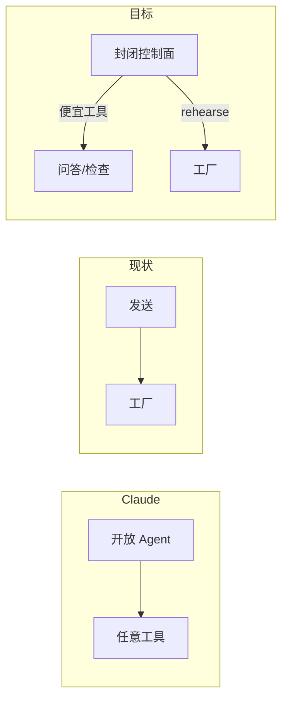
```mermaid
flowchart LR
  subgraph C["Claude"]
    CA[开放 Agent] --> CT[任意工具]
  end
  subgraph N["现状"]
    NA[发送] --> NF[工厂]
  end
  subgraph T["目标"]
    TA[封闭控制面] -->|便宜工具| TQ[问答/检查]
    TA -->|rehearse| TF[工厂]
  end
```

- **风险**：控制面若 fail-open 到「工具失败就直接点火工厂」，等于没加。若 fail-open 到无工具 chat completion，产品变成通用助手。两条都禁止。工具表必须闭集：开放工具 = 变成编码 Agent。`search_evidence` 若 `commit_artifact`，问候+搜索就能预装 6/6——禁止（M1.5 / KD18）。

---

### M2 推演前 Scope Card / Plan Mode

- **方面**：控制面 / 交互
- **Claude**：Plan 模式只读探索，产出计划等人批准再改仓库。
- **Grok-build**：同样有 Plan mode；先谈范围再烧。
- **WhyBuddy 现状**：**absent**。发送即 `drive-full-stream`。G_READY 停泊在 `/drive-turn`，产品流不走（`slide_rule_interactive_gates.py`；`routes/sliderule_full.py:1041` vs `:1227`）。
- **要不要加入**：**必须**
- **加入后的 WhyBuddy 形态**：控制面第一轮默认走 `scope_card`，**不**调 `rehearse`。卡片含：

  1. 这句话会被编成什么应用（一句话复述）
  2. 设备档（已有 `intake_judge.device`：desktop / phone / unspecified）
  3. 将跑哪几步（产品六步口径，映射表见 M8；默认 `rehearse` 从「起草 SPEC」起，除非卡上勾了取证）
  4. 时间口径 v1：**「大约数分钟，第一页会先出现」**。禁止上屏 8–9 / 2 / 20 分钟——那些不是标定集（§4.1）。标定笔记（run id、spec-first/enrich 开关、median+p90）出来之前，数字不许进 DOM
  5. 将检索的证据范围（web.search 开/关；默认关，取证是 opt-in）
  6. 两个按钮：开始推演 / 先改范围

  **拦截点是 `runTurn`（或抽一层 `requestRehearsal()`），不是 `doSend`。** 今天绕过 `doSend` 直达 `runTurn` 的点火口：

  | 动词 | 活代码 | 范围卡？ |
  |---|---|---|
  | 作曲家发送 | `ComposerDock.doSend` → `runTurn` | **首轮强制完整卡**（Q2 已关闭：必须点「开始推演」） |
  | 迭代改产品 | 同一会话再发、非 repair/质疑 | **薄卡**（一句话 + 开始推演）。不用未标定「>2 min」跳卡 |
  | 重新推演 / 编辑重跑 | `sliderule:resend-prompt` → `sendMessage(text)`（`SlideRule.tsx:1754-1758`）；`sendMessage` 运行中 = **stop**（`useSlideRuleSession.ts:1643-1652`） | 要卡（与上一句 goal 完全相同的重放可跳卡，但不得 POST 工厂直到确认——重放也走控制面） |
  | 补齐缺口 | `repairGaps` → `runTurn(..., "repair")` | **跳卡**（E26 已是门说了算） |
  | 质疑本轮 | `challengeTurn` → `runTurn` | **跳卡**（先失效；是否再 `rehearse` 由控制面决定） |
  | G_READY 答卡 | `answerClarifications` → `runTurn` | 工厂内停泊才有；产品流今天不停 G_READY，见 M7 幸存者 |
  | `looksLikeNewAppIntent` | `runTurn` 内 `:610-627` 已闭环会话上静默重置 | **PR-3 起禁用自动重置**，直到 M7 控制面显式问「新应用还是变体？」；否则范围卡同意是假的 |

  用户点「开始推演」才点火。PR-4 起这不是又发一句「开始推演」让 LLM 再选工具：POST `control-turn-stream` 带 M1 第 9 条六个字段 + `forcedTool: "rehearse"` + 卡上确认句作 `userText`，**跳过** tool-calling，直接 `control_handoff_factory` + 信封（M1 契约第 10 条）。`/推演` 在卡未确认时只停泊本卡，**不是** `forcedTool: "rehearse"`（空会话斜杠不得 yolo 点火）。PR-3 只是 UI 壳（「开始推演」暂可调现有 `runTurn`）；PR-4 落地后删掉前端分流器（见 §12）。

  判据（正）：需要卡的意图发出后、工厂点火前，DOM 里有 `data-testid="sliderule-scope-card"`。
  判据（反）：`dispatchEvent(sliderule:resend-prompt)` 在确认前不得 POST `/drive-full-stream` 也不得 POST `/control-turn-stream` 的 `forcedTool: "rehearse"`；空会话 `/推演` 信封次数 = 0；控制模型夹具偏好 `ask_user` 时，点「开始推演」仍恰好调用信封一次、零 `control_ask_user`，且 `set_active_connectors` 仍收到本轮挂上的连接器 id。

- **三列对照**：


```mermaid
flowchart TD
  subgraph C["Claude"]
    CP[Plan 模式] --> CA[批准] --> CW[改仓库]
  end
  subgraph N["现状"]
    NS[发送] --> NF[一场工厂]
  end
  subgraph T["目标"]
    TS[发送] --> SC[Scope Card]
    SC -->|批准| RF[rehearse]
    SC -->|改范围| TS
  end
```

- **风险**：范围卡若只是前端装饰、后端仍自动点火，就是「闸全绿但东西没了」。确认若再走一轮 LLM，按钮是假的（模型可以再问、可以撞 45s 帽）。只拦 `doSend` 会让重新推演/补齐缺口/质疑继续直连工厂。墙上钟数字未标定就写进 UI = 违反本仓 §6。PR-3 不得变成永久前端调度器。

---

### M3 便宜轮 vs 昂贵轮（Ask vs Rehearse）

- **方面**：控制面
- **Claude / Grok**：短问答走模型直接回；改代码才调工具。用户问「为什么这样写」不必重跑 CI。
- **WhyBuddy 现状**：**half-live**。`intake_judge` 能分 real / iteration / vague / off_topic / meta / out_of_scope（`intake_judge.py:59-60`），前端出 hint 卡（`IntakeHintBar.tsx`），**从不拦点火**（`blocking_enabled()` 默认关）。`looksLikeNewAppIntent` 只做「新话题 vs 迭代」，false 语义重载（`intake_judge.py:5-7`）。
- **要不要加入**：**必须**
- **加入后的 WhyBuddy 形态**：控制面根据判定选工具，而不是「提示完再烧」。

  **幸存者（KD19）——四张卡只留一张决策面**：

  | 现状 | PR-4 之后 |
  |---|---|
  | `useIntakeJudge` + `IntakeHintBar`（提示、不拦点火） | `intake_judge` 是控制面的**输入特征**，不再是平行 UI。「仍然推演」不得直连 `runTurn` |
  | `IntakeHintBar` | **删除**，或降为 `ask_user` / `scope_card` 的视觉皮肤（同一 `data-testid` 家族）。同一 send **禁止**同时渲染 `IntakeHintBar` 与 `sliderule-scope-card` |
  | `ClarificationCard`（G_READY / `coverageGaps`） | **只服务工厂内停泊**。产品流 `drive-full-stream` 今天不停 G_READY，所以产品作曲家默认不画这张卡，直到有人真的在 stream 里 park |
  | `looksLikeNewAppIntent` 静默新话题 | 改成控制面一句 `ask_user`（M7）。`runTurn` 内自动重置 **关掉** |
  | 新 `ScopeCard` + 控制面选工具 | **唯一**面向用户的「要不要烧工厂」决策面 |

  | verdict | 控制面动作 |
  |---|---|
  | `meta` / `off_topic` / 问候 | 罐头或短文本。**禁止** `rehearse`。控制面挂了也是 M1 罐头，不是开放 chat |
  | `vague` | `ask_user` + 引导。禁止 `rehearse` 直到范围清楚或用户强制 |
  | `out_of_scope` | 说明做不了 + 邻域能做的。禁止 `rehearse` |
  | `iteration` 且问的是「为什么/这个角色」 | `inspect_model` 便宜回。不点火 |
  | `real` 或用户点了「开始推演」 | `scope_card` →（确认后）`rehearse` |
  | `iteration` 且是改产品 | `scope_card`（增量）→ `refine` |

  接在：`judge_turn` 结果作为 control-turn 请求的一个字段，由控制面选工具。`SLIDERULE_INTAKE_JUDGE_BLOCKING` **不要**打开。阻断权归工具选择。

- **三列对照**：

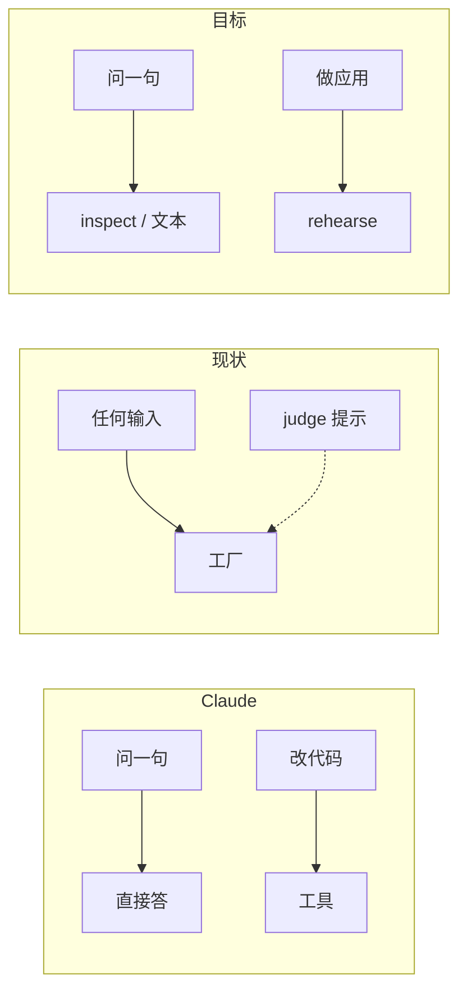
```mermaid
flowchart LR
  subgraph C["Claude"]
    CQ[问一句] --> CA[直接答]
    CE[改代码] --> CT[工具]
  end
  subgraph N["现状"]
    NQ[任何输入] --> NF[工厂]
    NJ[judge 提示] -.-> NF
  end
  subgraph T["目标"]
    TQ[问一句] --> TI[inspect / 文本]
    TR[做应用] --> TF[rehearse]
  end
```

- **风险**：fail-closed 拦真需求 = 把人挡在核心功能外（`intake_judge.py:45-48` 已踩过）。控制面误判时必须留「仍然推演」逃生口——逃生口走 `scope_card`，不是旧 `runTurn`。反向：问候语走完后 `drive_full_*` 调用 = 0；同一 send 不得同时出现 hint 条和范围卡。

---

### M4 中途可对话 / 可改方向（今天 send = stop）

- **方面**：交互 / 控制面
- **Claude / Grok**：运行中可插入新指令；agent 看到后调整，不是先杀进程。
- **WhyBuddy 现状**：**live 且故意如此**。`ComposerDock.tsx:1022-1033` 运行中按钮是方块「停止」。E25 取消是诚实的（`run_cancel.py` 协作式取消旗；看门狗 `task.cancel()` 打不断 `asyncio.to_thread` 的事故记在模块头）。
- **要不要加入**：**应该**（分两期）
- **加入后的 WhyBuddy 形态**：

  - **一期（必须配 M1）**：运行中输入框可打字，发送 = **排队到下一轮控制面**，不杀工厂。停止仍单独存在（保留方块按钮）。工厂不中途改 spec——改方向等本轮闭环或用户显式停止。
  - **二期（可以）**：把排队指令当作本轮 `refine` 的附加约束，在 spec-first 步间安全点注入。这要碰 `run_spec_first` 的步间检查，类似 `raise_if_cancelled()`（`run_cancel.py`）。**不要**在 HTML 生成中途热改 prompt——那是「改了没通电的半步」，产物会四不像。

  接在：拆的是 `sendMessage` / `runTurn` 这一层，不只是 `doSend`。`sendMessage` 今天运行中直接 `stop()`（`useSlideRuleSession.ts:1643-1646`）；`sliderule:resend-prompt` 也走它。新指令进控制面队列，停止留独立按钮。

- **三列对照**：

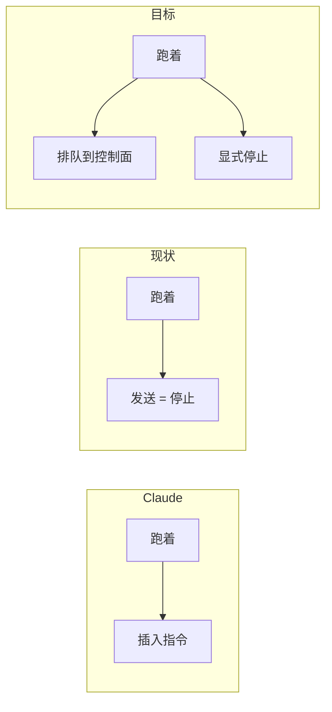
```mermaid
flowchart LR
  subgraph C["Claude"]
    CR[跑着] --> CI[插入指令]
  end
  subgraph N["现状"]
    NR[跑着] --> NS[发送 = 停止]
  end
  subgraph T["目标"]
    TR[跑着] --> TQ[排队到控制面]
    TR --> TX[显式停止]
  end
```

- **风险**：中途改工厂内部状态 = 证据链撕裂。控制面排队是 fail-closed 到「等本轮完」；不许 fail-open 成「假装改了其实没改」。停止必须继续诚实（E25 不许回退成 `task.cancel()` 账面谎言）。

---

### M5 质疑 / 挑战一等公民

- **方面**：交互 / 推演内核
- **Claude / Grok**：用户说「这段不对」就是新消息，agent 用 Edit 改。没有 `window.prompt`。
- **WhyBuddy 现状**：**live 但交互是死的，且失效发生在 TS 客户端**。

  产品流（通电）：`challengeTurn`（`useSlideRuleSession.ts:1882-1895`，无理由则 `window.prompt`）→ `runTurn` + `intent: "challenge"` → TS `intakeMessage` → `invalidateForIntervention`（`client/src/lib/sliderule-runtime.ts:3215`，定义 `:2982`）→ `persistSession(preparedState)`（`:862-871`，**失败仍继续驱动**——旧会话会被 Python 当权威起点，质疑静默丢失）→ `drive_full_stream` 加载已持久化会话（`sliderule_full.py:1248-1254`）。`v5_full_driver.py` 零 `challenge` 引用。这是**整轮** `runTurn`，不是局部重跑。

  Python 副本：`invalidate_for_intervention`（`slide_rule_interactive_gates.py:399`）由 `drive_reasoning_turn`（`slide_rule_session.py:277`）调用 = `/drive-turn`，产品流不走。OSS `:44-46` 讲的是 stale-cascade / 该函数名，**不是** `persistence.py:399-576`（读会话解析）。

  Dev 页另有 `window.prompt`（`SlideRuleDev.tsx:119`）。闭环后按钮在 `SlideRule.tsx:192, 650`。
- **要不要加入**：**必须**（UI + persist fail-closed）；局部重跑 **不要**写进本模块，那是 M14
- **加入后的 WhyBuddy 形态**：质疑是作曲家的一等意图，不是浏览器弹窗。

  - 预览上点一个结论 / 一个角色 / 一条闸 → 作曲家预填「质疑：…」
  - PR-1（无控制面）：作曲家文本 → `intent: "challenge"` → TS `invalidateForIntervention` → **persist 成功才能**开 stream；persist 失败展示错误、**不**启动 `drive-full-stream`。仍是整轮工厂，不是局部重跑
  - PR-4 之后：质疑按钮和 `/质疑` POST `forcedTool: "challenge"` + M1 第 9 条六个字段，**跳过 LLM 选工具**。**Python 必须在控制面 handler 里调用** `apply_user_intervention_invalidation`（`slide_rule_interactive_gates.py:579`）恰好一次，不得假设客户端已经 invalidate——否则 TS/Python 双份会漂（`Claude.md` §4）。本请求**不**调信封。是否再 `rehearse`/`refine` 是后续控制面决策（M2：质疑跳卡、先失效）。
  - **禁止**产品面 `window.prompt`（Dev 页可留，标 legacy）
  - 「局部重跑」等到 M14 pendingRuns；之前挑战 = 失效；再烧工厂要另一次确认

  接在：`challengeTurn` 改收作曲家文本；与已有 `intent: "challenge"` 对齐。

  判据（反）：产品面源码剥注释后不准再出现 `window.prompt(`；挑战 persist 失败夹具下信封 = 0；控制模型夹具只愿 `inspect_model` 时，点质疑仍 invalidate 一次、信封 = 0。

- **三列对照**：

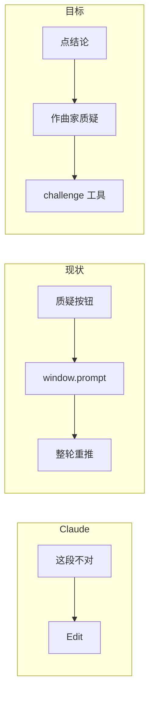
```mermaid
flowchart LR
  subgraph C["Claude"]
    CU[这段不对] --> CE[Edit]
  end
  subgraph N["现状"]
    NU[质疑按钮] --> NP[window.prompt]
    NP --> NR[整轮重推]
  end
  subgraph T["目标"]
    TU[点结论] --> TC[作曲家质疑]
    TC --> CH[challenge 工具]
  end
```

- **风险**：挑战必须走失效级联（fail-closed：被质疑的结论不许继续当绿灯）。persist 失败仍点火 = 质疑静默丢失。把「局部重跑」写进 PR-1 会有人在不通电路径上发明半套重跑。控制面接手后若仍只信 TS invalidate，Python 权威会话会对不上。

---

### M6 产品宪章 / 跨场记忆（opt-in）

- **方面**：上下文
- **Claude**：`CLAUDE.md` / `AGENTS.md` 自动注入每次会话。这是给**这个仓库怎么写代码**的宪章。
- **Grok-build**：同样读项目指令；另有用户级记忆。
- **WhyBuddy 现状**：**absent（产品级）/ live（引擎级）**。仓里 `Claude.md`、`Agents.md` 是给引擎建造者的事故记录，**不会**注入用户的推演。没有「这家公司的 RBAC 默认三级审批」这种跨场记忆。
- **要不要加入**：**应该**（opt-in，**禁止**自动注入上一场产品）
- **加入后的 WhyBuddy 形态**：用户可保存一份**产品宪章**（不是引擎宪章）：

  - 行业、术语、默认角色、不可逾越的合规、品牌约束
  - 显式勾选「下一场沿用」才注入 `scope_card` / `rehearse` 的 system 侧
  - **永远不要**把上一场的五系统模型当 priors 自动塞进下一场——那会让闸看到悬挂引用，或者更糟：把 A 公司的权限图装进 B 公司的应用

  接在：会话创建 / `scope_card` 装配。不要接在 `v5_llm_generate._build_user_content` 而不接 spec-first——默认路径是 spec-first（`Claude.md` 第一条 2026-08-16 事故）。

- **三列对照**：

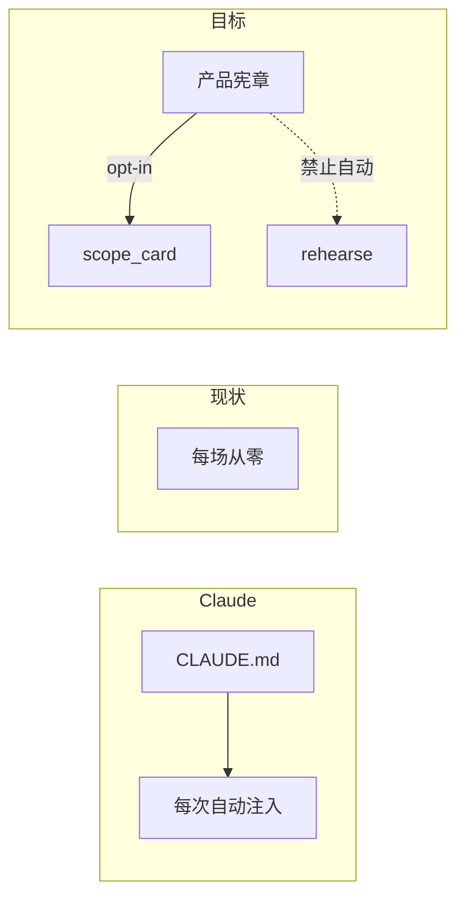
```mermaid
flowchart LR
  subgraph C["Claude"]
    CM[CLAUDE.md] --> CA[每次自动注入]
  end
  subgraph N["现状"]
    NN[每场从零]
  end
  subgraph T["目标"]
    TP[产品宪章] -->|opt-in| TS[scope_card]
    TP -.->|禁止自动| TR[rehearse]
  end
```

- **风险**：自动注入 = 证据污染。宪章只是约束，不是证据。闸仍然 fail-closed。宪章内容不得绕过 `v5_model_gate`。

---

### M7 会话：恢复 / 分叉变体 / 版本回退（产品语言）

- **方面**：上下文 / 交互
- **Claude**：Rewind / 对话分叉；checkpoint 回到某步。
- **Grok-build**：同类。工作区可 worktree，那是编码 DNA，不偷。
- **WhyBuddy 现状**：**live 但未产品化**。

  - `modelVersions` 在状态里（`v5_state.py:401`），工具条 `v2/v3`（`SlideRuleStudio.tsx:609-655`）
  - Fork 应用在 `AppsWorkbench.tsx:1829-1852`（`fork_app`，零 LLM，但曾经 14 次 Wikipedia 见 `mcp_tools.py:50-54`）
  - 回退走「模型直供」，spec-first 必须让路（`v5_capability_executor.py:572-577`）——不让路会变成「按原话重抽一次」
  - **没有**轮中 checkpoint，不能回到第 N 轮中间态（`OSS_GAP_ANALYSIS.md:47-51`）

- **要不要加入**：**应该**（产品语言）；轮中 checkpoint 见 M14
- **加入后的 WhyBuddy 形态**：

  | 用户说的 | 系统做的 | 不要叫 |
  |---|---|---|
  | 回到这一版 | `restore_version` | v2/v3 小箭头（可保留为快捷键） |
  | 从这里分一个变体 | fork 会话 + 新指令 | 不要跟「Fork 应用」抢词——应用 fork 是画廊动作，会话变体是推演动作 |
  | 换个方向重做 | 新会话，可选沿用宪章 | 「自动新话题」启发式 |

  `looksLikeNewAppIntent` 不再偷偷开新话题（PR-3 起从 `runTurn` 拆掉自动重置）。控制面问：「这是新应用，还是这一版的变体？」

  `fork_variant` **已经在 M1 闭集里**（便宜、现有 `fork_app` + `suppress_web_search`），不是事后加塞的工具。画廊「Fork 应用」仍是画廊动作，会话变体走这个工具。

  接在：控制面 `restore_version` / `fork_variant`。后端已有 fork 与 modelVersions，**不要**再写一套存储。

- **三列对照**：

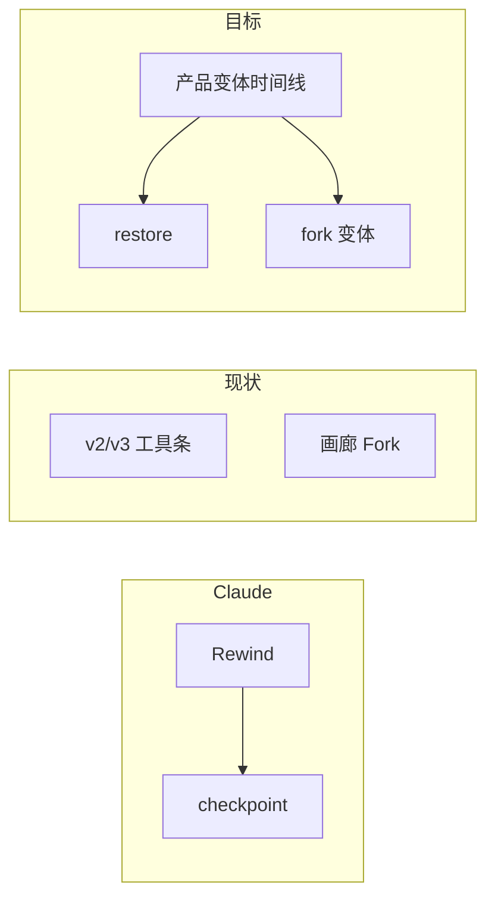
```mermaid
flowchart LR
  subgraph C["Claude"]
    CR[Rewind] --> CC[checkpoint]
  end
  subgraph N["现状"]
    NV[v2/v3 工具条]
    NF[画廊 Fork]
  end
  subgraph T["目标"]
    TV[产品变体时间线]
    TV --> TR[restore]
    TV --> TF[fork 变体]
  end
```

- **风险**：fork 时必须继续 `suppress_web_search`（`mcp_tools.py:43-73`）。回退必须走模型直供，不许重抽。

---

### M8 进度钟 + 轨迹折叠 + context HUD

- **方面**：交互 / 上下文
- **Claude**：token 用量、当前工具、可折叠思考。
- **Grok-build**：同样有步骤与用量。
- **WhyBuddy 现状**：**half-live**。SSE 已有 `skill_start` / `skill_result` / `progress_heartbeat` / spec-first 页面事件（`v5_full_driver.py:1787-1843`）。前端把 LLM 增量流成 `llmDraft` / `llmStreams`（`useSlideRuleSession.ts:300-309`）。活事件是能力 id（`risk.analyze`）和页 sink，**没有**产品六步映射。用户看到的是散文和 token。
- **要不要加入**：**必须**
- **加入后的 WhyBuddy 形态**：

  1. **推演钟**（产品口径六步）。内部模块 → 步的映射（PR-2 必须落地这张表，否则投影是假的）：

     | 产品步 | 内部事件 / 模块 | 默认 `rehearse`（M18 `profile="app"`） |
     |---|---|---|
     | 1 澄清与取证 | `intent.clarify` / `gap.ask` / `evidence.search` 的 `skill_start` | **跳过**，除非范围卡勾了取证 |
     | 2 起草 SPEC | `spec_tree` | 默认起点 |
     | 3 每页 HTML | `spec_page_html` / `page_shell`（页 sink） | 有 |
     | 4 结构反推 | `html_structure` | 有 |
     | 5 权限/工作流/不变式 | `spec_semantics` | 有 |
     | 6 汇合过闸 | `model_assembly` / `html_bindings` / `v5_model_gate` / `evaluate_coverage_gate` | 有 |

     默认 `rehearse` 从第 2 步起跳。勾了取证才亮第 1 步。M18 之后若仍从第 1 步起跳，钟是假的。

  2. **墙上钟数字**：v1 只写「大约数分钟，第一页会先出现」。8–9 / 2 / 20 都不是标定集（§4.1）。PR-5 短清单后再测；没有 run id + median/p90 的笔记，禁止改 UI 上的分钟数（KD4）。
  3. LLM 轨迹默认折叠，点开才见 `risk.analyze` 原文。
  4. **Context HUD**：两列——闸过的证据条数 vs 叙述 token。证据列 fail-closed（没有就是 0）；token 列来自 `cost_ledger` 且只展示 `source="server"`（fail-open）。便宜轮 `search_evidence` **不进**证据列。

  接在：现有 SSE 事件投影，**不要**另开一条进度 API。`client/src/pages/sliderule/derive-status-bar.ts` 是现状投影点。

  判据：用户不打开轨迹也能回答「现在在哪一步、第一页会不会先出来」。不许靠假分钟数过关。

- **三列对照**：

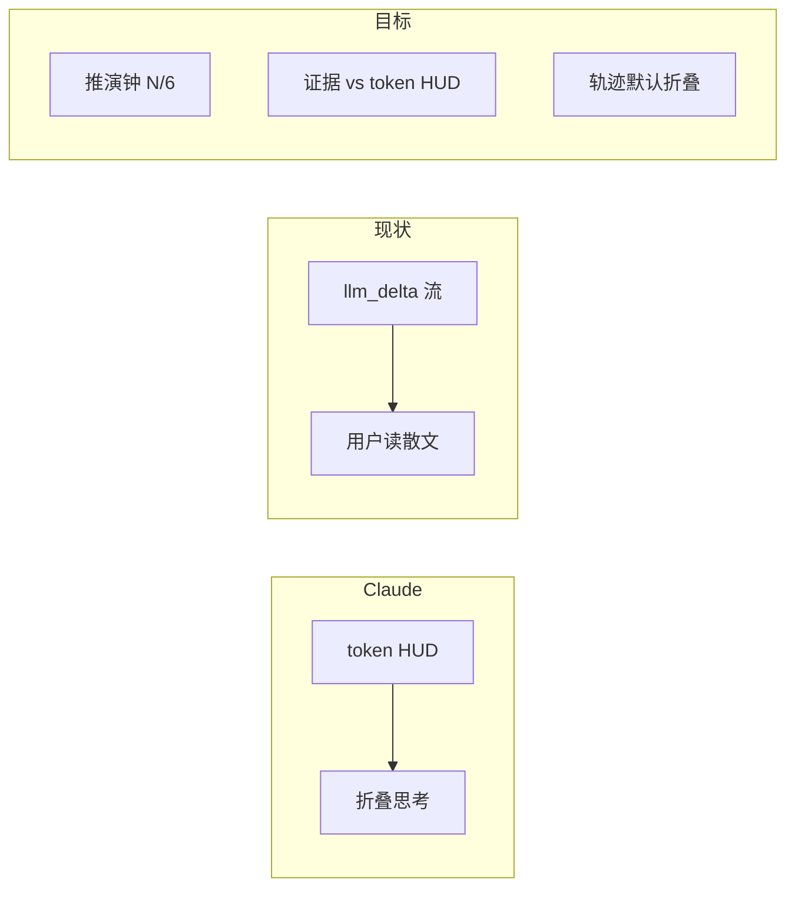
```mermaid
flowchart LR
  subgraph C["Claude"]
    CT[token HUD] --> CC[折叠思考]
  end
  subgraph N["现状"]
    NL[llm_delta 流] --> NU[用户读散文]
  end
  subgraph T["目标"]
    TK[推演钟 N/6]
    TH[证据 vs token HUD]
    TF[轨迹默认折叠]
  end
```

- **风险**：用字符数量密度、用「页面字节变没变」验进度——本仓踩过（`Claude.md` §5）。把能力池散文步画进默认钟、再被 M18 删掉 = 第一格永远空。HUD 的证据列不许用 token 或控制面搜索冒充。

---

### M9 斜杠：保持扩展选择器，补推演命令（不要抄 50 个引擎命令）

- **方面**：交互 / 可扩展
- **Claude**：`/plan` `/compact` `/mcp` `/commit` `/review`……引擎命令一排。
- **Grok-build**：同类。
- **WhyBuddy 现状**：**live，且语义不同**。`composer-slash.ts` 是 skill / connector / partner 选择器（2026-08-25 用户裁决，对标豆包扩展中心），不是引擎命令。判定层纯函数，错弹比不弹烦人（头注写了 `https://`、`2026/08/25` 的事故）。
- **要不要加入**：**应该**（只加推演动词）；**不要**抄 50 个引擎命令
- **加入后的 WhyBuddy 形态**：保留现有三种 `SlashKind`，再加第四种 `rehearsal`：

  | 命令 | 作用 | 不要做成 |
  |---|---|---|
  | `/推演` | 无已确认范围卡 → 停泊 `control_scope_card`（信封 = 0）。只有本回合卡已确认才允许 `forcedTool: "rehearse"` | 不要叫 `/run`；**不要**空会话直接信封（那是 yolo 点火） |
  | `/精修` | `forcedTool: "refine"` → 信封 → 生成器 `set_refine_context` | 不要直调执行器 |
  | `/质疑` | `forcedTool: "challenge"`：invalidate 一次，不调信封 | 不要当聊天等 LLM 选 `inspect_model` |
  | `/范围` | 只出 scope card，不点火 | 不要 forced rehearse |
  | `/回退` | restore 上一版 | |

  **不要**：`/plan` `/compact` `/mcp` `/commit` `/loop` `/yolo`。

  接在：`composer-slash.ts` 的 `SlashKind` 联合类型 + `ComposerSlashMenu.tsx`。判定层继续纯函数、继续变异测试。

- **三列对照**：

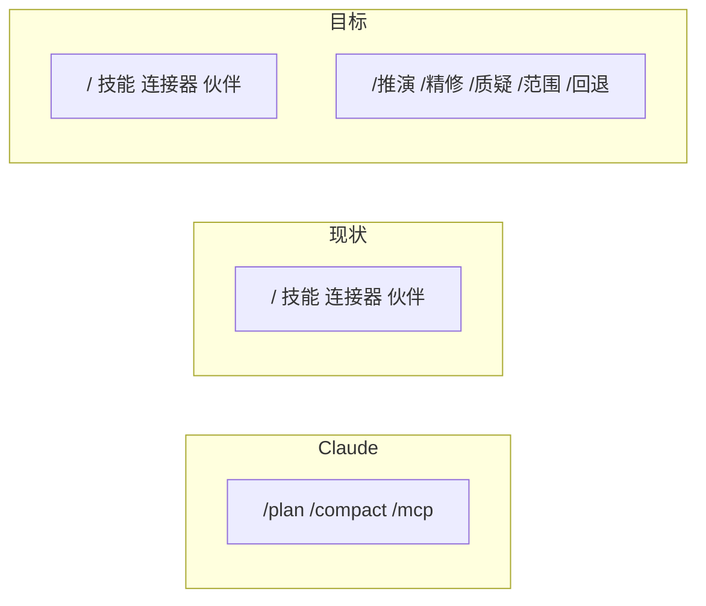
```mermaid
flowchart LR
  subgraph C["Claude"]
    CS["/plan /compact /mcp"]
  end
  subgraph N["现状"]
    NS["/ 技能 连接器 伙伴"]
  end
  subgraph T["目标"]
    TS["/ 技能 连接器 伙伴"]
    TR["/推演 /精修 /质疑 /范围 /回退"]
  end
```

- **风险**：斜杠命令若直连 `runTurn` 绕过控制面，M1/M2 被旁路。`/精修` 若只 POST 一句自然语言，模型可以 `ask_user` 或撞 45s 帽，斜杠是假的。`/推演` 若 `forcedTool: "rehearse"` 且没有范围卡，就是换了个名字的 yolo 点火（M12 禁止）。`/质疑` 若走 LLM 选工具，模型可挑 `inspect_model`，失效一次都不跑。

---

### M10 Connectors 真接（只读证据），不是 MCP 应用商店

- **方面**：可扩展 / 执行
- **Claude / Grok**：MCP 是 stdio 服务器市场，模型可调任意工具（含写）。
- **WhyBuddy 现状**：**live，窄且对**。

  - `services/connectors.py`：天气（Open-Meteo，不要 key）等，生成期取一次快照进 runtime。fail-closed，取不到不编数据（头注三条硬约束）。
  - 已接 live path：`test_connectors_reach_the_live_path.py` 钉住同步+流式都 `set_active_connectors`。
  - `mcp_tools.py`：`web.search` 真搜；`code.run` 注册了但 driver 不调。
  - `mcp_runtime.py` 是可注入适配器，不是 MCP 客户端。

- **要不要加入**：**应该**（更多只读连接器）；**不要** MCP 应用商店
- **加入后的 WhyBuddy 形态**：

  - 连接器继续：声明实体 schema → spec 按 schema 建模 → 生成期取真数据落行
  - 新连接器必须只读、有 provenance、fail-closed
  - 控制面 `search_evidence` 可以选「用哪个连接器」，但**不能**让模型挂任意 MCP server
  - 便宜 `search_evidence` 的引用只进 `controlTranscript`，`provenance=control-search`。**禁止** `commit_artifact`，禁止写 `evidencePresent`，禁止出现在 `perSkillEvidence`。只有工厂内 `rehearse`/`refine` 的检索算 6/6。反向：`你好，帮我搜一下请假制度` 之后 `publishClosure.evidencePresentCount` 不变，且 `drive_full_*` 未被调用
  - `code.run` 继续沙盒、继续不进控制面默认工具表。需要时由工厂内部能力调用，不给聊天 agent

- **三列对照**：

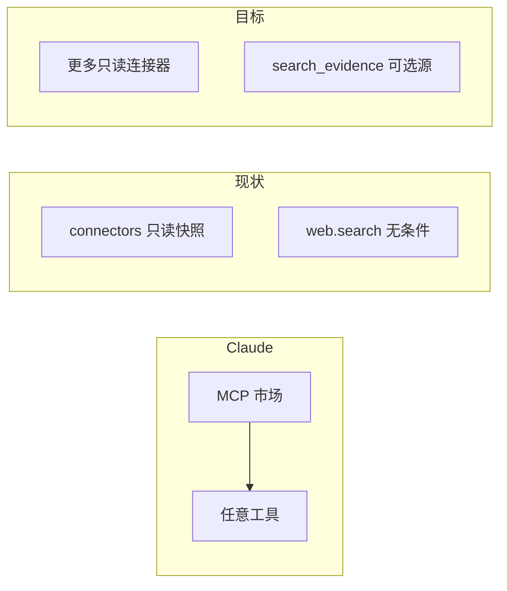
```mermaid
flowchart LR
  subgraph C["Claude"]
    CM[MCP 市场] --> CA[任意工具]
  end
  subgraph N["现状"]
    NC[connectors 只读快照]
    NW[web.search 无条件]
  end
  subgraph T["目标"]
    TC[更多只读连接器]
    TS[search_evidence 可选源]
  end
```

- **风险**：连接器 fail-open 编数据 = 「成功但数字是假的」（`connectors.py:20-24`）。禁止。外部 MCP 写工具 = 编码 Agent。禁止。

---

### M11 领域技能包（priors），不要把六系统 skill 变成插件

- **方面**：可扩展 / 推演内核
- **Claude / Grok**：`SKILL.md` 是给 agent 的操作手册，用户可装一堆。
- **WhyBuddy 现状**：**live 但混了两件事**。

  - 六系统（数据中台 / 权限 / 工作流 / 页面设计器 / 应用中心 / AIGC）是**工厂产物的骨架**，不是插件（`NORTH_STAR.md:41-44`：先做深前 3 个）。
  - `/agent-loop/skills` 是扩展中心（技能 / 连接器 / 伙伴），view key 仍叫 skills（`DashboardApp.tsx:77-80`）。
  - 斜杠选的 skill 是推演时勾选的 priors，不是把六系统换成可插拔 runtime。

- **要不要加入**：**应该**（领域包）；**不要**把六系统变成插件
- **加入后的 WhyBuddy 形态**：

  - **Rehearsal pack**（Q4 已关闭：与骨架两层）：行业包（律所、宠物医院、审批流……）= 行业术语 + 宪章 + 页种类倾向（语义），不是页清单
  - Pack 可推荐一副 `app_template` 骨架；匹配失败互不影响（各自 fail-open）
  - 斜杠 `/` 继续选 pack，注入 `scope_card` 与 spec-first 的 `spec_tree` 输入
  - 六系统运行时逻辑继续只在 Python 侧（`NORTH_STAR.md:43-44`）
  - 不要做「用户上传一个 skill 替换 rbac 生成器」

  接在：`composer-slash.ts` + spec-first 的澄清上下文（`_clarification_context` 吃产物不吃原句，架构图 ⚑2）。不要只接 GEN5 prompt。

- **三列对照**：

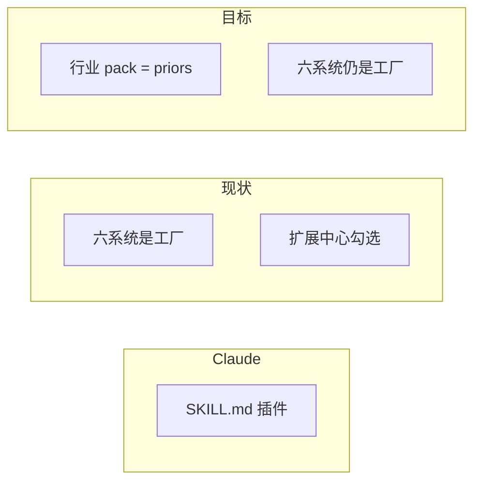
```mermaid
flowchart LR
  subgraph C["Claude"]
    SK[SKILL.md 插件]
  end
  subgraph N["现状"]
    S6[六系统是工厂]
    SX[扩展中心勾选]
  end
  subgraph T["目标"]
    RP[行业 pack = priors]
    S6b[六系统仍是工厂]
  end
```

- **风险**：pack 若直接写实体 id / 绑定，会变成旧模板库——结构闸 DANGLING（`app_template.py` 头注 `_assert_no_bindings`）。pack 只许 prior，不许带绑定。

---

### M12 权限：范围批准 + 发布批准，不要 yolo 发布

- **方面**：执行 / 架构治理
- **Claude**：ask / accept-edits / bypassPermissions（yolo）。
- **Grok-build**：always-approve 存在。
- **WhyBuddy 现状**：**live 且正确偏向 fail-closed**。发布闭环 6/6，缺证据 blocked（`v5_publish_closure_response.py:14`）。没有 yolo 发布。没有「范围批准」是因为没有控制面——发送即全权点火。
- **要不要加入**：**必须**（范围批准，作为 M2 的权限面）；**不要** yolo 发布
- **加入后的 WhyBuddy 形态**：

  | 动作 | 批准 |
  |---|---|
  | 便宜问答 / inspect | 不需要 |
  | `search_evidence` 外网 | 会话级一次批准（或沿用现有 web.search 开/关） |
  | `rehearse` / `refine` | Scope card 上的显式「开始推演」。`/推演` 在卡未确认时只出卡，不算批准 |
  | 发布到应用市场 public | 独立批准；默认 private（OWNERSHIP 已有 private/link/public） |
  | 绕过 6/6 绿灯 | **不存在这个动作** |

- **三列对照**：

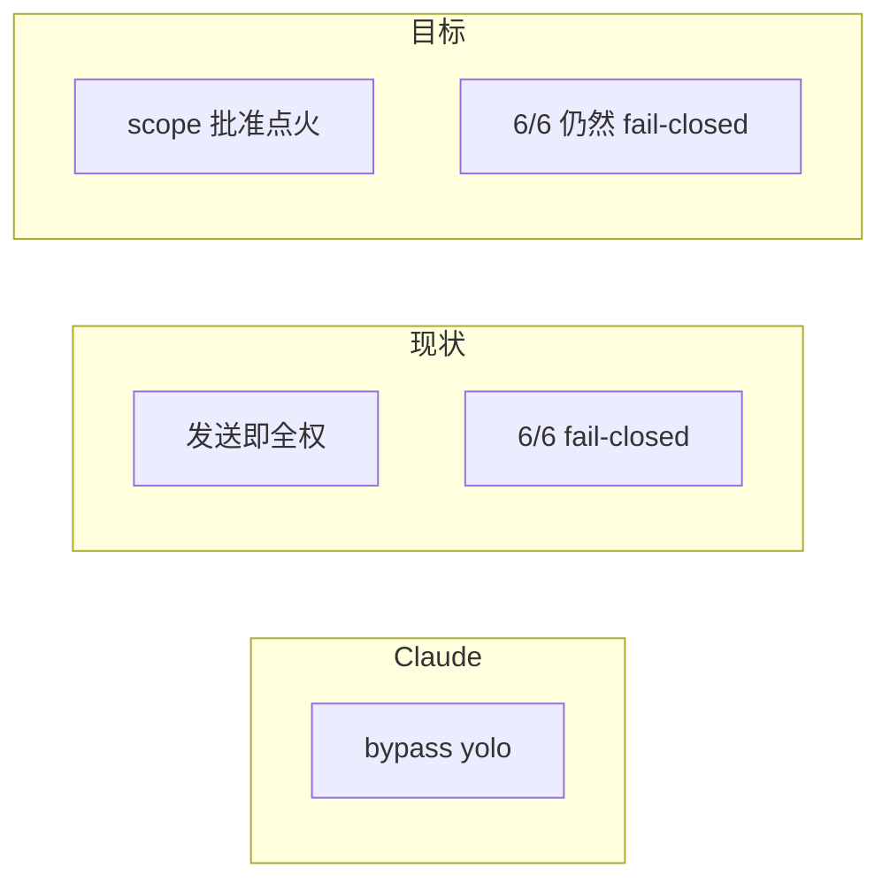
```mermaid
flowchart LR
  subgraph C["Claude"]
    CY[bypass yolo]
  end
  subgraph N["现状"]
    NP[发送即全权]
    NG[6/6 fail-closed]
  end
  subgraph T["目标"]
    TS[scope 批准点火]
    TG[6/6 仍然 fail-closed]
  end
```

- **风险**：把优化写成 fail-closed 会让一次能跑完的推演崩掉；把闭环写成 fail-open 会端出「成功但内容为空」（`Claude.md` §7）。yolo 发布属于后者。禁止。

---

### M13 子代理：只允许只读取证并行，禁止 general-purpose 改模型

- **方面**：执行
- **Claude / Grok**：Task/subagent 可 general-purpose，可改文件。
- **WhyBuddy 现状**：**absent（子代理）/ live（并行是工厂内部的）**。spec-first 第 3 步页面扇出并行（`spec_first_pipeline.py` 头注）。能力调度一轮最多 5 个（`pick_next_capabilities` `return out[:5]`）。没有 general-purpose 子代理。
- **要不要加入**：**可以**（只读并行取证）；**不要** general-purpose 改模型
- **加入后的 WhyBuddy 形态**：控制面可并行多个 `search_evidence`（不同查询）。**只有** `rehearse` / `refine` / `repair` 允许**生成**新五系统模型，且同时只有一个写者。`challenge` 只失效，不算第二写者。禁止「四个 agent 各自改 rbac」。

- **三列对照**：

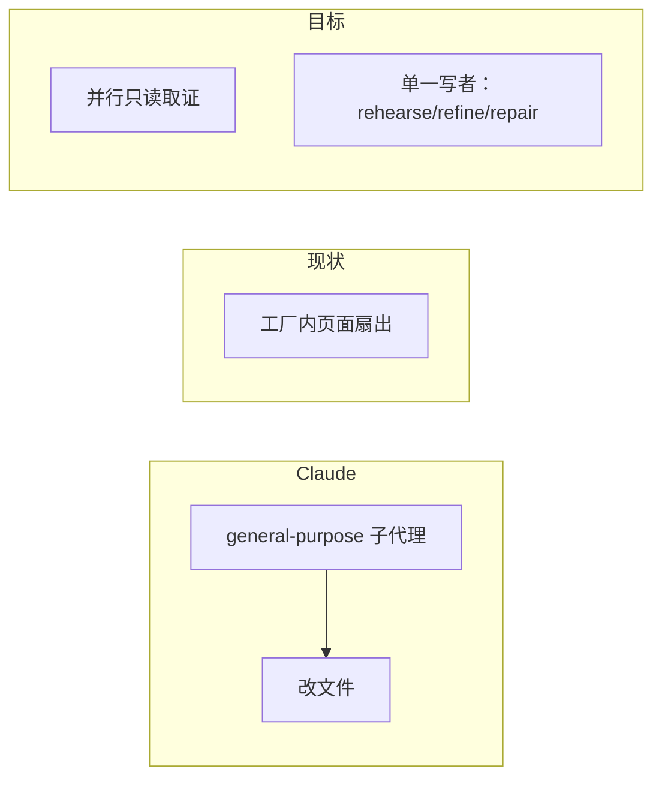
```mermaid
flowchart LR
  subgraph C["Claude"]
    SA[general-purpose 子代理] --> SF[改文件]
  end
  subgraph N["现状"]
    SP[工厂内页面扇出]
  end
  subgraph T["目标"]
    SE[并行只读取证]
    SW[单一写者：rehearse/refine/repair]
  end
```

- **风险**：两个写者改同一会话 = 单调版本守卫被打成竞态（`persistence.py:195-207` lastTurnId）。子代理写模型是架构级禁止，不是「暂时不做」。

---

### M14 检查点 / 能力级 pendingWrites（OSS_GAP_ANALYSIS 未做）

- **方面**：执行 / 架构治理
- **Claude**：会话可 compact；部分产品有 rewind checkpoint。
- **Grok-build / LangGraph**：每超步一份 checkpoint + pending writes，挂了只重跑失败节点（`OSS_GAP_ANALYSIS.md:45-47`）。
- **WhyBuddy 现状**：**absent**。`persistence.py` 整会话一份最新快照。一轮 5 能力挂在第 4 个 = 整轮重跑。OSS 文档 2026-07-15 就写了落地方案，**代码里没有 `checkpoints/`**。
- **要不要加入**：**应该**（按 OSS 已写的三张图纸，不引 LangGraph）
- **加入后的 WhyBuddy 形态**（抄 `OSS_GAP_ANALYSIS.md:47-57`，优先级不变）：

  1. **能力粒度 pending 写**（先做，省 LLM 钱）：drive loop 每个能力执行完即落 `pendingRuns`，崩溃恢复跳过已完成能力
  2. **每轮存档 + 父链**：`save_session` 同步落 `checkpoints/` 带 `parent_id`，解锁「回到第 N 轮」
  3. **versions_seen**：产物版本 + 消费方「看过版本」，替代粗粒度 stale 集合

  接在：`v5_full_driver` 的 loop 内 + `persistence.save_session`。spec-first 七步内部先**不要**做每步 checkpoint——线性链，步间取消旗已经有；先救能力池那 5 个 LLM 调用。

- **三列对照**：

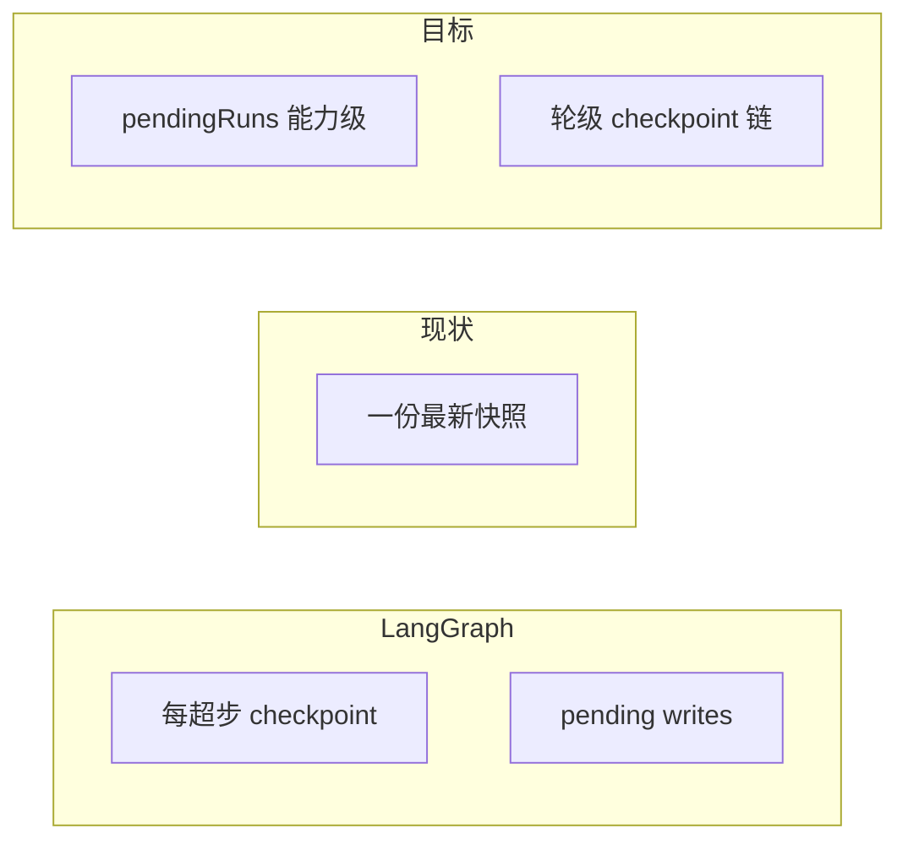
```mermaid
flowchart LR
  subgraph L["LangGraph"]
    LC[每超步 checkpoint]
    LP[pending writes]
  end
  subgraph N["现状"]
    NS[一份最新快照]
  end
  subgraph T["目标"]
    TP[pendingRuns 能力级]
    TK[轮级 checkpoint 链]
  end
```

- **风险**：两套编排模型（LangGraph + 自有 state）是 `spec_first_pipeline.py:31-33` 明确拒绝过的。抄图纸，不搬框架。checkpoint 是证据链的一部分 → 写失败 fail-closed（不能假装存了）。

---

### M15 应用骨架接线（app_template 未接）

- **方面**：推演内核
- **Claude / Grok**：无对等物（他们不产五系统应用）。
- **WhyBuddy 现状**：**dead（对工厂而言）**。`services/app_template.py` 有契约、种子、`match_app_template`；架构图 `:2333` 自己写着没接进推演。`app.py:88` 只为 seed 做了 import。`match_app_template` 的非测试引用：无。
- **要不要加入**：**应该**
- **加入后的 WhyBuddy 形态**：骨架是「该有哪几页、每页大概摆什么」，**不许带绑定**（`_assert_no_bindings`）。与 M11 Pack 是两层（Q4 已关闭）：骨架 = 结构，Pack = 语义。接线顺序：

  1. `scope_card` 阶段 `match_app_template(goal)` → 命中则展示「将按请假审批骨架展开」，用户可拒
  2. 用户接受后，骨架进 `spec_tree` 作为 prior（页清单），不是进 GEN5
  3. 窄化（区块选材）在骨架之后——架构图 `:2334` 写的前提「骨架与窄化谁先谁后」在此拍板：**骨架先，窄化后**

  接在：`spec_first_pipeline.run_spec_first` 的 spec_tree 输入。判据必须是「`match_app_template` 出现在 `run_spec_first` 调用链」——只测 `match_app_template` 函数本身会重演「11 条全绿但删调用点照样绿」。

- **三列对照**：

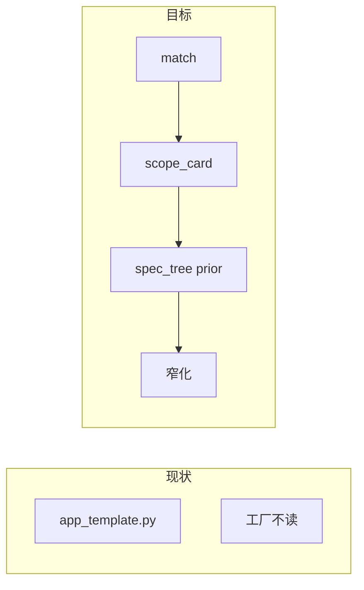
```mermaid
flowchart LR
  subgraph N["现状"]
    NT[app_template.py]
    NF[工厂不读]
  end
  subgraph T["目标"]
    TM[match] --> SC[scope_card]
    SC --> ST[spec_tree prior]
    ST --> NR[窄化]
  end
```

- **风险**：骨架带绑定 → 结构闸悬挂。匹配失败必须 fail-open 到「无骨架继续」，不许 fail-closed 拦推演。

---

### M16 架构图治理（拆成 6 张可读图，删墓碑）

- **方面**：架构治理
- **Claude / Grok**：不靠 2400 行 mermaid 当实验室笔记。
- **WhyBuddy 现状**：**live 且有病**。V5.1–V6.0 十一份架构图叠在 `docs/`。V6.0 头注自己承认图码不符。`node scripts/mermaid-render-check.mjs` 是改完必跑的闸（`Claude.md` 常用命令）。
- **要不要加入**：**必须**（否则下一轮继续照假图施工）
- **加入后的 WhyBuddy 形态**：V6.1 拆成 6 张短图，**一张一个事实**：

  | 图 | 内容 | 不许画 |
  |---|---|---|
  | 1. 控制面 | 本文件 §7 目标总图 | 能力池散文 |
  | 2. 工厂 spec-first | 七步实线 | GEN5 当脊柱 |
  | 3. 闸与闭环 | coverage / structure / publish 6/6 | 把 enrich 画进主轴 |
  | 4. 活 UI 路由 | `/agent-loop/sliderule` 为主 | Autopilot 当主线 |
  | 5. 扩展 | connectors / packs / slash | MCP 市场 |
  | 6. 已知缺口 | 只写仍为真的欠账 | 已落地却标「尚未做」 |

  纪律：同一个数字只存在代码常量里，图只引用路径。升版时删墓碑，不追加 ⚑⚑H'。

  改完必须跑：`node scripts/mermaid-render-check.mjs "docs/SlideRule V6.1 控制面.md"`（新文件，不在 2400 行上继续打补丁）。

- **风险**：继续在 V6.0 上追加 ⚑ = 第三次「图自己打架」。

---

### M17 产品面收敛（藏 Autopilot / legacy workbench / 死 driver）

- **方面**：架构治理 / 交互
- **WhyBuddy 现状**：**live 太宽**。

  - `/` → `/agent-loop/sliderule`（对）
  - `/autopilot`、`/projects`、`/tasks`、`/agent-loop/workbench`、`workbench/legacy`、`settings/legacy` 仍直达（`App.tsx`）
  - `drive_v5_full_path` 死 import
  - Node blueprint `role-agent-runtime` 有真工具定义，Autopilot/legacy，gated（`server/routes/blueprint/role-agent-runtime/`）
  - `agent-loop/` 队列跑手，NORTH_STAR 说松耦合不占主线

- **要不要加入**：**必须**（藏，不是删）
- **加入后的 WhyBuddy 形态**：

  - 侧栏恢复「推演」为第一项（Q3 已关闭：改 `DashboardApp.tsx:1193` 那句「不再单列」。`NAV_GROUPS` 第一组第一项 `{ key: "sliderule", label: "推演" }`。样式仍不要左侧竖条、不要假折叠箭头）
  - Autopilot / legacy / projects / tasks：URL 保留、导航移除、页顶 banner「legacy，不维护」
  - `drive_v5_full_path`：删 import 或标 `@unused` 并加测试「路由不调用」
  - 控制面 **不要** 接在 `role-agent-runtime` 或 `agent-loop` 队列上——那是不通电的插座

- **三列对照**：

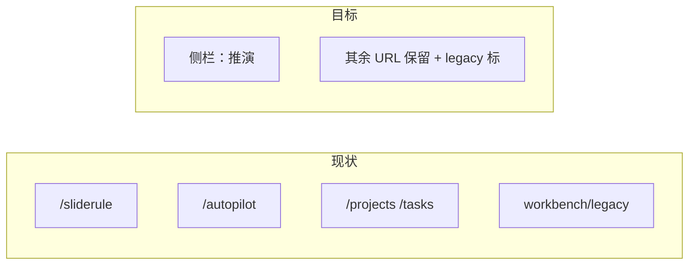
```mermaid
flowchart LR
  subgraph N["现状"]
    N1["/sliderule"]
    N2["/autopilot"]
    N3["/projects /tasks"]
    N4["workbench/legacy"]
  end
  subgraph T["目标"]
    T1["侧栏：推演"]
    T2["其余 URL 保留 + legacy 标"]
  end
```

- **风险**：删路由会断书签与截图脚本（`app_screenshot.py:274` 写死 `/agent-loop/sliderule`）。藏不等于 404。控制面若接到 Autopilot 工具定义上，会重演 2026-08-16「改了没通电的插座」。

---

### M18 能力池与工厂分离（pool 不再假装是 app factory）

- **方面**：推演内核
- **WhyBuddy 现状**：**live 且形状错**。`pick_next_capabilities` 在工厂点火前仍调度 `risk.analyze` / `counter.argue` / `report.write` / `critique.generate` 等 RAG 作文能力（`v5_agentic_pick.py:34-54`；`capability_maps.py` 几乎每个都 `retrieve_evidence`）。用户等的是 `appbundle.runtimeclosure` 进 spec-first。真机：选材段之后还有「散文轮」，第一页 HTML 要等到约第 2 分钟。
- **要不要加入**：**必须**
- **加入后的 WhyBuddy 形态**：

  - **控制面**可用作文能力当便宜工具（`search_evidence`、短报告），因为它们不再挡在工厂前面
  - **`rehearse` 的内部调度**收敛为：取证（可选）→ spec-first 七步 → 闸 → 闭环。默认跳过 risk/critique/report 散文，除非 scope card 勾了「要可行性报告」
  - `appbundle.runtimeclosure` 不再跟 20 个作文能力抢 5-cap 名额

  接在：给 `drive_full_v5_session_stream` **加参数** `profile: Literal["full", "app"] = "full"`（默认 `"full"`，`/drive-turn` 与 `agentic_pick_eval.py` 行为不变）。信封 helper 把 `rehearse` 的 `"app"` 传进生成器。函数体内 `profile=="app"` 时跳过 `pick_next_capabilities` + `agentic_pick`（`:2019-2030` 那段），改走短清单。`repair=True` 仍走 `pick_repair_capabilities`。

  **禁止**在 `/drive-full-stream` HTTP 体上放 `factoryProfile`。短清单不是公开方言，是 `rehearse` 工具 → 信封 → 生成器入参。产品路径上**信封**的唯一调用方是控制面的 `rehearse`/`refine`/`repair`；生成器只被信封调用（KD16）。只改路由不把 `profile` 传入生成器 = 空操作（2026-08-16 插座）。裸调生成器 = 拔掉 persist/E25/E26。

  判据（反）：产品 `rehearse` 的 `skill_start` 默认不得出现 `critique.generate` / `risk.analyze` / `report.write`（范围卡勾了取证/报告除外）；`/drive-turn` 仍可以。`evaluate_coverage_gate` 在短清单路径上仍被调用（M20），删掉算失败 PR。

- **三列对照**：

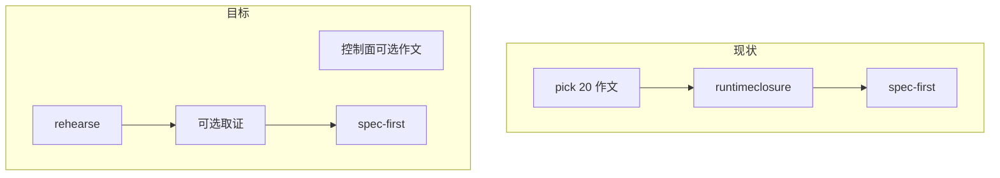
```mermaid
flowchart TD
  subgraph N["现状"]
    P[pick 20 作文] --> R[runtimeclosure]
    R --> S[spec-first]
  end
  subgraph T["目标"]
    CP[控制面可选作文]
    RH[rehearse] --> EV[可选取证]
    EV --> S2[spec-first]
  end
```

- **风险**：只改规则 pick 不改 agentic pick = 一半不生效（`Claude.md` §4）。两条都要收。评测脚本 `agentic_pick_eval.py` 会红——那是预期，评测口径要改成「工厂路径不再靠作文能力凑闭环」。

---

### M19 真实成本账

- **方面**：架构治理 / 交互
- **Claude / Grok**：按 provider usage 记账。
- **WhyBuddy 现状**：**half-true**。`cost_ledger.py`（2026-08-20）挂在 `call_llm` `_finalize_result`，主循环真实 usage 会入账；观察者自己炸了 fail-open。能力执行器仍 `len(content)//4`（`slide_rule_executor.py:167`）。架构图 `:2351` 仍写「全是假的」——过期一半。`LLM_UNLIMITED_MODELS` 跳过 Node 侧记账的口径可能仍在 Node 遗留里。
- **要不要加入**：**应该**
- **加入后的 WhyBuddy 形态**：

  - HUD 只展示 `source="server"` 的条目；`estimated` 标「估」
  - 能力执行器估 token 要么删掉、要么明确不进 HUD
  - Scope card 的预估费用用最近 N 次真机 `costLedger` 中位数，不用 `len//4`

  接在：`cost_ledger.record_llm_result` 已在流式 drive 上（`v5_full_driver.py:1863 bind_cost_session`）。补的是消费侧 HUD + 停用假估。

- **风险**：拿假数做预算门会变成「从来没触发过的 maxTokensPerSession」（架构图 `:2352-2353`）。预算门必须读 server usage。增强类记账 fail-open 保持。

---

### M20 宿主安全 / 闸 / 闭环 —— 已有、禁止拆掉（负向模块）

- **方面**：推演内核（**负向**：列入是为了写明不许动）
- **Claude / Grok**：权限模式；**没有**「证据不够不许写结论」的门（`OSS_GAP_ANALYSIS.md:61-69`）。这是本仓差异化。
- **WhyBuddy 现状**：**live，必须保持**。

  | 机制 | 位置 | 纪律 |
  |---|---|---|
  | `v5_model_gate` 结构闸 | `v5_capability_executor.py:498` | fail-closed |
  | `v5_model_repair` 零 LLM 修复 | 同文件 `:532` | 修不好的剔除，不放行 |
  | publish closure 6/6 | `v5_publish_closure_response.py` | 缺证据 blocked，不许绿灯 |
  | coverage gate（活插座） | `evaluate_coverage_gate` 在 `v5_full_driver.drive_full_v5_session_stream`：`:1992` / `:2333` / `:2363` | fail-closed。`rehearse` 若不调用它 = 失败 PR。`POST /coverage`（`routes/sliderule_full.py:1216`）是算一遍不落库的调试口，**不是**产品插座 |
  | DOMPurify + closed Shadow DOM | `client/src/pages/sliderule/live-runtime/bound-html-surface.tsx:10-14` | 影子根不是安全边界；挡执行的是 DOMPurify |
  | `code.run` E2B 沙盒 | `mcp_tools.py:369+` | 不进默认控制面 |
  | 协作式取消 | `run_cancel.py` | 不许退回 `task.cancel()` 谎言 |
  | 连接器不编数据 | `connectors.py:20-24` | fail-closed |

- **要不要加入**：**不要拆；不要用控制面绕过**
- **加入后的 WhyBuddy 形态**：控制面的 `rehearse` **必须**走现有工厂出口（含 `evaluate_coverage_gate`），不许另写一条「快速生成跳过闸」。沙盒只围 `code.run` 和 HTML purify，**不要**给整个引擎套进程沙箱（那是编码 Agent DNA）。便宜 `search_evidence` 不得充当 Skill 证据。

- **三列对照**：

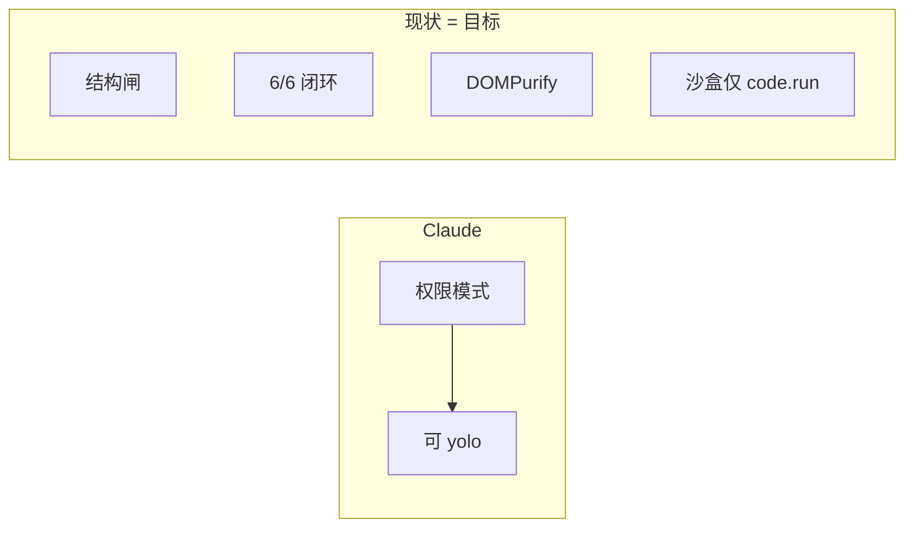
```mermaid
flowchart LR
  subgraph C["Claude"]
    CP[权限模式] --> CY[可 yolo]
  end
  subgraph N["现状 = 目标"]
    NG[结构闸]
    N6[6/6 闭环]
    ND[DOMPurify]
    NS[沙盒仅 code.run]
  end
```

- **风险**：控制面若提供 `rehearse_unsafe` / `publish_anyway`，产品从推演平台变成聊天生成器。明确禁止。任何 PR 若让 `blocked=false` 在证据不足时出现，一票否决。

---

## 7. 目标架构总图（WhyBuddy V6.1 控制面 + 工厂）

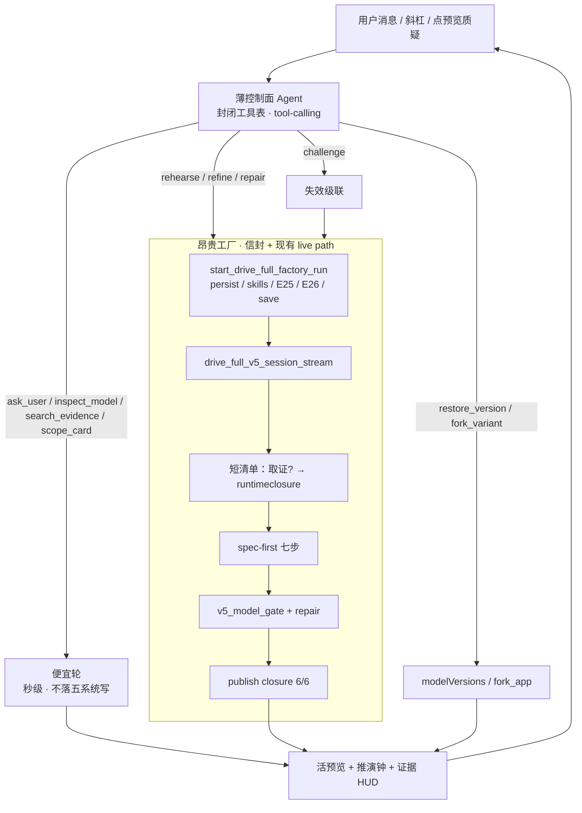
```mermaid
flowchart TB
  U[用户消息 / 斜杠 / 点预览质疑] --> CP[薄控制面 Agent<br/>封闭工具表 · tool-calling]

  CP -->|ask_user / inspect_model / search_evidence / scope_card| CHEAP[便宜轮<br/>秒级 · 不落五系统写]
  CP -->|rehearse / refine / repair| FACTORY
  CP -->|challenge| INV[失效级联]
  CP -->|restore_version / fork_variant| VER[modelVersions / fork_app]

  INV --> FACTORY

  subgraph FACTORY["昂贵工厂 · 信封 + 现有 live path"]
    direction TB
    ENV[start_drive_full_factory_run<br/>persist / skills / E25 / E26 / save]
    ENV --> D[drive_full_v5_session_stream]
    D --> P[短清单：取证? → runtimeclosure]
    P --> SF[spec-first 七步]
    SF --> G[v5_model_gate + repair]
    G --> C6[publish closure 6/6]
  end

  CHEAP --> HUD[活预览 + 推演钟 + 证据 HUD]
  C6 --> HUD
  VER --> HUD
  HUD --> U
```

**通电检查表**（写代码前钉死）：

1. **新烧唯一点火 HTTP**：发送 / 「开始推演」/ 补齐缺口 / 质疑 / 斜杠 `/推演` → `POST /api/sliderule/control-turn-stream`。不是 `/drive-turn`，不是 Autopilot，不是 `agent-loop` 队列，**也不是**前端直 POST `/drive-full-stream` 或 `/drive-full`。
2. **续播不是点火**：`runTurn(..., { runId })` → `GET /runs/{id}/stream`。刷新不得 POST control-turn-stream，不得增加生成器调用次数。
3. **唯一工厂信封**：`rehearse`/`refine`/`repair` 调 `start_drive_full_factory_run`（从 `sliderule_full.py:1248-1334` 抽出）。生成器只被信封调用。`/drive-full-stream` 可调同一 helper。短清单是 `profile=`，不是 HTTP `factoryProfile`。
4. `refine` 走生成器 `wants_refine` / `set_refine_context`（`:469-508`），禁止直调 `v5_capability_executor`。coverage 用驱动器内 `evaluate_coverage_gate`，不用 `/coverage`。
5. spec-first 仍是默认工厂；GEN5 仍只是回落。闸与 6/6 仍在信封出口。便宜搜索不计 6/6。
6. 「开始推演」/ `/精修` / 补齐缺口 / 质疑按钮与 `/质疑` 走 `forcedTool`，不再跑一轮 LLM。`/推演` 无已确认范围卡只停泊 `control_scope_card`，信封 = 0。每个产品 POST 带齐 `sessionId`/`userText`/`installedSkills`/`activeConnectors`/`preferredDevice`/`designSystemId`。
7. `controlTranscript` 是 `V5SessionState` 一等字段；`awaitReason` 扩 `control_ask` / `control_scope`（Python + TS）。前端 `consumeControlStreamResponse` 必须吃 `control_*`。
8. 控制面故障 → M1 罐头，不是开放 chat，不是点火，不是 `driveReasoningSession`。

---

## 8. 明确不做什么

| 不做什么 | 为什么 | 大哥身上在哪 |
|---|---|---|
| Bash / Edit / Grep-over-repo | 工作对象不是 git 仓库 | Claude / Grok 主工具表 |
| git worktrees / ACP-in-IDE | 编码 Agent 宿主 | Grok-build |
| 开放 MCP 应用商店 | 模型可挂任意写工具 | Claude `/mcp` |
| hooks.json / always-approve / yolo 发布 | 闭环 fail-open | Claude bypass |
| 用户在推演中途 `/commit` | 没有 git 产品语义 | Claude skills |
| 多 agent 编码仪表盘 | 会变成第三套 UI | Grok `/loop` 仪表盘 |
| `/loop` cron | 产品是一场推演不是常驻工人 | Grok |
| 引擎进程级沙箱 | 沙盒只围 code.run 与 HTML | 编码 Agent 默认 |
| 把 SlideRule 做成 Cursor 皮肤 | 北极星不是「写代码更快」 | — |
| 打开 `SLIDERULE_INTAKE_JUDGE_BLOCKING` 当控制面 | 旧闸误伤真需求；阻断权在工具选择 | — |
| 给 GEN5 加参数当主轴 | 主轴是 spec-first | 架构图 ⛔1 老链路 |
| 把 `role-agent-runtime` 当控制面 | Autopilot/legacy，不通电 | `server/routes/blueprint/role-agent-runtime/` |
| 自动注入上一场五系统模型 | 悬挂引用 / 串台 | — |
| general-purpose 子代理写模型 | 竞态 + 证据撕裂 | Claude Task |
| 控制面故障时发一次无 tools 的开放 chat | 那就是通用助手；只许罐头推演提示 | — |
| HTTP `factoryProfile` 作为第二点火方言 | 成对插座，一半产品仍走 20 能力池 | — |
| 把 `mcp_runtime.py` / `skill_runtime.py` 接成控制面 | 可注入适配器，流式 driver 不调 | — |
| 控制面裸调 `drive_full_v5_session_stream` | 拔掉 persist/E25/E26/skills 信封 | — |
| 「开始推演」再走一轮 LLM | 按钮是假的，可再问或撞 45s 帽 | — |
| 空会话 `/推演` 直接 `forcedTool: "rehearse"` | 换了个名字的 yolo 点火 | — |
| control-turn body 只有 `{forcedTool, goal}` | 信封 `set_active_connectors(None)`，斜杠连接器静默 no-op | — |
| 质疑按钮当聊天、等 LLM 选 `challenge` | 模型可改选 `inspect_model`，失效一次都不跑 | — |
| 停泊复用 `ready` / `user_input` / `confirm` | G_READY 在 `/drive-turn`；Literal 会 ValidationError 或走错前端分支 | — |
| `controlTranscript` 当 extras / sibling blob | Pydantic 剥 extras，刷新后问题消失 | — |
| 控制面故障回落 `SlideRuleRuntime.driveReasoningSession` | 第三工厂，M1 罐头被绕过 | — |
| 刷新续播 POST `control-turn-stream` | 把「（续播上一轮推演）」当新意图再烧一场 | — |

偷的是**控制面形状**。不偷的是**编码 Agent 的工作对象与权限哲学**。

---

## 9. 落地顺序与验收

用户能感到「好用了」的判据（落在看见的东西上，正反成对）：

| # | 用户感受 | 正判据 | 反判据 |
|---|---|---|---|
| A | 第一次发送前看到范围卡 | DOM `sliderule-scope-card`；文案「大约数分钟，第一页会先出现」（无假分钟数） | 确认前信封 = 0；空会话 `/推演` 信封 = 0；`sliderule:resend-prompt` 同样要卡或文档化 skip |
| B | 问「这个角色为什么这样」不必重跑一场工厂 | 走 `inspect_model`；回复秒级 | 该轮无 `appbundle.runtimeclosure` |
| C | 质疑不再是 `window.prompt` | 作曲家预填质疑；产品面无 `window.prompt(`；POST `forcedTool: "challenge"` | Dev 页以外 grep 剥注释后为零；persist 失败不点火；模型偏好 `inspect_model` 仍 invalidate 一次 |
| D | 侧栏有「推演」 | `NAV_GROUPS` 第一组第一项 `{ key: "sliderule", label: "推演" }`（Q3 已关闭，不是主按钮 fallback） | 品牌 logo 不是唯一 `sliderule` href；`html.toContain("推演")` 不够 |
| E | 问候不烧钱 | `你好` 走控制面罐头/短文本 | `drive_full_*` = 0；`evidencePresentCount` 不变 |
| F | 进度能读懂 | 推演钟按 M8 映射表亮步（默认从起草 SPEC 起） | 默认不展开 `risk.analyze` 原文；无未标定分钟数 |
| G | 停止仍然诚实 | 点停止后引擎在步间退出 | run 状态不是 cancelled 却还在烧 LLM |
| H | 新烧只有一个 HTTP 插座 | 产品客户端剥注释后无 POST `/drive-full-stream`、无 POST `/drive-full`；「开始推演」带 `forcedTool: "rehearse"` + 六个上下文字段 | 控制面故障无开放 chat、无信封调用、无 `driveReasoningSession`；续播仍 `GET /runs/{id}/stream`；`{forcedTool, goal}` 夹具失败；斜杠连接器仍进 `set_active_connectors` |

建议落地顺序（每步可独立合并，见 PR Plan）：

1. **产品面收敛 + 侧栏「推演」**（M17）——零引擎风险，立刻好找
2. **质疑进作曲家**（M5）——改 `challengeTurn`，不改工厂
3. **进度钟 + HUD**（M8、M19 消费侧）——投影已有 SSE
4. **Scope card UI 壳**（M2）——拦 `runTurn` 全入口；**不**作为永久调度器，PR-4 落地即删
5. **薄控制面**（M1 + M3）——**在此之前不要开 PR-4 的实现**，契约先写进代码头注；唯一点火插座
6. **工厂短清单**（M18）——`profile="app"` 传入 `drive_full_v5_session_stream`，无公开 flag
7. **斜杠推演动词**（M9）
8. **中途排队**（M4 一期）
9. **骨架接线**（M15）+ **领域 pack**（M11）
10. **checkpoint pendingRuns**（M14）
11. **架构图拆分**（M16）——可与 1–4 并行，但必须在控制面上线前有一张真图
12. 宪章 opt-in（M6）、变体语言（M7）、更多连接器（M10）、只读取证并行（M13）随其后

---

## 10. Key Decisions

| # | 决策 | 理由 | 接在哪条 live path |
|---|---|---|---|
| KD1 | **不替换推演编译器；包一层薄控制面** | 工厂是北极星差异化（闸 + 6/6）。不好用是因为聊天=点火 | 产品动词 → `/control-turn-stream` → 可选工厂 |
| KD2 | 控制面工具表**封闭**（含 `fork_variant`），工作对象是五系统会话不是 git | 开放工具会把产品变成伪 Cursor；闭集事后加塞会偷渡 | 新模块；禁止接 `role-agent-runtime` / `mcp_runtime` / `skill_runtime` |
| KD3 | 只有 `rehearse`/`refine`/`repair` 可**生成**新五系统模型。`challenge` 只失效；`restore_version`/`fork_variant` 只移/复制指针。无工具可写 `blocked=false` | 字面「只有这三个能写」会让人拒掉失效级联，或跳过 invalidate 以服从 KD | 信封 `start_drive_full_factory_run` → 生成器；`apply_user_intervention_invalidation` |
| KD4 | 范围卡在工厂之前。**Q2 已关闭**：首轮强制完整卡（必须点「开始推演」）；迭代出薄卡（一句话 + 开始推演）。不用未标定「>2 min」跳卡。`repair` / 质疑续跑按 M2 表 skip。UI v1 **不上屏未标定分钟数** | 8–9 / 2 / 20 来自不同路径的观测，不是标定集；M18 后还会变 | 拦截 `runTurn`/`requestRehearsal`；标定笔记出来再改数字 |
| KD5 | `intake_judge` 不升级成硬拦；阻断权在工具选择 | 模块头写过误伤真需求的事故 | `judge_turn` 作控制面输入，不改 `BLOCKING` 默认 |
| KD6 | 质疑走作曲家；产品流失效在 TS persist，控制面接手后改 Python `apply_user_intervention_invalidation`；persist 失败不点火 | 抄错 `persistence.py` / 只改 UI 都会让质疑静默丢 | `sliderule-runtime.ts:3215` → persist → stream；PR-4 后控制面 handler |
| KD7 | 产品宪章 opt-in，禁止自动注入上一场模型 | 串台 / 悬挂引用 | `scope_card` 装配；spec-first 输入，不只 GEN5 |
| KD8 | 运行中发送 ≠ 停止；停止单独保留且诚实 | E25 事故：账面 cancelled 仍烧 15 分钟 | 拆 `sendMessage` 不只 `doSend`；`run_cancel.raise_if_cancelled` |
| KD9 | `rehearse` 默认 `profile="app"` 短清单；作文能力退出工厂主轴 | 用户等的是 HTML 不是 risk 散文 | **参数传入** `drive_full_v5_session_stream`；同时跳过 agentic pick |
| KD10 | 骨架先于窄化；骨架不许带绑定。**Q4 已关闭**：骨架与 Pack 是两层（结构 vs 语义）；Pack 可推荐骨架，匹配失败各自 fail-open | 架构图未决问题在此拍板；悬挂闸已踩过；混成一层会把先验当绑定 | `run_spec_first` → `spec_tree`；pack 只许 prior |
| KD11 | 抄 LangGraph 图纸进 `persistence.py`，不引框架 | `spec_first_pipeline.py:31-33` 已拒绝第二套编排 | `save_session` + drive loop |
| KD12 | **Q3 已关闭**：侧栏第一项是「推演」，不是分叉。`NAV_GROUPS` 第一组第一项 `{ key: "sliderule", label: "推演" }`。样式仍服从 08-26（不要左侧竖条、不要假折叠箭头）。legacy 藏不住删。PR-0 走侧栏项，不以主按钮为默认 | 新用户找不到产品；logo `title="回到推演"` 会让弱断言假绿 | `client/src/pages/agent-loop/dashboard/DashboardApp.tsx` NAV_GROUPS |
| KD13 | 沙盒只围 code.run 与 HTML purify；闸不许绕过 | `Claude.md` §7；OSS「信任层不动」 | 控制面无 `publish_anyway`；coverage 在驱动器内 |
| KD14 | 斜杠保持扩展选择器，只加 5 个推演动词 | 用户 2026-08-25 已裁过扩展中心；不抄 `/compact` | `composer-slash.ts` |
| KD15 | 架构图拆 6 张，停止在 V6.0 上打 ⚑ | ⚑⚑A 与 ⚑⚑E 打架已造成读图事故 | 新 `docs/SlideRule V6.1 *.md` + mermaid-render-check |
| KD16 | **新烧一个 HTTP 插座**。控制面是工厂**信封**（`start_drive_full_factory_run`）的唯一产品客户端。生成器只被信封调用。禁止公开 `factoryProfile`。续播 `GET /runs/{id}/stream` 不是点火 | 裸调生成器 = 拔掉 persist/E25/E26；两个 HTTP 方言 = Claude.md §4 | 抽出 `sliderule_full.py:1248-1334`；产品客户端剥注释无 POST `/drive-full-stream` 也无 `/drive-full` |
| KD17 | 便宜轮写入 `V5SessionState.controlTranscript`（一等字段，Python+TS），**禁止**写入工厂 `conversation` | extras 会被剥；问候/搜索会变成下一轮 spec-first 意图 | `models/v5_state.py` + `v5-reasoning-state.ts`；schema-parity 测试 |
| KD18 | 便宜 `search_evidence` 不计 6/6（`provenance=control-search`，不 `commit_artifact`） | 问候+搜索预装证据会让 `blocked=false` 无推演 | 与 `retrieve_evidence` 工厂路径隔离 |
| KD19 | 作曲家只留一个「要不要烧」决策面：范围卡 / `ask_user`。Hint 条不再平行点火 | 四张卡叠在 `runTurn` 上 = 闸全绿东西没了 | 删或吞并 `IntakeHintBar`；关掉 `looksLikeNewAppIntent` 自动重置 |
| KD20 | 控制面走标准 `tool_calls`（Q1=A）。**Q5 已关闭**：控制面模型分开配 `SLIDERULE_CONTROL_MODEL`，缺省回落同一 `LLM_MODEL`。故障降级是罐头推演提示，**不是**无工具开放 chat，**也不是** `driveReasoningSession` | 开放 chat 就是通用助手；null stream 回落本地引擎是第三工厂 | `sliderule_llm/control_client.py`；删 `useSlideRuleSession.ts:1178-1188` 产品路径 |
| KD21 | 贵按钮是 `forcedTool`，不再跑一轮 LLM。「开始推演」（卡已确认）→`rehearse`；`/精修`→`refine`；补齐缺口→`repair`；质疑按钮与 `/质疑`→`challenge`（只失效，不调信封）。`/推演` 无已确认范围卡只停泊 `control_scope_card` | 确认当聊天，按钮是假的；空会话 `/推演` 直接 rehearse = yolo；质疑走 LLM 可选 `inspect_model` 跳过失效 | `control-turn-stream` body；空会话 `/推演` 信封 = 0；质疑夹具偏好 `inspect_model` 仍 invalidate 一次 |
| KD22 | `AwaitReason` 扩 `control_ask` / `control_scope`（Python+TS）。禁止复用 `ready`/`user_input`/`confirm`。前端 `consumeControlStreamResponse` 吃 `control_*`，handoff 后复用工厂 case | 未入 Literal 会 ValidationError；`consumeDriveStreamResponse` 无 default 会丢事件 | `v5_state.py:12-24`；`v5-reasoning-state.ts:20-31`；`sliderule-marathon-driver.ts` |
| KD23 | 每个产品 POST 必带 `sessionId` / `userText` / `installedSkills` / `activeConnectors` / `preferredDevice` / `designSystemId`。信封 helper 签名接同一组字段。`userText` 是本回合指令，refine 不覆盖会话 `goal` | 只 POST `{forcedTool, goal}` 时 helper 清空 connectors/skills；删 `driveFullViaPythonStream` 后字段会丢 | 活 POST `sliderule-marathon-driver.ts:303-315`；`useSlideRuleSession.ts:1001-1006`；`installedSkillsDrivePayload` / `pickedConnectorIds` 必须仍在产品 POST 路径 |

---

## 11. Open Questions

全部关闭。不再有未决产品分叉。实现细节不装成问题。

**Q1. 控制面要不要真的走 provider `tools`/`tool_calls`？ — 已关闭：A**

- 控制面专用 `control_client.py` 发标准 tool_calls，闭集 schema。工厂 `client.py` **禁止** `tools`（工厂开工具 = 模型自己 `rehearse` 递归）。PR-4 不是产品分叉。

**Q2. 范围卡默认拦所有 `real`，还是只拦首轮？ — 已关闭：首轮强制卡；迭代出薄卡**

- 第一次点火必须点「开始推演」。迭代仍出一句话薄卡，**不要**用未标定的「>2 min」阈值跳卡。`repair` / 质疑续跑按 M2 表 skip。见 KD4。

**Q3. 「推演」侧栏项 vs 2026-08-26「不再单列」？ — 已关闭：加回侧栏第一项「推演」**

- `NAV_GROUPS` 第一组第一项 `{ key: "sliderule", label: "推演" }`。样式仍服从 08-26：不要左侧竖条、不要假折叠箭头。PR-0 走侧栏项路径，不以「主按钮 fallback」为默认。见 KD12。

**Q4. 领域 pack 与 app_template 是一个东西还是两个？ — 已关闭：两层**

- 骨架 = 页清单 + 区块槽（结构）。Pack = 行业术语 + 宪章 + 页种类倾向（语义）。Pack 可推荐一副骨架，匹配失败互不影响（各自 fail-open）。见 KD10。

**Q5. 控制面模型是否与工厂模型分开配？ — 已关闭：分开配**

- `SLIDERULE_CONTROL_MODEL`，缺省回落到同一 `LLM_MODEL`。挂了 → **M1 罐头**（「我是面团的推演引擎…」），不点火，**不是**无工具开放 chat，**也不是** `driveReasoningSession`。见 KD20。

不列为问题的（已拍板）：yolo 发布、开放 MCP、子代理写模型、替换 spec-first、把 agent-loop 队列当主线、HTTP `factoryProfile`、控制面故障变通用助手或 `driveReasoningSession`、裸调生成器、确认再走一轮 LLM、停泊复用 `ready`、空会话 `/推演` 直接点火、control-turn 只 POST `{forcedTool, goal}`、Q2 薄卡 / Q3 侧栏项 / Q4 两层 pack / Q5 控制面模型 env。

---

## 12. PR Plan

每条可独立合并。依赖写明。文件点名。每条必须有「通电」测试：删调用点要红。

**插座纪律（盖过单条 PR 描述）**：PR-0 / PR-1 / PR-2 仍走今天的 `runTurn` → `/drive-full-stream` **信封**，因为控制面还不存在。PR-3 是**可删的 UI 壳**，不是永久调度器。PR-4 **同一 PR 内**把**新烧**收到 `POST /api/sliderule/control-turn-stream`，抽出信封 helper，让 `rehearse`/`refine`/`repair` 调 helper（不是裸生成器），删掉 PR-3 分流器。续播保持 `GET /runs/{id}/stream`。PR-4 之前不要开控制面实现。PR-5 禁止公开 `factoryProfile`。

### PR-0 图与导航（无引擎风险）

- **依赖**：无
- **文件**：
  - `client/src/pages/agent-loop/dashboard/DashboardApp.tsx`（`NAV_GROUPS` 第一组第一项 `{ key: "sliderule", label: "推演" }`。样式服从 08-26：不要左侧竖条、不要假折叠箭头。Q3 已关闭，不以主按钮为默认）
  - `client/src/App.tsx`（legacy 路由加 banner 组件，不删）
  - `docs/SlideRule V6.1 控制面.md`（本文件 §7 那张图，短）
  - `client/src/pages/agent-loop/AgentLoopPage.test.tsx`
- **描述**：用户能从侧栏进推演。新图可渲染。跑 `node scripts/mermaid-render-check.mjs`。
- **通电 / 反向**：
  - `NAV_GROUPS` 第一组第一项是 `{ key: "sliderule", label: "推演" }`。
  - 剥注释后断言品牌 logo **不是**唯一的 `sliderule` href。
  - **禁止**把 `html.toContain("推演")` 当验收——今天 logo 的 `title="回到推演"` 就能让这条绿（`AgentLoopPage.test.tsx:186-197`）。
- **对应**：M16 起步、M17、验收 D、KD12

### PR-1 质疑进作曲家（UI + persist fail-closed；无局部重跑）

- **依赖**：无
- **文件**：
  - `client/src/pages/sliderule/useSlideRuleSession.ts`（`challengeTurn` 去掉产品面 `window.prompt`；挑战路径 persist 失败**不得**开 stream）
  - `client/src/lib/sliderule-runtime.ts`（继续走现有 `invalidateForIntervention` `:2982` / `intakeMessage` `:3215`，本 PR 不发明 Python 半套）
  - `client/src/pages/sliderule/ComposerDock.tsx`（challenge 预填）
  - `client/src/pages/SlideRule.tsx`（按钮改为打开作曲家）
  - 新测试：剥注释后产品面无 `window.prompt`；persist 失败夹具下不 POST `/drive-full-stream`
- **描述**：质疑是作曲家意图。活路径保持：`intent: "challenge"` → TS `invalidateForIntervention` → **persist 成功才能** `drive_full_v5_session_stream`（整轮，不是局部重跑）。今天 `:869-871` 的 `catch { 仍继续驱动 }` 在挑战路径上改为 fail-closed：展示错误、不启动 stream。**不要**在本 PR 写 pendingRuns / 能力级重跑（那是 M14 / PR-8）。PR-4 接手后这条路径改走控制面 `challenge` 工具 + Python `apply_user_intervention_invalidation`。
- **对应**：M5、验收 C、KD6

### PR-2 推演钟 + 证据 HUD（无假分钟数）

- **依赖**：无
- **文件**：
  - `client/src/pages/sliderule/derive-status-bar.ts`（必须落地 M8 映射表：`spec_tree` / `spec_page_html` / `page_shell` / `html_structure` / `spec_semantics` / `model_assembly` / `html_bindings` / `gate` → 产品六步）
  - `client/src/pages/sliderule/useSlideRuleSession.ts`（SSE 投影：步；`llmStreams` 默认折叠）
  - 消费 `costLedger`（只展示 `source="server"`）
- **描述**：不改 driver。用已有 `skill_start` / page sink / heartbeat。墙上钟文案只许「大约数分钟，第一页会先出现」。**禁止**把 8–9 / 2 / 20 写进 DOM。默认 `rehearse`（PR-5 之后）从第 2 步「起草 SPEC」起跳，除非范围卡勾了取证——本 PR 的映射表必须把第 1 步标成可跳过，免得 PR-5 后第一格空转。
- **通电 / 反向**：用户不打开轨迹也能回答「现在在哪一步」。DOM 剥文本后不得出现「8–9」「8 分钟」「约 2 分钟」作为 ETA。
- **对应**：M8、M19 消费侧、验收 F、KD4

### PR-3 Scope card UI 壳（拦 `runTurn`；PR-4 落地即删）

- **依赖**：PR-0 最好先合（导航），非硬依赖
- **文件**：
  - `client/src/pages/sliderule/useSlideRuleSession.ts`（抽 `requestRehearsal()`；拦截点是 `runTurn` 全入口，**不是**只拦 `ComposerDock.doSend`。关掉 `looksLikeNewAppIntent` `:610-627` 自动重置）
  - `client/src/pages/sliderule/ComposerDock.tsx`（卡的 DOM；「开始推演」在本 PR 仍可调现有 `runTurn`——这是壳，不是调度器）
  - 新 `client/src/pages/sliderule/ScopeCard.tsx`（`data-testid="sliderule-scope-card"`；文案无假分钟数）
  - `client/src/pages/sliderule/IntakeHintBar.tsx` / `use-intake-judge.ts`（同一 send **禁止**同时渲染 hint 条和范围卡；hint 条降为卡的皮肤或隐藏）
- **描述**：这是控制面到来前的 UI mock。枚举 M2 表：发送 / `sliderule:resend-prompt` 要卡；`repair` / 挑战 skip 卡。`ClarificationCard` 不在本 PR 当点火闸（产品流不停 G_READY）。**本 PR 合入后不得被当成永久前端调度器**——PR-4 必须删除「开始推演 → `runTurn` → `/drive-full-stream`」这条旁路，或把它藏进只给测试用的 flag，默认关。
- **通电 / 反向**：
  - 需要卡的意图发出后、确认前，DOM 有 `sliderule-scope-card`。
  - `dispatchEvent(sliderule:resend-prompt)` 确认前不得 POST `/drive-full-stream`。
  - 只测 `doSend`、不测 resend/repair/challenge = 失败 PR。
- **对应**：M2、M3 幸存者、M12 范围批准、验收 A、KD4、KD19

### PR-4 薄控制面（新烧唯一点火 HTTP；信封不是裸生成器；Q1=A）

- **依赖**：PR-3（前端已有「不自动点火」的壳）。**契约未写进 `rehearsal_control.py` 头注之前不要写分发器。**
- **文件**（新，不要塞进 `v5_full_driver.py`）：
  - `slide-rule-python/services/drive_full_factory.py`（**抽出**今天 `routes/sliderule_full.py:1248-1334`：persist-as-authority、skills/connectors/device/design-system、E25 `run_registry.start_run`、E26 自动补救、`save_session`。导出 `start_drive_full_factory_run(session_id, user_text, installed_skills, active_connectors, preferred_device, design_system_id, *, repair=False, profile="full", ...)`。内部才调 `drive_full_v5_session_stream`。禁止 helper 内部再 parse 两套 payload 形状）
  - `slide-rule-python/routes/sliderule_full.py`（`POST /drive-full-stream` 改为把现网字段**具名**传给 helper；**另加** `POST /api/sliderule/control-turn-stream`，`_require_login`。Node catch-all 已转发，**不要**再写一份 Node 实现。不要公开 `factoryProfile`）
  - `slide-rule-python/services/rehearsal_control.py`（闭集工具分发；`rehearse`/`refine`/`repair` **只**调 helper 且传入 POST 上的 skills/connectors/device/designSystem，禁止 `async for drive_full_v5_session_stream`。`refine` 走生成器 refine-context，禁止 import 执行器当入口。未确认范围的 `forcedTool: "rehearse"` 当停泊，不调 helper）
  - `slide-rule-python/sliderule_llm/control_client.py`（**单独** payload，可带 `tools`；工厂 `client.py` 不动、禁止 `tools`）
  - `slide-rule-python/models/v5_state.py` + `shared/blueprint/v5-reasoning-state.ts`（`AwaitReason` 加 `control_ask` / `control_scope`；`V5SessionState.controlTranscript` 一等字段，默认 `[]`）
  - `slide-rule-python/tests/test_v5_state_schema_parity.py`（两边 Literal + `controlTranscript` 必须绿；旧会话缺字段读成 `[]`）
  - `client/src/pages/sliderule/useSlideRuleSession.ts`（新烧改 POST `control-turn-stream`，body 必带 `sessionId`/`userText`/`installedSkills`/`activeConnectors`/`preferredDevice`/`designSystemId`——从今天 `:1001-1006` 和 `installedSkillsDrivePayload` / `pickedConnectorIds` 挪过来，不要随 `driveFullViaPythonStream` 一起删掉。`runTurn(..., { runId })` **仍** `resumeDriveFullStream`；删除 PR-3 分流器；删除 Python null → `SlideRuleRuntime.driveReasoningSession` 回落，`:1178-1188`）
  - `client/src/lib/sliderule-marathon-driver.ts`（产品面不再 POST `/drive-full-stream` 或 `/drive-full`；新增 `consumeControlStreamResponse`：处理 `control_*`，handoff 后复用 `consumeDriveStreamResponse` 的工厂 case。`GET /runs/{id}/stream` 保留）
  - `client/src/pages/sliderule/ComposerDock.tsx` / `ScopeCard.tsx`（渲染 `control_ask_user` / `control_scope_card`；「开始推演」POST 六个字段 + `forcedTool: "rehearse"` + 确认句作 `userText`。质疑按钮 POST `forcedTool: "challenge"`。`/推演` 无卡时不带 `forcedTool: "rehearse"`）
  - `slide-rule-python/tests/test_control_plane_does_not_ignite_factory.py`（问候 / inspect / 控制面故障：信封调用 = 0，且不调 `driveReasoningSession`）
  - `slide-rule-python/tests/test_control_rehearse_reaches_factory_envelope.py`（`rehearse`/`forcedTool` 调到 helper——正反；删 helper 调用点必须红。裸调生成器不算通电）
  - `slide-rule-python/tests/test_control_forced_tool_skips_llm.py`（夹具里控制模型只愿 `ask_user`：点「开始推演」仍恰好信封一次，零 `control_ask_user`，零第二轮 tool-calling；helper 收到的 `active_connectors` 含本轮斜杠 id）
  - `slide-rule-python/tests/test_control_turn_body_feeds_envelope.py`（「开始推演」把 `installedSkills`/`activeConnectors`/`preferredDevice`/`designSystemId`/`sessionId`/`userText` 传到 helper。body 只有 `{forcedTool, goal}` 的夹具必须红。refine 后会话 `goal` 未被 `userText` 覆盖）
  - `slide-rule-python/tests/test_slash_rehearse_parks_without_scope.py`（空会话 `/推演`：信封次数 = 0，发出 `control_scope_card`；未确认却带 `forcedTool: "rehearse"` 服务端仍停泊）
  - `slide-rule-python/tests/test_forced_challenge_invalidates.py`（质疑按钮 / `/质疑`：`forcedTool: "challenge"`；夹具控制模型只愿 `inspect_model` 仍恰好 `apply_user_intervention_invalidation` 一次，信封 = 0）
  - `slide-rule-python/tests/test_control_search_does_not_count_toward_closure.py`（`你好，帮我搜一下请假制度` 后 `evidencePresentCount` 不变、`conversation` 长度不变、无 `commit_artifact`）
  - `slide-rule-python/tests/test_control_ask_user_parks.py`（`ask_user` 发 `control_ask_user` 后本请求结束；persist `awaitReason="control_ask"`；reload 仍能读到问题；不复用 G_READY）
  - `slide-rule-python/tests/test_resume_does_not_post_control_turn.py`（刷新 `runTurn(..., { runId })` 只 GET `/runs/{id}/stream`；生成器调用次数不增加）
- **描述（M1 一页契约，缺一条 PR 失败）**：
  1. Q1 = **A**：控制面走 provider `tool_calls`；工厂 client 零 `tools`。
  2. SSE：`control_text` / `control_tool_start` / `control_tool_result` / `control_ask_user` / `control_scope_card` / `control_handoff_factory`（带 `runId`）/ `complete`。便宜轮 request-scoped，不开 `run_registry`。handoff 才 `start_run`，同一 SSE 订阅（或客户端走 resume 消费者）。
  3. 停泊：`awaitReason` 必须是扩过的 `control_ask` / `control_scope`。`controlTranscript` 是 schema 字段。
  4. 便宜轮只写 `controlTranscript`，**禁止**写入 `conversation`。
  5. `inspect_model` 有界 digest（≤40 条 / ≤4k 字），永不吐生模型 JSON；缺则 fail-open 空 digest。
  6. 硬上限：工具轮次 8、便宜 token 8k、点火前墙钟 45s。超限「停在控制面，未点火」，信封 = 0。
  7. 挂了 → **罐头**；禁止无 tools 开放 chat；禁止点火；禁止 `driveReasoningSession`。
  8. `challenge`：`forcedTool: "challenge"` 跳过 LLM；handler 调 `apply_user_intervention_invalidation`（`:579`）恰好一次，不调信封。
  9. `search_evidence`：`provenance=control-search`，不计 6/6。
  10. `forcedTool: "rehearse"|"refine"|"repair"` 跳过 LLM，直接信封；helper 仍收六个上下文字段。`repair` 另 `repair=True`。
  11. `refine` = 信封 + 生成器 refine-context（`:469-508`），禁止直调执行器；`userText` 不覆盖会话 `goal`。
  12. 每个产品 POST 必带 `sessionId`/`userText`/`installedSkills`/`activeConnectors`/`preferredDevice`/`designSystemId`。`/drive-full-stream` 与 `rehearse`/`refine`/`repair` 用同一 helper 签名。
  13. `/推演` 无已确认范围卡不得 `forcedTool: "rehearse"`；空会话信封 = 0。
- **通电 / 反向**：
  - 产品客户端剥注释后 grep POST 路径：`/drive-full-stream` = 0 **且** `/drive-full` = 0。`GET /runs/{id}/stream` 仍在。
  - `rehearsal_control.py` 剥注释后不得出现对 `drive_full_v5_session_stream` 的直接调用（只许 helper）。
  - 「开始推演」body 含 `forcedTool: "rehearse"` **以及** 六个上下文字段；控制模型偏好 `ask_user` 夹具下信封恰好一次；斜杠连接器 id 进 `set_active_connectors`。
  - `{forcedTool, goal}` 夹具必须红。剥注释后产品 POST 路径仍有 `installedSkillsDrivePayload` / `pickedConnectorIds`。
  - 空会话 `/推演` 信封 = 0。质疑 `forcedTool: "challenge"`：模型偏好 `inspect_model` 仍 invalidate 一次。
  - 问候语信封 = 0，`conversation.length` 不变。停泊 reload 仍显示问题，`awaitReason` 不是 `"ready"`。
  - 产品 `runTurn` 剥注释后够不到 `driveReasoningSession`。
- **对应**：M1、M2、M3、M5 控制面接手、验收 A/B/C/E/H、KD16–KD23

### PR-5 工厂短清单（`profile` 传入生成器，无公开 flag）

- **依赖**：PR-4（有 `rehearse` 入口才能区分来源）。**禁止**「没有控制面时用 `factoryProfile=app`」——那是第二点火方言。
- **文件**：
  - `slide-rule-python/services/v5_full_driver.py`（`drive_full_v5_session_stream(..., profile: Literal["full","app"] = "full")`。`profile=="app"` 时跳过 `:2019-2030` 的 `orchestrate_plan` + `pick_next_capabilities` + `agentic_pick`，改短清单。默认 `"full"` 让 `/drive-turn` 与 eval 不动）
  - `slide-rule-python/services/rehearsal_control.py` + `drive_full_factory.py`（`rehearse` 经信封传 `profile="app"`；禁止给 HTTP 加 `factoryProfile`）
  - `slide-rule-python/services/v5_agentic_pick.py`（只在 `profile="full"` 或评测脚本里继续被调）
  - `slide-rule-python/tests/test_rehearse_skips_essay_caps.py`（反：产品 `rehearse` 的 `skill_start` 无 `critique.generate` / `risk.analyze` / `report.write`，除非范围卡勾了；`/drive-turn` 仍可以）
  - `slide-rule-python/tests/test_rehearse_still_calls_coverage_gate.py`（短清单路径仍调用 `evaluate_coverage_gate`；只留 `POST /coverage` 不算通电）
- **描述**：短清单是函数参数，不是 HTTP 体字段。只改调用点 + 生成器入参，不改 `pick_next_capabilities` 词表本身。规则 pick 与 agentic pick **同时**跳过（`Claude.md` §4）。PR-5 后再测墙钟；没有标定笔记禁止改 UI 分钟数。
- **对应**：M18、M20、验收 F、KD9、KD16

### PR-6 斜杠推演动词 + 中途排队

- **依赖**：PR-4（斜杠必须进控制面，不许直连 `runTurn`）
- **文件**：
  - `client/src/pages/sliderule/composer-slash.ts`（新 `SlashKind = "rehearsal"`）
  - `client/src/pages/sliderule/composer-slash.test.ts`（正反：`https://` 仍不弹）
  - `client/src/pages/sliderule/useSlideRuleSession.ts`（拆的是 `sendMessage` / `runTurn`：运行中发送排队到下一轮控制面，不是只改 `doSend`）
  - `client/src/pages/sliderule/ComposerDock.tsx`（停止仍单独方块按钮）
- **描述**：斜杠进控制面。`/推演` 无已确认范围卡只出卡；`/质疑` 走 `forcedTool: "challenge"`；`/精修` 走 `forcedTool: "refine"`。POST 仍带齐 KD23 六个字段。
- **对应**：M9、M4 一期、KD8、KD14、KD21、KD23

### PR-7 骨架接线

- **依赖**：PR-3（scope card 能展示命中的骨架）；PR-4 后骨架命中由控制面 `scope_card` 展示
- **文件**：
  - `slide-rule-python/services/spec_first_pipeline.py` / `spec_tree.py`
  - `slide-rule-python/services/app_template.py`（只调用，不改契约）
  - `slide-rule-python/tests/test_app_template_reaches_spec_first.py`（**调用点**测试，剥注释匹配）
- **描述**：`match_app_template` 出现在 `run_spec_first` 链上。匹配失败 fail-open。
- **对应**：M15、KD10

### PR-8 pendingRuns + 轮级 checkpoint（此处才允许「局部重跑」）

- **依赖**：无（可与控制面并行）
- **文件**：
  - `slide-rule-python/services/persistence.py`
  - `slide-rule-python/services/v5_full_driver.py`（能力结束写 pending）
  - `slide-rule-python/tests/test_pending_runs_skip_completed.py`
- **描述**：按 `OSS_GAP_ANALYSIS.md` 优先级 2 然后 1。不引 langgraph。挑战的能力级重跑从本 PR 才存在；PR-1 不得提前发明。
- **对应**：M14、M5「局部重跑」延期处

### PR-9 宪章 opt-in + 变体语言 + 连接器只读扩充

- **依赖**：PR-4（`fork_variant` / `restore_version` 已在闭集）
- **文件**：
  - 宪章存储（会话或账户级，新小表/JSON，不要借用 `Claude.md`）
  - `SlideRuleStudio.tsx` 版本条改为「变体」文案
  - `services/connectors.py` 新只读源（仍 fail-closed）
  - `tests/test_connectors_reach_the_live_path.py` 同步扩
- **对应**：M6、M7、M10、M11 起步

### PR-10 死代码与双路径收口

- **依赖**：PR-4 稳定后
- **文件**：
  - 删除或闸死 `drive_v5_full_path` 的无用 import（`v5_session_driver.py` / `routes/sliderule_full.py`）
  - 文档：V6.1 六张图替换 V6.0 为「历史」
  - **点名标注** `slide-rule-python/services/mcp_runtime.py` 与 `slide-rule-python/services/skill_runtime.py`「非产品流、流式 driver 不调」——**禁止**把它们接成控制面
- **对应**：M16 收尾、M17、§4 墓碑

---

**PR 合入纪律**（本仓已付过学费）：

1. 先在目标路径打日志或断言，确认通电（`tests/test_refine_merge_reaches_the_live_path.py` 形状）。
2. 每条正向判据配反向：删调用点必须红。
3. 同步/流式成对改（控制面若另开同步 twin，必须成对 `set`/`clear`；产品面只走 SSE）。
4. 证据/闭环 fail-closed；控制面自身故障 → 罐头推演提示 + **不点火**（不是开放 chat）。
5. 不要改 `docs/SlideRule V6.0 架构图.md` 打新 ⚑——新图新文件。
6. 产品面剥注释后不得新增 POST `/drive-full-stream` 或 `/drive-full` 调用点；不得新增 HTTP `factoryProfile`；不得裸调 `drive_full_v5_session_stream`。
7. PR-3 的前端分流器在 PR-4 合入时必须消失（删或默认关的测试 flag）。
8. 续播继续 `GET /runs/{id}/stream`。`forcedTool` 贵按钮不得再跑 LLM。`AwaitReason` / `controlTranscript` 必须双边 schema 落地。
9. 每个产品 POST 必须带齐 KD23 六个字段；`installedSkillsDrivePayload` / `pickedConnectorIds` 不得随 `driveFullViaPythonStream` 一起消失。空会话 `/推演` 不得调信封。质疑必须 `forcedTool: "challenge"`。


---

## 13. 工程纪律层对照（2026-08-28 补）

> §1–§12 比的是**产品/架构层**：缺哪些模块。这一节比的是**模块内部**：
> 同一件事，grok-build 怎么写才不会静默失效。两层不重叠，都要。
>
> 来源：为修「菜单点不动」「排队的话卡死」两个真机 bug 通读了 grok-build
> 十来个文件（`managed_text/transaction.rs`、`ask_user_question/mod.rs`、
> `acp_handler/interactions.rs`、`agent_view/interactions.rs` 等），以及
> claw-code 的 `policy_engine.rs` / `recovery_recipes.rs` / `approval_tokens.rs`。

### 13.1 四条可搬的纪律（已抄，含出处）

| 纪律 | grok/claw 出处 | 本仓落点 |
|---|---|---|
| **每条出路都要兑现承诺** | `interactions.rs:85`「submit, cancel, or is replaced by another question」——三条出路各 send 一次 | 中途排队补上「空闲时点发送」这条出路（`6aebebf`）；`run_pause` 四种结局各有名字 |
| **超时不是失败** | `ask_user_question/mod.rs`「returns the same skipped text as a user dismiss, **not a tool failure**」 | `PauseOutcome.SKIPPED` 按「模型自己定的」继续，闭环照样绿（`a52316b`） |
| **看起来一样的状态要分开命名** | `timeout_enabled` vs `timeout_secs=0`；`non_interactive` 单独一档 | `PauseBudget.enabled` / `seconds=0` 回落默认；`NO_OPERATOR` 不并进 `SKIPPED` |
| **没人答是正常场景，不是异常** | claw-code `TrustPromptUnresolved`：自动一次 → 只一次 → 再不行喊人 | `UNRESOLVED_RECOVERY` / `RecoveryLedger` |

### 13.2 审出来的真缺口（已修）

**① 事件发进虚空。** 前端事件 switch 收尾是 `default: return "continue"`
——不认识的类型**静默丢弃，连日志都没有**。全量对账：Python 发 29 种、
前端认 19 种。其中 `recovery` 是「我替你做了个决定」的结构化事件，而没人听。
修法是**去掉那条没人听的通道**（并进 `run_pause_ended`），不是再加个监听。
判据：`sse-event-vocab-agrees.test.ts`（白名单式，逼人对每个新事件做一次决定）。

**② 执行器事件词表没有跨语言闸。** `executor_event_projection.py` 的注释
写着「Contract constants (shared/executor/contracts.ts)」——注释说了，没有
任何东西保证。本仓给 `BLOCK_KINDS`、`RECORD/WORKFLOW_ACTION_KINDS` 都上过
闸（Python 判据直接读 TS 文件），唯独这份漏了。判据：
`test_executor_vocab_matches_ts.py`。

**③ 状态封闭词没有「先申报再写」的闸。** `AwaitReason` 头上记着**两次同形状
的事故**（`control_clarify` / `error` 写了没申报 → 会话从库里读回来被整条
跳过 → 「停在那一步的会话重启后从侧栏消失」）。两次都是人手修的，没留下闸。
⚠ 要害：**Python/TS 两边互比挡不住这一类**——两边都缺时「一致」照样成立。
闸必须比「申报的词表 vs 代码里真写过的值」。判据：
`test_state_enum_values_are_declared.py`，两条变异就是重演那两次事故。

### 13.3 审出来是健康的（记一笔，免得下次重审）

- **fail-open / fail-closed 分类（纪律七）**：闭环/证据类模块没有吞异常伪造
  绿灯（`v5_publish_closure_response` 那处 `except` 是 `_as_dict` 的类型兜底，
  判决本身仍是 `return None`）；增强类模块也没有会炸主链路的 `raise`。
- **写后校验**：落库路径有 `PersistClosedError` fail-closed；前端 5 处 fetch
  全都看 `ok` 或读 body，没有「发出去就当成功」的。
- **awaitReason / runtimePhase 当前口径**：写过的值全部已申报，Python/TS 两份
  一字不差（15 / 15）。

### 13.4 还没动的

- **死代码**：全仓扫出 736 个零 import 的模块（`server/core/workflow-runtime-engine.ts`
  3974 行居首）。判据太粗——动态注册的路由是误报——且这是 §12 PR-10「死代码与
  双路径收口」的范围，不在本次。
- **`ACTIONS` 重名**：`spec_semantics.py` 的权限动词与 `shared/permission/contracts.ts`
  的连接器动作同名不同义。不是漂移，是重名；读的人容易串。
- **判据自己打空**：本次写判据时踩到一次（路径少一层 + `catch { continue }`
  把「文件没读到」吞了 → 扫描集为空 → 判据绿灯空过）。已在两处新判据里各加
  一条「先钉住它真的量到了东西」的前置断言。这个形状值得全仓再扫一遍。

---

## 14. 闸有没有通电（2026-08-29 架构对账第二轮）

> §13 比的是「同一件事 grok 怎么写才不会静默失效」，并据此补了三道闸。
> 这一节问下一个问题：**那些闸自己咬得动吗。**
>
> 做法照 CLAUDE.md 第二条，只是对象换成闸本身：**把被保护的不变式改坏，
> 看闸红不红。** 每条改完 `git checkout` 还原。这是本仓第一次系统地做这件事——
> 此前判据都是"写的时候变异验一次"，没人回头复验，而闸会随着被保护的代码演化
> 而失效（本节抓到的那一条就是）。

### 14.1 八道闸的复验结果

| 闸 | 变异（把不变式改坏） | 结果 |
|---|---|---|
| 执行器事件词表跨语言 | TS 契约里删掉一个 `EXECUTOR_EVENT_TYPES` 成员 | 红 ✅ |
| DOMPurify 白名单 | 删掉 `"data-page-id"` | 红 ✅ |
| 精修别名合并 | 把 `merge_page_id_aliases(...)` 换成直接取本轮 | 红 ✅ |
| **状态封闭词先申报再写** | 写一个未申报的 `awaitReason` | **见 14.2** |
| 暂停接线没有半截 | 流式驱动器里 `take_hold()` → `None` | 见 14.3 |
| SSE 事件词表 | Python 改发一个前端不认的类型 | 红 ✅ |
| 精修落在活链路 / 页面写回 | 摘掉 `state.specFirstPages = got` | 红 ✅ |
| 菜单别名回退 | `canonicalPageId` 的别名分支 → `return null` | 红 ✅ |

### 14.2 抓到的真洞：闸只认它作者想到的那种写法

`test_state_enum_values_are_declared.py` 是 §13.2 ③ 那道闸——挡「写了没申报
的状态值 → 会话从库里读不回来 → 侧栏里消失」。同一个位置换三种写法：

```
awaitReason = "control_paused"   → 红 ✅   （设计中的那一种）
awaitReason = "control_scope2"   → 绿 ❌   带数字，扫描正则 [a-z_]+ 看不见
awaitReason = "controlScope"     → 绿 ❌   驼峰，同上
```

后两种一点都不牵强：`v2` 后缀是本仓改词表时的常见写法，而**驼峰正是本仓字段名
自己的惯例**（`awaitReason` / `runtimePhase` 全是驼峰），顺手把值也写成驼峰是
最容易犯的那种。也就是说：**闸挡住的是它作者想到的那一种写法，不是它声称要挡
的那件事。**

本仓第三条说「函数写对了 ≠ 它被调用了」；这里是它的近亲——**闸装上了 ≠ 闸咬得动**。

修法：字符集放宽到 `[A-Za-z0-9_]+`，申报侧与扫描侧共用同一条 `_VALUE`（只放宽
一侧会把已申报的同形状值判成未申报，从漏报变误报）。新增
`Test闸对未申报值的三种形状都要红`，直接把四种字面值喂给扫描正则——它才是闸的牙齿。

顺带修了同族的 `test_await_reason_literal_covers_what_code_writes.py`：同样的窄
字符集，但方向相反——那边窄了是**误报**（TS 里明明有、正则看不见 → 判成 TS 少了）。
误报比漏报安全，仍要修：一条会无故变红的闸，下一个人会把它注释掉，那时漏报就来了。

### 14.3 分工是对的，写法在骗人

把流式驱动器的 `take_hold()` 改成 `None`——按钮还在、请求照发、`hold_run` 照样
返回 `held=true`，**但什么都不会停**——`pause-wiring-has-no-half.test.ts` 8 条全绿，
`test_run_pause_wired.py` 5 条红。

分工本身没问题（TS 守前端五段，Python 守驱动器里那个真正停得住的安全点）。问题
在那份 TS 判据的文件头写着「这条链跨了六个文件：卡片 → … → **后端路由**」，读的
人会以为这一份把整条链都守住了。已改成写清楚谁守哪一段——**写清楚谁守哪一段，
比多守一段更要紧**。

### 14.4 顺带记一笔：扫描器自己也要变异验

为查 §13.4 留的「判据自己打空」，写了个扫描器找「负向断言 `X not in 文件内容`
但没有正向锚」。第一版报 **0 条**，看着像全仓干净。埋一个故意写坏的样本进去——
**一条都没抓到**：锚的正则 `assert .*\bin\s+src\b` 把负向断言自己也当成了正向锚。
排掉 `not in` 之后立刻抓到 20 条候选。

**一个报 0 的扫描器和一条全绿的判据是同一种东西**，都得先证明它能变红。
（这 20 条逐条看下来多是 `.find()` / `.index()` 隐式锚住的误报，Python 侧这一形状
基本是干净的；TS 侧 §13.4 点名的 `catch { continue }` 只剩那条修复注释里的一处引用。）

### 14.5 还没动的

- §13.4 的死代码（736 个零 import 模块）与 `ACTIONS` 重名，仍在 PR-10 范围，未动。
- 这次只复验了八道**跨语言/跨半边**的闸。按同样做法把全仓判据轮一遍是下一轮的事，
  优先级排在「一条闸保护的东西越贵，越该定期复验」。

### 14.6 环境开关：手抄 28 份，其中两份的默认与词表对不上

对账 `xai-sqlite-journal` 时抄到两句纪律（都在它选 journal mode 的那段里）：

> A typo in the emergency kill-switch must be loud, not silently ignored.
> Loud so field flips of the kill-switch are greppable in logs.

回来一数，本仓同一份真假词表被**手抄了 28 份**，散在 16 个文件里。
`refine_short_circuit.env_flag_off_values()` 的注释写着「跟仓里其它开关同一份
词表」——注释说了，没有任何东西保证，而且**没有一个开关在用它**（同 §13.2 ② 那口）。

手抄的后果不是"以后可能漂"，是**已经漂了两处，且两处都朝危险方向漂**：

| 开关 | 声明的默认 | 实际用的词表 | 拼错一个字母的后果 |
|---|---|---|---|
| `SLIDERULE_REFINE_MERGE_PATCH` | 开 | "开"的词表 | **应急闸把自己扳掉** |
| `SLIDERULE_PARALLEL_MODEL_GENERATION` | 关 | "关"的词表 | **并行静静打开** |

两个都很讽刺：前者的 docstring 正写着「留开关是因为它改的是生成契约本身，
**线上出事要能一条环境变量退回**」——一根应急闸，误触的方向恰好是扳掉它自己；
后者的 docstring 用一整段解释并行**为什么现在必须关着**（缺串行兜底、Contract
还没瘦身），而一个拼写错误就能把它打开。两处都不报错、不打日志。

`sliderule_llm/config._bool` 是第三处**潜在**的：签名 `default: bool = False` 可传，
但解析用"开"的词表。今天所有调用点都传 False 所以没出事，第一个传 True 的人会踩。

**修法**：`services/env_flags.py` —— 全仓唯一一份词表 + 两条纪律：
认不出来的值回落到**声明的默认**（不是回落到 False，那等于把上面①做进公共实现），
并且喊一声；覆盖真的生效时也留一行（去重，热路径不刷屏）。28 处调用点全部迁完。

判据 `test_env_flags.py`：正向（两个方向的回落、认得出的值照常生效）、
反向（没覆盖时不许打日志、不许"什么都回落默认"）、防漂（**全仓不许再手抄词表**，
剥注释后扫），外加两条钉住出过事的那两个开关自己。四次变异各咬到不同的用例。

⚠ 写防漂那条时又踩了一次「判据被自己要挡的文字骗了」：第一版直接扫原文，报了
5 处手抄——其中 4 处是**修复时写的说明里逐字引用了旧写法**。剥注释要用 tokenize
不能用正则：词表本身就是一串字符串字面量，正则剥字符串会把要找的东西一起剥掉。

### 14.7 审计脚本自己的坑：`git checkout` 还原会抹掉未提交的活

变异审计脚本用 `git checkout -- <file>` 还原，那是**还原到 HEAD**。两个后果实测都踩了：

1. 迁移到一半还没提交的文件被变异脚本"还原"没了（run_pause.py）；
2. 对**未跟踪**的新文件，`git diff --quiet` 恒为真 → 脚本判"变异没改动文件"直接返回，
   **跳过了还原**，两处变异就留在了工作区里，后面的判据一路红着，差点被当成真缺口。

结论写进脚本头：**只在干净树上跑变异审计**，且新文件先 `git add` 再审。

---

## 15. V6.1 短图对 V6.0 的覆盖复核（2026-08-29）

V6.0 是一张大图（19 个子图 / 183 个节点），V6.1 是一组短图。复核问的是：
**短图有没有把大图的模块盖全。**

### 15.1 结论：12 个子图一张也没画

`TRIAGE` / `IDENTITY` / `REENTRY` / `RUNTIME` / `REFINELOOP` / `ENRICH` /
`BLOCKSUP` / `NARROW` / `APPTPL` / `EXEC` / `DRIVE` / `SURF` —— 91 个节点。

读图的人会以为那些东西不存在（入站判定、身份权限、失效级联、断线续播、精修环……），
而它们全都在代码里活着。V6.0 头注那句「照着一个不存在的结构去理解系统，比不知道它
存在更糟」的**另一半**：照着一个「没画」的空白以为那块东西不存在，一样糟。

补了 8 张（入站判定 / 身份与权限 / 失效与重入 / 运行时与续播 / 精修环 /
区块供给与窄化 / 体验层 / 执行与记账），有意不搬的 6 类写进
`docs/SlideRule V6.1 V6.0未搬清单.md`——**不留空白**，包括那批「一行代码都没有」
的提案格为什么不许搬。

### 15.2 顺带咬到：已知缺口图六条里四条已经不为真

那张图自己写着「已落地的不要再标尚未做」，而它正是最容易过期的一张——
欠账被还掉的时候没有人回来改图。逐条对着代码复核：

| 原欠账 | 复核 | 依据 |
|---|---|---|
| 短清单未合 | 已落地 | `profile="app"` 两个点火点都传，`should_run_agentic_pick` 跳过；作文能力改成范围卡勾选才注入 |
| `app_template` 未进 `run_spec_first` | 已落地 | `match_app_template` 在 `spec_first_pipeline` 里已被调用 |
| `pendingRuns` / 轮级 checkpoint | 已落地 | `_write_turn_checkpoint` + `_checkpoint_dir` + 三处 `pendingRuns` |
| 斜杠推演动词 | 已落地 | `composer-slash.ts` 有 `rehearse` |
| 领域 pack 未接工厂 | **仍为真** | `v5_skill_packages` 只有 GET 接口，工厂链上零调用点 |
| 执行器 token 仍 len 除 4 | **仍为真** | `slide_rule_executor.py` `est_tokens = max(8, (len(content) // 4) + …)` |

**一张过期的欠账图比没有更糟**：它会让人以为已经做完的事还没做，
也会让人以为图上没写的就没欠。已还清的搬进「不许再欠」栏，别删掉——
删了下一个人还会再提一遍。

### 15.3 复核方法（下次照做）

不是对着图读，是**对着代码核**：每个子图挑它的落点模块，先确认文件在，
再确认它**被谁引用**（`grep -rln`），最后确认引用它的那条路是不是产品路。
`app_template` 那条正是这么翻出来的——文件一直在，V6.0 也标着「已落地但尚未接进
推演」，而 2026-08-27 早就接进去了，图没跟着改。

⚠ 三处**没查完的**，图上按「待确认」写，没当结论：
`/api/sliderule/drive-marathon` 今天还有没有产品调用点（路由、后端模块、前端 fetch
都还在，但同一个前端文件里也有产品主路径的 `/drive-full-stream`，光看文件名会读反）。

### 15.4 复核的复核（2026-08-29 当天第二轮）

被问到「19 个子图对 15 张图，剩下的 4 个呢」——**这个减法不成立，而且答案不是 4 是 3**。
两个数不同量纲：一张 V6.1 图可以合并多个 V6.0 子图（`区块供给与窄化` 吃了三个），
而 `工厂` / `活UI路由` / `已知缺口` / `未搬清单` 在 V6.0 里没有对应子图。

被这么一问才发现，上一轮「有意不搬」的 5 个里**判错了 2 个**：

| 上一轮的说法 | 复核 | 处理 |
|---|---|---|
| `POOL` 画出来是散文墙，不搬 | 只对了一半：33 个孤点确实不该画，但同一块里的 `run_degradation` **哪张图都没有**，而它是防假绿那道闸 | 补 `能力池与降级` |
| `ROLES` 随 POOL 一起不搬 | 同上，降级台账 `runConditions` 进闭环 payload，三处在用 | 同上 |
| `SURF` 拆散进了别的图 | 附件提取（E31 三条路）与中途排队**一张图都没落**，等于没画 | 补 `作曲家` |
| `DRIVE` 不是产品主线（待确认） | 查实：`driveMode` 初值硬编码 `"single"`，`setDriveMode` 只留给 Dev 面，产品 UI 到不了——**通电但够不着** | 维持不搬，把待确认改成结论 |
| `OUT` 主输出物换了 | 维持 | 维持 |

**教训**：「不搬」比「搬」更需要逐条给理由，因为它不会被任何人复核——
图上没有的东西，没人会去问它为什么没有。上一轮我给 POOL/ROLES 的理由是
「画出来是散文墙」，那是对**画法**的判断，被我当成了对**要不要画**的判断——
散文墙不该画，不等于那一整块里没有该画的东西。

---

## 16. 抄 grok 的「编译器」：架构图改成生成的（2026-08-29）

### 16.1 差距量出来是什么样

| | grok-build | WhyBuddy（改之前） |
|---|---|---|
| 架构图 | **0 张**（svg/png/puml/dot 也是 0） | 17 张，全手画 |
| 模块级文档 | 1991 文件 / 14828 行 `//!` | 687 文件 / 10266 行 docstring |
| 写了模块头的比例 | 68%（平均 7.4 行） | **93%（平均 14.9 行）** |
| 模块边界 | 91 个 crate，**编译器强制** | 265 个模块，**零强制** |
| 依赖边 | 347 条，Cargo.toml 显式声明（边上写着为什么） | 394 条，自由 import |

**模块文档我们不差，反而更厚**——CLAUDE.md 那条「知识在代码注释里」是真在执行的。
差距只有一条：**他们的架构图是编译器画的，我们的是人画的。**

手画的后果已经量到过（§15）：已知缺口图六条里四条早就不成立、19 个模块块有 12 个
从没画过。代码这边同样在飘：内部 import 有 **62% 写在函数体里**（Python 绕环的
标准手法），顶层 import 图里 **5 个真的环**，包括最核心的
`v5_full_driver ⇄ v5_capability_executor`。

### 16.2 搬过来的三件

| grok | 这里 |
|---|---|
| 每个 crate 在 Cargo.toml 显式声明依赖 | `slide-rule-python/architecture.toml` 声明分层与允许的边 |
| 没声明就编译不过 / 循环编译不出来 | `tests/test_architecture.py` —— 我们的编译器，CI 里随 pytest 跑 |
| 根 Cargo.toml 是**生成的**，read-only | `docs/SlideRule V6.2 架构图（自动生成）.md`，判据保证它与代码同步 |

第三条正是「多台电脑架构不一致」的解药：改了代码不重新生成，判据当场红。

### 16.3 三个非做不可的细节

**① 函数体里的 import 必须算数。** 62% 在函数体里，不算就等于默认放行三分之二，
而且「把 import 挪进函数」会变成一句话绕过闸的办法。变异验过：藏进函数体照样红。

**② 存量用棘轮，不做一次大修。** 4 条违规 + 5 个环冻进 `[baseline]`，只比有没有变多。
这些环穿的是最核心的几对文件，一次性拆的风险远大于收益——想清哪条清哪条。
基线**只许变短**，修好了不从基线删掉也会红。

**③ 生成必须确定性。** 一切排序固定。不确定就等于没修：两台电脑生成的文件不一样，
判据每次都红，下一个人就会把它注释掉。

### 16.4 变异验过（四刀，各咬不同判据）

| 变异 | 结果 |
|---|---|
| 新增未声明的跨包依赖（models → services） | 红 ✅ |
| 把同一条 import **藏进函数体**绕闸 | 红 ✅ |
| 新增循环依赖 | 红 ✅ |
| 手改生成的架构图 | 红 ✅ |

⚠ **第三刀第一次没咬住**，逼出了分析器里一个真洞：`from . import x` 被解析成了
包名而不是 `包.x`，于是 `page_id_freeze ⇄ spec_first_pipeline` 这类环**扫不出来**。
改成两趟（先收模块集合，再拿它筛候选、取最长匹配）之后才咬住。
**不做变异就会把一道漏筛的闸当成装好了**——这正是 §14 那条「闸装上了 ≠ 闸咬得动」。

### 16.5 还欠着的（棘轮里，只许变少）

    未声明跨包依赖 4：middlewares→services、services→app、services→routes、
                      sliderule_llm→services
    循环依赖 5：      routes.sliderule_full ⇄ services.rehearsal_control
                      services.capability_maps ⇄ services.slide_rule_executor
                      services.page_shell ⇄ services.spec_tree
                      services.persistence ⇄ services.slide_rule_session
                      services.v5_capability_executor ⇄ services.v5_full_driver

### 16.6 建议先还哪一笔，以及它的手术清单

第一个环最值得还：`rehearsal_control` 反过来 import 了
`routes.sliderule_full._restore_model_version_locked`——**services 依赖 routes，
方向是反的**。把那个函数下沉成 service，这个环和 `services→routes` 那条违规
一起清掉，一刀还两笔。

⚠ 但它是一次典型的「只改一半会静默失效」（CLAUDE.md 第四条）。动手前先看全下面
六处，2026-08-29 已经数过：

    产线两处
      routes/sliderule_full.py        定义在这里，HTTP 路由 + 每会话回退锁调它
      services/rehearsal_control.py   `_tool_restore` 在**函数体内** import 它

    测试四处（都钉在「它在 routes 里」这个事实上，函数一搬全部失效）
      test_forced_restore_previous_version.py:50/91/111
                                      monkeypatch "routes.sliderule_full._restore_model_version_locked"
                                      走的是控制面路径，靠 rehearsal_control 的函数内
                                      import 命中这个 patch——改成从 service import 之后
                                      **patch 不再拦得住，会去打真库**
      test_restore_serialized.py:47/77 patch 同一个属性，验的是每会话回退锁串行化
      test_page_id_aliases_survive_refine.py:250
                                      直接调它，且 patch 的是 `srf.load_session` /
                                      `srf.save_session`——函数搬走后它会用 service 模块的
                                      那两个名字，patch 落空
      test_restore_evidence_lands.py:140
                                      grep `routes/sliderule_full.py` 源码里的
                                      `def _restore_model_version_locked`

    另外：控制面那条路**不走每会话回退锁**（`_tool_restore` 直接调 locked 版），
    这是既有的并发缺口，下沉时顺手收口比较自然，但那是另一件事，别混着做。

搬之前先把这六处列成清单逐个划掉；只改产线两处、测试不动的话，
四个测试会以各自不同的方式失效——其中两个是**打到真库**，不是干脆报错。

---

## 17. services 内部分层：抄 grok 的叶子 crate（2026-08-29）

### 17.1 先搞清楚「60% 的 import 藏在函数体里」grok 是怎么解决的

**他们不解决——他们不会得这个病。** 数据：

| | grok-build | WhyBuddy |
|---|---|---|
| 函数体内 import | 4561 条 / 21% | 463 条 / **60%** |
| 为什么这么写 | 作用域干净（某个 trait 只在一个函数里用） | **躲循环导入**（放文件头会炸） |

在 Rust 里函数体内的 `use` 跟循环依赖**毫无关系**：编译期解析名字、没有运行时导入、
同一个 crate 内部的模块可以互相引用。所以没有人需要"把 use 挪进函数来绕环"。

同一个数字，两种病。**我们那 60% 是真实的技术债，不是 Python 的正常写法。**

### 17.2 他们靠什么让病长不出来

```
crate 数 90，每个 crate 的 .rs 文件数：中位数 8
≤10 个文件的 crate：51 个（56%）
最大的两个：xai-grok-pager 796 个文件、xai-grok-shell 628 个
```

形状不是"均匀切小"，而是**几个大块 + 一大批极小的叶子**。那 51 个小 crate 是
`xai-token-estimation` / `xai-dirs` / `xai-file-utils` / `xai-grok-paths` 这类共用工具。

关键：**叶子被单独切成 crate，依赖方向就被编译器焊死**——大块能用叶子，叶子永远
不可能反过来依赖大块。不是靠自觉，是编译不过。大块内部随便缠没关系，因为 Rust
里没有导入环这回事。

对照我们：`services/` 195 个模块平铺在**一个命名空间**里，`page_id_freeze`（叶子工具）
和 `v5_full_driver`（顶层编排）住在同一层，谁都能 import 谁，没有任何东西规定方向。

实测这 463 条藏起来的 import 集中在哪：

    谁在躲：  routes.sliderule_full 95   v5_full_driver 43   spec_first_pipeline 38
    躲谁：    app_store 37   sliderule_llm.client 33   v5_llm_generate 28   env_flags 19
    前 10 个被躲的模块吃掉 41%

`env_flags` 是当天刚建的纯工具，19 处都得躲着 import——就因为它跟 195 个业务模块平铺。

### 17.3 搬过来的：三层 + 方向焊死

分层**从真实依赖深度算出来**（`arch_graph.suggest_services_layers`），不是拍脑袋：

| 层 | 数量 | 依据 | 可以依赖 |
|---|---|---|---|
| `util` | 117 | 深度 0：不依赖 services 内任何模块 | （谁都不依赖） |
| `core` | 52 | 深度 1~2 | util |
| `flow` | 26 | 深度 ≥3：驱动器 / 流水线 / 控制面 / 会话 | util、core |

`flow` 层实测捞出来的正是该在那儿的东西：`rehearsal_control`、`drive_full_factory`、
`v5_full_driver`、`spec_first_pipeline`、`v5_capability_executor`……

⚠ 这是**棘轮基线不是重新设计**：先把现状固定成契约，此后只许变好。所以今天只抓到
1 条越层（`page_shell → spec_tree`，正好是已知环的一半）——**闸的价值在从今往后**，
不在此刻抓到多少。

### 17.4 变异验过三刀

| 变异 | 结果 |
|---|---|
| 叶子反过来 import 编排（`env_flags → v5_full_driver`） | 红 ✅（同时触发 4 条判据） |
| 新模块不落进任何一层 | 红 ✅ |
| 把分层规则写反（声明 util 可以依赖 flow） | 红 ✅ |

第三刀挡的是最阴的一种：**规则写反了闸照样绿**——它只会忠实地执行一条错规则。

### 17.5 这条数字往后怎么读

`60%` 现在随每次生成刷新，写在 `docs/SlideRule V6.2 架构图（自动生成）.md` 里：

- **降下来** = 依赖真的在理顺，import 挪回了文件头
- **涨上去** = 又有人用「挪进函数」绕问题了

它从一个没人知道的事实，变成了一个会被盯着的指标。

---

## 18. 五笔架构债还完（2026-08-29）

抄 grok 抄到底。五个环 + 一条越层，用了**四种**不同的答案——形状不同，药方就不同。

| # | 债 | 病 | grok 的答案 | 结果 |
|---|---|---|---|---|
| 1 | routes ⇄ rehearsal_control | 业务逻辑住在入口层 | **入口层是个「汇」**（组合根被依赖数 0） | 下沉 `model_version_restore` |
| 2 | page_shell ⇄ spec_tree | 两个大文件为两个小函数互指 | **共用件切成叶子 crate**（51 个 ≤10 文件的小 crate） | 抽出 `page_naming` |
| 3 | persistence ⇄ slide_rule_session | 下层要够上层的状态 | **依赖倒置**（tools 定 trait、shell impl 并注入） | `set_cache_sink` |
| 4 | v5_capability_executor ⇄ v5_full_driver | 共用件长在大块里 | 同 #2 | 抽出 `model_versions` |
| 5 | capability_maps ⇄ slide_rule_executor | **有意的互相委托** | **同一个 crate 内部允许互指** | 声明成 component |

### 18.1 第五个的关键：闸差一块，不是代码差一块

前四个都是「代码放错了」。第五个不是——源码注释写着那条委托是**有意的**
（「原本是第二份拷贝……所以这里改成委托，不再各写一份」），拆开会让同一段逻辑
再变成两份，那正是这个仓踩过三次的坑。

去查 grok 才发现是**我们的闸把模型抄漏了一半**：Rust 禁止的是 **crate 之间**成环，
**同一个 crate 内部的模块可以互相引用**。实测：

    xai-grok-tools  内 8 组互相引用的模块对（含 implementations ⇄ registry）
    xai-grok-shell  内 15 组（含 agent ⇄ auth / config / leader / remote）

`implementations ⇄ registry` 与 `capability_maps ⇄ slide_rule_executor`
**形状完全一样**：注册表与实现互指。

所以补的是 `component` 概念——显式声明「哪几个模块其实是同一个 crate」。
**闸没有变松**：跨 component 的环照样红，而且加了三道门槛防它变成消环后门：
每个 component 必须写清「它们为什么是一个东西」、至少两个模块、总量不许超过
services 的 5%。变异验过：把十个模块塞进一个 component 消环 → 红。

### 18.2 棘轮

    未声明跨包依赖   4 → 3
    循环依赖         5 → 0（跨 component 口径；1 组同 crate 内互指，已声明）
    services 越层    1 → 0

### 18.3 五笔共同守住的一条

**搬家只该改依赖方向，不该把别人的调用点和判据弄红。**
每一笔都在原位置留同名转出（`_restore_model_version_locked`、`nav_tab_label`、
`is_host_brand_name`、`record_model_snapshot` 等），仓里十几个测试文件和五个
services 模块按老名字引用照常有效。

真正必须跟着搬的只有**patch 点**——那类判据钉的是「函数住在哪个模块」。
⚠ patch 错模块**不会报错，只会静静地测不到东西**（两处真踩到，都验过变异）。

### 18.4 抽代码不能靠眼睛扫

第四笔抽 `model_versions` 时漏了 `datetime` / `timezone` 两个 import，35 条红。
第一版的扫描器把小写名字过滤掉了。换成严格的「未定义名字」分析
（builtins + 函数参数 + for/with/except 绑定 + 各类 import 全算进已定义）之后为空。

### 18.5 最后三条未声明依赖：三种处理，一个都不是「加进白名单了事」

| 边 | 判断 | 处理 |
|---|---|---|
| `sliderule_llm → services.env_flags` | **叶子住错了包**——读环境变量是配置不是业务 | 把 `env_flags` 搬到 `config/`，`services/env_flags.py` 留转出层（28 个调用点不动） |
| `middlewares → services` | **合理分层**——鉴权本来就要问身份服务（auth_tokens / identity_store） | 在 `may_depend_on` 里声明，写清与 routes 同 rank 的理由 |
| `services.external_provider_cutover → app` | **有意的探针**——`import app` 探的正是「应用模块能不能加载」 | 新增 `[accepted]` 边级例外，必须写 why |

`[accepted]` 与 `[baseline]` 是**两件事**：baseline 是欠账（只许变少），accepted 是
「就该这样，原因如下」。grok 的对应物是 Cargo.toml 依赖行上那句注释——
依赖存在是事实，**为什么存在**得写下来。

四道门槛防它退化成消违规的开关：必须写 why（≥30 字）、例外对应的依赖必须真的
还在（删了代码要跟着删例外）、总数 ≤5、**一个例外不许放行同一对包上的其它边**
（违规按包对报、例外按具体边给，漏掉最后这条闸会当场穿底）。

### 18.6 收工时的账

    未声明跨包依赖   4 → 0
    循环依赖         5 → 0（跨 component 口径；1 组同 crate 内互指，已声明）
    services 越层    1 → 0

棘轮全部归零，`[baseline]` 三个清单都空了——**这正是它该有的样子**：
基线是欠账栏，不是永久收容所。

⚠ 顺带咬到一条：`env_flags` 搬家之后，它自己那条「全仓不许手抄词表」的判据
豁免路径还指着旧家，于是**唯一那份正版词表被自己的判据当成了手抄**。
搬家要连判据里的路径一起搬。

---

## 19. crate 级边界：把 270 个模块归成 23 个 component（2026-08-29）

### 19.1 为什么还要这一步

§18 收工时模块级的账全清零了，但那时说过一句实话：**粒度对不上，所以不可比**。

    grok      90 个 crate，347 条声明过的边   一个 crate 平均 31.7 个文件（中位数 8）
    我们      270 个模块，768 条边            一个模块 = 一个文件

他们的一条边是「crate 依赖 crate」，我们的是「文件 import 文件」。768 vs 347
不是同一个量纲。要真可比，得先有「我们的 crate」。

### 19.2 归组结果

23 个 component，覆盖全部 270 个模块（中位数 9，grok 是 8）。
归组依据是名字前缀 + 依赖图，**理由逐条手写**（判据盯着：不许套模板）。

组间 **103 条边**，与 grok 的 347 条同量纲了（他们 crate 更多）。

### 19.3 第一次量到的东西：组级还有 17 个环

模块级的环已经清零，**组级还有 17 个**。这不矛盾——粒度不同看到的东西不同，
crate 粒度下的缠绕以前根本没人量过。由七组两两互指衍生：

    app_store ⇄ identity        evidence ⇄ llm_gateway      app_store ⇄ drive
    model_core ⇄ spec_first     evidence ⇄ model_core       refine ⇄ spec_first
    model_core ⇄ observability

已进 `[baseline].component_cycles`，**只许变少**。这是下一轮该还的债。

⚠ 中途抓到一个**分组错误制造的假环**：第一版把 `app`（组合根）塞进了 `platform`，
于是所有东西经它成环，报出 40 个。`app` 是**汇**（grok 的 `xai-grok-pager-bin`
被依赖数 0），单独成组之后 40 → 17。**报出来的环先怀疑分组，再怀疑代码。**

### 19.4 归组差点把环判据做松——这是本节最该记的一条

`component` 原本的语义是「同一个 crate 内部允许互指」。全仓归组之后，
这条会让**环判据当场废掉一大半**：270 个模块都在组里，同组即放行。

所以先改严再归组：**内部成环要单独 `allow_internal_cycles = true` 并说明理由**，
默认即使同组也红。全仓只有 `capability_engine` 开了这个口子（注册表与实现互指，
源码注释写明是有意的），而且判据钉住「开口子的组必须 ≤6 个模块、最多 2 个组」。

**加一个新概念的时候，先想它会不会把已有的闸放松。** 这次差一点。

### 19.5 两条老判据按新模型重写（挡的事没变）

| 老判据 | 为什么必须改 | 改成什么 |
|---|---|---|
| `component 不许无限膨胀`（组内模块 ≤ services 的 5%） | 全仓归组后按字面必然红 | 门槛移到 `allow_internal_cycles` 那几个组身上（≤6 模块、≤2 组）+ 单组不许超全仓 1/4 |
| `每个 component 都写了理由`（≥30 字） | 8 个组的理由**本身有信息**，只是中文密度高不到 30 字 | 降到 15 字，补一条更强的：**理由不许重复**（套模板当场红） |

⚠ 第二条值得单独记：**为了凑字数去加水，判据就变成了装饰**。
能挡住敷衍的不是长度，是去重。

### 19.6 现在的账

    模块级：未声明依赖 0 · 环 0 · services 越层 0
    组  级：未声明组间依赖 0 · 组间环 17（新量到，已基线）

变异验过三刀：新增未声明组间依赖 → 红；23 个组的理由套同一句 → 红；
给大组开内部成环豁免 → 红。

---

## 20. 组级环 17 → 13：一半是分组画歪的（2026-08-29）

### 20.1 先怀疑分组，再怀疑代码

§19 量到 17 个组间环。逐组看具体边，**其中一半根本不是代码问题，是我的归组规则打架**：

| 归错的 | 被谁抢走 | 真正该在 | 后果 |
|---|---|---|---|
| `models.v5_state` | `model_core`（`v5_` 前缀） | `platform` | `evidence ⇄ model_core`、`model_core ⇄ observability` 两个假环 |
| `scripts.block_selection_metrics` 等 3 个 | `spec_first`（`block_` 前缀） | `ops_scripts` | `model_core ⇄ spec_first` 的一半 |
| `services.app_working_session` | `app_store`（`app_` 前缀） | `drive`（我自己在 drive 规则里列过它） | `app_store ⇄ drive` |
| `services.session_blob_store` | `app_store` | `persist`（它是**会话**存档后端） | 同上 |
| `services.slide_rule_llm` | `llm_gateway` | `evidence`（RAG 支撑的能力 helper） | `evidence ⇄ llm_gateway` |

**根因是规则顺序**：语义前缀（`v5_` / `block_` / `app_`）排在包前缀（`models.` /
`scripts.`）前面，把不属于自己的模块抢走了。这跟上一轮 `app` 塞进 `platform`
造出 40 个假环是同一个病，**同一天犯了两次**。

> 归组是判据的输入。**输入错了，判据报出来的东西再精确也是错的。**

### 20.2 真的那一半：SQL 网关埋在应用商店里

`identity ⇄ app_store` 与 `drive ⇄ app_store` 是真耦合，但根因不是业务纠缠——
是**三个模块共用的数据库基础设施长在了应用商店里**：

    identity_store     → app_store   （_sql_engine_config / HttpSqlGateway / _neon_http_error…）
    session_blob_store → app_store   （同上 + http_api_credentials / prefer_neon_http…）

连接参数、HTTP 网关客户端、错误形状——**这些根本不是应用商店的业务**，是谁存东西
谁都要用的东西。抽成叶子 `services/sql_gateway.py`（14 样、约 250 行），
`app_store` 保留同名转出（它自己 200 多处调用、以及仓里脚本与判据按老名字引用）。

一刀断两条边，组级环 17 → 13。

### 20.3 两处我自己的粗心，都值得记

**① 盲目 sed 换 import。** 我把两个消费者里**所有** `from .app_store import` 一律
换成 `from .sql_gateway import`，而 `prefer_neon_http` / `neon_http_endpoint` /
`_http_api_target_key` 当时还在 app_store 里。因为是函数体内 import，
**模块导入不报错，要到调用时才炸**。查出来之后把这三样一并搬下去（它们本来就同属网关一簇）。

**② 未定义名检查器漏了元组解包。** `connect_args, engine_kwargs = f()` 这种
`ast.Assign(targets=[Tuple])`，第一版只认直接的 `ast.Name` 目标，于是把解包出来的
名字全报成未定义（app_store 6 个假阳性）。修完之后两边都是「无」，
再靠它一轮轮把 `_NEON_ERROR_FIELDS` / `_scan_numeric_placeholders` /
`_DOLLAR_TAG_RE` / `hashlib` / `settings` 这些遗漏逐个揪出来。

**抽代码不能靠眼睛扫**——这条 §18.4 记过一次，这次是同一条纪律救了场。

### 20.4 剩下 13 个：是真的，留给下一轮

    app_store ⇄ model_core       app_store ⇄ spec_first      identity ⇄ model_core
    refine ⇄ spec_first          model_core ⇄ spec_first     drive ⇄ …

这些是子系统之间的双向依赖，拆起来要动职责划分而不是搬文件。已进基线，只许变少。

---

## 21. 组级环 13 → 8：又是一半分组、一半真耦合（2026-08-29）

### 21.1 这次抓到的是**语义陷阱**，不只是规则顺序

上一轮（§20）的归错是规则顺序：语义前缀抢在包前缀前面。这一轮更隐蔽：

| 归错的 | 我为什么归错 | 真正是什么 |
|---|---|---|
| `identity_palette_hint` | 名字里有 `identity` → 我放进了鉴权组 | **品牌视觉识别**的种子色板，跟用户身份毫无关系 |
| `identity_theme_gen` | 同上 | 同上 |
| `app_template` | `app_` 前缀 → 应用商店 | 骨架先验，**只被 spec_first 那三个模块用** |
| `app_graph` | `app_` 前缀 | 五系统模型摊成图，用户全在 spec_first / refine |
| `thumb_image` | 我放进了 spec_first | 卡片缩略图编码，用户是 app_store |
| `device_policy` | 我放进了 spec_first | 目标设备策略，drive/spec_first/model_core/routes 都要且零依赖 → 叶子 |
| `run_cancel` | 我放进了 drive | **零内部依赖**的协作式取消原语，7 处在用 → 叶子 |

`identity` 那两个是最值得记的：**同一个词在这个仓里有两个意思**——
`identity_store` 是用户身份，`identity_palette_hint` 是品牌视觉识别。
按名字归组会把它们塞进同一个抽屉，然后凭空造出 `identity ⇄ spec_first` 这个环。

### 21.2 我拒绝做的一件事

`drive ⇄ spec_first` 只剩两条边，其中 `spec_tree → product_charter` 一条。
把 `product_charter` 挪进 `identity` 就能断掉这一组——它确实依赖 `identity_store`。

**没挪。** 因为 `identity` 组自己写的定义是「账号、令牌、验证码投递、应用归属、
鉴权中间件」，产品宪章不是那些东西。**为了让数字好看而挪，就是我一路在防的
「拿声明消环」**。这一组留在基线里。

⚠ 顺带验了一次闸：裸挪（不重新生成清单）会被拦下——报 1 条未声明组间依赖 +
2 个新环。但**如果连清单一起重新生成，闸就会接受**。所以「归组是否诚实」
最终靠 `why` 和人看，不是靠判据。**判据能挡住手滑，挡不住存心。**

### 21.3 剩下 3 组互指：是真的

    drive ⇄ model_core      (19/22)  工作区重开要整套引擎；驱动器要模型核心
    model_core ⇄ spec_first (33/9)   流水线要过结构闸；闸要认识流水线的产物形状
    refine ⇄ spec_first     (8/5)    精修的范围计算器被流水线调用，而精修又跑流水线

这三组拆起来要动**职责划分**，不是搬文件。`refine` 那三个模块（页面范围 /
图范围 / 短路）其实可以论证成 spec_first 的一部分——但那是一个新的架构主张，
不是修正一个错误，**我不在单方面的情况下做这种判断**。

### 21.4 账

    模块级：未声明依赖 0 · 环 0 · services 越层 0
    组  级：未声明组间依赖 0 · 组间环 8（原 13，再原 17）

---

## 22. 组级环 8 → 6：把"契约"和"闸"放回该在的位置（2026-08-29）

### 22.1 这轮的归错：把**契约**当成了某一层的私产

| 归错的 | 我原来放在 | 实际是什么 | 证据 |
|---|---|---|---|
| `schema_legal` | spec_first | **五系统模型合法域的单一真相源**，零内部依赖，13 个模块在用 | 模块头自己写着「此前记在四处」，就是为了收成一份才有这个文件 |
| `rbac_roles` | model_core | 角色两种写法归一，零依赖 | 4 处在用，跨组 |
| `closure_relevance` | model_core | 标定过的相关性判据，零依赖 | 4 处在用，跨组 |
| `model_assembly` | model_core | **spec-first 七步的第 6 步** | 依赖全在 spec_first；流水线文档写着「spec_semantics → model_assembly → html_bindings」 |
| `v5_model_gate` / `v5_model_repair` | model_core | 流水线**出口的闸** | 13 个消费者里 7 个在 spec_first；V6.1 图上画的就是「SF → 闸 → 模型」 |

**共同的形状**：零依赖、被多组使用的东西是**契约**，契约属于底层；
而「闸」属于它守着的那条链，不属于被它检查的那个东西。

`model_core ⇄ spec_first` 因此从 33/9 一路降到 **16/2**。

### 22.2 最后 2 条我没动，理由写在这里

`spec_first → model_core` 只剩两条：

    spec_tree:746          → v5_llm_generate.connector_prompt_block
    identity_theme_gen:86  → v5_llm_generate.installed_skills_for_channel

两条都**不是"调 LLM"**，是提示词上下文块（列出本轮装了哪些连接器/技能）。
它们该在一个 `turn_context` 叶子里，跟 `v5_llm_generate` 无关。

**但没搬。** 因为这两个函数读的是 `_installed_skills_var` / `_active_connectors_var`
两个 **ContextVar**——搬 getter 就得连 ContextVar 和它的 setter 一起搬，而
**ContextVar 搬错的失败方式是静默的**：这边 `set`、那边 `get` 到的永远是空，
不报错、不告警。本仓在 `set_refine_context` 上正踩过这一口
（「两个调用点谁后跑谁覆盖，漏传的那次把 pages 抹成 None」）。

这类改动我不在单方面的情况下做。它是下一轮最值得做的一件，且**必须配一条
「set 与 get 落在同一个 ContextVar 上」的判据**。

### 22.3 剩下 3 组

    drive ⇄ model_core      (19/21)  工作区重开要整套引擎
    drive ⇄ spec_first      (2/1)    见 §21.2：能断，但要把 product_charter 挪进
                                     一个它不属于的组，没做
    model_core ⇄ spec_first (16/2)   见上，卡在两个 ContextVar getter
    refine ⇄ spec_first     (8/5)    精修的范围计算器被流水线调用
                                     ⚠ 2026-08-29 已合并消掉（§29）：当时"否掉合并"
                                       的理由是裸 grep 数错的

### 22.4 账

    模块级：未声明依赖 0 · 环 0 · services 越层 0
    组  级：未声明组间依赖 0 · 组间环 **6**（17 → 13 → 8 → 6）

---

## 23. 组级环 6 → 2：ContextVar 那一口，配着判据搬掉了（2026-08-29）

§22.2 结尾写着「这类改动我不在单方面的情况下做……且**必须配一条「set 与 get
落在同一个 ContextVar 上」的判据**」。这一轮就是把那条判据先写出来，再搬。

### 23.1 装配根不许被业务层 import（6 → 5）

`services/external_provider_cutover.py` 里有一项探针：

```python
try:
    import app  # noqa: F401
    return {"status": "ready", "reason": "python app module loadable"}
except Exception:
    return {"status": "degraded", ...}
```

两个毛病，第二个才是要命的：

1. **方向反的。** 业务层反过来依赖装配根。grok-build 那边装配根
   `xai-grok-pager-bin` 的**被依赖数是 0**，编译器焊死。我们这条边把
   `diagnostics → entrypoint → http_routes → diagnostics` 连成了一个组间环。
2. ⚠ **这个判据永远不会红。** uvicorn 是 `app:app` 起的，`sys.modules['app']`
   早就在了，那句 `import app` 拿的是缓存，必然成功；而 app 真炸了的话进程
   根本起不来，这个接口也没人调得到。线上它**只能返回 ready**——
   CLAUDE.md 第三条点名的「接口返回 200 ≠ 它真的做了事」。

`architecture.toml` 里原来还给它写了一条 `[[accepted]]` 例外，理由是
「`import app` 是**故意**的，探的正是应用模块能不能加载」。理由本身没错，
错在**它探不到那件事**。

换成依赖倒置（跟 `persistence.set_cache_sink` 同一招）：装配根装完自己钉标记，
探针读标记。方向朝下，环断了，而且**判据能红了**——没装配过的进程读到 None。

判据 `tests/test_composition_root_state.py`，三条变异实测都咬住：
把 `mark_composition_root_ready(...)` 缩进进 `if`（→ 红）、删掉那一行（→ 两条红）、
探针改回 `import app`（→ 红）。

### 23.2 请求域上下文切成叶子 `turn_context`（5 → 2）

`spec_tree.build_spec_prompt` 要往 prompt 里拼三块东西，三块分别长在**它上游**：

    产品宪章    product_charter.charter_prompt_block        （drive 组）
    连接器实体  v5_llm_generate.connector_prompt_block      （model_core 组）
    已安装技能  v5_llm_generate.installed_skills_for_channel（model_core 组）

于是 spec-first 拼一段 prompt 就得反过来 import 上层。**两条边连着四个环**：
`capability_engine ⇄ spec_first ⇄ drive`、`drive ⇄ model_core ⇄ spec_first`、
`drive ⇄ spec_first`。

抄 grok 的共用叶子 + `-types`/`-api` 拆法，**切一刀**：

| 搬进 `services/turn_context.py`（叶子，零依赖） | 留在原处 |
|---|---|
| 两个技能/连接器 ContextVar、宪章的两个 ContextVar | `set_active_connectors` 的清洗（要查连接器注册表） |
| `installed_skills_for_channel` / `active_connectors` / `connector_prompt_block` | `set_installed_skills` 的绑定形状清洗（要查 `schema_legal`） |
| `charter_prompt_block` / `normalize_charter` / 白名单常量 | `CharterStore` / `activate_charter_for_run`（要查 `identity_store`） |

老入口全部按原名 re-export，调用方零改动；**ContextVar 对象本身也 re-export**，
所以 `v5_llm_generate._installed_skills_var is turn_context._installed_skills_var`。

**判据先于搬家写**（`tests/test_turn_context_leaf.py`）。主判据不是「函数在不在」，
是**从老入口 set、从叶子 get，读到同一份**——只有它能咬住「两边各有一个
ContextVar」这种静默失效。五条变异实测：

    生成层再定义一个同名 ContextVar        → 2 条红
    spec_tree 改回 import 上层              → 1 条红（第一条纪律：搬了但调用点没跟着 = 没搬）
    宪章 opt-in 关着也灌                    → 1 条红
    叶子反过来 import 上层                  → 1 条红
    宪章白名单换成照单全收                  → 2 条红

⚠ 有一条变异**没咬住**，如实记下来：单删 `normalize_charter` 里那行
`stripped = {k: v for k, v in raw.items() if k not in _FIVE_SYSTEM_KEYS}` 判据不红——
因为五系统键本来就不在 `CHARTER_FIELDS` 白名单里。那一行是原作者故意留的第二道
（原注释：「比『定义了不用』更能被变异咬住」），不是漏筛；已写进测试的 docstring。

### 23.3 顺手捡到的两笔真债

搬的过程中量出来两处**跟环无关、本身就是错的**：

**① `html_structure` 是第五本账。** `schema_legal` 模块头写着「本模块是唯一入口」，
理由是「此前『什么写法是合法的』记在四处靠人肉对齐，E37 的根因就是漏账」。而
`html_structure` 自己又开了一个 `json.loads` 去读同一份 `five_system_legal.json`：

```python
_LEGAL = _legal()
FIELD_TYPES: tuple[str, ...] = tuple(_LEGAL["fieldTypes"])
PAGE_KINDS:  tuple[str, ...] = tuple(_LEGAL["pageKinds"])
```

值当时没漂（读的是同一个文件），但**第二个解析器就是漂的前提**——正是它上面
那行注释（「都从合法域账本派生，**不手抄**」）自己在警告的形状。
改成 `from .schema_legal import FIELD_TYPES, PAGE_KINDS`。
顺带：`refine_short_circuit` 原本为了这两个枚举去 import 整条 spec-first 流水线。

**② `spec_llm_call` 归组归错了，按名字前缀。** 它的活是「把传输挂了和模型吐了
坏 JSON 分开」，依赖只有 `sliderule_llm`，spec-first 五处 + refine 两处在用。
它是 `llm_gateway`，不是 `spec_first`。
**按名字前缀归组这仓已经踩过三次**（`models.v5_state` 被 `v5_` 抓走、
`scripts.block_*` 被 `block_` 抓走、`app_working_session` 被 `app_` 抓走），
这是第四次——归组是判据的输入，输入错了判据报得再准也是错的。

### 23.4 判据自己也修了一条：例外还完之后它为自己而红

`test_一个例外不许放行同一对包上的其它边` 原本拿仓里**真实的**例外来构造样本，
开头一句 `assert ok, "没有例外，这条判据是空的"`。§23.1 把最后一条例外还掉之后，
这条判据当场红——**它在为自己的存在而红，不是在报问题**。

改成自己造一份 manifest（两个假包 + 一条假例外），现在 0 条例外也照样有效，
而且正反两条都测：唯一一条边被接受 → 不该报；同对包多一条没被接受的边 → 必须报。
两条变异（`all` 换 `any`、例外完全不生效）都咬住。

### 23.5 剩下 2 组，为什么停在这

    drive ⇄ model_core   (19/21)  工作区重开要整套引擎。真耦合，不是归组问题。
                                  ⚠ 这句也下早了（§28）：真去数边，21 条里 15 条是
                                    归组画歪（run_control 被拆两组、model_version_restore
                                    按前缀归错），现在剩 6 条。
    refine ⇄ spec_first  (4/5)    精修的三个范围计算器被流水线调用，同时又回用
                                  流水线的校验器（validate_spec_tree / HtmlStructure /
                                  app_graph）。

`refine` 一度看着像"应该并进 spec_first"，量了消费者之后**否掉了**：
`refine_page_scope` 有 8 个消费者，散在 spec_first / drive / model_core 三个组，
不是流水线的私有卫星。

> ⚠ **这一段是错的，同一天就被推翻了（见 §29）。** 那个 8 是
> `grep -rn refine_page_scope` 数出来的，命中的是注释和文档字符串；依赖图里真正的
> `import` 只有 1 个（`spec_first_pipeline`）。原文不删——「拿错测量替自己挡下
> 该做的事」这个形状比结论本身更值得记，而且它比做错事更难被发现：
> 没人会去复查一个"我们仔细考虑过，决定不做"的结论。

grok 那边的对应答案是：**同一个 crate 内部的模块互指是合法的**（`xai-grok-tools`
8 对、`xai-grok-shell` 15 对，含 `implementations ⇄ registry`）。这两组要么是
真·同一个 crate（那就该合并，但上面的数据说不是），要么就是真耦合。
再往下动就不是"改归组"，是**改职责边界**——那需要产品侧的判断，不该我一个人定。

两条都进了棘轮基线，**只许变少**。

### 23.6 账

    模块级：未声明依赖 0 · 环 0 · services 越层 0 · 显式例外 **0**
    组  级：未声明组间依赖 0 · 组间环 **2**（17 → 13 → 8 → 6 → 5 → 2）

### 23.7 闸自己的漏筛：只查「用了没声明」，不查「声明了没用」

还完那三条组间边之后，`architecture.toml` 里对应的三条 `may_depend_on` 还留着，
**闸一声不吭**：

    diagnostics -> entrypoint
    spec_first  -> drive
    spec_first  -> model_core

是手工比对才发现的。过期声明有两个真代价：下一个人以为那条依赖还在（照着它写
新代码），以及**它是一张空白支票**——哪天真长出这条边，闸会直接放行。

`[[accepted]]` 那一侧早就有 `test_例外必须真的存在于代码里` 盯着，
组级这一侧一直没有。补上 `test_声明了却没有边的组间依赖要清掉`，变异实测咬住。

**这是本轮最值得记的一条**：闸自己也会有正向判据齐全、反向判据缺失
（CLAUDE.md 第三条）。写闸的人容易只想「有没有人越界」，忘了「边界画得还准不准」。

### 23.8 真机验证：验到哪、没验到哪（如实记）

**验到的：**

    三轮真话题（养老助餐 / 烘焙订损 / 生鲜前置仓）  闭环 blocked=False，0 悬空菜单孔
    同进程内 set → 叶子 → build_spec_prompt        weather_daily + temp_max 逐字进了 prompt
    搬过来的四个函数与 HEAD 逐字相同               connector_prompt_block / charter_prompt_block /
                                                   normalize_charter / installed_skills_for_channel

**⚠ 一开始的验证设计是错的，查活路径才发现。** 本来打算挂技能跑真机来验叶子，
查了一遍调用点：

    identity_theme_gen.experience_skill_guidance_block  ← 2026-08-03 整段从
        v5_capability_executor 摘掉了（"全站一个颜色"），**不在产品路上**
    v5_llm_generate._build_user_content                 ← 老生成器

技能的两个读侧都不在产品路上，拿技能跑真机只能跑出"没炸"。换成连接器——它的读侧
`spec_tree.build_spec_prompt` 确实在 spec-first 上，而且要求是"实体一字不差收录进
datamodel"，**有没有生效在产出的模型里直接看得见**。这就是第一条。

**没验到的，也如实写下来：** 挂 weather 连接器那一轮，`weather_daily` **没有**被
收录进 datamodel（产出的三个实体是 camp_site / activity_schedule /
schedule_conflict；页面倒是叫 weather_calendar / weather_reschedule_center）。

已经证明的是**块进了 prompt**（同进程内实测，prompt 里有 weather_daily 和 temp_max
的逐字要求），所以这一步在本次改动的下游——模型没照做。**但我没有在改动前跑同一题
做对照**，所以不能断言"这是存量问题"。

下一轮该把它当独立课题查：连接器实体收录率到底是多少，是提示词权重问题（这段在
prompt 中段，而末尾那句"Produce the five-system JSON now."权重最高——§22 里精修收尾
那一条踩过同型的坑），还是结构闸/修复器在下游把它剥了。
**别拿"块进了 prompt"当"功能生效了"结案**——那正是第三条点名的"名单里有名字 ≠ 埋点在"。

---

## 24. §23.8 那个真机 ❌ 查清了：块接在了不产 datamodel 的那一步（2026-08-29）

### 24.1 病灶

上一轮挂 weather 连接器跑真机，`weather_daily` 没进 datamodel。翻 SSE 逐段数
这个词的出现次数，一眼就看出来了：

    specfirst.spec        2 次   ← 连接器块在这一步（spec_tree.build_spec_prompt）
                                   但 SPEC 树是**需求树**，那两次在 notes 的散文里
    specfirst.structure   0 次   ← datamodel 从这一步来（html_structure.derive_structure），
                                   它**从生成好的 HTML 反推**结构，提示词里没有连接器块
    specfirst.semantics   0 次
    specfirst.assemble    0 次

**实体从来没有被建出来过。** 连接器块接在了写需求的那一步，而不是产数据模型的那一步——
仓里第一条的原形：装在不通电的插座上。

而 `tests/test_connectors_reach_the_live_path.py` 里那四条专门验"接在链上吗"的判据
**全绿**：块进了 `_build_user_content`、进了 `build_spec_prompt`、两条路由都设了都清了、
前端两处载荷都带了。它们**验到「块进了 prompt」为止**。

    正向判据：块进了 prompt          ✅ 四条，全绿
    反向判据：实体活到了模型里        ❌ 一条都没有

这就是第三条点名的形状。**「块进了 prompt」和「功能生效了」之间，还隔着三步。**

### 24.2 修法：确定性补录，不是再给模型加一句要求

第 4 步的全部纪律是「只记 HTML 里真有的，臆造的剪掉」。往它提示词里塞一句
"这个实体你必须收录"，等于给臆造开同一道门。

而连接器实体是**已经逐字声明好的**（注册表里 id / name / 字段 id / 类型俱全）——
不需要任何模型去抄一遍。**让模型抄一份我们已经有的东西，只是多一处会抄错的地方。**
所以在第 6 步机械段（`assemble_mechanical`，本来就是"零 LLM 纯搬运"）直接搬。

⚠ 位置有讲究：必须补在 `entity_ids` / `_vocabulary()` **之前**。绑定层的提示词是
全封闭词汇表，模型只能在词汇表里挑；补晚了实体在、页面却绑不上它，运行时照样
每格填「—」——**病换个位置原样复发**。`test_补录发生在词汇表算出来之前` 钉这一条。

### 24.3 真机前后对照（同一个题目）

    改动前 sr-conn-180152   实体 ['camp_site','activity_schedule','schedule_conflict']   ❌
    改动后 sr-conn2-181602  实体 [...,'weather_daily']  七个字段 id 全中             ✅

**而且走完了最后一米。** 光有实体还不算数——页面得真的绑上它，运行时才填得进数。
查改动后那一轮的 `page.pages[].fieldBindings`：

    schedule_workbench          10 个绑定，连接器字段 0
    site_resource_ledger        11 个绑定，连接器字段 0
    weather_emergency_dispatch  13 个绑定，**连接器字段 7 个全绑上了**
                                （date / city / condition / temp_max / temp_min /
                                 rain_chance / wind_max）

这才是"用户挂了连接器"该有的样子：那一页运行时会被真天气数据填满。
补录如果晚一步（排在 `_vocabulary()` 之后），实体照样在，这一行会是 0 个。

判据 15 条。变异实测：**把修复整个撤回 → 10 条红**（真机那个 bug 的原样）；
补录挪到词汇表之后 → 2 条红；同名实体新增第二条 → 红；不过滤非法类型 → 红。

### 24.4 顺带：判据自己也踩了第二条

`test_补录发生在词汇表算出来之前` 第一版直接 `src.index("entity_ids")`，而调用点
上方那句注释里正好写着"必须在 entity_ids / _vocabulary 之前"——**命中的是注释**，
判据当场打空。剥完注释才真的红。第二条那个坑，写判据的人自己也会掉进去。

---

## 25. 扫描器自己有两个盲区，叠在一起（2026-08-29）

查孤儿模块的时候，名单里出现了 `stdio_utf8`——而 `app.py` 第 24 行明明写着
**顶层** `from stdio_utf8 import configure_stdio_utf8`。查下去是扫描器的问题，
而且是**一份手写名单同时当两样东西用**造成的，漏一项漏两次：

    PACKAGES（手写）
      ├─ 在 _resolve 里当「哪些 import 算内部边」的筛子  → 边根本没被扫出来
      └─ 在 _pkg_of 里当分类器，不在名单里就返回 "?"
                                                         → 而 layer_violations
                                                           见 "?" 会把整条边跳过
                                                           （就算边补出来，闸也看不见）

一并浮出水面的：`complete_migration -> models` 和 `complete_migration -> services`
两条边，**在此之前从来没被任何一道闸看见过**。

修法就是这仓一路在拆的那种东西（合法域四本账、闸的常量拷贝）：**名单改成从真实
模块集合派生**。加一个顶层 .py 或一个新包，不用再回来改这里。原来那份留作
`_SEED_PACKAGES`，只当判据的对照物。

判据两条，各咬各的一半（只写一条就会漏另一半）：

    test_包名单是从代码派生的_不是手写的   任何模块的包都不许是 "?"；派生出的包都得声明
    test_顶层单文件模块的import也算边      `app -> stdio_utf8` 这条边必须在图里

变异实测：退回手写筛子 → 后者红；`_pkg_of` 退回带 "?" 出口 → 前者红。

**这条最值得记的地方**：孤儿名单本身是查这个 bug 的工具，而工具第一次给出的答案
里就藏着它自己的 bug。先验工具，再信数字。

---

## 26. 抄 grok 的最后一条：workspace 成员关系（2026-08-29）

grok 90 个 crate 全在 workspace 里，**被依赖数为 0 的只有装配根**
`xai-grok-pager-bin` 一个——因为它是 binary。一个既不是入口、又没人依赖的 crate，
在那套体系里是明显的死重量。Python 没有编译器替我们数，所以自己数。

    零入度模块 93 个
      ├─ 声明过的入口 39（app / arch_graph / complete_migration / scripts.* /
      │                   sliderule_llm.__init__）
      └─ **真孤儿 54**

### ⚠ 但这 54 个**不是待删清单**

> ⚠ **下面这张表被 §30 订正了。**「挨个看了」是假的——我只读了 3 个模块头就外推了 54 个。
> 全量扫下来「Node 边界镜像」只占 30%（16 个），另有 18 个是**模块头明写 Python-owned、
> 却没有任何人 import**，19 个模块头没说清。原文不删，留作「样本小 + 写成陈述句」这个形状的记录。

挨个看了，绝大多数不是"忘了删"，是三类各有各的理由：

| 类 | 例子 | 为什么在 |
|---|---|---|
| Node 边界镜像 | `web_aigc_*`(14) `task_*_closure`(10) `blueprint_*_takeover`(12) `a2a_*`(3) | Node 拥有运行时，Python 这边把契约镜像下来用测试钉住。删了等于丢掉那份记录 |
| 脚本/评测插座 | `v5_session_driver` | 模块头明写「产品路由调用点零，禁止再 import 进来当驱动器」——**故意**不在产品链上 |
| 未挂载的基线面 | `routes.sliderule` | docstring 自己写着「Primary mounted surface in app.py is sliderule_full.py」 |

所以给的是**棘轮**，不是清零：今天这 54 个冻在基线，只许变少；新长出来的孤儿必须
当场解释——要么接上，要么写进 `[entrypoints]` 说清为什么。

四条判据，其中一条专门堵这套东西唯一的后门：往 `[entrypoints]` 里写 `services.*`
就能一口气把整个包的孤儿全抹掉，而且看起来完全合法。变异实测这一手会同时点亮三条红。

**删不删是产品判断，不是我一个人能定的**——尤其 Node 边界镜像那 39 个，删掉就等于
放弃"Python 这边镜像了哪些契约"这份记录。棘轮先把口子焊住，删不删下次当面说。

### 账

    模块级：未声明依赖 0 · 环 0 · services 越层 0 · 显式例外 0
    组  级：未声明组间依赖 0 · 组间环 2（17 → 13 → 8 → 6 → 5 → 2）
    成员：  没人 import 的模块 54（新立棘轮，只许变少）

---

## 27. 生成链搬家时，**六块"本轮上下文"被落在了老生成器上**（2026-08-29）

§24 那个连接器 bug 修完，顺手查了一句：**别的上下文块是不是也接错了地方？**
是的，而且不止一块。

### 27.1 前提：老生成器不是产品路

    v5_capability_executor:  if model is None and not _block_gen5:
                                 model = generate_five_system_model(goal, ...)

`generate_five_system_model`（以及它拼 prompt 的 `_build_user_content`）是
**spec-first 失败时的回落**。正常一轮 spec-first 成功，它根本不跑。

`product_charter` 的模块头 2026-08 就点过这个名：

> 注入点必须是 spec-first / scope_card 真正读上下文的地方。
> 只接在 `v5_llm_generate._build_user_content` 上等于接在不通电的插座——
> **默认生成路径是 spec-first**。

宪章按这句话接对了，连接器（§24 之后）也接对了。**剩下的没跟上。**

### 27.2 实测：spec-first 七步一处都不读技能

```
set_installed_skills([aigc 一条, experience 一条, unbound 一条])
build_spec_prompt(...)            → prompt 里出现技能名：False
_build_user_content(...)          → prompt 里出现技能名：['损耗率环比统计', '随手记一笔']
```

grep 也印证：`spec_tree / spec_page_html / page_shell / html_structure /
spec_semantics / model_assembly / design_language / spec_first_pipeline`
**八个文件里 `installed_skills` 出现 0 次**。

盘下来六块：

| 块 | 现在接在哪 | 生效吗 |
|---|---|---|
| 产品宪章 | spec_tree.build_spec_prompt | ✅ |
| 连接器实体 | 同上 + 第 6 步确定性补录 | ✅（§24 才修好） |
| 开工前澄清 | **老生成器** | ❌ → 本轮接上 |
| 已安装技能 aigc | 老生成器 | ❌ |
| 已安装技能 unbound | 老生成器 | ❌ |
| 已安装技能 experience | identity_theme_gen（2026-08-03 整段摘除） | ❌ |

### 27.3 澄清这一块本轮接上了，另外三块没有

**接了澄清**，因为它不是新的产品主张，是一条明显的断线：产品把问题问出去、
把答案记下来、把缺口置 resolved、闸变绿——**而生成侧一个字都没看到**。
它自己的注释写着：

> ⚠ 这块是澄清这条链的**最后一环**。少了它，前面问得再漂亮也只是让用户多点了几下：
> 卡片答完、缺口关掉、闸变绿，而生成侧一个字都没多看到。

这段话描述的正是它自己当时的处境。`models/v5_state.py` 里 `answer` 字段旁边那句
"生成侧照原样带进提示词"，在这一天之前**也是不成立的**——两处注释都已订正。

**没接技能那三块**，因为那是产品判断不是重构：aigc 通道会给每一轮加一条
「必须为它产出一条能力卡」的硬要求，直接改变生成结果、还跟结构闸互动；
experience 通道要复活得先复活 2026-08-03 被用户裁决摘掉的那一步。
这些该由用户拍板，不该我顺手带上。

### 27.4 真正的产出：把这一类变成一张有闸的表

同一形状的 bug 一天内抓到三次，说明**缺的不是某个修复，是这一类的判据**。
`tests/test_turn_blocks_reach_the_live_chain.py` 就是那张表：每块只有两种合法状态，

    LIVE      塞进去，然后在**真实的 build_spec_prompt 输出**里找得到
    STRANDED  在真实 prompt 里找不到，且这里写清为什么没接

**两个方向都验。** 只验 LIVE，"某块被悄悄摘掉"会漏；只验 STRANDED，
"某块被接上了但没人知道它已经在改变每一轮生成"也会漏。

再加两条钉前提的：老生成器的回落条件没变（`if model is None and not _block_gen5`）、
spec-first 八步里 `installed_skills` 出现 0 次——**前提塌了，整张表的判定就反了**。

变异实测：撤回澄清接线 → LIVE 那条红；把技能接上而不改表 → STRANDED 那条红；
摘掉宪章块 → 另一个文件的判据红。

### 27.5 澄清这条线的真机验证：做到哪一步，如实写

**没拿到真机前后对照**，两次都卡在同一处：

    第一次  PUT 少了必填的 createdAt → 422，而脚本照样跑完一整轮（那轮作废）
    第二次  PUT 返回 ok:true，但读回来 coverageGaps 仍是 []

第二次不是 bug，是**设计如此**。`routes/sliderule_full.py:821` 的 exclude 名单里
写着 coverageGaps 是服务端的——「澄清问题由控制面写、答案由控制面落在缺口上，
客户端只读着渲染卡片」（2026-08-27 加的，理由是陈旧 PUT 会把刚问出来的问题整组
抹掉，卡片凭空消失）。**从 HTTP 这个缝里种不进一条答过的澄清**，这是对的。

所以拿到的是**分层证据**，不是一次端到端真机跑：

    活路径上有人 set   drive_full_factory 里 `set_clarifications(clarifications_from_state(state))`
                       —— 判据 + 变异（删掉那行，两条红）
    筛选逻辑对         只认 resolved ∧ 留了答案 ∧ kind=open_question —— 四组样本判据
    set → 叶子 → prompt  同进程实测：塞进去，`build_spec_prompt` 输出里逐字找得到
                       （ContextVar 是同一个对象，`is` 判过）
    清空后不留痕       反向判据

**唯一没验的一环**：真机上控制面写答案那一步。要验得走真正的多轮范围卡对话
（控制面问 → 用户答 → 缺口 resolved），那是另一个脚本的活，留给下一轮。

⚠ 顺带把一个**我自己差点写成结论的东西**记下来。第一轮（澄清没种进去）产出里
`CNY` 出现、`JPY` 不出现，看着像个漂亮的负对照——"这题的默认倾向是 CNY，
将来补上真机对照，JPY 就是干净的信号"。

**第二轮同样没种进澄清，JPY 出现了。**

两轮都没有澄清，一轮有 JPY 一轮没有——所以 JPY 根本不是这题的干净标记，
是跨境电商题材下的模型自然波动。差一步就把一次运气写成了判据。

结论只剩一条：**这个探针的标记选错了**。将来真要跑澄清的真机对照，得挑一个
不带澄清时**几乎不可能出现**的答案（比如一个自造的术语或 id），
而不是"日元"这种题材里本来就会飘出来的词。第五条的老账：判据要落在
只有被测的那件事才能造成的差别上。

---

## 28. `drive ⇄ model_core` 从 21 条边量到 6 条，剩下的是一句话（2026-08-29）

§23.5 里我把这个环写成「真耦合，工作区重开要整套引擎」就搁下了。**那个判断下早了**——
真去数了一遍边，21 条里有 15 条根本不是耦合，是归组画歪。

### 28.1 21 → 7：本轮运行控制面被拆在两个组

    run_cancel        协作式取消        在 platform
    run_pause         协作式暂停        在 drive
    run_degradation   本轮降级标记      在 drive
    repeat_policy     同一步连着跑几次   在 drive

同一件事——「本轮该不该继续、怎么继续」——一个在叶子层、三个在编排组。于是引擎
（model_core）为了读一个降级标记，就得反过来依赖驱动组：**21 条边里 14 条是这么来的**。

四个都是零依赖叶子，被引擎 / 驱动 / spec-first / 路由共用——正是 grok 的小叶子 crate。
单独成 `run_control` 组。顺带把 `request_context` / `turn_narration` 两个零依赖叶子
从 drive 挪进 platform。

### 28.2 差一点立错一条规则

本来想顺势立一条：**「零依赖的 util 叶子不许住在非叶子组」**。先量了一遍：

    全仓 121 个 util 叶子
      └─ 39 个长在别的组，且被跨组依赖

而这 39 个**是对的**：`connectors` 属 evidence、`auth_tokens` 属 identity、
`audit_sink` 属 audit、`spec_llm_call` 属 llm_gateway。叶子被多个组用是 grok 叶子
crate 的**常态**，只有**成环**时才是问题。那条规则会把 39 个模块推平进 platform，
把 crate 语义整个毁掉。

已写进 platform 的 why：**别拿零依赖当搬家理由**。
这是这一夜第二次"量完之后否掉自己的方案"（第一次是 refine 该不该并进 spec_first）。

### 28.3 7 → 6：第五次栽在名字前缀上

`model_version_restore` 干的是「读会话 → 重建闭环 → D8 裁决 → 提交」——是**编排**，
不是模型核心。它在 model_core 只因为名字以 `model_` 开头。挪进 drive。

前四次：`models.v5_state` 被 `v5_` 抓走、`scripts.block_*` 被 `block_` 抓走、
`app_working_session` 被 `app_` 抓走、`spec_llm_call` 被 `spec_` 抓走。

### 28.4 剩下的 6 条是同一句话，**没接着拆，理由在这**

    v5_full_driver -> slide_rule_session   ×6

引擎要用 7 个长在 `slide_rule_session.py` 里的**回合机制函数**——
不是 `load_session` / `save_session`（那叫「引擎用会话存储」，天经地义），
是排程和记账：

    pick_next_capabilities      213 行   排程主路径
    pick_repair_capabilities     44 行
    commit_artifact              80 行
    record_capability_run_error  38 行
    append_reasoning_event       32 行
    append_replay_event          28 行
    _is_delivery_intent           6 行
    ─────────────────────────  441 行

**这是引擎自己的东西被寄放在会话文件里**，所以才算债。

没接着拆的实测理由：这 7 个函数又用到同文件里**另外 13 个模块级 helper**
（`_pick_readiness_chain` / `_resolve_role_mode` / `_should_degrade_brainstorm` …）。
要动的是 1101 行里的 700 多行——**那不是搬家，是把这个文件劈成两半**，
而劈出来那一半该叫什么、归谁，是职责边界的判断。凌晨在没人看着的时候改
`pick_next_capabilities` 这条排程主路径，不是勇敢是鲁莽。

所以立的是**边界判据**而不是修复：`tests/test_engine_session_boundary.py`
把「引擎从会话文件拿哪 7 个名字」钉死，多拿一个就红；名单只许变短；
再加一条钉住"没拆的理由"——哪天那 13 个 helper 的缠绕松了，判据会红，
提醒下一个人：**代价变小了，回头看看该不该动手**。

### 28.5 账

    组间环 2（drive ⇄ model_core 的边 21 → 6；refine ⇄ spec_first 未动）
    模块级：未声明依赖 0 · 环 0 · services 越层 0 · 显式例外 0
    成员：  没人 import 的模块 54（棘轮）
    测试：  5251 passed

---

## 29. 组间环 2 → 1：我拿一个错的测量，替自己挡下了该做的事（2026-08-29）

### 29.1 先说结论

`refine` 那三个模块，**唯一 import 它们的是 `spec_first_pipeline`**：

    spec_first_pipeline:1124  from .refine_page_scope import split_pages_for_refine
    spec_first_pipeline:1136  from .refine_graph_scope import ...
    spec_first_pipeline:1355  from .refine_page_scope import split_pages_for_refine
    spec_first_pipeline:1356  from .refine_short_circuit import ...
    spec_first_pipeline:1619  from .refine_page_scope import decide_pages_to_regenerate

而它们又回读这条流水线自己的校验器（`html_structure` / `spec_tree` / `app_graph`）。
按 grok 的口径，这是**同一个 crate 内部的模块互指**（xai-grok-tools 8 对、
xai-grok-shell 15 对，含 `implementations ⇄ registry`），不是两个 crate。合并掉，
`refine ⇄ spec_first` 这个环随之消失。

### 29.2 我先前是怎么把它挡下来的

§22.3 里我写：

> `refine` 一度看着像"应该并进 spec_first"，量了消费者之后**否掉了**：
> `refine_page_scope` 有 8 个消费者，散在 spec_first / drive / model_core 三个组，
> 不是流水线的私有卫星。

**那个 8 是 `grep -rn refine_page_scope` 数出来的。** 命中的是注释、文档字符串、
模块头里提到这个名字的地方。真正的 `import` 只有 1 个。

CLAUDE.md 第二条讲的就是这件事（「判据 grep 源码里的标识符，而那个词同时出现在
文档字符串里」）——我在**同一个仓、同一天、写着那条纪律的文件里**，又踩了一次。

⚠ 而且这次的形状更坏一层：**用 grep 数依赖，错的方向刚好是「看起来更耦合」**。
它不会让你做错事，它会让你**不做该做的事**，而且看着像审慎。
「量过了，是真耦合」这句话，比「没量」更难被质疑。

### 29.3 所以判据不是"以后小心点"

把「数消费者」从人手里拿走：`arch_graph.satellite_components()` —— 条件是
**被且只被一个组依赖 ∧ 那个组正是它 `may_depend_on` 里的**。
命中就是硬红（不是棘轮），信息里直说：那不是两个 crate，是一个。

今天全仓 0 个卫星组。判据自带一条**防空转**：拿自造的两组样本证明探测器真的会报——
仓里 0 个的时候，「探测器坏了」和「确实没有」长得一模一样
（本仓旧账：一个报 0 的扫描器和一条全绿的判据是同一种东西）。

变异实测：把 refine 拆回去 → 红；探测器改成永远返回空 → 防空转那条红。

### 29.4 这一夜第三次"量完之后推翻自己"

    ① util 叶子           想立「零依赖叶子不许住非叶子组」→ 量出 39 个合理反例 → 规则作废
    ② drive ⇄ model_core  §23.5 写"真耦合"→ 数完边发现 21 条里 15 条是归组画歪
    ③ refine ⇄ spec_first 拿 grep 数出的 8 个消费者拒绝合并 → 依赖图里只有 1 个

三次里有两次，**错的测量让我少做了事**。这比做错事更难发现——没人会去复查一个
"我们仔细考虑过，决定不做"的结论。

### 29.5 账

    组间环 **1**（17 → 13 → 8 → 6 → 5 → 2 → 1），只剩 drive ⇄ model_core，
                 而它的边已经从 21 条量到 6 条，全部是同一句话（§28.4）
    卫星组 0（新立硬闸）
    模块级：未声明依赖 0 · 环 0 · services 越层 0 · 显式例外 0
    成员：  没人 import 的模块 54（棘轮）

---

## 30. 订正 §26：那 54 个孤儿里，"Node 边界镜像"只占三成（2026-08-29）

§26 里我写「挨个看了，绝大多数不是"忘了删"，是三类各有各的理由」，然后给了一张
以 Node 边界镜像为主的表。**"挨个看了"是假的——我只读了 3 个模块头就外推了 54 个。**

拿它们自己的文档字符串跑一遍分类（关键词：`Node-owned` / `Node owns` /
`remain Node` vs `Python-owned` / `Python owns` vs「不在产品链」「禁止再 import」「验证件」）：

| 数 | 类 | 说明 |
|---:|---|---|
| 16 | Node 拥有运行时，Python 只镜像契约 | §26 说的那一类，**只占 30%** |
| 18 | ⚠ **Python 自己拥有，却没人 import** | 模块头明写 "Python-owned"，而依赖图里入度为 0 |
| 19 | ❓ 模块头没说清归谁 | 分类器认不出来，得人读 |
|  1 | 明说不在产品链上 | `v5_session_driver`（"禁止再 import 进来当驱动器"） |

⚠ 分类器是关键词匹配前 1200 字，粗糙——**别把这张表当结论，它只是把"我读了 3 个"
换成"我扫了 54 个"**。两个方向都别overclaim。

### 30.1 中间那 18 个才是该问的

「Python 自己拥有这块运行时」+「没有任何模块 import 它」= 两种可能，而且**都不是
"就该这样"**：

    a) 接线漏了 —— 功能其实不存在，而它有测试、有契约、看着像存在
    b) 确实死了 —— 那就该删，留着是假的记录

这跟今晚 §24（连接器块接在不通电的插座上）、§27（六块上下文落在老生成器上）
是**同一个形状的第三次发作**：东西写好了、测试全绿、就是没人调它。

区别在于：那两次我能自己判断（连接器有确定的正确行为、澄清是明显的断线），
这 18 个每一个都要回答"这块运行时到底该不该被 wire 起来"——那是产品判断。

### 30.2 我在这一夜里第四次被自己的测量绊倒

    ① util 叶子           想立规则 → 量出 39 个合理反例 → 规则作废
    ② drive ⇄ model_core  写"真耦合" → 数完边发现 15/21 是归组画歪
    ③ refine ⇄ spec_first 拿 grep 数的 8 个消费者拒绝合并 → 图里只有 1 个
    ④ 54 个孤儿           说"绝大多数是 Node 镜像" → 扫完只有 30%

四次里三次，**错的测量让我少做事或说大话**，而不是做错事。共同点是：
样本小、用 grep、然后**把结论写成陈述句**。

下次写「挨个看了」之前，先问一句：真的挨个了吗，还是看了三个？

---

## 31. 最后一个组间环拆掉了，而 §28.4 说的"拆不动"是又一个没做的测量（2026-08-29 夜）

### 31.1 结论

    组间环 1 → **0**
    模块 274 · 边 782 · 未声明依赖 0 · 模块级环 0 · services 越层 0 · 卫星组 0
    测试 5260 passed / 17 skipped / 10 xfailed / **0 failed**

`v5_full_driver → slide_rule_session` 那 6 条边，靠把回合机制那 20 个函数搬去
新模块 `services/engine_scheduling.py`（model_core / core 层）解决。

### 31.2 §28.4 写的理由，和真去数出来的数

§28.4 说不拆，理由是：

> 那 7 个函数又用到同文件里另外 13 个模块级 helper……要动的是 1101 行里的
> 700 多行——**那不是搬家，是把这个文件劈成两半**。而劈出来那一半该叫什么、
> 归谁，是职责边界的判断。

按传递闭包真数了一遍：

| | 函数数 | 行数 | 位置 |
|---|---:|---:|---|
| 引擎侧（7 个入口 + 13 个 helper） | 20 | **541** | **连续**占据 477–1101 |
| 存储侧 | 12 | 402 | 1–476 |
| **两侧共用的 helper** | — | — | **0 个** |

"700 多行"是估的（真数是 541）。而真正要紧的那个数——**两半有没有共用**——
上一版从来没量过。答案是零。切口在 476 行，一刀直的。

更关键的是，那些函数自己的注释里一直写着它们当初为什么在那儿：

    # Moved into allowed file (slide_rule_session.py) for this task to respect
    # Allowed files boundary.
    # implemented inside allowed file slide_rule_session.py to respect boundary
    # (no edit to slide_rule_trust.py)

**是某一轮任务的「可改文件白名单」把它们挤进来的**，不是职责判断。
"该叫什么、归谁"这个所谓的难题，代码里早就写着答案，只是没人回头读。

### 31.3 上一版的判据量错了方向

§28.4 立了 `Test那七个函数确实还缠在一起`，并写着"哪天缠绕解开了这条会红，
那是好消息：该动手拆了"。

它从来没红过，因为**它量的是「引擎侧用了多少 helper」（13 个，是真的），
而该量的是「这 13 个是不是也被存储侧用」（0 个）**。前者恒为真，后者才是判据。

⚠ 这比"判据没咬住"更坏一档：**判据咬住了一个不相干的事实，并且把它当成了
"暂时不该动手"的凭证。** 一条永远不会红的判据，和一条不存在的判据，
对下一个人的区别是——前者让他更放心。

### 31.4 这是第五次「错的测量让我少做事」

    ① util 叶子           想立规则 → 量出 39 个合理反例 → 规则作废（做对了）
    ② drive ⇄ model_core  写"真耦合" → 数完边发现 15/21 是归组画歪
    ③ refine ⇄ spec_first 拿 grep 数的 8 个消费者拒绝合并 → 图里只有 1 个
    ④ 54 个孤儿           说"绝大多数是 Node 镜像" → 扫完只有 30%
    ⑤ **本节**            说"1101 行里要动 700 多行" → 真数是 541，且零重叠

五次里四次，错的测量让我**少做该做的事**或**说了大话**。共同形状没变：
样本小 / 估而不数 / 然后写成陈述句。②③⑤ 还共享一个更细的形状——
**量了一个相关但不决定性的数，拿它当决定性的用**。

### 31.5 拆完立的是四条反向判据

拆完之后最可能发生的不是"再拆一次"，是**悄悄长回去**：谁在 `v5_full_driver`
里补一行 import，环就整个回来，且不报错。所以
`tests/test_engine_session_boundary.py` 整个重写成反向判据：

    引擎不再从会话文件拿东西        v5_full_driver 一个名字都不许拿
    路由层也从新家拿                 CLAUDE.md 第四条：同一件事的第二处
    新家不许反向依赖回去             engine_scheduling 不许 import slide_rule_session
    会话文件不许变成引擎的门面        回 export 名单只许是 drive_reasoning_turn 用到的 5 个，只许变短

外加一条正向的（`排程函数确实都在新家`）——CLAUDE.md 第三条：光证明"旧地方
没有了"不够，删掉整个文件也能让反向判据全绿。

### 31.6 一个保住了既有判据的实现细节

`slide_rule_session` 顶层 `from .engine_scheduling import ...` 回 5 个名字，
不是为了兼容，是因为：

- `drive_reasoning_turn`（177 行，单轮驱动，留在 drive）真的要用；
- **顶层** import 让它们仍是本模块属性，于是
  `test_session_persistence_contract.py` 里那条
  `monkeypatch.setattr("services.slide_rule_session.pick_next_capabilities", …)`
  照样拦得住。改成函数体内 import 会让那个 patch **静默落空**——不是报错，
  是打到真的排程逻辑上。正是 §16.6 记过的那种坏法。

### 31.7 账

    组间环 0 · 模块级环 0 · 未声明依赖 0 · services 越层 0 · 卫星组 0 · 显式例外 0
    孤儿 54（棘轮，见 §30 与下一节）
    Python 侧的棘轮账，只剩孤儿这一笔。

---

## 32. 闸原来只盖住 13% 的仓：TS 侧 1830 个模块补上（2026-08-29 夜）

### 32.1 收工时才发现的覆盖率

§16~§31 把 `slide-rule-python` 从「零强制」做到了「未声明的边红、环红、图是生成的」。
收工数了一下覆盖率：

    受闸（slide-rule-python）    273 个模块
    不受闸（TS/TSX，排除测试）  1830 个
        client 1024 · server 582 · shared 176 · services 26 · agent-loop 22
    ────────────────────────────────────────
    覆盖率 273 / 2103 = **13%**

也就是说，一整夜建的闸**只装了一半**。而 CLAUDE.md 第四条讲的正是这个形状：
「Python 判定 / TypeScript 运行时」成对存在，改一条不改另一条不会报错，
只会有一半不生效。**架构闸自己就是这条纪律的又一个受害者。**

grok 那边没有"覆盖率"这个概念：92 个 crate、364 条内部边，一个 cargo workspace
全包。要抄的正是那个"全包"。

### 32.2 第一次量到的 TS 侧长什么样

`scripts/arch-graph-ts.mjs`（走 TypeScript 编译器 API，**不是正则**）：

    模块 1910   边 5910   动态 import/require 307   类型 import 2219
    包级环        **0**    ← client / server / shared 方向是干净的
    模块级环       94
    组间环         35      （26 个 component）
    没人 import    211

对照：Python 侧 274 模块 / 782 边 / 0 环；grok 92 crate / 364 边 / 0 环（Rust 编不出环）。

⚠ **我差点又把一个没量的结论写成陈述句。** 报告按字母序只显示前 12 条环，
全是 `client/...` 开头，我顺手要写"环都在前端"。真按包分了一下：

    server 54 · client 27 · shared 8 · services 5

**最多的是 server，不是 client。** 这是这一夜第六次差点栽在同一件事上，
区别只是这次在写下之前先数了。

### 32.3 唯一一条 `server → client`，是对的，但必须被声明

    server/sliderule/session-driver:23  →  client/src/lib/sliderule-runtime

模块头写着：多步重入循环的 CORE 只存在一份，在前端运行时里；服务端这个是
**薄适配器**，"there is NO second copy of the loop here"。

这是对的——这仓踩过三次「同一段逻辑两份实现各自漂移」。所以闸不该禁止它，
闸该做的是让它**被声明**（`architecture.ts.json` 的 layer 里写着理由），
而不是恰好没人看见。

### 32.4 TS 侧特有的三个坑，都在扫描器里堵死了

**① 动态 import 必须算数。** 这是 TS 侧对应 Python「函数体 import」的逃生口。
不算它，「把 import 改成 `await import()`」就是一句话绕过整道闸。全仓 307 条。
变异实测：把依赖藏进 `await import()` **照样红**。

**② 类型 import 也算边。** `import type` 运行时被擦掉，但它是契约耦合——
Cargo 里 `use` 一个类型同样是依赖。全仓 2219 条，占 38%，不算等于放行三分之一。

**③ 不许用正则扫 import。** 注释里的 `// import x from 'y'`、文档字符串里的
示例、字符串常量里的路径——正则全会当真。这正是 CLAUDE.md 第二条记的形状
（判据 grep 标识符，而那个词同时出现在文档字符串里）。判据里专门有一条
`注释和字符串里的 import 不算数`，构造了三种写法。

### 32.5 变异验过五刀

| 变异 | 结果 |
|---|---|
| 新增未声明的跨包依赖（shared → server，方向反的） | 红 ✅ |
| 把同一条依赖**藏进动态 import** 绕闸 | 红 ✅ |
| 新增循环依赖 | 红 ✅ |
| 手改生成的架构图 | 红 ✅ |
| 新增一个没归组的目录 | 红 ✅（三条判据同时报） |

还原后全绿。**没变异过的闸跟没装是一回事**（§14 原话），所以这一步不是可选的。

判据里还有两条「防空转」——拿构造出来的样本证明探测器**真的会报**。
仓里若某天环归零，「探测器坏了」和「确实没有」长得一模一样，
而本仓旧账里，一个报 0 的扫描器和一条全绿的判据是同一种东西。

### 32.6 归组是从磁盘派生的，这一点要说实话

26 个 component 按**目录结构**划分，不是按职责重新判断的。`mayDependOn` 也是
从实测边派生（冻结现状），所以「未声明的组间依赖」开局就是 0。

这道闸今天能挡住的是：**新增的跨组连接、新增的环、新增的孤儿、图与代码不同步。**
它今天挡不住的是：已经存在的 35 个组间环和 94 个模块级环——那些进了棘轮，只许变少。

Python 侧走的是同一条路（先包级、再 component 级、再一轮轮还环 17→0）。
TS 侧现在停在 Python 侧 §19 那个位置，后面的路是一样的。

### 32.7 账

    Python 侧   模块 274 · 边 782 · 未声明 0 · 模块级环 0 · 组间环 0 · 孤儿 54（棘轮）
    TS 侧       模块 1910 · 边 5910 · 未声明 0 · 包级环 0（硬闸）
                模块级环 94（棘轮）· 组间环 35（棘轮）· 孤儿 211（棘轮）
    覆盖率      2184 / 2184 = **100%**（原 13%）
    判据        Python 40 条 + TS 23 条，两侧都变异验过

---

## 33. 第三次读那 54 个孤儿，翻出了前两次都没有的第三种可能（2026-08-29 夜）

### 33.1 前情：同一份名单读过三次，三个结论

| 轮次 | 做法 | 结论 |
|---|---|---|
| §26 | 读了 3 个模块头，外推 54 个 | "绝大多数是 Node 边界镜像" |
| §30 | 关键词分类器扫 54 个前 1200 字 | Node 镜像只占 30%；18 个是"Python 拥有却没人 import"；19 个"❓没说清" |
| **§33** | **逐个读模块头 + 追消费者 + 真跑一遍** | **见下，前两次都漏了一整类** |

§30 已经承认「挨个看了」是假的。这次是真的逐个读了 54 个模块头。

### 33.2 翻出来的第三种可能：接线在，只是在另一门语言里

`server/index.ts:1221` 的 `createPythonWebAigcAdapter` 起一个 Python 子进程，
在里面按**拼出来的字符串**加载模块：

    mod_name = "services.web_aigc_" + adapter.replace("-", "_") + "_adapter"
    mod = __import__(mod_name, fromlist=["*"])
    fn = getattr(mod, "execute_" + adapter.replace("-","_") + "_runtime_bridge", None)

Node 侧接了四个：`open` / `orchestration` / `web_qa` / `device_location`。

**这条边两侧的静态分析都看不见**——模块名在 TypeScript 里拼出来，在另一个进程里
`__import__`。于是 Python 依赖图里这四个入度为 0，看着像"可能死了"。

照着 Node 那段代码原样跑了一遍（不是读代码推断，是真跑）：

    open               ✅ 模块在，桥函数 = execute_open_runtime_bridge
    orchestration      ✅ 模块在，桥函数 = execute_orchestration_runtime_bridge
    web_qa             ✅ 模块在，桥函数 = execute_web_qa_runtime_bridge
    device_location    ✅ 模块在，桥函数 = execute_device_location_runtime_bridge

**它们是产线代码。** §26 的"Node 边界镜像"和 §30 的"接线漏了 / 确实死了"
两个框都装不下它——两次都漏了「接线在，在另一门语言里」这一格。

⚠ 而且这批是**最不能删的一类**：删掉或改名，两侧判据全绿，线上表现是
`{"ok": false, "code": "py_bridge"}`——一个降级信封，不是崩溃，没有告警。

新增 `tests/test_cross_language_entrypoints.py`，**两头都钉**：Python 侧模块与
桥函数真的在（正），Node 侧仍然按这个规则拼名字、名单没少也没多（反）。
只钉一头等于没钉——Node 那边改个拼法，Python 这边四个模块照样在、判据照样绿。

变异验过三刀：改 Python 侧桥函数名 → 红；Node 侧下线一个 adapter → 红；
Node 侧改模块名拼法 → 红。

### 33.3 54 个的真实构成

|  数 | 类 | 含义 |
|---:|---|---|
| 25 | `migration_ledger` | **主体**。产出「哪块归 Python、哪块留 Node」的报告，消费者只有判据。不在产品链上是**设计如此**，不是欠账。名字形态整齐：`*_cutover` / `*_takeover` / `*_closure` / `*_reconciliation` / `*_scope_decision` |
| 18 | `contract_mirror` | Node 拥有运行时，Python 只锁信封形状（模块头自己写着 remain Node-owned / side-effect-free fake runtime） |
|  4 | `cross_language_entry` | §33.2 那批。**产线代码，不许删** |
|  4 | `superseded` | 明说被取代或未挂载。`routes.sliderule` 未挂载（app.py 只 include `sliderule_full`）、`v5_session_driver` 模块头明写"禁止再 import"、`full_migration_note` 与 `slide_rule_full_executor` 连测试都没有 |
|  3 | `unwired` | ⚠ **这批才是该问的** |

另一个量出来的事实：**52 / 54 有测试直接 import 它们**，只有 `full_migration_note`
和 `slide_rule_full_executor` 连测试都没有。这正是 §30 说的那个形状——
"有测试、有契约、看着像存在"。区别是现在知道了：对 25 个 `migration_ledger` 来说，
"只有判据在用"就是它的全部用途。

### 33.4 剩下的 3 个 `unwired`，留给产品判断

模块头明写 Python 拥有运行时、且有真实现（不是契约壳），却没有任何接线，
也不是跨语言入口：

    services.a2a_runtime    1117 行  Python-owned A2A registry/session runtime + stream/cancel
                                     transport，file-backed stores。产线消费者：0
    services.rag_ingestion   853 行  Python-owned RAG ingestion + 向量生产存储边界，
                                     Qdrant-shaped provider 走真实路径
    sliderule_llm.pool       442 行  多 key 池（parallel/sequential）。开关
                                     SLIDERULE_CAPABILITY_POOL_ENABLED 默认 False

⚠ **`rag_ingestion` 这条查实了：是两份实现，但不是"真的 vs 假的"。**

先说方法——§29 的教训是「拿 grep 数出来的相似度当依据」，所以这里比的是
AST（签名、私有 helper 集合、实际调用），不是名字：

| | `rag_service.run_…`（活） | `rag_ingestion.project_…`（零入度） |
|---|---|---|
| 签名 | `(payload, *, storage)` | `(payload, *, storage)` **相同** |
| 行数 | 88 | 131 |
| 私有 helper | `_build_rag_ingestion_base` / `_build_rag_ingestion_chunks` / `_read_rag_ingestion_operation` / `_rag_ingestion_collection` | `_build_base` / `_build_chunks` / `_read_operation` / `_collection_name` **一一对应** |
| 向量来源 | `_fake_rag_ingestion_embedding` | `_get_rag_vector_provider(payload)` → 真 provider 对象（`prov.get_config()` / `prov.delete(...)`） |
| 向量值 | 假 | **也是占位** `[0.1] * dim` |

**同一个边界的两份实现，私有 helper 成对镜像**——正是这仓踩过三次的形状。

但差别不是"一份真一份假"：活着那份**根本没有 provider**，零入度那份**接了真
provider 却仍然写占位向量** `[0.1]*dim`。**两份都不是完整的真 ingestion 路径。**
（配套事实：`.env` 里 `RAG_VECTOR_ENABLED=false`。）

所以「该不该把 `rag_ingestion` 接上」这个问题问错了——真正该问的是
**这两份要留哪一份、真向量从哪来**。那是产品判断，不替你做。

这三个每一个都要回答"这块运行时到底该不该被 wire 起来"，那是产品判断。
**没有人在场的时候不替你做这个决定**，所以只把证据摆齐。

### 33.5 立的闸：名单必须有归类

`architecture.toml` 新增 `[orphan_reasons]`，54 个逐一归类，
`arch_graph.orphan_reason_gaps()` + 四条判据钉住：

    孤儿必须有归类                        （正）
    归类不许指向已经不是孤儿的模块          （反，同 baseline 只许变短）
    类别名必须在词表里                     （挡拼错——拼错不报错，只静静地不算数）
    cross_language_entry 必须同时被跨语言判据钉住

最后一条是前三条的**意义**所在：标签挡不住 `git rm`，真正护住那四个模块的是
`ADAPTERS` 名单。两处对不上，就等于有模块顶着"产线代码不许删"的标签却没有闸。

变异验过三刀：删一条归类 → 红；类别名拼错 → 红；标成 cross_language_entry
但跨语言判据没钉 → 红。

### 33.6 这是第六次「错的测量」，也是第一次它让我**差点删错东西**

前五次（§29.4 / §30.2 / §31.4）错的方向都是**少做事或说大话**。这次不同：
如果照着 §30 的"18 个可能是死代码"去清理，会删掉四个产线模块，
而且**删完两侧判据全绿、线上只是静静降级**。

共同形状还是那个：**零入度是一个测量结果，"没人用"是一个结论，中间隔着
"我的扫描器能不能看见所有调用方"这个前提。** 前两次都跳过了这个前提。

### 33.7 账

    Python 侧   模块 274 · 边 782 · 未声明 0 · 模块级环 0 · 组间环 0
                孤儿 54，**全部有归类**（原 19 个"❓没说清"→ 0）
                其中待产品判断的只剩 3 个
    TS 侧       模块 1910 · 边 5910 · 包级环 0（硬闸）· 其余进棘轮
    覆盖率      100%（原 13%）
    新增判据    跨语言入口 14 条 + 孤儿归类 4 条，都变异验过

---

## 34. 抄 grok 的「自由」：把三份写死的定义改成账本（2026-08-30）

### 34.1 先说清楚 grok 的自由是什么，别抄错

用户看了 grok 的架构说「太自由了，我们太固定」。**先泼冷水：grok 的自由不是
没有结构。**

    xai-workflow — Rhai-scripted dynamic workflow engine: scripts orchestrate agents

**固定的原语 + 可脚本化的编排。** 工具依然是封闭表、依然有类型、依然过闸；
变的是「这次调哪些原语、按什么顺序」——**流程本身是数据，不是代码**。

而且 grok 的结构也没有想象中匀称（2026-08-30 实测）：

    xai-grok-pager   516,429 行（30%），依赖 41 个 crate
    xai-grok-shell   416,282 行（25%），依赖 **62 个**（全仓 2/3）
    前 5 个 crate 占 **72%** 代码量；中位数 crate 只有 3,082 行

**「两个巨型 crate + 90 个小叶子」**，不是 92 个匀称格子。那 90 个叶子确实切得
干净，核心那两坨该拆没拆——跟所有真实产品一样。所以「照着 grok 重构」这件事
**不成立**：它 92 个 crate 里 PTY 控制、TUI 渲染、git worktree、崩溃处理、
甚至一个射击彩蛋（`xai-grok-gboom`），我们一个都用不上。

真正该抄的是**机制**，而且分三笔落地。

### 34.2 第一笔：「什么算闭环」不再是全局常量

真机跑通一条完整推演之后量出来的瓶颈：

    REQUIRED_EVIDENCE_KEYS = [datamodel, rbac, workflow, page, aigc, appbundle]

**六样缺一样就不算闭环。** 小游戏没有实体表、没有角色权限、没有审批流——
按这个闸**永远 0/6**。不是生成得不好，是**不允许它闭环**，而闭环是这个产品的
全部意义。

`v5_capability_executor` 模块头写着 "the metamodel is domain-agnostic"。那句话
**对领域成立**（采购/工单/翻译都能套），**对产品原型不成立**。六系统是「有数据表、
有角色、有流程、有页面」那类东西的正确定义，错的是把**一个原型的定义写成了
全局常量**。

新增 `services/data/product_archetypes.json` + `archetype_legal.py`，抄的是本仓
自己的账本模式（`schema_legal` 把四本账收成一本，E40.1）。

**同一份词表跨两门语言手抄 13 处**，全部收进账本。其中第 12、13 处是**判据自己
抓出来的**——它们六个字母一样但**顺序不同**（workflow/rbac 调换），
"搜同一串字面量"的人肉复查必然漏。

⚠ 第 13 处在 `closure_relevance`，是**标定过的**模块（第六条）。所以动它之前
实测了顺序敏感性：200 次随机打乱，score 与 passed 完全一致 → 确认顺序无关才动。
**没实测就不该碰标定过的地方。**

### 34.3 第二笔：设备形态——原以为三处，实际 13 处

原判断是三处手抄（闸 / 判定 / 提示词）。判据扫出来是 **13 处**，还包括一个自称
`Authoritative target-device policy` 的 `device_policy.py`——**它自己内部就重复了
4 次，而闸和判定都没用它。「权威」是愿望不是事实。**

分两类处理，因为它们性质不同：

| 类别 | 处理 | 理由 |
|---|---|---|
| 运行时判断 `in {...}` | 全部同源于账本 | 能派生就必须派生 |
| `Literal["desktop","phone"]` | **手写保留 + parity 锁** | Python 的 `Literal` 只吃字面量，写不成 `Literal[tuple(...)]`——**物理上没法派生** |

**拦不住的地方，就钉住它。** 这跟 TS 侧那份 archetype-parity 是同一条纪律。

提示词的设备条目改成账本生成（加设备自动进提示词），但那五行「容易判错的例子」
是标定过的，**手写保留**——生成它等于把标定丢给模板。验收逐字节：
`_DEVICE_RUBRIC` 615 字符 == 改造前 615 字符。

### 34.4 第三笔：事件自描述——这才是「页面跟着自由」的前提

用户问：「后端自由了，页面是不是也就自由了？」**答案是不会。** 前端有它自己的
三份表，跟后端那两份还对不上：

    后端 2 份   turn_narration._SPEC_FIRST_LABELS      9 条
                v5_full_driver._ENRICH_STAGE_LABELS   14 条（含老生成链）
    前端 3 份   useSlideRuleSession 文案表             7 条
                stage-authority 权属表                 9 条
                blueprint-stage-signal 场景词表        9 条 —— **完全另一套词表**

第五份与前四份**只有 `spec_tree` 一个词对得上**。

抄 `xai-grok-session-events`（**typed** per-session event log）：grok 的 TUI
根本不预先知道步骤——它渲染事件流本身，**事件自己带展示信息**。
所以正确的抄法是**删表，不是改表**。

落地：后端事件带上 `stageLabel` / `stageGroup` / `stageOrder` / `stageOf`，
前端那张 7 条的手抄表**删掉**。前端那张表自己的注释早就写着病灶：

> 这张表跟后端 delta_emitter 传的 label 是**同一份词汇的两半**，而它俩隔着一条
> SSE，谁也编译不到谁。漏一个的后果不是报错，是左栏冒出
> "LLM 正在执行 specfirst.design"——2026-08-19 安康随访通就是这样漏的。

⚠ `order`/`of` 必须按**本轮真实序列**算，不能用账本绝对位置：账本含两个精修专用
步（pagescope / graphscope），第一版拿绝对位置当序号，实测立刻出
**`order=8, of=7`**。不给序列就只给 order 不给 of——**宁可少给一个字段，
也不给一对自相矛盾的数**。

### 34.5 我在第三笔里真的弄丢了东西

建阶段账本时，我用正则从现存表提取，**只抓了 `specfirst.*`**——因为我以为那张表
只有流水线的步骤。它还有 5 条老生成链（`model.generate` / `monitor.palette` …）。

**全量测试当场红**（`test_enrich_stage_visibility`）。恢复后逐字比对：14 条 == 14 条。

教训写在账本注释里：**只抓自己认识的那一半，就是丢掉另一半。**
这跟 §31/§32/§33 那三次「错的测量」是同一族——区别是这次错误方向是
**做少了并且真的破坏了东西**，而不是"少做了该做的"。抓住它的不是我，是全量测试。

### 34.6 还有一跤：我的检查器没检查会坏的那件事

往文件插 import 时用「最后一个 `from __future__` 之后」定位，而
`spec_first_pipeline` 的 `__future__` 在第 68 行（模块头很长），超出了我扫描的
前 60 行 → import 被插到**模块文档字符串之前** → 文档字符串变成裸表达式 →
`__future__` 不在文件开头 → SyntaxError。

更要紧的是**我的复查扫描说"全仓无错"**：我用 `ast.parse` 扫，而 `__future__`
位置是**编译期**规则，不是语法树规则。换成 `compile()` 立刻抓出来。

**判据量错了对象** —— 跟 §31.3 那条「量了一个相关但不决定性的数」同形。

### 34.7 账

    三本账     product_archetypes.json（闭环契约 + 设备形态）
               pipeline_stages.json（阶段人话 / 分组 / 实测耗时）
    收编手抄   六系统 13 处 · 设备 13 处 · 阶段 5 份表 → 各一本
    变异验     archetype 5 刀 · 设备 4 刀 · 阶段 4 刀，**全红**，还原后全绿
               其中阶段那组的刀 2/刀 3 正是「只做一半」的两个方向
    测试       5320 passed / 17 skipped / 10 xfailed / 0 failed
    两侧架构闸 绿；tsc 8 个错 == 改造前 8 个（既有欠账，非本轮引入）

⚠ **今天的行为一个字节没变**：默认原型 == 历史六样、设备提示词 615 == 615、
阶段人话与耗时逐字一致。`casual_game` / `glance_app` / `tablet` / `watch`
是**契约声明、生成侧未接**，选中即 fail-closed 并说清缺什么——
不许静静退回默认，那会让「要个游戏、拿到一个后台系统」看着像成功。
